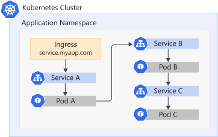
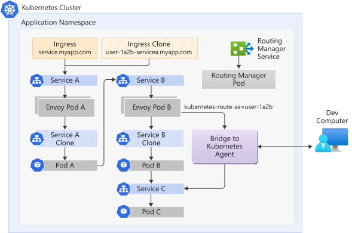

# How Bridge to Kubernetes works

*Bridge to Kubernetes* is an iterative development tool for authoring microservice applications that target Kubernetes. The Bridge to Kubernetes extension is available for Visual Studio and Visual Studio Code (VS Code).

Bridge to Kubernetes allows you to run and debug code on your development computer. That computer is still connected to your Kubernetes cluster with the rest of your application or services. If you have a large microservices architecture with many interdependent services and databases, replicating those dependencies on your development computer can be difficult. Building and deploying code to your Kubernetes cluster for each code change can be slow, time-consuming, and difficult.

Bridge to Kubernetes creates a connection between your development computer and your cluster. This approach avoids having to build and deploy your code to your cluster. You can test and develop your service in context, connected to your cluster. This approach allows you to debug without creating any more Docker or Kubernetes configuration.

Bridge to Kubernetes redirects traffic between your connected Kubernetes cluster and your development computer. Local code and services in your Kubernetes cluster can communicate as if they're in the same Kubernetes cluster.

Bridge to Kubernetes lets you replicate environment variables and mounted volumes in your Kubernetes cluster to your development computer. Access to environment variables and mounted volumes allows you to work on your code without having to replicate those dependencies.

## Requirements

> [!NOTE]
> Bridge to Kubernetes does not work with Docker for Desktop Kubernetes clusters.
To use Bridge to Kubernetes, you need either of the following configurations:

- VS Code with the [Bridge to Kubernetes extension](https://aka.ms/bridge-to-k8s-vsc-extension) installed.
- [Visual Studio 2019][visual-studio] version 16.7 or later running on Windows 10 or later. Be sure that the *ASP.NET and web development* workload is installed. Install the [Bridge to Kubernetes Extension][btk-extension].

You can use Bridge to Kubernetes to establish a connection to your Kubernetes cluster. This connection redirects traffic to and from an existing pod in the cluster to your development computer.

> [!NOTE]
> When using Bridge to Kubernetes, you are prompted for the name of the service to redirect to your development computer. This option is a convenient way to identify a pod for redirection. All redirection between your Kubernetes cluster and your development computer is for a pod. For more information, see [Make a service available](configure-bridge-to-kubernetes.md#make-a-service-available).

In VS Code, Bridge to Kubernetes supports all languages as long as you can run them locally. In Visual Studio, Bridge to Kubernetes supports .NET Core. Bridge to Kubernetes doesn't support .NET Framework in Visual Studio because it requires Windows nodes support.

> [!CAUTION]
> Bridge to Kubernetes is intended for use in development and testing scenarios only. It is not intended or supported for use with production clusters or live services in active use.

For current features and future plans, see the [Bridge to Kubernetes roadmap](https://github.com/orgs/Azure/projects/284).

## Establishing a connection

When Bridge to Kubernetes establishes a connection to your cluster, it takes the following actions:

- Prompts you to configure the service to replace on your cluster, the port on your development computer to use for your code, and the launch task for your code as a one-time action.
- Replaces the container in the pod on the cluster with a remote agent container that redirects traffic to your development computer.
- Runs [kubectl port-forward][kubectl-port-forward] on your development computer to forward traffic from your development computer to the remote agent running in your cluster.
- Collects environment information from your cluster using the remote agent. This environment information includes environment variables, visible services, volume mounts, and secret mounts.
- Sets up the environment in Visual Studio so the service on your development computer can access the same variables as if it were running on the cluster.
- Updates your *hosts* file to map services on your cluster to local IP addresses on your development computer. These *hosts* file entries allow code running on your development computer to make requests to other services running in your cluster. To update your *hosts* file, Bridge to Kubernetes needs administrator access on your development computer.
- Starts running and debugging your code on your development computer. If necessary, Bridge to Kubernetes frees required ports on your development computer by stopping services or processes that are currently using those ports.

## Using Bridge to Kubernetes

After you establish a connection to your cluster, run and debug code natively on your computer, without containerization. The code interacts with your cluster. Any network traffic the remote agent receives is redirected to the local port specified during the connection. Your natively running code can accept and process that traffic. The environment variables, volumes, and secrets from your cluster are made available to code running on your development computer.

Bridge to Kubernetes adds *hosts* file entries and port forwarding to your developer computer. Your code can send network traffic to services running on your cluster using the service names from your cluster. That traffic gets forwarded to the services that are running in your cluster. Traffic is routed between your development computer and your cluster the entire time you're connected.

In addition, Bridge to Kubernetes provides a way to replicate environment variables and mounted files available to pods in your cluster on your development computer through the `KubernetesLocalProcessConfig.yaml` file. You can also use this file to create new environment variables and volume mounts.

> [!NOTE]
> For the duration of the connection to the cluster, plus 15 minutes, Bridge to Kubernetes runs a process called *EndpointManager* with admin permissions on your local computer.

You can debug in parallel, with multiple services. Launch as many instances of Visual Studio as services you want to debug. Make sure that your services listen on different ports locally. Configure and debug them separately. Isolation isn't supported in this scenario.

### Additional configuration

The *KubernetesLocalProcessConfig.yaml* file allows you to replicate environment variables and mounted files available to your pods in your cluster. When you use Visual Studio, the *KubernetesLocalConfig.yaml* file must be in the same directory as the project file for the service. For more information, see [Configure Bridge to Kubernetes][using-config-yaml].

### Using routing capabilities for developing in isolation

By default, Bridge to Kubernetes redirects all traffic for a service to your development computer. You can instead use routing capabilities to only redirect requests from a subdomain to your development computer. These routing capabilities allow you to use Bridge to Kubernetes to develop in isolation and avoid disrupting other traffic in your cluster.

The following animation shows two developers working on the same cluster in isolation:


When you enable working in isolation, Bridge to Kubernetes does the following actions in addition to connecting to your Kubernetes cluster:

- Verifies that the Kubernetes cluster doesn't have Azure Dev Spaces enabled.
- Replicates your chosen service in the cluster in the same namespace and adds a *routing.visualstudio.io/route-from=SERVICE_NAME* label and *routing.visualstudio.io/route-on-header=kubernetes-route-as=GENERATED_NAME* annotation.
- Configures and starts the routing manager in the same namespace on the Kubernetes cluster. The routing manager uses a label selector to look for the *routing.visualstudio.io/route-from=SERVICE_NAME* label and *routing.visualstudio.io/route-on-header=kubernetes-route-as=GENERATED_NAME* annotation when configuring routing in your namespace.

> [!NOTE]
> Bridge to Kubernetes checks whether Azure Dev Spaces is enabled on your Kubernetes cluster. It prompts you to disable Azure Dev Spaces before you can use Bridge to Kubernetes.

The routing manager does the following actions when it starts up:

- Duplicates all ingresses, including load balancer ingresses, found in the namespace using the *GENERATED_NAME* for the subdomain.
- Creates an envoy pod for each service associated with duplicated ingresses with the *GENERATED_NAME* subdomain.
- Creates another envoy pod for the service you're working on in isolation. This configuration allows requests with the subdomain to be routed to your development computer.
- Configures routing rules for each envoy pod to handle routing for services with the subdomain.

The following diagram shows a Kubernetes cluster before Bridge to Kubernetes connects to your cluster:



The following diagram shows the same cluster with Bridge to Kubernetes enabled in isolation mode. Here, you can see the duplicate service and the envoy pods that support routing in isolation.



When the cluster receives a request with the *GENERATED_NAME* subdomain, it adds a *kubernetes-route-as=GENERATED_NAME* header to the request. The envoy pods handle routing that request to the appropriate service in the cluster. For a request to the service that is being worked on in isolation, the cluster redirects the request to your development computer by the remote agent.

When the cluster receives a request without the *GENERATED_NAME* subdomain, it doesn't add a header to the request. The envoy pods handle routing that request to the appropriate service in the cluster. For a request for the service that is being replaced, the pods route it to the original service instead of the remote agent.

> [!IMPORTANT]
> Each service on your cluster must forward the *kubernetes-route-as=GENERATED_NAME* header when making additional requests. For example, when *serviceA* receives a request, it then makes a request to *serviceB* before return a response. In this example, *serviceA* needs to forward the *kubernetes-route-as=GENERATED_NAME* header in its request to *serviceB*. Some languages, such as [ASP.NET][asp-net-header], may have methods for handling header propagation.

When you disconnect from your cluster, by default, Bridge to Kubernetes removes all the envoy pods and the duplicate service.

> [!NOTE]
> The routing manager deployment and service remain running in your namespace. To remove the deployment and service run the following commands for your namespace.
>
> ```azurecli
> kubectl delete deployment routingmanager-deployment -n NAMESPACE
> kubectl delete service routingmanager-service -n NAMESPACE
> ```

### Diagnostics and logging

When using Bridge to Kubernetes to connect to your cluster, your computer logs diagnostics. It stores them in your development computer's *TEMP* directory in the *Bridge to Kubernetes* folder.

### Kubernetes RBAC authorization

Kubernetes provides Role-based Access Control (RBAC) to manage permissions for users and groups. For information, see the [Kubernetes documentation](https://kubernetes.io/docs/reference/access-authn-authz/rbac/). You can set the permissions for an RBAC-enabled cluster by creating a YAML file and using `kubectl` to apply it to the cluster.

To set permissions on the cluster, create or modify a YAML file such as *permissions.yml*. Use your namespace for `<namespace>` and the users and groups that need access.

```yml
kind: RoleBinding
apiVersion: rbac.authorization.k8s.io/v1
metadata:
  name: bridgetokubernetes-<namespace>
  namespace: development
subjects:
  - kind: User
    name: jane.w6wn8.k8s.ginger.eu-central-1.aws.gigantic.io
    apiGroup: rbac.authorization.k8s.io
  - kind: Group
    name: dev-admin
    apiGroup: rbac.authorization.k8s.io
roleRef:
  kind: ClusterRole
  name: admin
  apiGroup: rbac.authorization.k8s.io
```

Apply the permissions by using the following command:

```cmd
kubectl -n <namespace> apply -f <yaml file name>
```

## Limitations

Bridge to Kubernetes has the following limitations:

- A pod may only have a single container running in that pod for Bridge to Kubernetes to successfully connect.
- Currently, Bridge to Kubernetes pods must be Linux containers. Windows containers aren't supported.
- Bridge to Kubernetes needs elevated permissions to run on your development computer in order to edit your hosts file.
- Bridge to Kubernetes can't be used on clusters with Azure Dev Spaces enabled.

## Next steps

To get started using Bridge to Kubernetes to connect to your local development computer to your cluster, see [Use Bridge to Kubernetes (VS)](bridge-to-kubernetes-vs.md) or [Use Bridge to Kubernetes (VS Code)](bridge-to-kubernetes-vs-code.md).

[asp-net-header]: https://www.nuget.org/packages/Microsoft.AspNetCore.HeaderPropagation/
[azds-cli]: /azure/dev-spaces/how-to/install-dev-spaces#install-the-client-side-tools
[azds-tmp-dir]: /azure/dev-spaces/troubleshooting#before-you-begin
[azure-cli]: /cli/azure/install-azure-cli?view=azure-cli-latest&preserve-view=true
[bridge-to-kubernetes-vs]: bridge-to-kubernetes.md
[kubectl-port-forward]: https://kubernetes.io/docs/reference/generated/kubectl/kubectl-commands#port-forward
[visual-studio]: https://visualstudio.microsoft.com/downloads/?cid=learn-onpage-download-cta
[btk-extension]: https://marketplace.visualstudio.com/items?itemName=ms-azuretools.mindaro
[using-config-yaml]: configure-bridge-to-kubernetes.md
