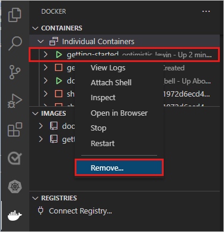
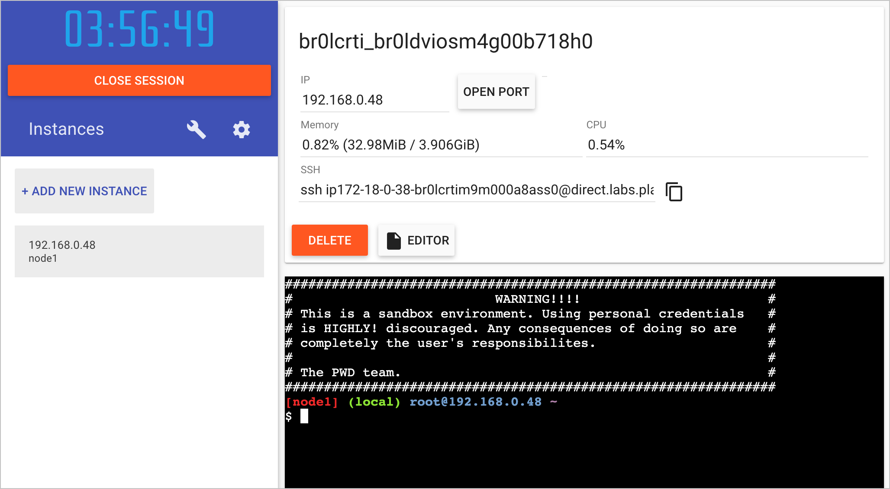

# Tutorial: Share a Docker app with Visual Studio Code

This tutorial is part two of a four-part series introducing [Docker](https://www.docker.com) for use with Visual Studio Code (VS Code).  

In this tutorial, you learn how to:

> [!div class="checklist"]
> - Update the code and replace the container.
> - Share your image.
> - Run the image on a new instance.

## Prerequisites

This tutorial continues the previous tutorial, [Create a Docker app with Visual Studio Code](docker-tutorial.md). To continue here, you'll need the running todo list manager from part 1.


## Update the code and replace the container

Let's make a few changes and learn about managing your containers.

1. In the `src/static/js/app.js` file, update line 56 to use this new text label:

   ```diff
   - <p className="text-center">No items yet! Add one above!</p>
   + <p className="text-center">You have no todo items yet! Add one above!</p>
   ```

    Save your change.

1. Stop and remove the current version of the container.
   More than one container can't use the same port.

   Right-click the **getting-started** container and select **Remove**.

   

   Or, from the command line, use the following command to get the container ID.

   ```bash
   docker ps
   ```

   Then stop and remove the container:

   ```bash
   docker stop <container-id>
   docker rm <container-id>
   ```

1. Build the updated version of the image.
   In the file explorer, right-click *Dockerfile*, then select **Build Image**.

   Or, to build on the command line, change directory to the folder that contains the Dockerfile, and use the same command you used before.

    ```bash
    docker build -t getting-started .
    ```

1. Start a new container that uses the updated code.

    ```bash
    docker run -dp 3000:3000 getting-started
    ```

1. Refresh your browser on `http://localhost:3000` to see your updated help text.

   


## Share your image

Now that you've built an image, you can share it.
To share Docker images, use a Docker registry.
The default registry is Docker Hub, which is where all of the images we've used have come from.

To push an image, first, you need to create a repo on Docker Hub.

1. Go to [Docker Hub](https://hub.docker.com) and sign in to your account.

1. Select **Create Repository**.

1. For the repo name, enter `getting-started`.
   Make sure that the **Visibility** is **Public**.

1. Select **Create**.

   On the right of the page, you'll see a section named **Docker commands**.
   This section gives an example command to run to push to this repo.

   

1. In VS Code, in the Docker view, under **REGISTRIES**, click the plug icon, to connect to a registry, and choose **Docker Hub**.

   Enter your Docker Hub account name and password.

1. In the Docker view of VS Code, under **IMAGES**, right-click the image tag, and select **Push**. Enter the namespace and the tag, or accept the defaults.

1. To push to Docker Hub by using the command line, use this procedure.

   Sign in to the Docker Hub:

   ```bash
   docker login -u <username>
   ```

1. Use the following command to give the *getting-started* image a new name.

    ```bash
    docker tag getting-started <username>/getting-started
    ```

1. Use the following command to push your container.

    ```bash
    docker push <username>/getting-started
    ```

## Run the image on a new instance

Now that your image has been built and pushed into a registry, try running the app on a brand new instance that has never seen this container image.
To run your app, use Play with Docker.

1. Open your browser to [Play with Docker](http://play-with-docker.com).

1. Sign in with your Docker Hub account.

1. Select **Start** and then select the **+ ADD NEW INSTANCE** link in the left side bar.
   After a few seconds, a terminal window opens in your browser.

   

1. In the terminal, start your app.

    ```bash
    docker run -dp 3000:3000 <username>/getting-started
    ```

    Play with Docker pulls down your image and starts it.

1. Select the **3000** badge, next to **OPEN PORT**.
   You should see the app with your modifications.

   If the **3000** badge doesn't show up, select **OPEN PORT** and enter 3000.

## Clean up resources

Keep everything that you've done so far to continue this series of tutorials.

## Next steps

Congrats. You've completed part 2 and learned how to update your code and run your image on a new instance.

Here are some resources that might be useful to you:

- [Docker Cloud Integration](https://github.com/docker/compose-cli)
- [Examples](https://github.com/docker/awesome-compose)

Next, try the next tutorial in this series:

> [!div class="nextstepaction"]
> [Persist data and layer a Docker app](tutorial-persist-data-layer-docker-app-with-vscode.md)
