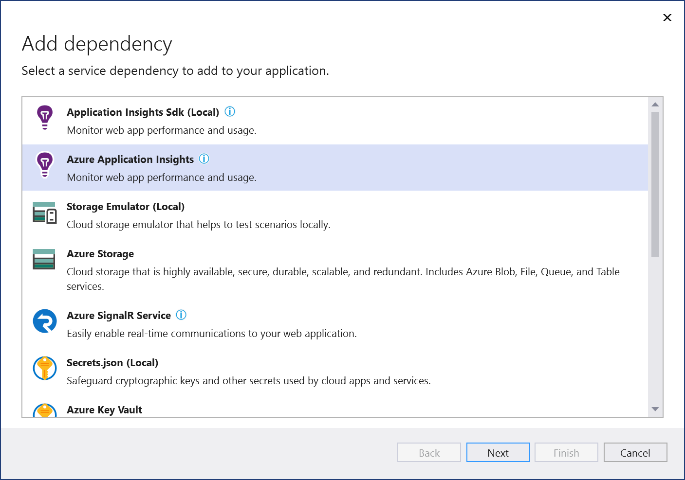

# Add Azure Application Insights by using Visual Studio Connected Services

 [!INCLUDE [Visual Studio](~/includes/applies-to-version/vs-windows-only.md)]

With Visual Studio, you can connect any of the following to Azure Application Insights by using the **Connected Services** feature:

- .NET Framework console app
- ASP.NET MVC (.NET Framework) 
- ASP.NET Core
- .NET Core (including console app, WPF, Windows Forms, class library)
- .NET Core Worker Role
- Azure Functions
- Universal Windows Platform App
- Xamarin
- Cordova

The connected service functionality adds all the needed references and connection code to your project, and modifies your configuration files appropriately.

> [!NOTE]
> This topic applies to Visual Studio on Windows. For Visual Studio for Mac, see [Connected services in Visual Studio for Mac](/visualstudio/mac/connected-services).

## Prerequisites

- Visual Studio with the Azure workload installed.
- A project of one of the supported types

:::moniker range="vs-2019"

## Connect to Azure Application Insights using Connected Services

1. Open your project in Visual Studio.

1. In **Solution Explorer**, right-click the **Connected Services** node, and, from the context menu, select **Add Connected Service**.

1. In the **Connected Services** tab, select the + icon for **Service Dependencies**.

    

1. In the **Add Dependency** page, select **Azure Application Insights**.

    

    If you aren't signed in already, sign into your Azure account. If you don't have an Azure account, you can sign up for a [free trial](https://azure.microsoft.com/free/).

1. In the **Configure Azure Application Insights** screen, select an existing Azure Application Insights component, and select **Next**.

    If you need to create a new component, go to the next step. Otherwise, skip to step 7.

    

1. To create an Application Insights component:

   1. Select **Create a new Application Insights component** at the bottom of the screen.

   1. Fill out the **Application Insights: Create new** screen, and select **Create**.

       

   1. When the **Configure Azure Application Insights** screen is displayed, the new component appears in the list. Select the new component in the list, and select **Next**.

1. Enter an instrumentation key name, or choose the default, and choose whether you want the connection string stored in a local secrets file, or in [Azure Key Vault](/azure/key-vault).

   

1. The **Summary of changes** screen shows all the modifications that will be made to your project if you complete the process. If the changes look OK, choose **Finish**.

   

1. The connection appears under the **Service Dependencies** section of the **Connected Services** tab.

   
:::moniker-end

:::moniker range=">=vs-2022"

## Connect to Azure Application Insights using Connected Services

1. Open your project in Visual Studio.

1. In **Solution Explorer**, right-click the **Connected Services** node, and, from the context menu, select **Add** to open the menu of available services.

   

1. Choose **Azure Application Insights**. The **Add Dependency** page appears. You should see two options, one for a local emulator, **Application Insights Sdk (Local)**, and one for connecting to the live Azure Application Insights service. You can reduce cost and simplify early development by starting with the local emulator. You can migrate to the live service later by repeating these steps and choosing the other option.

   

   If you choose to use the Application Insights Sdk locally, click **Next** to see the **Summary of changes** screen, which shows how your project is being modified. A NuGet package reference is added to your project and the connection code for the local emulator is added to your project.

   If you want to connect to the Azure service, continue to the next step, or if you aren't signed in already, sign into your Azure account before continuing. If you don't have an Azure account, you can sign up for a [free trial](https://azure.microsoft.com/free/).

1. In the **Configure Azure Application Insights** screen, select an existing Azure Application Insights component, and select **Next**.

    If you need to create a new component, go to the next step. Otherwise, skip to step 7.

    

1. To create an Application Insights component:

   1. Select **Create a new Application Insights component** at the bottom of the screen.

   1. Fill out the **Application Insights: Create new** screen, and select **Create**.

       

   1. When the **Configure Azure Application Insights** screen is displayed, the new component appears in the list. Select the new component in the list, and select **Next**.

1. Enter an instrumentation key name, or choose the default, and choose whether you want the connection string stored in a local secrets file, or in [Azure Key Vault](/azure/key-vault).

   

1. The **Summary of changes** screen shows all the modifications that will be made to your project if you complete the process. If the changes look OK, choose **Finish**.

   

1. In Solution Explorer, double-click on the **Connected Services** node to open the **Connected Services** tab. The connection appears under the **Service Dependencies** section:

   

   If you click on the three dots next to the dependency you added, you can see various options such as **Connect** to reopen the wizard and change the connection. You can also click the three dots at the top right of the window to see options to start local dependencies, change settings, and more.

:::moniker-end

## See also

- [Azure Monitor product page](https://azure.microsoft.com/services/monitor/)
- [Azure App Insights documentation](/azure/azure-monitor/app/app-insights-overview/)
- [Connected services (Visual Studio for Mac)](/visualstudio/mac/connected-services)
