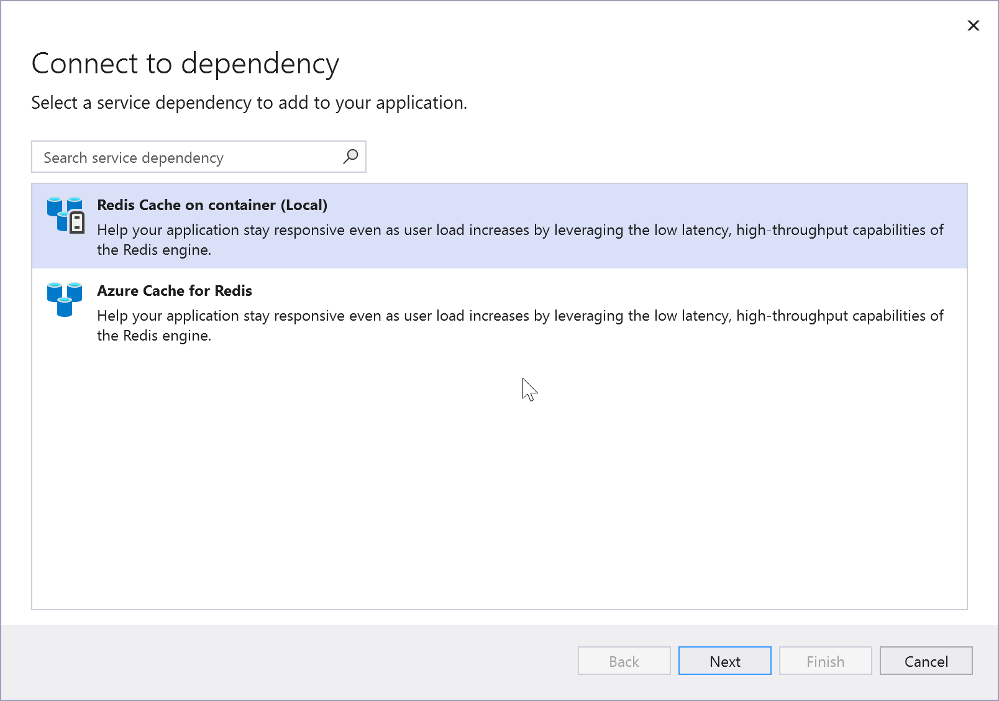
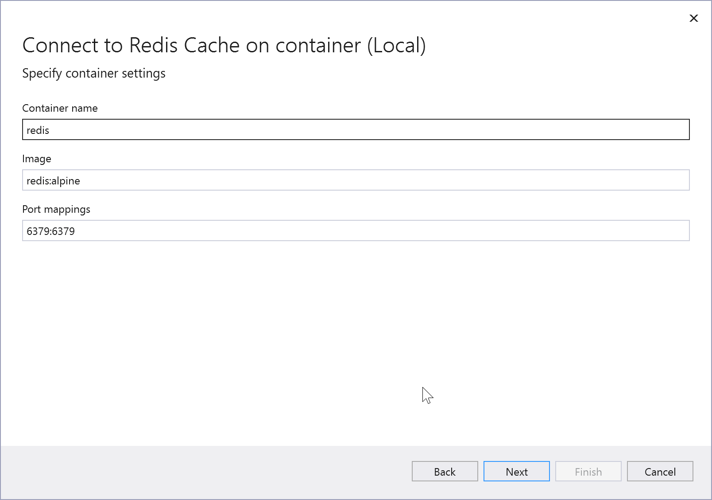

# Add Azure Cache for Redis by using Visual Studio Connected Services

 [!INCLUDE [Visual Studio](~/includes/applies-to-version/vs-windows-only.md)]

With Visual Studio, you can connect any of the following to Azure Cache for Redis by using the **Connected Services** feature:

- .NET Framework console app
- ASP.NET MVC (.NET Framework) 
- ASP.NET Core
- .NET Core (including console app, WPF, Windows Forms, class library)
- .NET Core Worker Role
- Azure Functions
- Universal Windows Platform App
- Xamarin
- Cordova

The connected service functionality adds all the needed references and connection code to your project, and modifies your configuration files appropriately.

> [!NOTE]
> This topic applies to Visual Studio on Windows. For Visual Studio for Mac, see [Connected services in Visual Studio for Mac](/visualstudio/mac/connected-services).
## Prerequisites

- Visual Studio with the Azure workload installed.
- A project of one of the supported types
- [!INCLUDE [prerequisites-azure-subscription](includes/prerequisites-azure-subscription.md)]

## Connect to Azure Cache for Redis using Connected Services

:::moniker range="vs-2019"
1. Open your project in Visual Studio.

1. In **Solution Explorer**, right-click the **Connected Services** node, and, from the context menu, select **Add Connected Service**.

1. In the **Connected Services** tab, select the + icon for **Service Dependencies**.

    

1. In the **Add Dependency** page, select **Azure Cache for Redis**.

    

    If you aren't signed in already, sign into your Azure account. If you don't have an Azure account, you can sign up for a [free trial](https://azure.microsoft.com/free/).

1. In the **Configure Azure Cache for Redis** screen, select an existing Azure Cache for Redis, and select **Next**.

    If you need to create a new component, go to the next step. Otherwise, skip to step 7.

    

1. To create an Azure Redis Cache:

   1. Select **Create a new Azure Redis Cache** at the bottom of the screen.

   1. Fill out the **Azure Cache for Redis: Create new** screen, and select **Create**.

       

   1. When the **Configure Azure Cache for Redis** screen is displayed, the new cache appears in the list. Select the new database in the list, and select **Next**.

1. Enter a connection string name, or choose the default, and choose whether you want the connection string stored in a local secrets file, or in [Azure Key Vault](/azure/key-vault).

   

1. The **Summary of changes** screen shows all the modifications that will be made to your project if you complete the process. If the changes look OK, choose **Finish**.

   

1. The connection appears under the **Service Dependencies** section of the **Connected Services** tab.

   
:::moniker-end

:::moniker range=">=vs-2022"

> [!NOTE]
> For .NET Framework projects, Connected Services UI is slightly different. To see the differences, compare to the [Visual Studio 2019 version of this page](./azure-cache-for-redis-add-connected-service.md?view=vs-2019&preserve-view=true).

1. Open your project in Visual Studio.

1. In **Solution Explorer**, right-click the **Connected Services** node, and, from the context menu, select **Add** to open the menu of available services.

   

1. Choose **Azure Cache for Redis**. The **Connect to dependency** page appears. You should see two options, one for a local emulator, **Redis Cache on container (Local)**, and one for connecting to the live Azure Cache for Redis service. You can reduce cost and simplify early development by starting with the local emulator. You can migrate to the live service later by repeating these steps and choosing the other option.

   

   If you choose the Redis cache locally, click **Next** to the **Connect to Redis cache on container** screen.

   

   Specify **Container name**, **Container image**, and port mappings or accept the defaults, and click **Next** to see the **Summary of changes** screen, which shows what changes would be made to your project. A NuGet package reference is added to your project and the connection code for the local emulator is added to your project.

   If you want to connect to the Azure service, continue to the next step, or if you aren't signed in already, sign into your Azure account before continuing. If you don't have an Azure account, you can sign up for a [free trial](https://azure.microsoft.com/free/).

1. To go with the live service, select **Azure Cache for Redis**.

    

    If you aren't signed in already, sign into your Azure account. If you don't have an Azure account, you can sign up for a [free trial](https://azure.microsoft.com/free/).

1. In the **Configure Azure Cache for Redis** screen, select an existing Azure Cache for Redis, and select **Next**.

    If you need to create a new component, go to the next step. Otherwise, skip to step 7.

    

1. To create an Azure Redis Cache:

   1. Select **Create a new Azure Redis Cache** at the bottom of the screen.

   1. Fill out the **Azure Cache for Redis: Create new** screen, and select **Create**.

       

   1. When the **Configure Azure Cache for Redis** screen is displayed, the new cache appears in the list. Select the new database in the list, and select **Next**.

1. Enter a connection string name, or choose the default, and choose whether you want the connection string stored in a local secrets file, or in [Azure Key Vault](/azure/key-vault).

   

1. The **Summary of changes** screen shows all the modifications that will be made to your project if you complete the process. If the changes look OK, choose **Finish**.

   

1. In Solution Explorer, double-click on the **Connected Services** node to open the **Connected Services** tab. The connection appears under the **Service Dependencies** section:

   

   If you click on the three dots next to the dependency you added, you can see various options such as **Connect** to reopen the wizard and change the connection. You can also click the three dots at the top right of the window to see options to start local dependencies, change settings, and more.

:::moniker-end

## Next steps

For ASP.NET apps, common use cases for Azure cache for Redis are to cache session state or page output (HTTP responses). ASP.NET Core provides built-in services for these use cases, which should be used instead when you're using ASP.NET Core.

To cache session state in an ASP.NET app, see [ASP.NET Session State Provider](/azure/azure-cache-for-redis/cache-aspnet-session-state-provider).

To cache page output in an ASP.NET app, see [ASP.NET Output Cache Provider](/azure/azure-cache-for-redis/cache-aspnet-output-cache-provider).

## See also

- [Azure Cache for Redis product page](https://azure.microsoft.com/services/cache)
- [Azure Cache for Redis documentation](/azure/azure-cache-for-redis/)
- [Connected services (Visual Studio for Mac)](/visualstudio/mac/connected-services)
