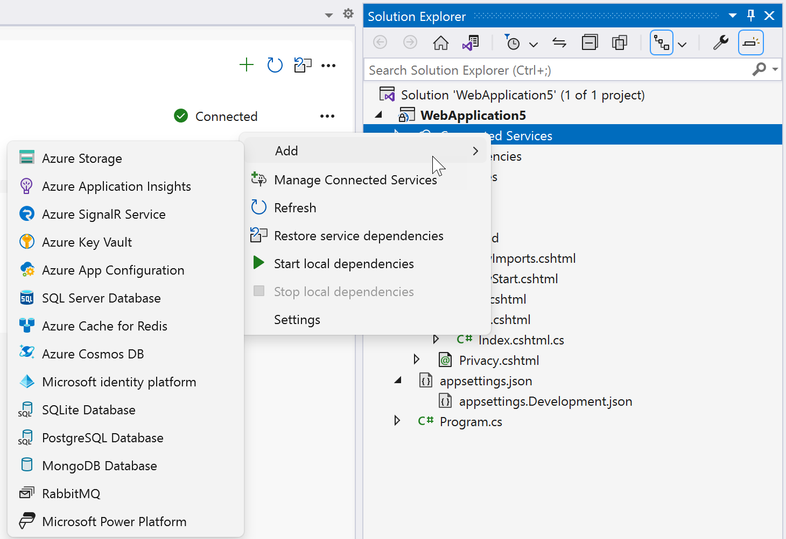
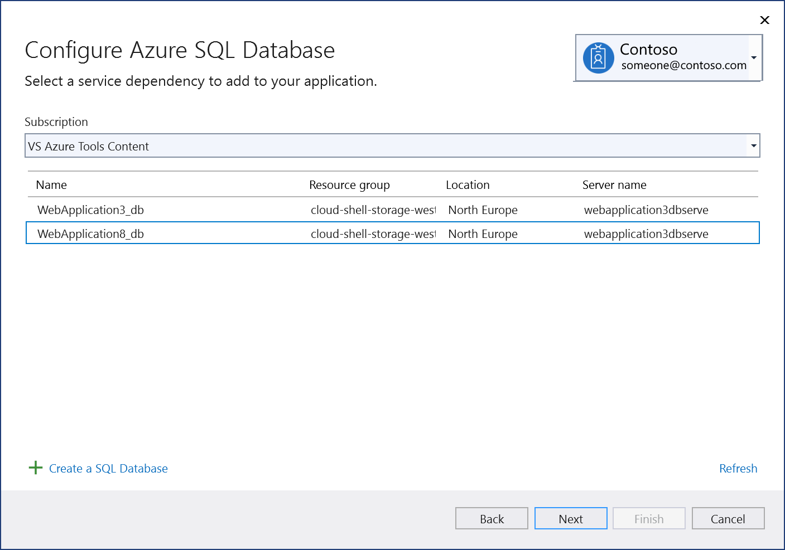
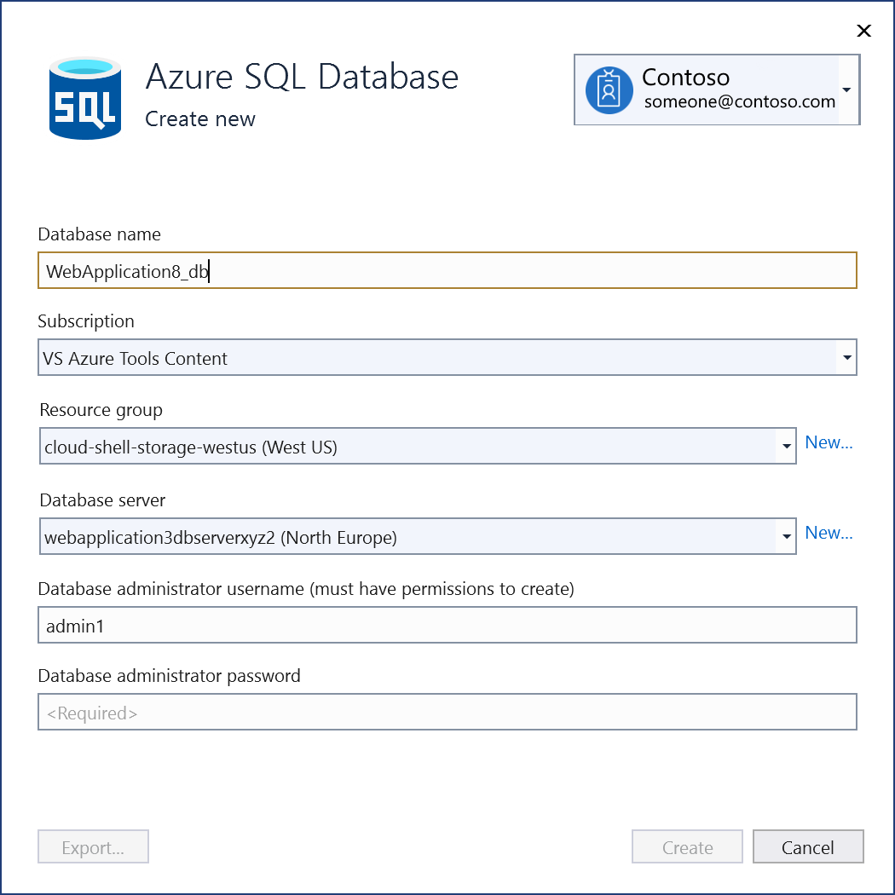
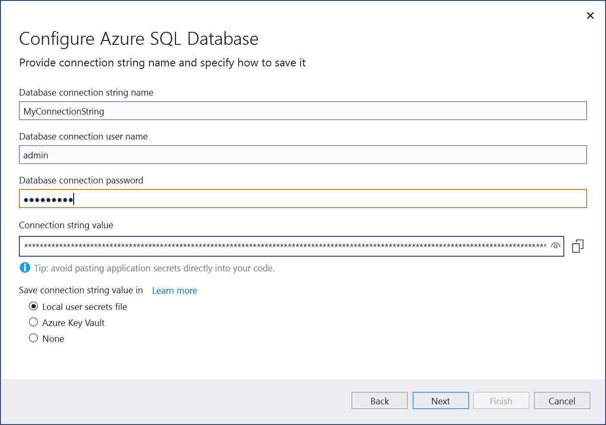
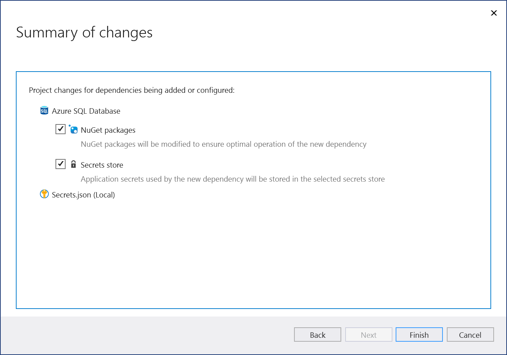
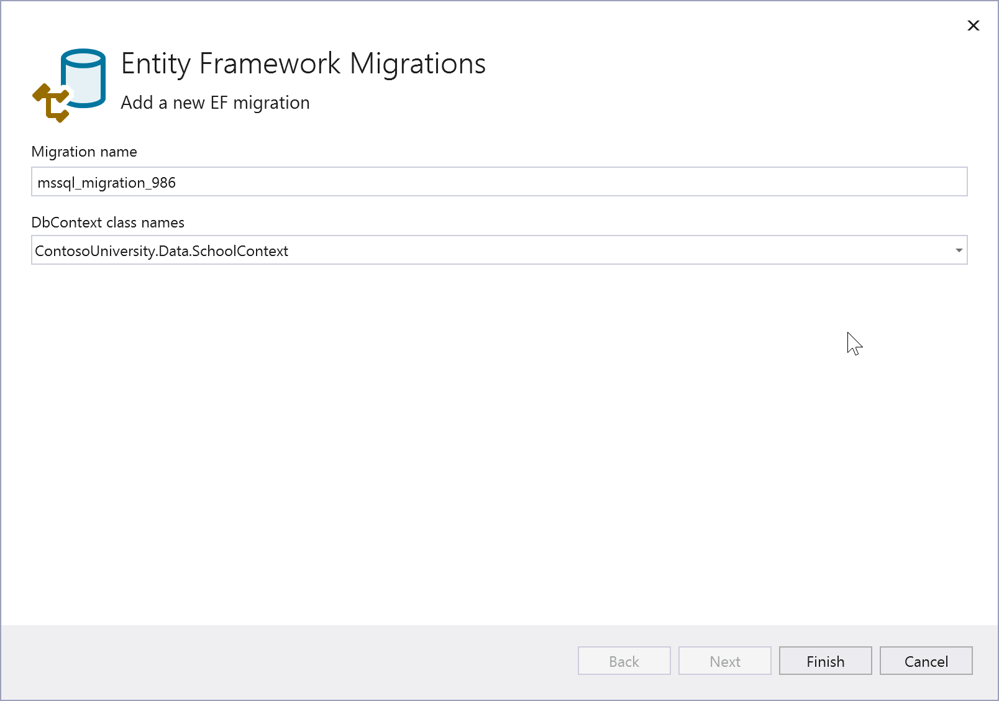
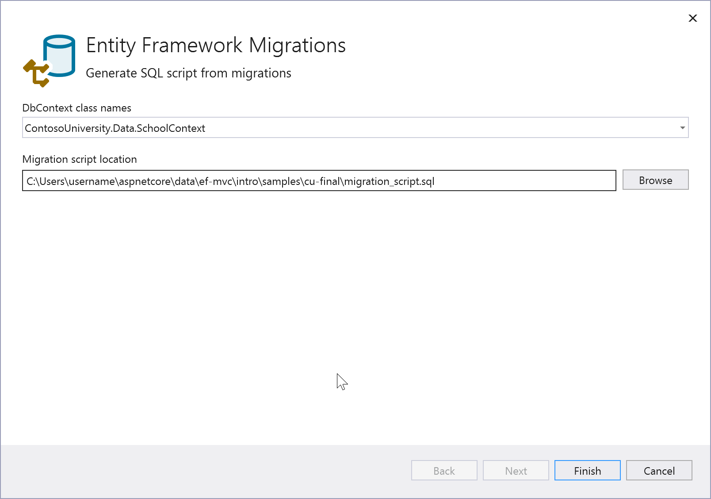
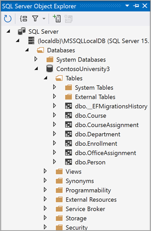

# Add a connection to an Azure SQL database

With Visual Studio Connected Services, you can connect to Azure SQL Database, a local emulator (for example, during development), or an on-premises SQL Server database. For on-premise SQL Server, see [Connect to a database](../data-tools/add-new-connections.md).

With Visual Studio, you can connect from any of the following project types by using the **Connected Services** feature:

- ASP.NET Core
- .NET Core (including console app, WPF, Windows Forms, class library)
- .NET Core Worker Role
- Azure Functions
- .NET Framework console app
- ASP.NET Model-View-Controller (MVC) (.NET Framework)
- Universal Windows Platform App
- MAUI app

The connected service functionality adds all the needed references and connection code to your project, and modifies your configuration files appropriately.

## Prerequisites

- Visual Studio with the Azure workload installed.
- A project of one of the supported types
- [!INCLUDE [prerequisites-azure-subscription](includes/prerequisites-azure-subscription.md)]

## Connect to Azure SQL Database using Connected Services

1. Open your project in Visual Studio.

1. In **Solution Explorer**, right-click the **Connected Services** node, and, from the context menu, select **Add** to open the menu of available services.

   

1. Choose **SQL Server Database**. The **Connect to dependency** page appears. You should see several options:

   - SQL Server Express LocalDB, the built-in SQL Database offering installed with Visual Studio
   - SQL Server Database on a local container on your machine
   - SQL Server Database, an on-premises SQL Server on the local network
   - Azure SQL Database, for the SQL Database running as an Azure service

   You can reduce cost and simplify early development by starting with a local database. You can migrate to the live service in Azure later by repeating these steps and choosing another option. If you create a database locally that you want to re-create in Azure, you can migrate your database to Azure at that time.

   

   If you want to connect to the Azure service, continue to the next step, or if you aren't signed in already, sign in to your Azure account before continuing. If you don't have an Azure account, you can sign up for a [free trial](https://azure.microsoft.com/free/).

1. In the **Configure Azure SQL Database** screen, select an existing Azure SQL Database, and select **Next**.

    If you need to create a new component, go to the next step. Otherwise, skip to step 7.

    

1. To create an Azure SQL database:

   1. Select **Create New** by the green plus sign.

   1. Fill out the **Azure SQL Database: Create new** screen, and select **Create**.

       

   1. When the **Configure Azure SQL Database** screen is displayed, the new database appears in the list. Select the new database in the list, and select **Next**.

1. Enter a connection string name, or choose the default, and choose whether you want the connection string stored in a local secrets file, or in [Azure Key Vault](/azure/key-vault).

   

1. The **Summary of changes** screen shows all the modifications that will be made to your project if you complete the process. If the changes look OK, choose **Finish**.

   

   If prompted to set a firewall rules, choose **Yes**.

   

1. In Solution Explorer, double-click on the **Connected Services** node to open the **Connected Services** tab. The connection appears under the **Service Dependencies** section:

   

   If you click on the three dots next to the dependency you added, you can see various options such as **Connect** to reopen the wizard and change the connection. You can also click the three dots at the top right of the window to see options to start local dependencies, change settings, and more.

## Access the connection string

Learn how to store secrets safely by following [Safe storage of app secrets in development in ASP.NET Core](/aspnet/core/security/app-secrets?tabs=windows). In particular, to read the connection string from the secrets store, you can add code as in [Read the secret via the configuration API](/aspnet/core/security/app-secrets?tabs=windows#read-the-secret-via-the-configuration-api). See also [Dependency injection in ASP.NET Core](/aspnet/core/fundamentals/dependency-injection).

## Entity Framework migrations

It might be convenient to work with a local data store during early development, but with Entity Framework Core, when you're ready to move to the cloud, you can use Visual Studio's support for Entity Framework migration to move your database, or merge changes with a remote data store. See [Migrations overview](/ef/core/managing-schemas/migrations/?tabs=vs).

On the **Connected Services** tab, you can find the migration commands by clicking on the three dots, as shown in the screenshot:


Commands are available there to create new migrations, apply them directly, or generate SQL scripts that apply the migrations.

:::moniker range=">=vs-2022"

### Add migration

When a data model change is introduced, you can use Entity Framework Core tools to add a corresponding migration that describes in code the updates necessary to keep the database schema in sync. Entity Framework Core compares the current model against a snapshot of the old model to determine the differences, and generates migration source files. The files are added to your project, usually in a folder called *Migrations* and can be tracked in your project's source control like any other source file.

When you choose this option, you're asked to provide the context class name that represents the database schema you want to migrate.



### Update database

After a migration has been created, it can be applied to a database. Entity Framework updates your database and your schema with the changes specified in the migration code. When you choose this option, you're asked to provide the context class name that represents the database schema you want to migrate.

### Generate SQL script

The recommended way to deploy migrations to a production database is by generating SQL scripts. The advantages of this strategy include the following:

- SQL scripts can be reviewed for accuracy; this is important since applying schema changes to production databases is a potentially dangerous operation that could involve data loss.
- In some cases, the scripts can be tuned to fit the specific needs of a production database.
- SQL scripts can be used in conjunction with a deployment technology, and can even be generated as part of your CI process.
- SQL scripts can be provided to a DBA, and can be managed and archived separately.

When you use this option, you're asked the database context class and the location for the script file.



### Open in SQL Server Object Explorer

For convenience, this command lets you jump to the SQL Server Object Explorer, so you can view tables and other database entities, and work directly with your data. See [Object explorer](/sql/ssms/object/object-explorer).



:::moniker-end

## Next steps

You can continue with the quickstarts for Azure SQL Database, but instead of starting from the beginning, you can start after the initial connection is set up. If you're using Entity Framework, you can start at [Add the code to connect to Azure SQL Database](/azure/azure-sql/database/azure-sql-dotnet-entity-framework-core-quickstart?view=azuresql&preserve-view=true&tabs=visual-studio%2Cservice-connector%2Cportal#add-the-code-to-connect-to-azure-sql-database). If you're using `SqlClient` or ADO.NET data classes, you can start at [Add the code to connect to Azure SQL Database](/azure/azure-sql/database/azure-sql-dotnet-quickstart?view=azuresql&preserve-view=true&tabs=visual-studio%2Cpasswordless%2Cservice-connector%2Cportal#add-the-code-to-connect-to-azure-sql-database).

Your code won't exactly match what is used in the quickstarts, which use a different way of getting the connection string. The connection strings are secrets and are securely stored as explained in [Safe storage of app secrets in development in ASP.NET Core](/aspnet/core/security/app-secrets?tabs=windows). In particular, to read the connection string from the secrets store, you can add code as in [Read the secret via the configuration API](/aspnet/core/security/app-secrets?tabs=windows#read-the-secret-via-the-configuration-api). In ASP.NET Core projects, the connection string created by Connected Services is available in a configuration object. You can access it by a property on the `WebApplicationBuilder` class (`builder` in many project templates), as in the following example:

```csharp
var connection = builder.Configuration["ConnectionStrings:ConnectionString1"];
```

## Related content

- [Azure SQL Database product page](https://azure.microsoft.com/services/sql-database/)
- [Azure SQL Database documentation](/azure/azure-sql/database/)
- [Connected services (Visual Studio for Mac)](/visualstudio/mac/connected-services)
