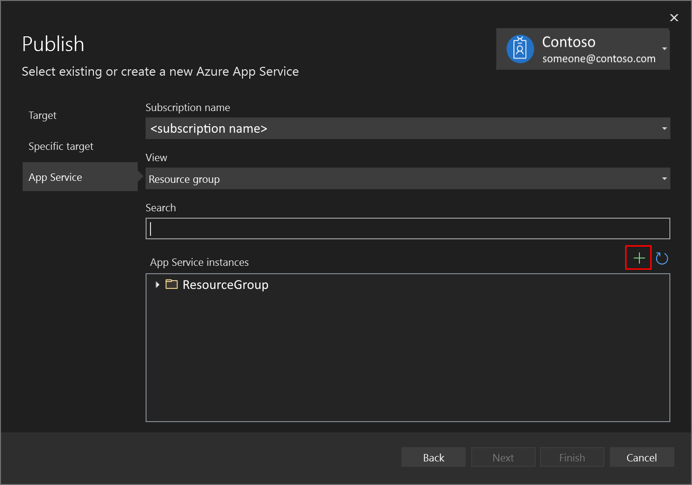
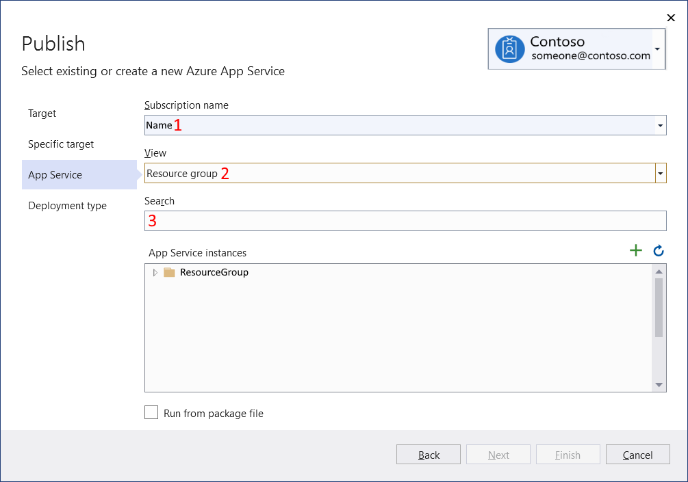
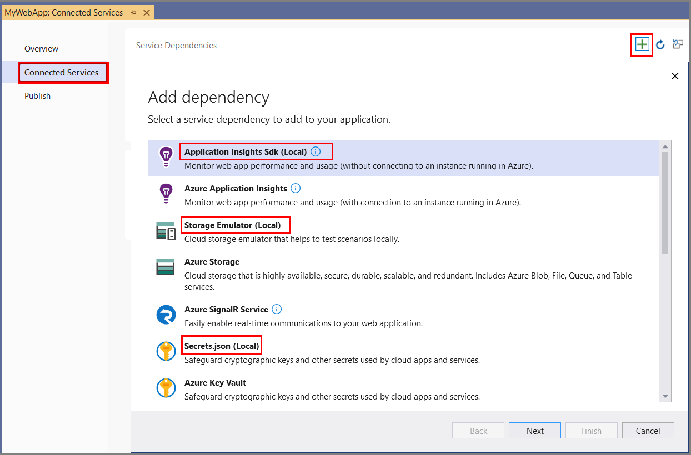
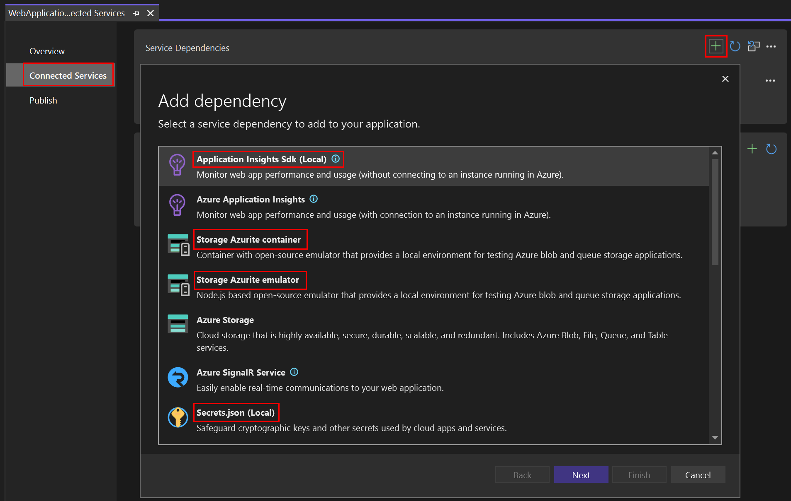

# Find and provision Azure resources in Visual Studio 

 [!INCLUDE [Visual Studio](~/includes/applies-to-version/vs-windows-only.md)]

You can work with Azure in Visual Studio using many capabilities designed to make development and deployment to Azure easier.

## Prerequisites

- [!INCLUDE [prerequisites-azure-subscription](includes/prerequisites-azure-subscription.md)]

## Provision Azure resources

This is a typical Visual Studio dialog where you can browse and search existing Azure resources. Above the list of existing resources, there is a button that lets you provision new ones:

:::moniker range="vs-2019"

:::moniker-end
:::moniker range=">=vs-2022"

:::moniker-end

> [!NOTE]
> This example shows instances of Azure App Service, but a similar dialog exists for all Azure services that Visual Studio supports.

:::moniker range=">=vs-2022"
You can use **Quick Launch** to find the Visual Studio IDE feature to connect to supported services. To use this feature, open Quick Launch (press **Ctrl**+**Q**), enter a service (for example, `Azure Storage`) to find the Connected Services features and immediately start connecting to the service.
:::moniker-end

## Browse and search existing Azure resources

The following screenshot shows a typical Visual Studio dialog where you can browse and search existing Azure resources.

1. You can filter by Azure subscription using the drop-down
2. You can group the found instances either by Resource Group or by Resource Type (which effectively gives you a flat list)
3. You can search by the resource name

:::moniker range="vs-2019"

:::moniker-end
:::moniker range=">=vs-2022"

:::moniker-end

> [!NOTE]
> This example shows instances of Azure App Service, but a similar dialog exists for all Azure services that Visual Studio supports.

## Deploy an application to Azure using Publish or GitHub Actions

:::moniker range=">=vs-2022"
Whenever you open a project from a GitHub repo in Visual Studio 2022 version 17.7 and later, any GitHub Actions in the repo are shown under the GitHub Actions node in Solution Explorer.
:::moniker-end

Visual Studio has special support for GitHub Actions that deploy your project. You can generate a deployment action that will publish your application to Azure. Right-click on your project in [Solution Explorer](../ide/use-solution-explorer.md), and pick **Publish** from the context menu. The Publish wizard will guide you through the experience, and if your project is hosted on GitHub, you will automatically also be given the opportunity to configure CI/CD using GitHub Actions. See [Overview of GitHub Actions in Visual Studio](overview-github-actions.md).

## Configure Azure dependencies to be emulated locally and connect to real services at deployment time

Use Connected Services to connect your application to local emulators and other local alternatives to Azure services. Get started by right-clicking on the **Connected Services** node in Solution Explorer and select **Manage Connected Services**.

:::moniker range="vs-2019"

:::moniker-end
:::moniker range=">=vs-2022"

:::moniker-end

## Debug Azure Function projects offline without cost

Visual Studio will seamlessly emulate the Azure Functions service locally when you start debugging. You don't even have to be signed in with an Azure subscription.

## Remote debug Azure hosting services like Azure App Service

See [Attach to running processes with the Visual Studio debugger](../debugger/attach-to-running-processes-with-the-visual-studio-debugger.md#attach-to-a-net-core-process-running-on-azure-app-service-windows)
