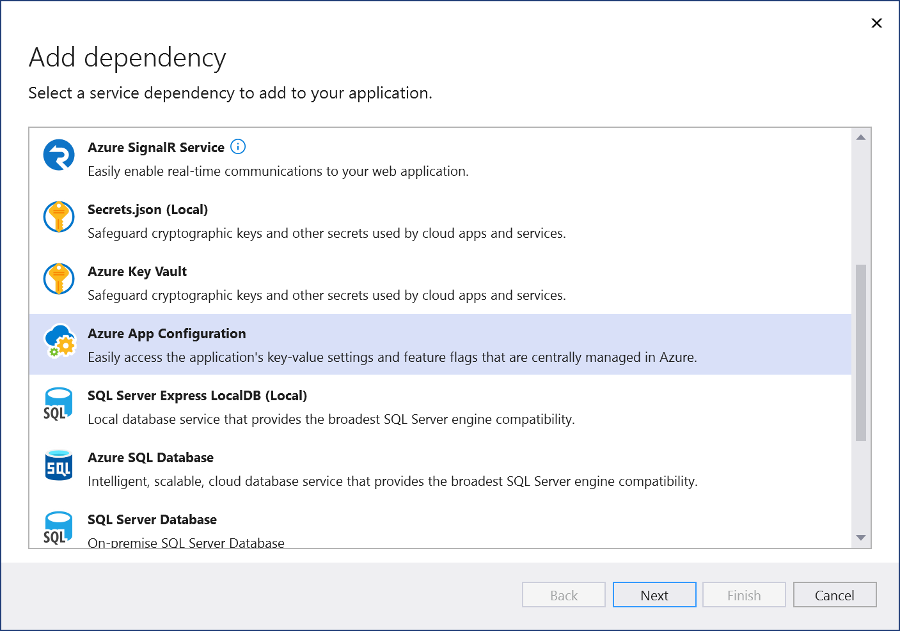
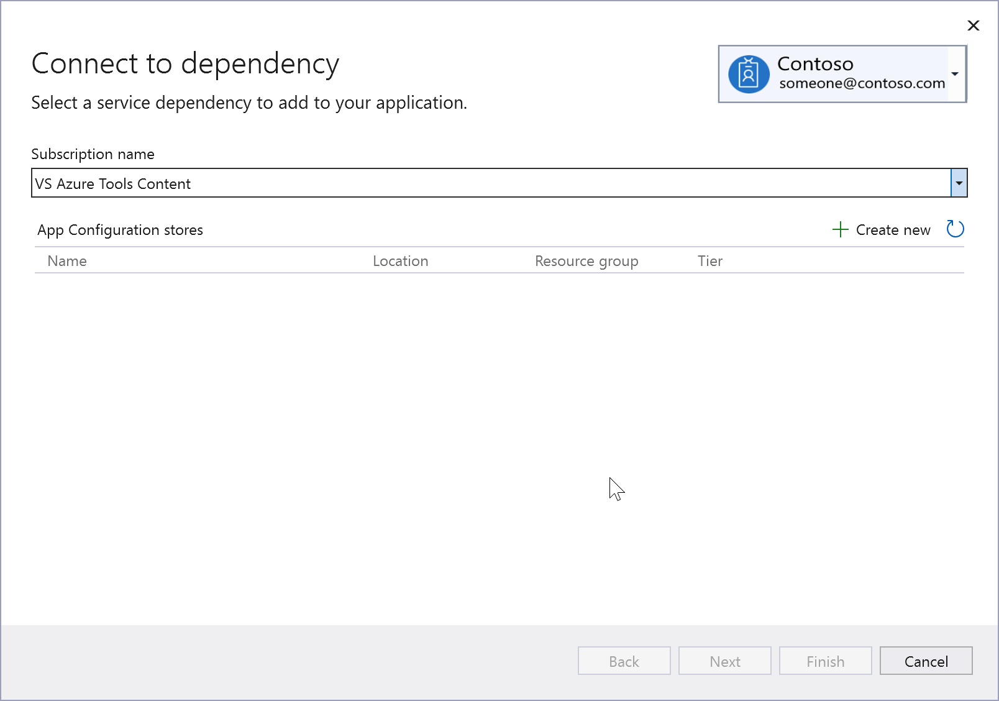

# Adding Azure App Configuration by using Visual Studio Connected Services

 [!INCLUDE [Visual Studio](~/includes/applies-to-version/vs-windows-only.md)]

In this tutorial, you will learn how to easily add everything you need to start using Azure App Configuration to manage your configuration and feature flags for web projects in Visual Studio. By using the Connected Services feature in Visual Studio, you can have Visual Studio automatically add all the code, NuGet packages, and configuration settings you need to connect to your App Configuration resource in Azure. To use this feature, you must be using Visual Studio 2019 version 16.9 or later.

You can use the App Configuration Connected Services feature in the following project types:

- ASP.NET Core
- .NET Core Console
- .NET Framework projects.

> [!NOTE]
> This topic applies to Visual Studio on Windows. For Visual Studio for Mac, see [Connected services in Visual Studio for Mac](/visualstudio/mac/connected-services).

## Prerequisites

- Visual Studio with the Azure workload installed.
- A project of one of the supported types

## Connect to Azure App Configuration using Connected Services

:::moniker range="vs-2019"

1. Open your project in Visual Studio.

1. In **Solution Explorer**, right-click the **Connected Services** node, and, from the context menu, select **Add Connected Service**.

    

1. In the **Connected Services** tab, select the + icon for **Service Dependencies**.

    

1. In the **Add Dependency** page, select **Azure App Configuration**.

    

    If you aren't signed in already, sign into your Azure account. If you don't have an Azure account, you can sign up for a [free trial](https://azure.microsoft.com/free/dotnet).

1. In the **Configure Azure App Configuration** screen, select your subscription and an existing configuration store. Then select **Next**.

    If you need to create an App Configuration store, go to the next step. Otherwise, skip to step 6.

    

1. To create an app configuration store:

   1. Select the + icon to the right of the **App Configuration stores** header. 

   1. Fill out the **Azure App Configuration: Create new** dialog, and select **Create**. Note that the Resource Name field needs to be unique. 

       

   1. When the **Azure App Configuration** dialog is displayed, the new configuration store appears in the list. Select this new store, then select **Next**.

1. Enter a connection string name, and choose whether you want the connection string stored in a local secrets file, or in [Azure Key Vault](/azure/key-vault).

   

1. The **Summary of changes** screen shows all the modifications that will be made to your project if you complete the process. If the changes look OK, choose **Finish**.

   

1. Once the **Dependency configuration process** has finished, Azure App Configuration now appears under the **Service Dependencies** node of your project.

:::moniker-end

:::moniker range=">=vs-2022"

1. Open your project in Visual Studio.

1. In **Solution Explorer**, right-click the **Connected Services** node, and, from the context menu, select **Add** to open the menu of available services.

   

1. Choose **Azure App Configuration**. The **Connect to dependency** page appears.

   

    If you aren't signed in already, sign into your Azure account. If you don't have an Azure account, you can sign up for a [free trial](https://azure.microsoft.com/free/).

1. In the **Configure Azure App Configuration** screen, select your subscription and an existing configuration store. Then select **Next**.

    If you need to create an App Configuration store, go to the next step. Otherwise, skip to step 6.

    

1. To create an app configuration store:

   1. Select the + icon to the right of the **App Configuration stores** header. 

   1. Fill out the **Azure App Configuration: Create new** dialog, and select **Create**. Note that the Resource Name field needs to be unique. 

       

   1. When the **Azure App Configuration** dialog is displayed, the new configuration store appears in the list. Select this new store, then select **Next**.

1. Enter a connection string name, and choose whether you want the connection string stored in a local secrets file, or in [Azure Key Vault](/azure/key-vault).

   

1. The **Summary of changes** screen shows all the modifications that will be made to your project if you complete the process. If the changes look OK, choose **Finish**.

   

   Once the **Dependency configuration process** has finished, Azure App Configuration now appears under the **Service Dependencies** node of your project.

1. In Solution Explorer, double-click on the **Connected Services** node to open the **Connected Services** tab. The connection appears under the **Service Dependencies** section:

   

   There's also a *Secrets.json* entry that supports secure storage of the connection string locally. Read about how this works at [Screenshot showing safe storage of app secrets in development in ASP.NET Core](/aspnet/core/security/app-secrets?tabs=windows).

   If you click on the three dots next to the dependencies you added, you can see various options such as **Connect** to reopen the wizard and change the connection, and for *Secrets.json*, the option to manage secrets. You can also click the three dots at the top right of the window to see options to start local dependencies, change settings, and more.

::: moniker-end

## Next steps

Learn about Azure App Configuration at [Azure App Configuration documentation](/azure/azure-app-configuration/overview).

## See also

- [Tutorial for using dynamic configuration in an App Configuration connected ASP.NET Core app](/azure/azure-app-configuration/enable-dynamic-configuration-aspnet-core)
- [Connected services (Visual Studio for Mac)](/visualstudio/mac/connected-services)