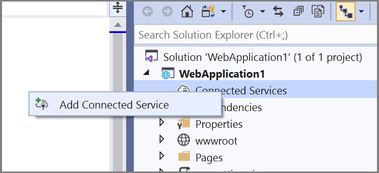
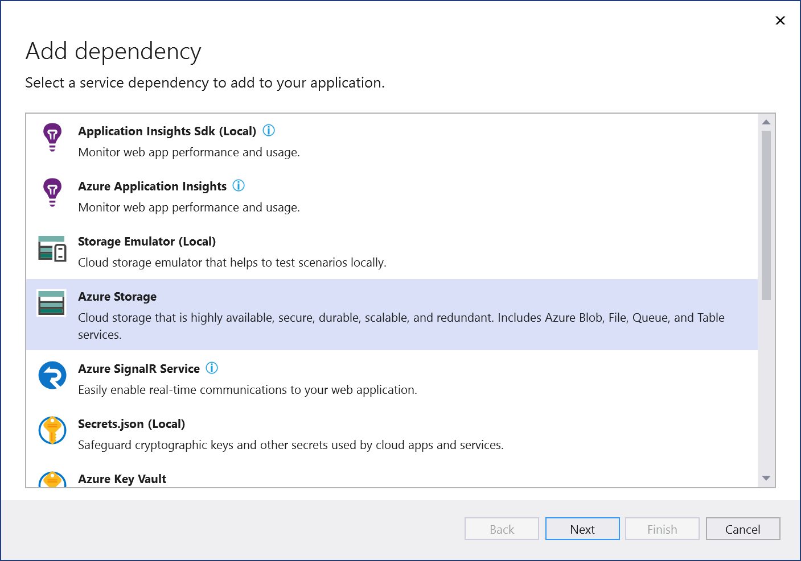
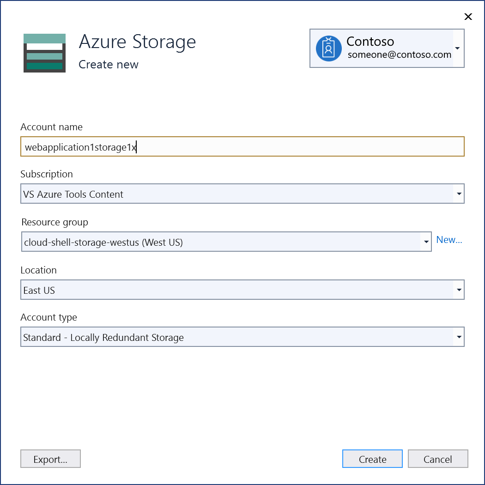
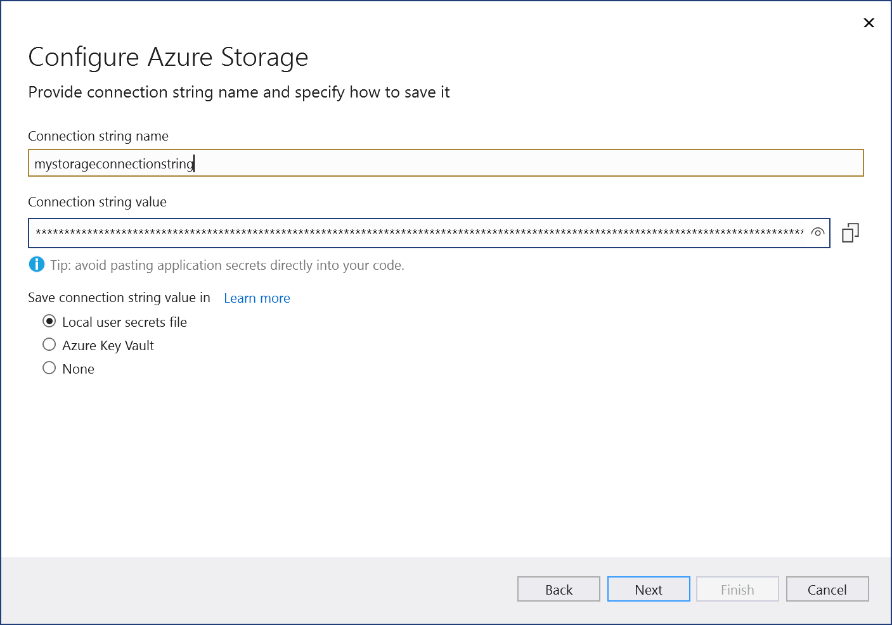
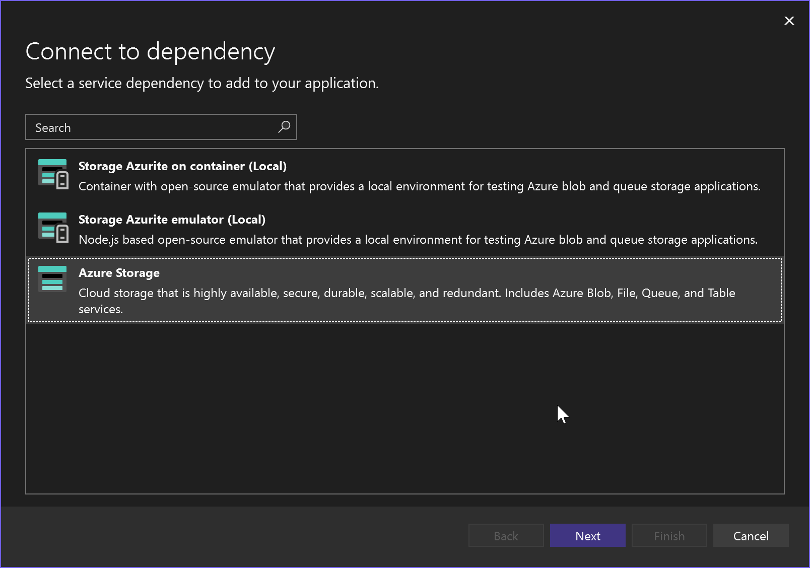
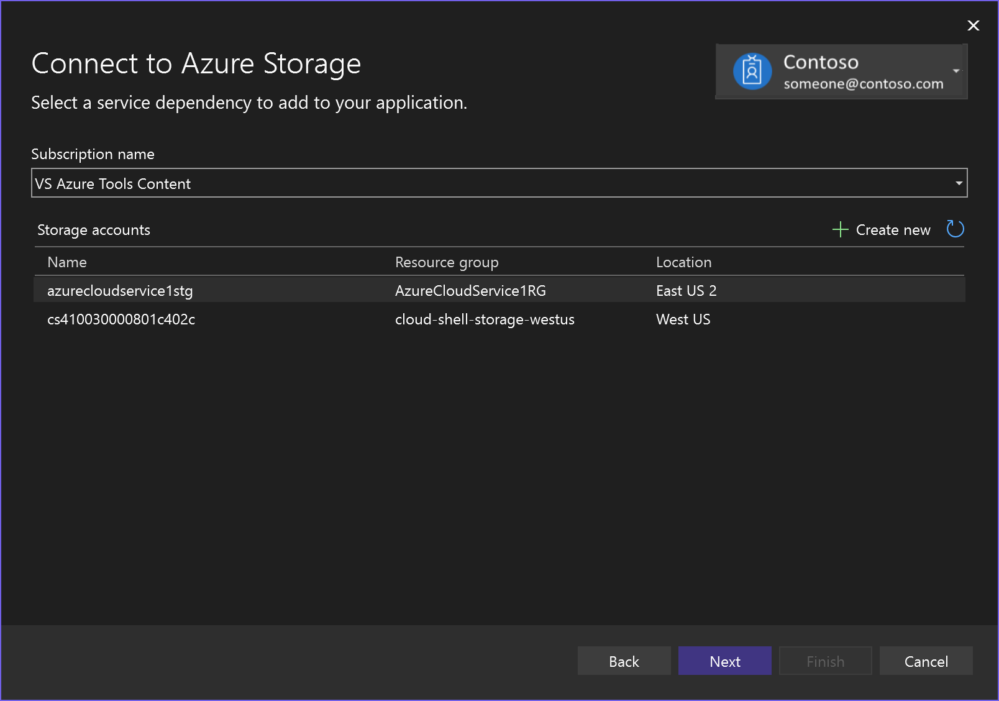
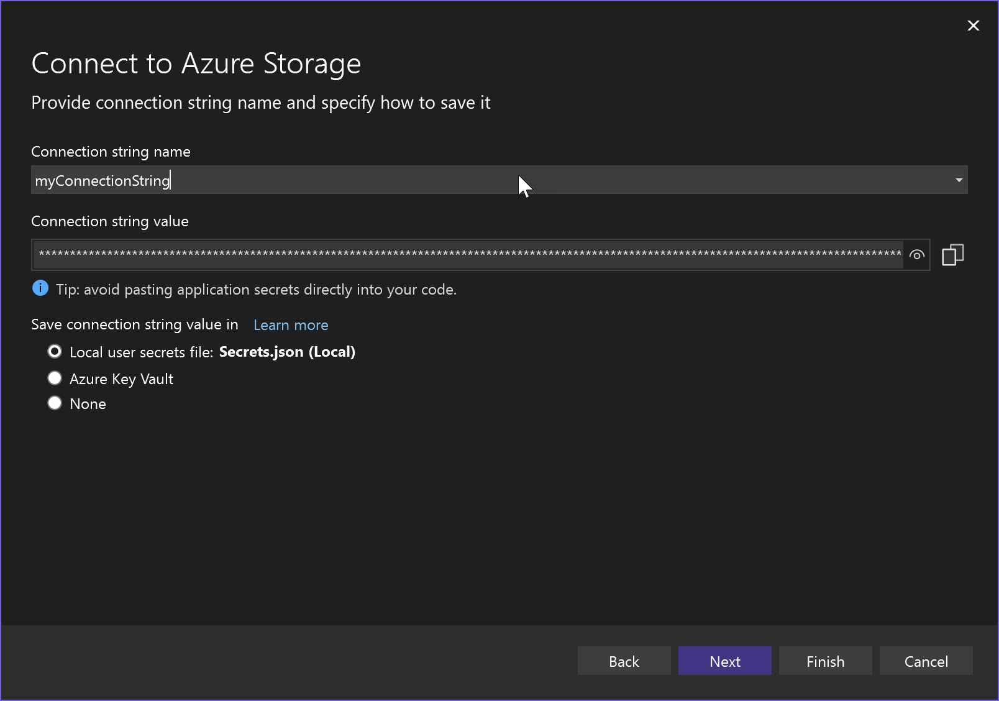
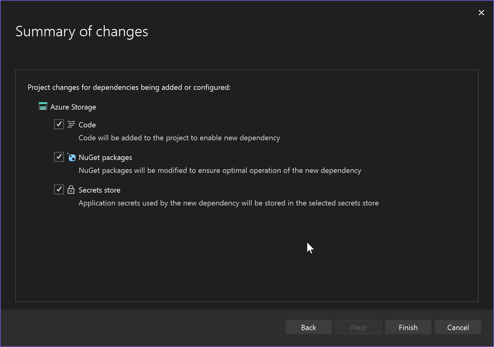

# Adding Azure storage by using Visual Studio Connected Services

 [!INCLUDE [Visual Studio](~/includes/applies-to-version/vs-windows-only.md)]

With Visual Studio, you can connect any of the following to Azure Storage by using the **Connected Services** feature:

- .NET Framework console app
- ASP.NET MVC (.NET Framework)
- ASP.NET Core
- .NET Core (including console app, WPF, Windows Forms, class library)
- .NET Core Worker Role
- Azure Functions
- Universal Windows Platform App
- Xamarin
- Cordova

The connected service functionality adds all the needed references and connection code to your project, and modifies your configuration files appropriately.

> [!NOTE]
> This topic applies to Visual Studio on Windows. For Visual Studio for Mac, see [Connected services in Visual Studio for Mac](/visualstudio/mac/connected-services).
## Prerequisites

- Visual Studio with the Azure workload installed.
- A project of one of the supported types

## Connect to Azure Storage using Connected Services

:::moniker range="vs-2019"

1. Open your project in Visual Studio.

1. In **Solution Explorer**, right-click the **Connected Services** node, and, from the context menu, select **Add Connected Service**.

    

1. In the **Connected Services** tab, select the + icon for **Service Dependencies**.

    

1. In the **Add Dependency** page, select **Azure Storage**.

    

    If you aren't signed in already, sign into your Azure account. If you don't have an Azure account, you can sign up for a [free trial](https://azure.microsoft.com/free/).

1. In the **Configure Azure Storage** screen, select an existing storage account, and select **Next**.

    If you need to create a storage account, go to the next step. Otherwise, skip to step 6.

    

1. To create a storage account:

   1. Select **Create a storage account** at the bottom of the dialog.

   1. Fill out the **Azure Storage: Create new** dialog, and select **Create**.

       

   1. When the **Azure Storage** dialog is displayed, the new storage account appears in the list. Select the new storage account in the list, and select **Next**.

1. Enter a connection string name, and choose whether you want the connection string stored in a local secrets file, or in [Azure Key Vault](/azure/key-vault).

   

1. The **Summary of changes** screen shows all the modifications that will be made to your project if you complete the process. If the changes look OK, choose **Finish**.

   

1. The storage connected service appears under the **Connected Services** node of your project.
:::moniker-end

:::moniker range=">=vs-2022"

1. Open your project in Visual Studio.

1. Press **Ctrl**+**Q** (or use the **Search** button in the Visual Studio IDE to the right of the main menu bar).

1. In **Feature search**, enter `Azure Storage`, and choose **Azure Storage - Project > Connected Services > Add > Azure Storage**.

   

1. In the **Connect to dependency** page, select **Azure Storage**, and then click **Next**.

    

    If you aren't signed in already, sign into your Azure account. If you don't have an Azure account, you can sign up for a [free trial](https://azure.microsoft.com/free/).

1. In the **Connect to Azure Storage** screen, select an existing storage account, and select **Next**.

    If you need to create a storage account, go to the next step. Otherwise, skip to the following step.

    

1. To create a storage account:

   1. Select **Create new** by the green plus sign.

   1. Fill out the **Azure Storage: Create new** dialog, and select **Create**.

       

   1. When the **Azure Storage** dialog is displayed, the new storage account appears in the list. Select the new storage account in the list, and select **Next**.

1. Enter a connection string name, and choose whether you want the connection string stored in a local secrets file, or in [Azure Key Vault](/azure/key-vault).

   

1. The **Summary of changes** screen shows all the modifications that will be made to your project if you complete the process. If the changes look OK, choose **Finish**.

   

1. The storage connected service appears under the **Connected Services** node of your project.
:::moniker-end

## Next steps

Azure Storage supports blobs and queues, as well as other features.

To learn about working with blobs, you can continue with the quickstart for blob storage, but instead of starting at the beginning, you can start at [Azure blobs quickstart (.NET) - Code examples](/azure/storage/blobs/storage-quickstart-blobs-dotnet?tabs=visual-studio%2Cmanaged-identity%2Croles-azure-portal%2Csign-in-azure-cli%2Cidentity-visual-studio#code-examples).

To learn about working with queues, start at [Azure queues quickstart (.NET) - Code examples](azure/storage/queues/storage-quickstart-queues-dotnet?tabs=passwordless%2Croles-azure-portal%2Cenvironment-variable-windows%2Csign-in-azure-cli#code-examples).

## See also

- [Azure Storage forum](https://social.msdn.microsoft.com/forums/azure/home?forum=windowsazuredata)
- [Azure Storage documentation](/azure/storage/)
- [Connected services (Visual Studio for Mac)](/visualstudio/mac/connected-services)
