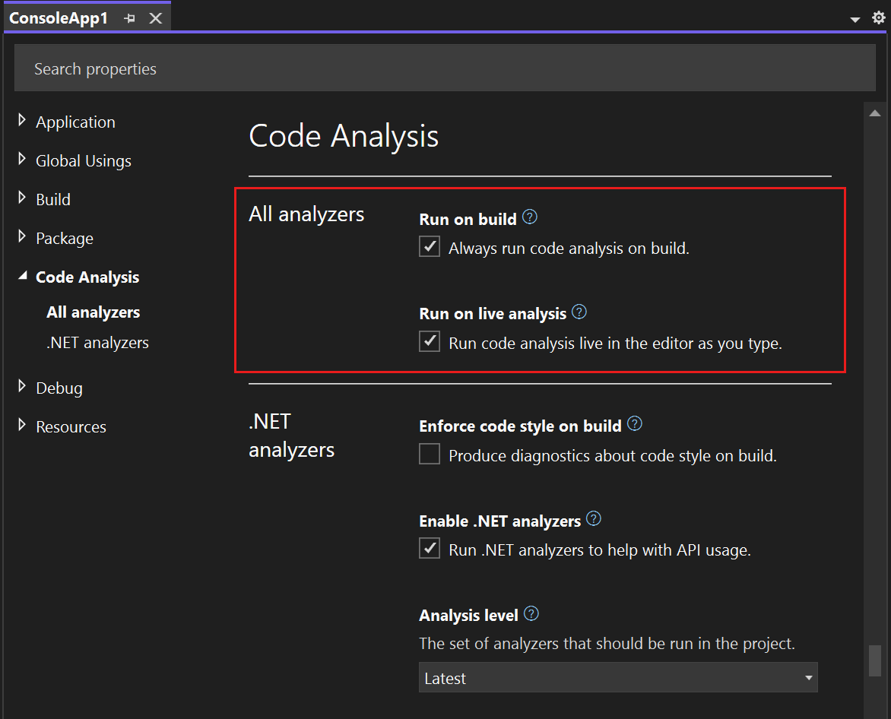

# Disable source code analysis for .NET

::: moniker range=">=vs-2022"

 Visual Studio allows you to control whether source code analyzers run at build time and design time. There are limitations to what you can disable, and the procedure for turning off code analysis differs depending on a few factors:

- Project type (.NET Core/Standard versus .NET Framework)

  .NET Core and .NET Standard projects have options on their **Code Analysis** properties page that let you turn off code analysis from analyzers installed as a NuGet package. For more information, see [.NET Core and .NET Standard projects](#net-core-and-net-standard-projects). To turn off source code analysis for .NET Framework projects, see [.NET Framework projects](#net-framework-projects).

- Source analysis versus legacy analysis

  This article applies to source code analysis and not to legacy (binary) analysis. For information about disabling legacy analysis, see [Enable and disable binary code analysis for managed code](how-to-enable-and-disable-automatic-code-analysis-for-managed-code.md).

## .NET Core and .NET Standard projects

Visual Studio 2022 version 17.0.4 and later provides two checkboxes in the **Code Analysis** properties page to control whether analyzers run at build time and design time. To disable code analysis in your project, follow these steps:

1. Right-click the project node in **Solution Explorer** and, then select **Properties**.

1. Select **Code Analysis**.

   The **Code Analysis** properties page opens.

   

1. To disable source analysis at build time, under **Run on build**, clear **Always run code analysis on build**.

1. To disable live source analysis, under **Run on live analysis**, clear **Run code analysis live in the editor as you type**.

> [!NOTE]
> Starting in Visual Studio 2022 version 17.0.4, if you prefer the on-demand code analysis execution workflow, you can disable analyzer execution during live analysis. Or, you can build and manually trigger code analysis once on a project or a solution on demand. For information about running code analysis manually, see [Run code analysis manually for .NET](how-to-run-code-analysis-manually-for-managed-code.md).

## .NET Framework projects

To turn off source code analysis for analyzers, add one or more of the following MSBuild properties to the [project file](../ide/solutions-and-projects-in-visual-studio.md#project-file).

| MSBuild property | Description | Default |
| - | - | - |
| `RunAnalyzersDuringBuild` | Controls whether analyzers run at build time. | `true` |
| `RunAnalyzersDuringLiveAnalysis` | Controls whether analyzers analyze code live at design time. | `true` |
| `RunAnalyzers` | Setting this property to `false` disables analyzers at both build and design time. It takes precedence over `RunAnalyzersDuringBuild` and `RunAnalyzersDuringLiveAnalysis`. | `true` |

For example:

```xml
<RunAnalyzersDuringBuild>false</RunAnalyzersDuringBuild>
<RunAnalyzersDuringLiveAnalysis>false</RunAnalyzersDuringLiveAnalysis>
<RunAnalyzers>false</RunAnalyzers>
```

::: moniker-end

::: moniker range="vs-2019"

This page lets you disable code analysis in Visual Studio. There are limitations to what you can disable, and the procedure for turning off code analysis differs depending on a few factors:

- Project type (.NET Core/Standard versus .NET Framework)

  .NET Core and .NET Standard projects have options on their Code Analysis properties page that let you turn off code analysis from analyzers installed as a NuGet package. For more information, see [.NET Core and .NET Standard projects](#net-core-and-net-standard-projects). For information about how to turn off source code analysis in .NET Framework projects, see [.NET Framework projects](#net-framework-projects).

- Source analysis versus legacy analysis

  This article applies to source code analysis and not to legacy (binary) analysis. For information about disabling legacy analysis, see [Enable and disable binary code analysis for managed code](how-to-enable-and-disable-automatic-code-analysis-for-managed-code.md).

## .NET Core and .NET Standard projects

Visual Studio 2019 version 16.3 and later provides two checkboxes in the **Code Analysis** properties page that lets you control whether analyzers run at build time and design time. These options are project-specific.


To open this page, right-click the project node in **Solution Explorer** and select **Properties**. Select the **Code Analysis** tab.

- To disable source analysis at build time, clear the **Run on build** option.
- To disable live source analysis, clear the **Run on live analysis** option.

> [!NOTE]
> Starting in Visual Studio 2019 version 16.5, if you prefer the on-demand code analysis execution workflow, you can disable analyzer execution during live analysis. Or, you can build and manually trigger code analysis once on a project or a solution on demand. For information about running code analysis manually, see [Run code analysis manually for .NET](how-to-run-code-analysis-manually-for-managed-code.md).

## .NET Framework projects

To turn off source code analysis for analyzers, add one or more of the following MSBuild properties to the [project file](../ide/solutions-and-projects-in-visual-studio.md#project-file).

| MSBuild property | Description | Default |
| - | - | - |
| `RunAnalyzersDuringBuild` | Controls whether analyzers run at build time. | `true` |
| `RunAnalyzersDuringLiveAnalysis` | Controls whether analyzers analyze code live at design time. | `true` |
| `RunAnalyzers` | Setting this property to `false` disables analyzers at both build and design time. It takes precedence over `RunAnalyzersDuringBuild` and `RunAnalyzersDuringLiveAnalysis`. | `true` |

For example:

```xml
<RunAnalyzersDuringBuild>false</RunAnalyzersDuringBuild>
<RunAnalyzersDuringLiveAnalysis>false</RunAnalyzersDuringLiveAnalysis>
<RunAnalyzers>false</RunAnalyzers>
```

::: moniker-end

## Related content

- [Suppress violations](use-roslyn-analyzers.md#suppress-violations)
- [Enable and disable binary code analysis for managed code](how-to-enable-and-disable-automatic-code-analysis-for-managed-code.md)
