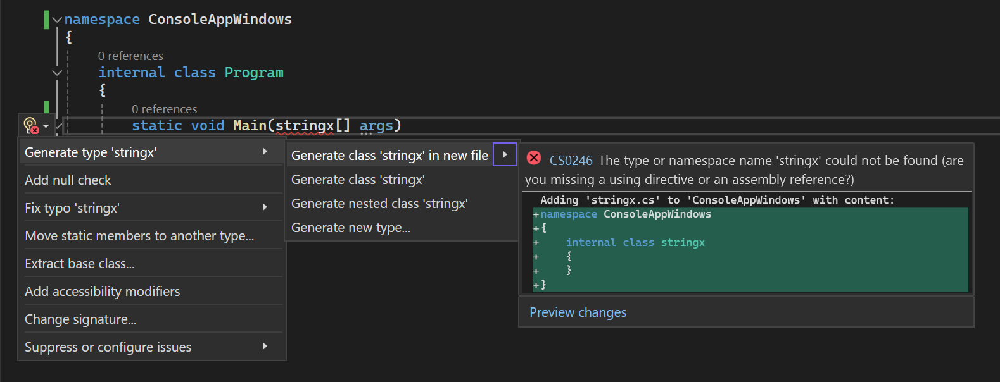
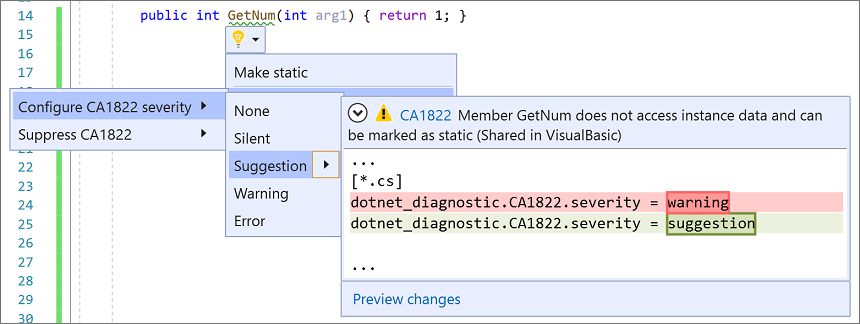
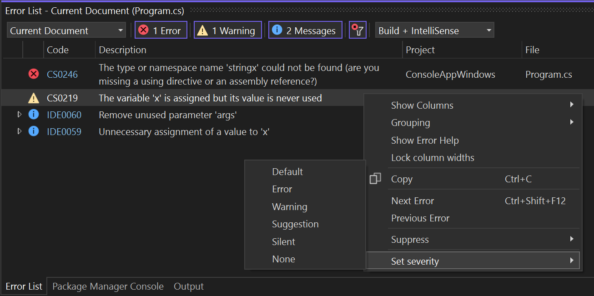
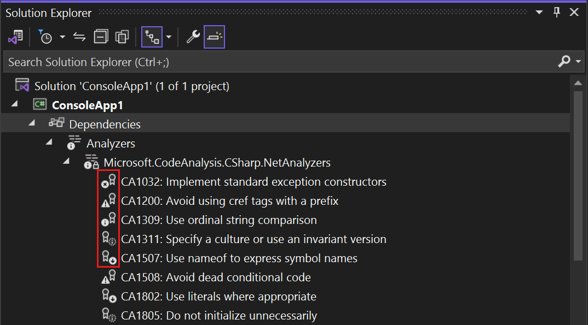

# Overview

Each Roslyn analyzer *diagnostic* or rule has a default severity and suppression state that can be overwritten and customized for your project. This article covers setting analyzer severities and suppressing analyzer violations.

## Configure severity levels

::: moniker range=">=vs-2019"

Starting in Visual Studio 2019 version 16.3, you can configure the severity of analyzer rules, or *diagnostics*, in an [EditorConfig file](#set-rule-severity-in-an-editorconfig-file), from the [light bulb menu](#set-rule-severity-from-the-light-bulb-menu), and from the error list.

::: moniker-end

::: moniker range="vs-2017"

You can configure the severity of analyzer rules, or *diagnostics*, if you [install the analyzers](../code-quality/install-roslyn-analyzers.md) as a NuGet package. You can change the severity of a rule [from Solution Explorer](#set-rule-severity-from-solution-explorer) or [in a rule set file](#set-rule-severity-in-the-rule-set-file).

::: moniker-end

The following table shows the different severity options:

| Severity (Solution Explorer) | Severity (EditorConfig file) | Build-time behavior | Editor behavior |
|-|-|-|
| Error | `error` | Violations appear as *Errors* in the Error List and in command-line build output, but do not cause builds to fail.| Offending code is underlined with a red squiggle and marked by a small red box in the scroll bar. |
| Warning | `warning` | Violations appear as *Warnings* in the Error List and in command-line build output, but do not cause builds to fail. | Offending code is underlined with a green squiggle and marked by a small green box in the scroll bar. |
| Info | `suggestion` | Violations appear as *Messages* in the Error List, and not at all in command-line build output. | Offending code is underlined with a gray squiggle and marked by a small gray box in the scroll bar. |
| Hidden | `silent` | Non-visible to user. | Non-visible to user. The diagnostic is reported to the IDE diagnostic engine, however. |
| None | `none` | Suppressed completely. | Suppressed completely. |
| Default | `default` | Corresponds to the default severity of the rule. To determine what the default value for a rule is, look in the Properties window. | Corresponds to the default severity of the rule. |

If rule violations are found by an analyzer, they're reported in the code editor (as a *squiggle* under the offending code) and in the Error List window.

The analyzer violations reported in the error list match the [severity level setting](../code-quality/use-roslyn-analyzers.md#configure-severity-levels) of the rule. Analyzer violations also show up in the code editor as squiggles under the offending code. The following image shows three violations&mdash;one error (red squiggle), one warning (green squiggle), and one suggestion (three grey dots):


The following screenshot shows the same three violations as they appear in the Error List:


Many analyzer rules, or *diagnostics*, have one or more associated *code fixes* that you can apply to correct the rule violation. Code fixes are shown in the light bulb icon menu along with other types of [Quick Actions](../ide/quick-actions.md). For information about these code fixes, see [Common Quick Actions](../ide/quick-actions.md).



### 'Hidden' severity versus 'None' severity

`Hidden` severity rules that are enabled by default are different from disabled or `None` severity rules in couple of ways.

- If any code fix has been registered for a `Hidden` severity rule, then the fix is offered as a light bulb code refactoring action in Visual Studio, even though the hidden diagnostic is not visible to the user. This is not the case for disabled `None` severity rules.
- `Hidden` severity rules can be bulk configured by entries that [set rule severity of multiple analyzer rules at once in an EditorConfig file](#set-rule-severity-of-multiple-analyzer-rules-at-once-in-an-editorconfig-file). `None` severity rules cannot be configured this way. Instead, they must be configured through entries that [set rule severity in an EditorConfig file for each rule ID](#set-rule-severity-in-an-editorconfig-file).

::: moniker range=">=vs-2019"

### Set rule severity in an EditorConfig file

(Visual Studio 2019 version 16.3 and later)

You can set the severity for compiler warnings or analyzer rules in an EditorConfig file with the following syntax:

`dotnet_diagnostic.<rule ID>.severity = <severity>`

Setting a rule's severity in an EditorConfig file takes precedence over any severity that's set in a rule set or in Solution Explorer. You can [manually](#manually-configure-rule-severity-in-an-editorconfig-file) configure severity in an EditorConfig file or [automatically](#set-rule-severity-from-the-light-bulb-menu) through the light bulb that appears next to a violation.

### Set rule severity of multiple analyzer rules at once in an EditorConfig file

(Visual Studio 2019 version 16.5 and later)

You can set the severity for a specific category of analyzer rules or for all analyzer rules with a single entry in an EditorConfig file.

- Set rule severity for a category of analyzer rules:

`dotnet_analyzer_diagnostic.category-<rule category>.severity = <severity>`

- Set rule severity for all analyzer rules:

`dotnet_analyzer_diagnostic.severity = <severity>`

> [!NOTE]
> Entries to configure multiple analyzer rules at once only apply to rules that are *enabled by default*. Analyzer rules that are marked as disabled by default in the analyzer package must be enabled through explicit `dotnet_diagnostic.<rule ID>.severity = <severity>` entries.

If you have multiple entries that are applicable to a specific rule ID, the following is the precedence order to choose the applicable entry:

- Severity entry for an individual rule by ID takes precedence over severity entry for a category.
- Severity entry for a category takes precedence over severity entry for all analyzer rules.

Consider the following EditorConfig example, where [CA1822](/dotnet/fundamentals/code-analysis/quality-rules/ca1822) has the category "Performance":

   ```ini
   [*.cs]
   dotnet_diagnostic.CA1822.severity = error
   dotnet_analyzer_diagnostic.category-performance.severity = warning
   dotnet_analyzer_diagnostic.severity = suggestion
   ```

In the preceding example, all three entries are applicable to CA1822. However, using the specified precedence rules, the first rule ID-based severity entry wins over the next entries. In this example, CA1822 will have an effective severity of "error". All the remaining rules with the "Performance" category will have severity "warning". All the remaining analyzer rules, which do not have the "Performance" category, will have severity "suggestion".

#### Manually configure rule severity in an EditorConfig file

1. If you don't already have an EditorConfig file for your project, [add one](../ide/create-portable-custom-editor-options.md#add-an-editorconfig-file-to-a-project).

2. Add an entry for each rule you want to configure under the corresponding file extension. For example, to set the severity for [CA1822](/dotnet/fundamentals/code-analysis/quality-rules/ca1822) to `error` for C# files, the entry looks as follows:

   ```ini
   [*.cs]
   dotnet_diagnostic.CA1822.severity = error
   ```

> [!NOTE]
> For IDE code-style analyzers, you can also configure them in an EditorConfig file using a different syntax, for example, `dotnet_style_qualification_for_field = false:suggestion`. However, if you set a severity using the `dotnet_diagnostic` syntax, it takes precedence. For more information, see [Language conventions for EditorConfig](/dotnet/fundamentals/code-analysis/style-rules/language-rules).

### Set rule severity from the light bulb menu

Visual Studio provides a convenient way to configure a rule's severity from the [Quick Actions](../ide/quick-actions.md) light bulb menu.

1. After a violation occurs, hover over the violation squiggle in the editor and open the light bulb menu. Or, put your cursor on the line and press **Ctrl**+**.** (period).

2. From the light bulb menu, select **Configure or Suppress issues** > **Configure \<rule ID> severity**.

   

3. From there, choose one of the severity options.

   

   Visual Studio adds an entry to the EditorConfig file to configure the rule to the requested level, as shown in the preview box.

   > [!TIP]
   > If you don't already have an EditorConfig file in the project, Visual Studio creates one for you.

### Set rule severity from the Error List window

Visual Studio also provides a convenient way to configure a rule's severity from the error list context menu.

1. After a violation occurs, right-click the diagnostic entry in the error list.

2. From the context menu, select **Set severity**.

   

3. From there, choose one of the severity options.

   Visual Studio adds an entry to the EditorConfig file to configure the rule to the requested level.

   > [!TIP]
   > If you don't already have an EditorConfig file in the project, Visual Studio creates one for you.

::: moniker-end

### Set rule severity from Solution Explorer

You can do much of the customization of analyzer diagnostics from **Solution Explorer**. If you [install analyzers](../code-quality/install-roslyn-analyzers.md) as a NuGet package, an **Analyzers** node appears under the **References** or **Dependencies** node in **Solution Explorer**. If you expand **Analyzers**, and then expand one of the analyzer assemblies, you see all the diagnostics in the assembly.


You can view the properties of a diagnostic, including its description and default severity, in the **Properties** window. To view the properties, right-click the rule and select **Properties**, or select the rule and then press **Alt**+**Enter**.


To see online documentation for a diagnostic, right-click the diagnostic and select **View Help**.

The icons next to each diagnostic in **Solution Explorer** correspond to the icons you see in the rule set when you open it in the editor:

- the "x" in a circle indicates a [severity](#configure-severity-levels) of **Error**
- the "!" in a triangle indicates a [severity](#configure-severity-levels) of **Warning**
- the "i" in a circle indicates a [severity](#configure-severity-levels) of **Info**
- the "i" in a circle on a light-colored background indicates a [severity](#configure-severity-levels) of **Hidden**
- the downward-pointing arrow in a circle indicates that the diagnostic is suppressed



::: moniker range=">=vs-2019"

#### Convert an existing Ruleset file to EditorConfig file

Starting in Visual Studio 2019 version 16.5, ruleset files are deprecated in favor of the EditorConfig file for analyzer configuration for managed code. Most of the Visual Studio tooling for analyzer rule severity configuration has been updated to work on EditorConfig files instead of ruleset files. EditorConfig files allow you to configure both analyzer rule severities and analyzer options, including Visual Studio IDE code style options. It is highly recommended that you convert your existing ruleset file to an EditorConfig file. It is also recommended that you save the EditorConfig file at the root of your repo or in the solution folder. By using the root of your repo or solution folder, you make sure that the severity settings from this file are automatically applied to the entire repo or solution, respectively.

There are a couple ways to convert an existing ruleset file to an EditorConfig file:

- From the Ruleset Editor in Visual Studio (requires Visual Studio 2019 16.5 or later). If your project already uses a specific ruleset file as its `CodeAnalysisRuleSet`, you can convert it to an equivalent EditorConfig file from Ruleset Editor within Visual Studio.

    1. Double-click the ruleset file in Solution Explorer.

       The Ruleset file should open in the Ruleset Editor. You should see a clickable **infobar** at top of the ruleset editor.

       

    2. Select the **infobar** link.

       This should open a **Save As** dialog that allows you to select the directory where you want to generate the EditorConfig file.

    3. Select the **Save** button to generate the EditorConfig file.

       The generated EditorConfig should open in the editor. Additionally, the MSBuild property `CodeAnalysisRuleSet` gets updated in the project file so that it no longer references the original ruleset file.

- From the command line:

    1. Install the NuGet package [Microsoft.CodeAnalysis.RulesetToEditorconfigConverter](https://www.nuget.org/packages/Microsoft.CodeAnalysis.RulesetToEditorconfigConverter).

    2. Execute `RulesetToEditorconfigConverter.exe` from the installed package, with paths to ruleset file and EditorConfig file as command-line arguments.

   ```
   Usage: RulesetToEditorconfigConverter.exe <%ruleset_file%> [<%path_to_editorconfig%>]
   ```

Here is an example ruleset file to convert:

```xml
<?xml version="1.0" encoding="utf-8"?>
<RuleSet Name="Rules for ConsoleApp" Description="Code analysis rules for ConsoleApp.csproj." ToolsVersion="16.0">
  <Rules AnalyzerId="Microsoft.Analyzers.ManagedCodeAnalysis" RuleNamespace="Microsoft.Rules.Managed">
    <Rule Id="CA1001" Action="Warning" />
    <Rule Id="CA1821" Action="Warning" />
    <Rule Id="CA2213" Action="Warning" />
    <Rule Id="CA2231" Action="Warning" />
  </Rules>
</RuleSet>
```

Here is the converted EditorConfig file:

```ini
# NOTE: Requires **VS2019 16.3** or later

# Rules for ConsoleApp
# Description: Code analysis rules for ConsoleApp.csproj.

# Code files
[*.{cs,vb}]


dotnet_diagnostic.CA1001.severity = warning

dotnet_diagnostic.CA1821.severity = warning

dotnet_diagnostic.CA2213.severity = warning

dotnet_diagnostic.CA2231.severity = warning
```
::: moniker-end

### Set rule severity from Solution Explorer

1. In Solution Explorer, expand **References** > **Analyzers** (or **Dependencies** > **Analyzers** for .NET Core projects).

2. Expand the assembly that contains the rule you want to set severity for.

::: moniker range=">=vs-2019"
3. Right-click the rule and select **Set severity**. In the context menu, choose one of the severity options.

   Visual Studio adds an entry to the EditorConfig file to configure the rule to the requested level. If your project uses a ruleset file instead of an EditorConfig file, the severity entry is added to the ruleset file.

   > [!TIP]
   > If you don't already have an EditorConfig file or ruleset file in the project, Visual Studio creates a new EditorConfig file for you.
::: moniker-end

::: moniker range="vs-2017"
3. Right-click the rule and select **Set Rule Set Severity**. In the context menu, choose one of the severity options.

   The severity for the rule is saved in the active rule set file.
::: moniker-end

### Set rule severity in the rule set file


1. Open the the active rule set file in one of the following ways:

- In **Solution Explorer**, double click the file, right-click **References** > **Analyzers** node, and select **Open Active Rule Set**.
- On the **Code Analysis** property page for the project, select **Open** .

  If this is the first time you're editing the rule set, Visual Studio makes a copy of the default rule set file, names it *\<projectname>.ruleset*, and adds it to your project. This custom rule set also becomes the active rule set for your project.

   > [!NOTE]
   > .NET Core and .NET Standard projects do not support the menu commands for rule sets in **Solution Explorer**, for example, **Open Active Rule Set**. To specify a non-default rule set for a .NET Core or .NET Standard project, manually [add the **CodeAnalysisRuleSet** property](using-rule-sets-to-group-code-analysis-rules.md#specify-a-rule-set-for-a-project) to the project file. You can still configure the rules within the rule set in the Visual Studio rule set editor UI.

1. Browse to the rule by expanding its containing assembly.

1. In the **Action** column, select the value to open a drop-down list, and choose the desired severity from the list.

   

::: moniker range=">=vs-2019"

## Configure Generated code

Analyzers run on all source files in a project and report violations on them. However, these violations are not useful on generated code files, such as designer generated code files, temporary source files generated by build system, etc. Users cannot manually edit these files and/or are not concerned about fixing violations in these kind of tooling-generated files.

By default, the analyzer driver executing analyzers treats files with certain name, file extension, or auto-generated file header as generated code files. For example, a file name ending with `.designer.cs` or `.generated.cs` is considered generated code. However, these heuristics might not be able to identify all the custom generated code files in user's source code.

Starting with Visual Studio 2019 16.5, end users can configure specific files and/or folders to be treated as generated code in an [EditorConfig file](https://editorconfig.org/). Follow the steps below to add such a configuration:

1. If you don't already have an EditorConfig file for your project, [add one](../ide/create-portable-custom-editor-options.md#add-an-editorconfig-file-to-a-project).

2. Add the `generated_code = true | false` entry for specific files and/or folders. For example, to treat all files whose name ends with `.MyGenerated.cs` as generated code, the entry would be as follows:

   ```ini
   [*.MyGenerated.cs]
   generated_code = true
   ```

::: moniker-end

## Suppress violations

You can suppress rule violations using various methods. For more information, see [Suppress code analysis violations](../code-quality/in-source-suppression-overview.md).

## Command-line usage

When you build your project at the command line, rule violations appear in the build output if the following conditions are met:

- The analyzers are installed with the .NET SDK or as a NuGet package, and not as a VSIX extension.

  For analyzers installed using the .NET SDK, you may need to [Enable the analyzers](../code-quality/install-net-analyzers.md). For code styles, you can also [enforce code styles on build](/dotnet/fundamentals/code-analysis/overview#code-style-analysis) by setting an MSBuild property.

- One or more rules are violated in the project's code.

- The [severity](#configure-severity-levels) of a violated rule is set to either **warning**, in which case violations don't cause build to fail, or **error**, in which case violations cause build to fail.

The verbosity of the build output does not affect whether rule violations are shown. Even with **quiet** verbosity, rule violations appear in the build output.

> [!TIP]
> If you're accustomed to running legacy analysis from the command line, either with *FxCopCmd.exe* or through msbuild with the **RunCodeAnalysis** flag, here's how to do that with code analyzers.

To see analyzer violations at the command line when you build your project using msbuild, run a command like this:

```cmd
msbuild myproject.csproj /target:rebuild /verbosity:minimal
```

The following image shows the command-line build output from building a project that contains an analyzer rule violation:


## Dependent projects

In a .NET Core project, if you add a reference to a project that has NuGet analyzers, those analyzers are automatically added to the dependent project too. To disable this behavior, for example if the dependent project is a unit test project, mark the NuGet package as private in the *.csproj* or *.vbproj* file of the referenced project by setting the **PrivateAssets** attribute:

```xml
<PackageReference Include="Microsoft.CodeAnalysis.NetAnalyzers" Version="5.0.0" PrivateAssets="all" />
```

## See also

- [Overview of code analyzers in Visual Studio](../code-quality/roslyn-analyzers-overview.md)
- [Submit a code analyzer bug](https://github.com/dotnet/roslyn-analyzers/issues)
- [Use rule sets](../code-quality/using-rule-sets-to-group-code-analysis-rules.md)
- [Suppress code analysis warnings](../code-quality/in-source-suppression-overview.md)
- [Configuration options for code analysis (.NET)](/dotnet/fundamentals/code-analysis/configuration-options)
