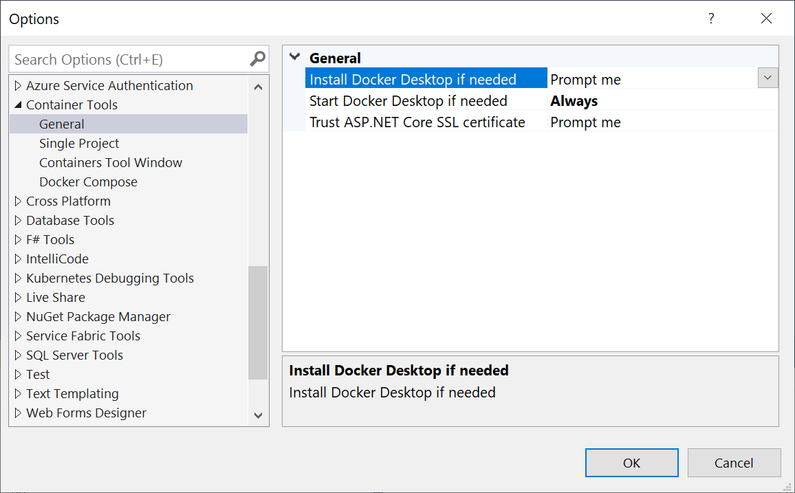
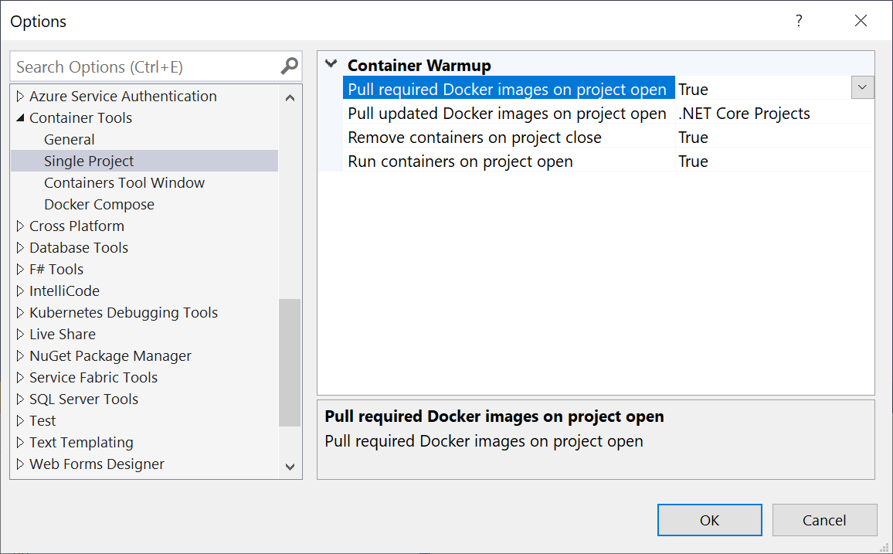

# How to configure Visual Studio Container Tools

Using Visual Studio settings, you can control some aspects of how Visual Studio works with Docker containers, including settings that affect performance and resource usage when working with Docker containers.

## Container Tools settings

From the main menu, choose **Tools > Options**, and expand **Container Tools > Settings**. The container tools settings appear.

::: moniker range="vs-2017"

::: moniker-end

::: moniker range=">=vs-2019"

Container Tools **General** settings:

Container Tools **Single Project** and **Docker Compose** settings:

::: moniker-end

The following table might help you decide how to set these options.

::: moniker range="vs-2017"
| Name | Default Setting | Applies To | Description |
| -----|:---------------:|:----------:| ----------- |
| Automatically pull required Docker images on project load | On | Docker Compose | For increased performance when loading projects, Visual Studio will start a Docker pull operation in the background so that when you're ready to run your code, the image is already downloaded or in the process of downloading. If you're just loading projects and browsing code, you can turn this off to avoid downloading container images you don't need. |
| Automatically start containers in background | On | Docker Compose | Again for increased performance, Visual Studio creates a container with volume mounts ready for when you build and run your container. If you want to control when your container is created, turn this off. |
| Automatically kill containers on solution close | On | Docker Compose | Turn this off if you would like containers for your solution to continue to run after closing the solution or closing Visual Studio. |
| Do not prompt for trusting localhost SSL certificate | Off | ASP.NET Core 2.1 projects | If the localhost SSL certificate is not trusted, Visual Studio will prompt every time you run your project, unless this checkbox is checked. |
::: moniker-end

::: moniker range=">=vs-2019"

The following table describes **General** settings:

| Name | Default Setting | Applies To | Description |
| -----|:---------------:|:----------:| ----------- |
| Install Docker Desktop if needed | Prompt Me | Single Project, Docker Compose | Choose whether you want to be prompted if Docker Desktop is not installed. |
| Trust ASP.NET Core SSL certificate | Prompt Me | ASP.NET Core 2.x projects | When set to **Prompt Me**, if the localhost SSL certificate is not trusted, Visual Studio will prompt every time you run your project. |

The following table describes **Single Project** and **Docker Compose** settings:

| Name | Default Setting | Applies To | Description |
| -----|:---------------:|:----------:| ----------- |
| Pull required Docker images on project open | True | Single Project, Docker Compose | For increased performance when loading projects, Visual Studio will start a Docker pull operation in the background so that when you're ready to run your code, the image is already downloaded or in the process of downloading. If you're just loading projects and browsing code, you can set to **False** to avoid downloading container images you don't need. |
| Run containers on project open | True | Single Project, Docker Compose | Again for increased performance, Visual Studio creates a container ahead of time so that it's ready for when you build and run your container. If you want to control when your container is created, set to **False**. |
| Stop containers on project close | True | Single Project and Docker Compose | Set to **False** if you would like containers for your solution to continue to run after closing the solution or closing Visual Studio. |

::: moniker-end
> [!WARNING]
> If the localhost SSL certificate is not trusted, and you check the box to suppress prompting, then HTTPS web requests might fail at runtime in your app or service. In that case, uncheck the **Do not prompt** checkbox, run your project, and indicate trust at the prompt.

## Next steps

Read more about working with containers in Visual Studio in this [overview](visual-studio-tools-for-docker.md).