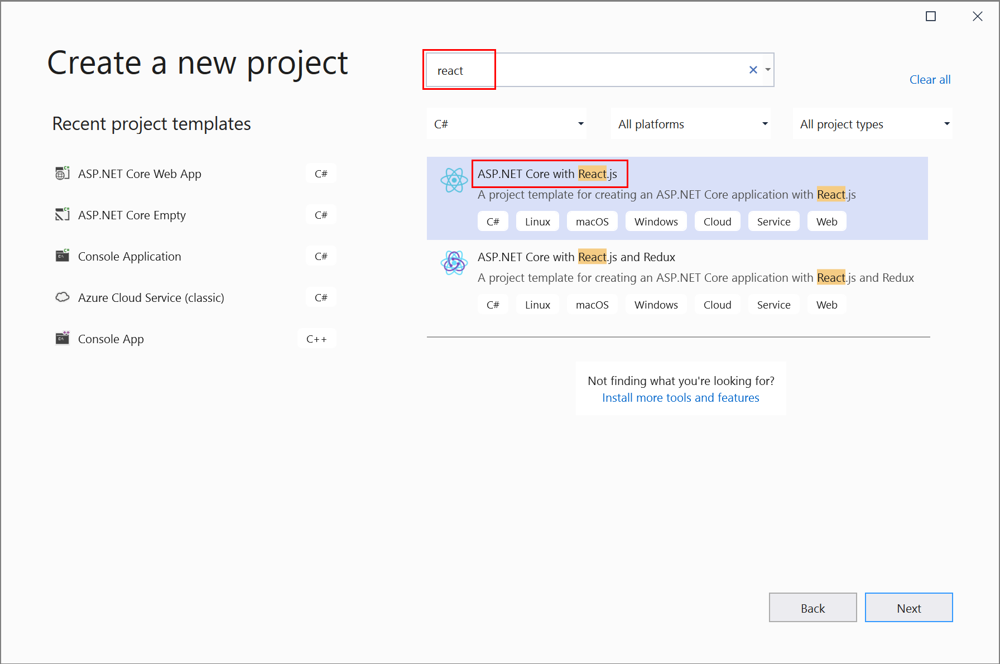
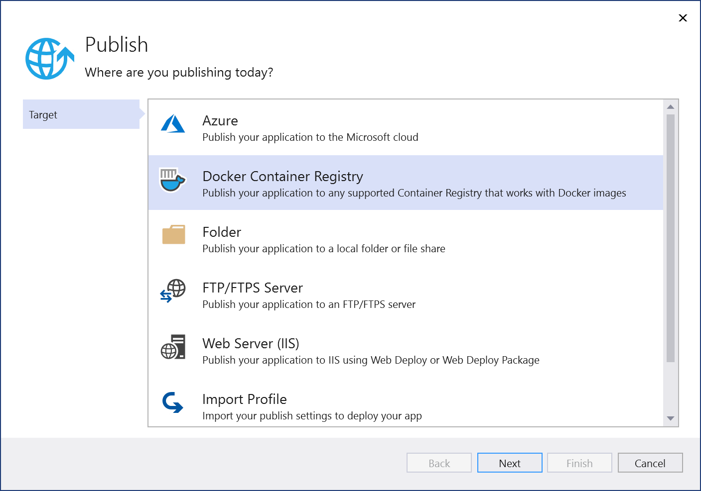
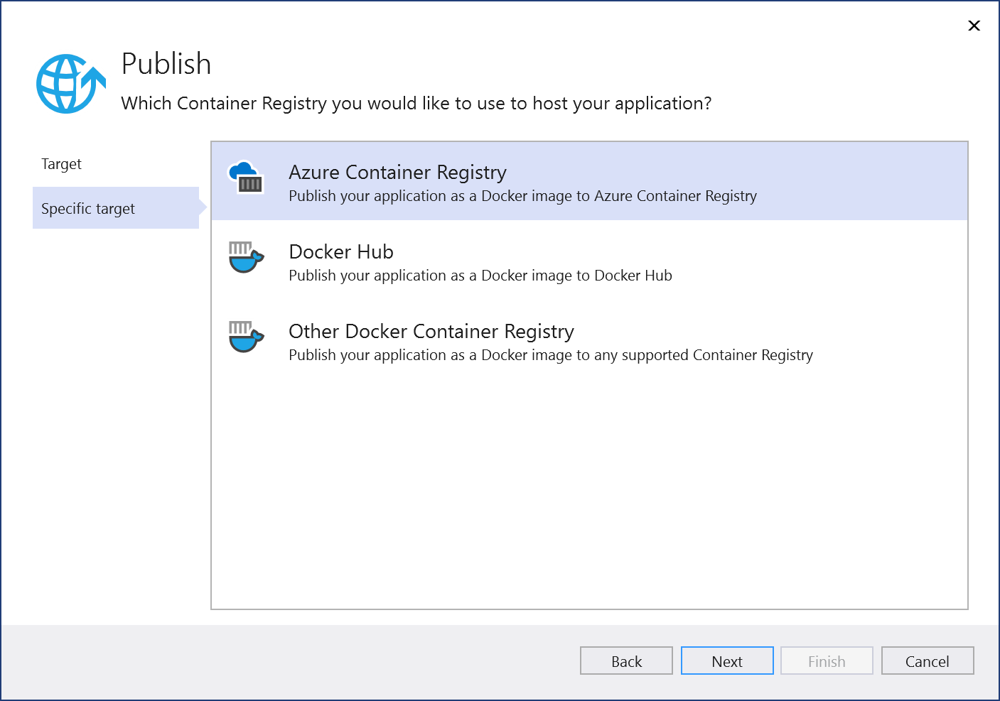
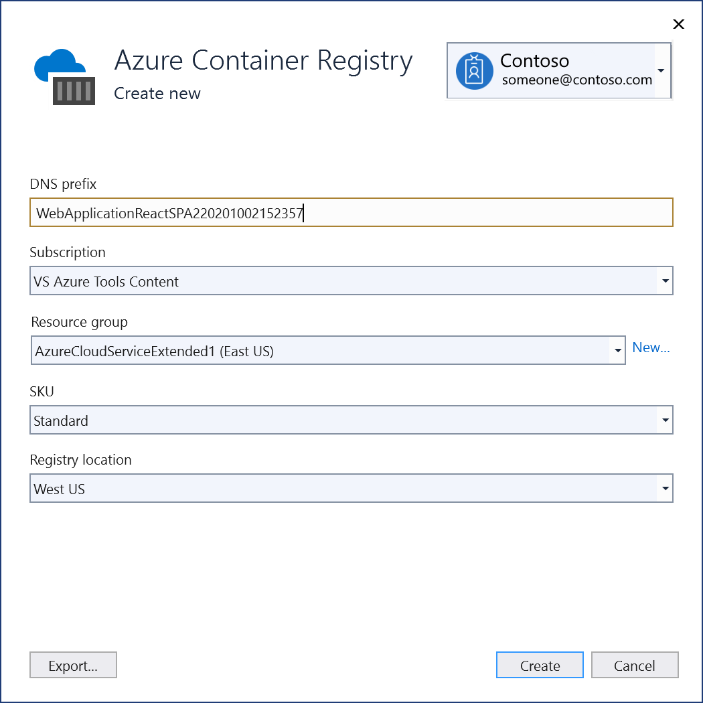
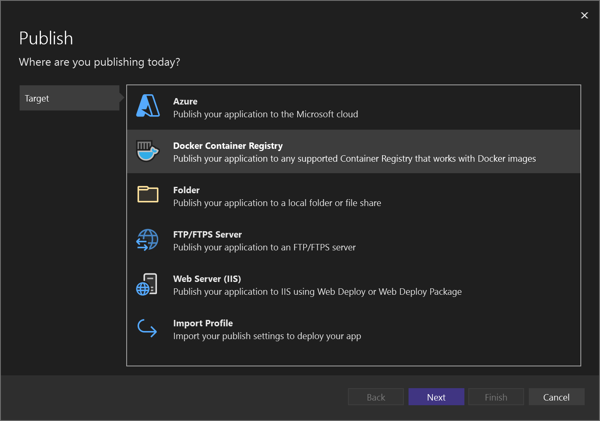

# Quickstart: Use Docker with a React Single-page App in Visual Studio

With Visual Studio, you can easily build, debug, and run containerized ASP.NET Core apps, including those with client-side JavaScript such as React.js single-page app, and publish them to Azure Container Registry, Docker Hub, Azure App Service, or your own Container Registry. In this article, we publish to Azure Container Registry.

## Prerequisites

::: moniker range="vs-2019"
- [Docker Desktop](https://hub.docker.com/editions/community/docker-ce-desktop-windows)
- [Visual Studio 2019](https://visualstudio.microsoft.com/downloads/?cid=learn-onpage-download-cta) with the **Web Development**, **Azure Tools** workload, and/or **.NET Core cross-platform development** workload installed
- [.NET Core 3.1 Development Tools](https://dotnet.microsoft.com/download/dotnet-core/3.1) for development with .NET Core 3.1.
- To publish to Azure Container Registry, an Azure subscription. [Sign up for a free trial](https://azure.microsoft.com/offers/ms-azr-0044p/).
- [Node.js](https://nodejs.org/en/download/)
- For Windows containers, Windows 10 version 1809 or later, to use the Docker images referenced in this article.
::: moniker-end
::: moniker range=">=vs-2022"
- [Docker Desktop](https://hub.docker.com/editions/community/docker-ce-desktop-windows)
- [Visual Studio 2022](https://visualstudio.microsoft.com/downloads/?cid=learn-onpage-download-cta) with the **Web Development**, **Azure Tools** workload, and/or **.NET Core cross-platform development** workload installed
- To publish to Azure Container Registry, an Azure subscription. [Sign up for a free trial](https://azure.microsoft.com/offers/ms-azr-0044p/).
- [Node.js](https://nodejs.org/en/download/)
- For Windows containers, Windows 10 version 1809 or later, to use the Docker images referenced in this article.

::: moniker-end

## Installation and setup

For Docker installation, first review the information at [Docker Desktop for Windows: What to know before you install](https://docs.docker.com/docker-for-windows/install/#what-to-know-before-you-install). Next, install [Docker Desktop](https://hub.docker.com/editions/community/docker-ce-desktop-windows).

## Create a project and add Docker support

::: moniker range="vs-2019"

1. Create a new project using the **ASP.NET Core with React.js** template.

   

1. On the **Additional information** screen, you can't select **Enable Docker Support**, but don't worry, you can add that support later.

   

1. Right-click on the project node, and choose **Add** > **Docker Support** to add a Dockerfile to your project.

   

1. Select the container type.

The next step is different depending on whether you're using Linux containers or Windows containers.

> [!NOTE]
> If you're using the latest project templates in Visual Studio 2022 or later, you don't need to modify the Dockerfile.

## Modify the Dockerfile (Linux containers)

A *Dockerfile*, the recipe for creating a final Docker image, is created in the project. Refer to [Dockerfile reference](https://docs.docker.com/engine/reference/builder/) for an understanding of the commands within it.

The default Dockerfile uses a base image to run the container, but when you want to also be able to run a Node.js application on it, you need to install Node.js, which means adding some installation commands in a couple of places in the Dockerfile. The installation commands require elevated permissions, since the changes affect the container's privileged system files and folders.

When the new project dialog's **Configure for HTTPS** checkbox is checked, the *Dockerfile* exposes two ports. One port is used for HTTP traffic; the other port is used for HTTPS. If the checkbox isn't checked, a single port (80) is exposed for HTTP traffic.

If you're targeting .NET 8 or later, the default Dockerfile that Visual Studio creates using the normal user account (look for the line `USER app`), but that account doesn't have the elevated permissions required to install Node.js. To account for this situation, do the following:

1. In the Dockerfile, delete the line `USER app`.
1. Change the ports that are exposed in the first section of the Dockerfile to port 80 is for HTTP requests and (if you chose to support HTTPS when you created the project) 443 for HTTPS requests.
1. Edit `launchSettings.json` to change the port references there to 80 and 443; replace 8080 with 80 for HTTP, and 8081 with 443 for HTTPS.

For all .NET versions, use the following steps to update the Dockerfile to install Node.js:

1. Add the following lines to install curl, Node.js 14.x, and certain required Node libraries in the container. Be sure to add these lines both in the first section, to add the installation of the Node package manager `npm.exe` to the base image, as well as in the `build` section.

```dockerfile
RUN apt-get update
RUN apt-get install -y curl
RUN apt-get install -y libpng-dev libjpeg-dev curl libxi6 build-essential libgl1-mesa-glx
RUN curl -sL https://deb.nodesource.com/setup_lts.x | bash -
RUN apt-get install -y nodejs
```

The *Dockerfile* should now look something like this:

```dockerfile
#See https://aka.ms/containerfastmode to understand how Visual Studio uses this Dockerfile to build your images for faster debugging.

FROM mcr.microsoft.com/dotnet/aspnet:3.1 AS base
WORKDIR /app
EXPOSE 80
EXPOSE 443
RUN apt-get update
RUN apt-get install -y curl
RUN apt-get install -y libpng-dev libjpeg-dev curl libxi6 build-essential libgl1-mesa-glx
RUN curl -sL https://deb.nodesource.com/setup_lts.x | bash -
RUN apt-get install -y nodejs

FROM mcr.microsoft.com/dotnet/sdk:3.1 AS build
RUN apt-get update
RUN apt-get install -y curl
RUN apt-get install -y libpng-dev libjpeg-dev curl libxi6 build-essential libgl1-mesa-glx
RUN curl -sL https://deb.nodesource.com/setup_lts.x | bash -
RUN apt-get install -y nodejs
WORKDIR /src
COPY ["ProjectSPA1/ProjectSPA1.csproj", "ProjectSPA1/"]
RUN dotnet restore "ProjectSPA1/ProjectSPA1.csproj"
COPY . .
WORKDIR "/src/ProjectSPA1"
RUN dotnet build "ProjectSPA1.csproj" -c Release -o /app/build

FROM build AS publish
RUN dotnet publish "ProjectSPA1.csproj" -c Release -o /app/publish

FROM base AS final
WORKDIR /app
COPY --from=publish /app/publish .
ENTRYPOINT ["dotnet", "ProjectSPA1.dll"]
```

The preceding *Dockerfile* is based on the [mcr.microsoft.com/dotnet/core/aspnet](https://hub.docker.com/_/microsoft-dotnet-aspnet/) image, and includes instructions for modifying the base image by building your project and adding it to the container.

## Modify the Dockerfile (Windows containers)

Open the project file by double-clicking on the project node, and update the project file (*.csproj) by adding the following property as a child of the `<PropertyGroup>` element:

   ```xml
    <DockerfileFastModeStage>base</DockerfileFastModeStage>
   ```

> [!NOTE]
> The change to **DockerfileFastModeStage** is required, because the Dockerfile here adds a stage to the beginning of the Dockerfile. In order to optimize performance, Visual Studio uses **Fast mode**, but it only works if the right stage is used. The default is the first stage in the Dockerfile, which in this example, is changed from `base` to something else in order to download Node.js. For more explanation of **Fast mode**, see [Customize Docker containers in Visual Studio](container-build.md#debugging).

Update the Dockerfile by adding the following lines. These lines will copy Node and `npm`` to the container.

   1. Add ``# escape=` `` to the first line of the Dockerfile
   1. Add the following lines before `FROM ... base`

      ```dockerfile
      FROM mcr.microsoft.com/powershell AS downloadnodejs
      ENV NODE_VERSION=14.16.0
      SHELL ["pwsh", "-Command", "$ErrorActionPreference = 'Stop';$ProgressPreference='silentlyContinue';"]
      RUN Invoke-WebRequest -OutFile nodejs.zip -UseBasicParsing "https://nodejs.org/dist/v$($env:NODE_VERSION)/node-v$($env:NODE_VERSION)-win-x64.zip"; `
          Expand-Archive nodejs.zip -DestinationPath C:\; `
          Rename-Item "C:\node-v$($env:NODE_VERSION)-win-x64" c:\nodejs
      ```

   1. Add the following line before and after `FROM ... build`

      ```dockerfile
      COPY --from=downloadnodejs C:\nodejs\ C:\Windows\system32\
      ```

   1. The complete Dockerfile should now look something like this:

      ```dockerfile
      # escape=`
      #Depending on the operating system of the host machines(s) that will build or run the containers, the image specified in the FROM statement may need to be changed.
      #For more information, please see https://aka.ms/containercompat
      FROM mcr.microsoft.com/powershell AS downloadnodejs
      ENV NODE_VERSION=14.16.0
      SHELL ["pwsh", "-Command", "$ErrorActionPreference = 'Stop';$ProgressPreference='silentlyContinue';"]
      RUN Invoke-WebRequest -OutFile nodejs.zip -UseBasicParsing "https://nodejs.org/dist/v$($env:NODE_VERSION)/node-v$($env:NODE_VERSION)-win-x64.zip"; \
          Expand-Archive nodejs.zip -DestinationPath C:\; \
          Rename-Item "C:\node-v$($env:NODE_VERSION)-win-x64" c:\nodejs

      FROM mcr.microsoft.com/dotnet/core/aspnet:3.1 AS base
      WORKDIR /app
      EXPOSE 80
      EXPOSE 443
      COPY --from=downloadnodejs C:\\nodejs C:\\Windows\\system32

      FROM mcr.microsoft.com/dotnet/core/sdk:3.1 AS build
      COPY --from=downloadnodejs C:\\nodejs C:\\Windows\\system32
      WORKDIR /src
      COPY ["ProjectSPA1/ProjectSPA1.csproj", "ProjectSPA1/"]
      RUN dotnet restore "ProjectSPA1/ProjectSPA1.csproj"
      COPY . .
      WORKDIR "/src/ProjectSPA1"
      RUN dotnet build "ProjectSPA1.csproj" -c Release -o /app/build

      FROM build AS publish
      RUN dotnet publish "ProjectSPA1.csproj" -c Release -o /app/publish

      FROM base AS final
      WORKDIR /app
      COPY --from=publish /app/publish .
      ENTRYPOINT ["dotnet", "ProjectSPA1.dll"]
      ```

   1. Update the `.dockerignore` file by removing the `**/bin`.

::: moniker-end
::: moniker range=">=vs-2022"

Follow these steps if you're using Visual Studio 2022 version 17.8 or later:

1. Create a new project using the **React and ASP.NET Core** template.

   :::image type="content" alt-text="Screenshot of creating a new React and ASP.NET Core project." source="media/container-tools-react/vs-2022/react-and-asp-net-core.png" lightbox="media/container-tools-react/vs-2022/react-and-asp-net-core.png" :::

1. On the **Additional information** screen, select **Enable container support**. Be sure to select **Dockerfile** option, since you'll need to manually make changes to that file.

   :::image type="content" alt-text="Screenshot of creating a React and ASP.NET Core project - Additional information screen" source="media/container-tools-react/vs-2022/additional-information-net-8.png" lightbox="media/container-tools-react/vs-2022/additional-information-net-8.png" :::

   > [!NOTE]
   > In some versions of Visual Studio 2022, this option is not enabled, but you can add that support later.

   Visual Studio creates two projects - one for the React JavaScript client code, and another for the ASP.NET Core C# server code.

1. If you didn't add Docker container support during project creation, right-click on the server project node, and choose **Add** > **Docker Support** and be sure to choose the Dockerfile option to create a Dockerfile.

   :::image alt-text="Screenshot of Add Docker support menu item" type="content" source="media/container-tools-react/vs-2022/add-docker-support.png" lightbox="media/container-tools-react/vs-2022/add-docker-support.png" :::

1. Select the container type.

Use the following steps for Visual Studio 2022 version 17.0 to 17.7:

1. Create a new project using the **ASP.NET Core with React.js** template.

   

1. On the **Additional information** screen, you can't select **Enable Docker Support**, but don't worry, you can add that support later.

   

1. Right-click on the project node, and choose **Add** > **Docker Support** to add a Dockerfile to your project.

   

1. Select the container type.

:::moniker-end

## Debug

:::moniker range=">=vs-2022"
With Visual Studio 2022 version 17.9 or later and the **React and ASP.NET Core** template that uses `vite.js`, the projects are already configured to start both the client and server projects with debugging support, but you need to set up the right port for the SPA proxy to use to access the ASP.NET Core server running in the container. You can get the host port from the **Containers** window in Visual Studio and set it in the React project as described in [Create a React app - Docker](../javascript/tutorial-asp-net-core-with-react.md#docker).

You can also disable the launch in the browser for the server, which is set up to open with Swagger, which is not required for this scenario. To disable the browser launch, open the **Properties** (**Alt**+**Enter**), go to the **Debug** tab, and click on the link **Open debug launch profiles UI**, and clear the **Launch browser** checkbox.

If you're using an earlier version of Visual Studio 2022, continue reading to set up debugging with the single-page application (SPA) proxy server.

The project uses the SPA Proxy during debugging. See [Improved single-page app (SPA) templates](https://devblogs.microsoft.com/dotnet/asp-net-core-updates-in-net-6-preview-4/#improved-single-page-app-spa-templates). When debugging, the JavaScript client runs on the host machine, but the ASP.NET Core server code runs in the container. When published, the proxy isn't run, and the client code runs on the same server as the ASP.NET Core code. You already have a Debug profile **Docker* that you can use to debug the server code. To debug the JavaScript client code, you can create an additional debug profile. You also need to start the proxy manually from a command prompt when debugging JavaScript. You can leave it running through multiple debug sessions.

1. Build the project, if not already built.

1. Open a Visual Studio dev command prompt, go to the ClientApp folder in your project, and then give the command, `npm run start`. You should see something like this:

   ```output
   Compiled successfully!

   You can now view project3_spa in the browser.

     Local:            https://localhost:44407
     On Your Network:  https://192.168.1.5:44407

   Note that the development build isn't optimized.
   To create a production build, use npm run build.

   webpack compiled successfully
   ```

   > [!NOTE]
   > Note the local URL. You need to provide this in a debug launch profile, which is stored in your `launchSettings.json` file.

1. Open the dropdown list that contains debug profiles (next to the green triangle icon or **Start** button), and choose **{ProjectName} Debug Properties**, and choose the **Docker** profile.
1. Check the **Environment variables** section and add the following environment variables if not already present:

   `ASPNETCORE_ENVIRONMENT=Development,ASPNETCORE_HOSTINGSTARTUPASSEMBLIES=Microsoft.AspNetCore.SpaProxy`

1. Set the **URL** to `https://localhost:{proxy-port}` where `{proxy-port}` is the port from the proxy server (from step 1).

   

   This action changes the Docker entry in the `launchSettings.json` file and launches the correct URL for the local proxy running on the host. Find the `launchSettings.json` file in **Solution Explorer** under **Properties**.

1. You should see something like the following code:

   ```json
   "profiles": {
      "Docker": {
         "commandName": "Docker",
         "launchBrowser": true,
         "environmentVariables": {
           "ASPNETCORE_ENVIRONMENT": "Development",
           "ASPNETCORE_HOSTINGSTARTUPASSEMBLIES": "Microsoft.AspNetCore.SpaProxy"
         },
         "launchUrl": "https://localhost:44407",
         "useSSL": true
      }
   }
   ```

   > [!IMPORTANT]
   > Do not set the launch settings option `publishAllPorts` to `true` if you're using a proxy. That option publishes all exposed ports to a random port, which won't work when you set a specific port in the SPA proxy.

1. Open the file *ClientApp/src/setupProxy.js* and change the line that sets the target to use the `localhost` address and port on the container. You can find the port on the **Ports** tab of the **Containers** window.

   ```javascript
   const target =  'https://localhost:{container-port}';
   ```

   If you're using HTTPS, be sure to choose the right port for HTTPS, which is 443 in this tutorial.

1. Launch the app with debugging (**F5**).

   

   If you get a build error trying to write the output assemblies, you might have to stop a previously running container to unlock the files.

1. Verify that you can hit a breakpoint in client-side JavaScript code by setting a breakpoint in **ClientApp/src/components/Counter.js** in the **incrementCounter** function, and then try hitting the breakpoint by clicking the **Increment** button on the Counters page.

   

1. Next, try hitting a breakpoint in the server-side ASP.NET Core code. Set a breakpoint in `WeatherController.cs` in the `Get` method and try appending `/weatherforecast` to the base `localhost` and port URL to activate that code.

   

1. If the container port changes, which can happen if you make a significant change, such as updating `launchSettings.json` or updating the debug launch profile in the IDE, you need to update the port in `setupProxy.js` and also restart the proxy. Terminate the current proxy (**Ctrl**+**C** in the command window where it's running), and then restart it using the same command `npm run start`.

:::moniker-end

:::moniker range="vs-2019"

Select **Docker** from the debug dropdown list in the toolbar, and start debugging the app. You might see a message with a prompt about trusting a certificate; choose to trust the certificate to continue. The first time you build, Docker downloads the base images, so it might take a bit longer.

The **Container Tools** option in the **Output** window shows what actions are taking place. You should see the installation steps associated with *npm.exe*.

The browser shows the app's home page.


:::moniker-end

## Containers window

Open the **Containers** tool window. You can find it on the menu under **View** > **Other Windows** > **Containers**, or press **Ctrl**+**Q** and start typing `containers` in the search box, then choose **Containers** window from the results. When the window comes up, dock it on the bottom under the editor pane.

The **Containers** window shows the running containers and lets you view information about them. You can view the environment variables, labels, ports, volumes, the file system, and logs. The toolbar buttons let you create a terminal (shell prompt) inside the container, attach the debugger, or prune unused containers. See [Use the Containers window](view-and-diagnose-containers.md).


Click on the **Files** tab, and expand the `app` folder to see your published application files.

You can also view the images and inspect information about them. Choose the **Images** tab, locate the one for your project, and then choose the **Details** tab to view a json file that contains information about an image.


> [!NOTE]
> The **dev** image does not contain the app binaries and other content, as **Debug** configurations use volume mounting to provide the iterative edit and debug experience. To create a production image containing all contents, use the **Release** configuration.

## Publish Docker images

Once the develop and debug cycle of the app is completed, you can create a production image of the app.

:::moniker range="vs-2019"

1. Change the configuration dropdown list to **Release** and build the app.
1. Right-click your project in **Solution Explorer** and choose **Publish**.
1. On the publish target dialog, select **Docker Container Registry**.

   

1. Next, choose **Azure Container Registry**.

   

1. Choose **Create a new Azure Container Registry**.
1. Fill in your desired values in the **Create new Azure Container Registry** screen.

    | Setting      | Suggested value  | Description                                |
    | ------------ |  ------- | -------------------------------------------------- |
    | **DNS Prefix** | Globally unique name | Name that uniquely identifies your container registry. |
    | **Subscription** | Choose your subscription | The Azure subscription to use. |
    | **[Resource Group](/azure/azure-resource-manager/resource-group-overview)** | myResourceGroup |  Name of the resource group in which to create your container registry. Choose **New** to create a new resource group.|
    | **[SKU](/azure/container-registry/container-registry-skus)** | Standard | Service tier of the container registry  |
    | **Registry Location** | A location close to you | Choose a Location in a [region](https://azure.microsoft.com/regions/) near you or near other services that use your container registry. |

    

1. Select **Create**, and then select **Finish**.

   

   When the publish process ends, you can review the publish settings, and edit them, when needed, or publish the image again using the **Publish** button.

   

   To start again using the **Publish** dialog, delete the publish profile by using the **Delete** link on this page, and then choose **Publish** again.
:::moniker-end

:::moniker range=">=vs-2022"

1. Change the configuration dropdown list to **Release** and build the app.
1. Right-click your project in **Solution Explorer** and choose **Publish**.
1. On the publish target dialog, select **Docker Container Registry**.

   

1. Next, choose **Azure Container Registry**.

   

1. Choose **Create a new Azure Container Registry**.
1. Fill in your desired values in the **Create new Azure Container Registry** screen.

    | Setting      | Suggested value  | Description                                |
    | ------------ |  ------- | -------------------------------------------------- |
    | **DNS Prefix** | Globally unique name | Name that uniquely identifies your container registry. |
    | **Subscription** | Choose your subscription | The Azure subscription to use. |
    | **[Resource Group](/azure/azure-resource-manager/resource-group-overview)** | myResourceGroup |  Name of the resource group in which to create your container registry. Choose **New** to create a new resource group.|
    | **[SKU](/azure/container-registry/container-registry-skus)** | Standard | Service tier of the container registry  |
    | **Registry Location** | A location close to you | Choose a Location in a [region](https://azure.microsoft.com/regions/) near you or near other services that use your container registry. |

    

1. Select **Create**, and then select **Finish**.

   

   When the publish process ends, you can review the publish settings, and edit them, when needed, or publish the image again using the **Publish** button.

   :::image type="content" alt-text="Screenshot showing successful publish" source="media/container-tools-react/vs-2022/publish-succeeded.png" lightbox="media/container-tools-react/vs-2022/publish-succeeded.png":::

   To start again using the **Publish** dialog, delete the publish profile by using the **Delete** link on this page, and then choose **Publish** again.
:::moniker-end

## Next steps

You can now pull the container from the registry to any host capable of running Docker images, for example [Azure Container Instances](/azure/container-instances/container-instances-tutorial-deploy-app).

## Additional resources

- [Container development with Visual Studio](./index.yml)
- [Troubleshoot Visual Studio development with Docker](troubleshooting-docker-errors.md)
- [Visual Studio Container Tools GitHub repository](https://github.com/Microsoft/DockerTools)
