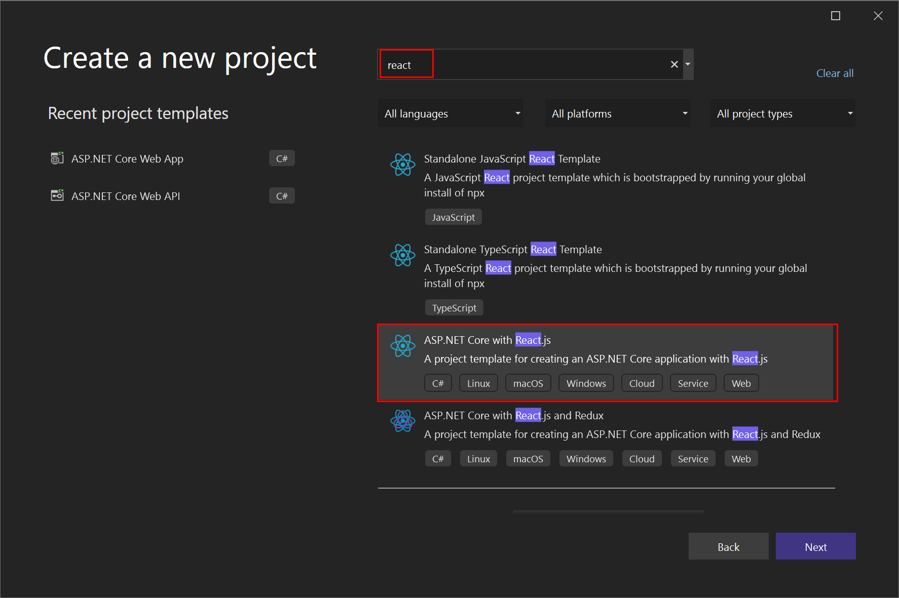
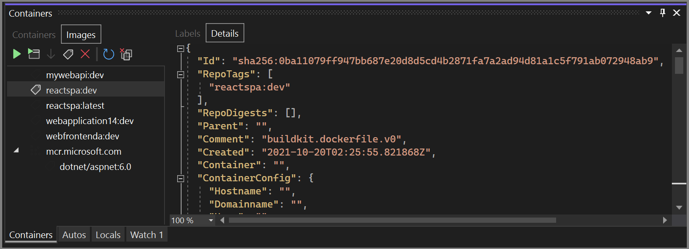
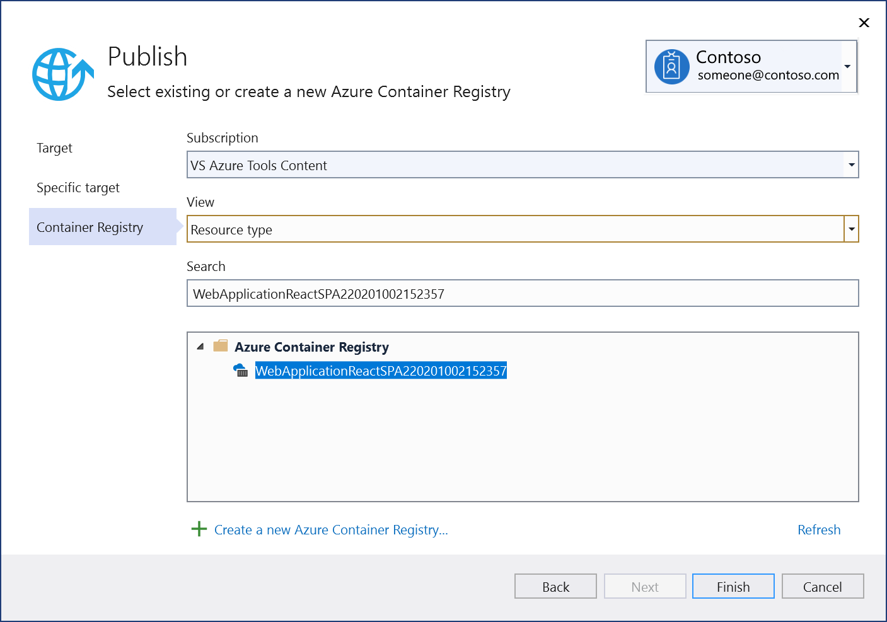
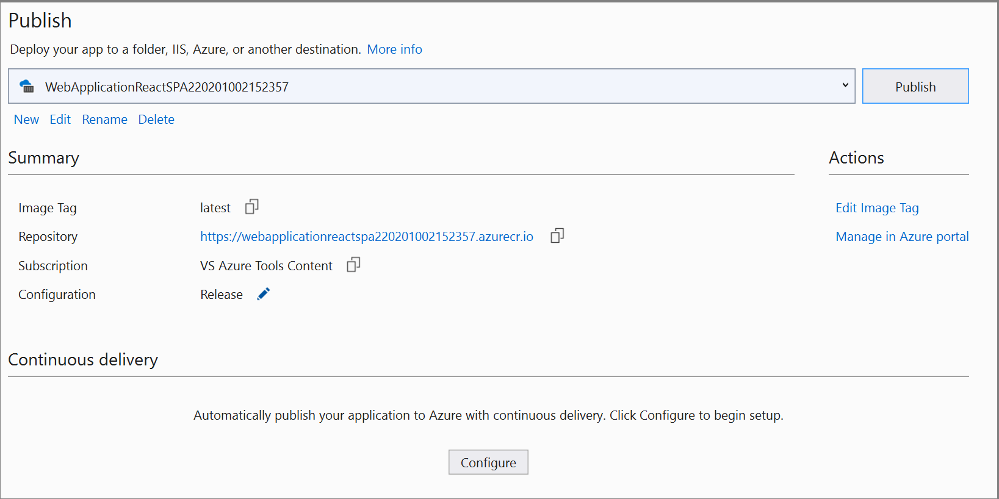
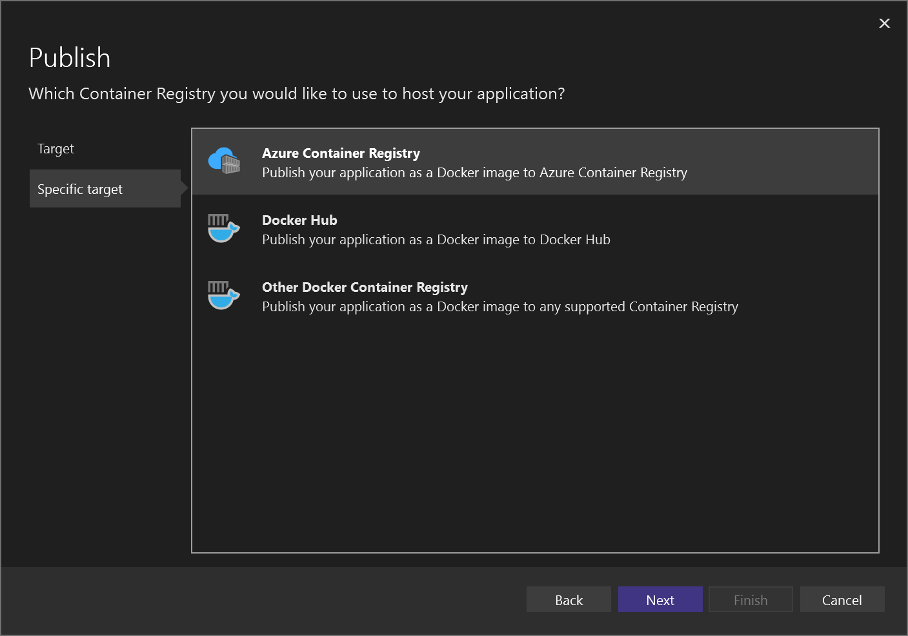
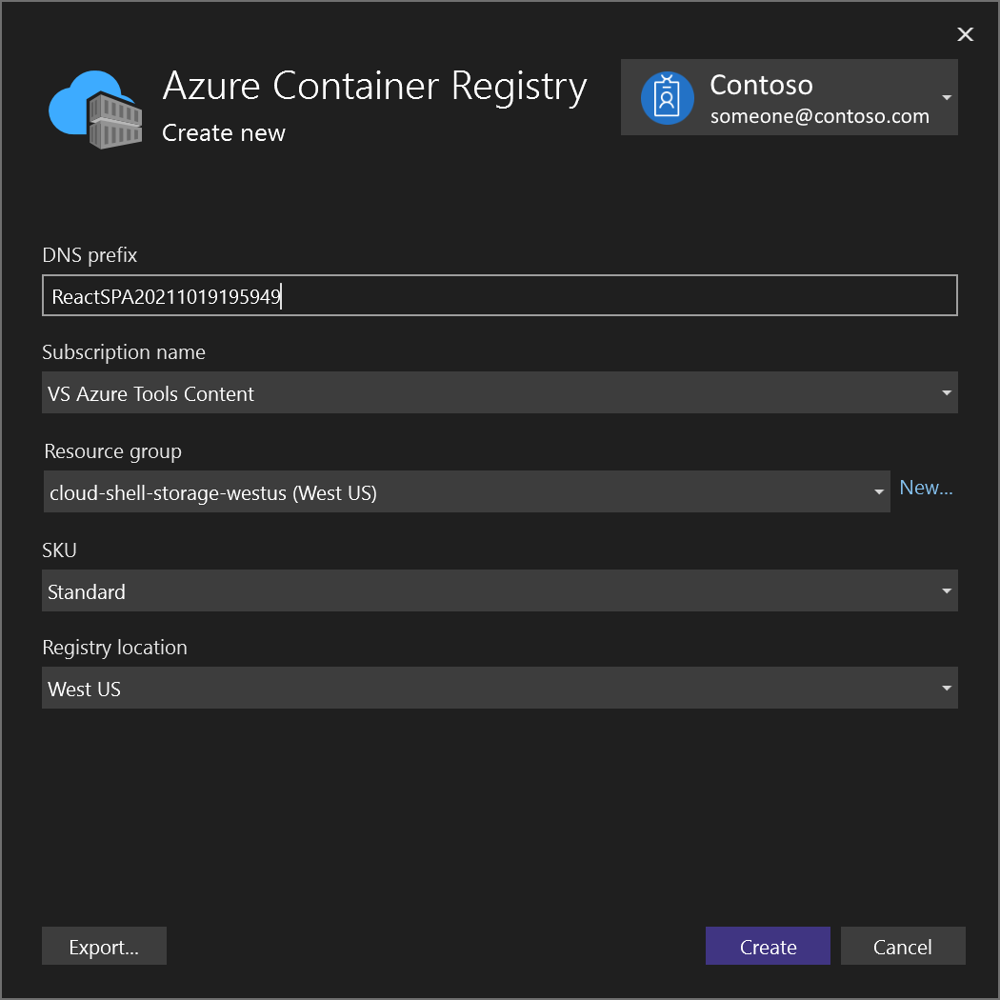
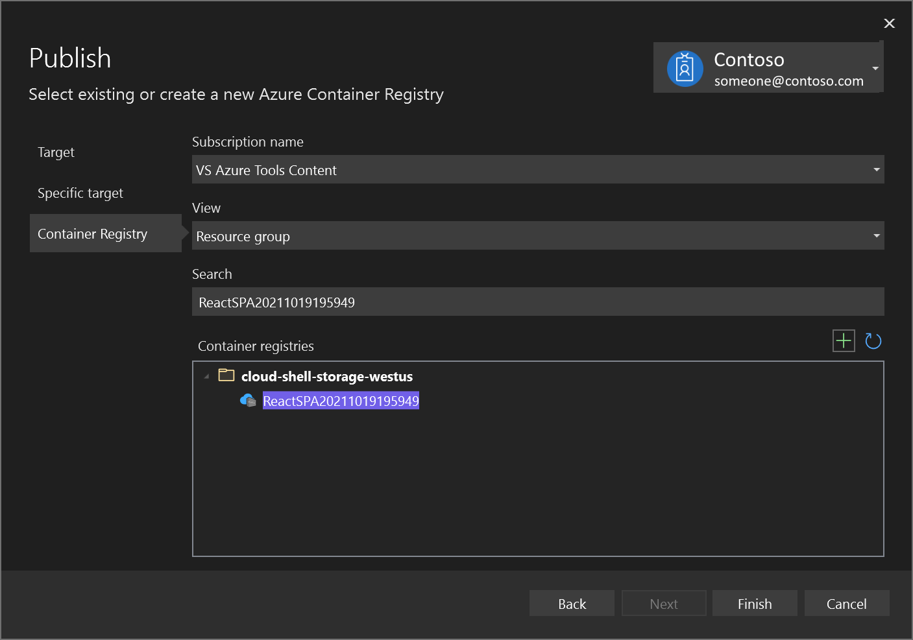

# Quickstart: Use Docker with a React Single-page App in Visual Studio

With Visual Studio, you can easily build, debug, and run containerized ASP.NET Core apps, including those with client-side JavaScript such as React.js single-page app, and publish them to Azure Container Registry, Docker Hub, Azure App Service, or your own container registry. In this article, we'll publish to Azure Container Registry.

## Prerequisites

::: moniker range="vs-2017"
* [Docker Desktop](https://hub.docker.com/editions/community/docker-ce-desktop-windows)
* [Visual Studio 2017](https://visualstudio.microsoft.com/vs/older-downloads/?utm_medium=microsoft&utm_source=docs.microsoft.com&utm_campaign=vs+2017+download) with the **Web Development**, **Azure Tools** workload, and/or **.NET Core cross-platform development** workload installed
* To publish to Azure Container Registry, an Azure subscription. [Sign up for a free trial](https://azure.microsoft.com/offers/ms-azr-0044p/).
* [Node.js](https://nodejs.org/en/download/)
* For Windows containers, Windows 10 version 1809 or later, to use the Docker images referenced in this article.
::: moniker-end
::: moniker range="vs-2019"
* [Docker Desktop](https://hub.docker.com/editions/community/docker-ce-desktop-windows)
* [Visual Studio 2019](https://visualstudio.microsoft.com/downloads) with the **Web Development**, **Azure Tools** workload, and/or **.NET Core cross-platform development** workload installed
* [.NET Core 3.1 Development Tools](https://dotnet.microsoft.com/download/dotnet-core/3.1) for development with .NET Core 3.1.
* To publish to Azure Container Registry, an Azure subscription. [Sign up for a free trial](https://azure.microsoft.com/offers/ms-azr-0044p/).
* [Node.js](https://nodejs.org/en/download/)
* For Windows containers, Windows 10 version 1809 or later, to use the Docker images referenced in this article.
::: moniker-end
::: moniker range=">=vs-2022"
* [Docker Desktop](https://hub.docker.com/editions/community/docker-ce-desktop-windows)
* [Visual Studio 2022](https://visualstudio.microsoft.com/downloads) with the **Web Development**, **Azure Tools** workload, and/or **.NET Core cross-platform development** workload installed
* To publish to Azure Container Registry, an Azure subscription. [Sign up for a free trial](https://azure.microsoft.com/offers/ms-azr-0044p/).
* [Node.js](https://nodejs.org/en/download/)
* For Windows containers, Windows 10 version 1809 or later, to use the Docker images referenced in this article.

::: moniker-end

## Installation and setup

For Docker installation, first review the information at [Docker Desktop for Windows: What to know before you install](https://docs.docker.com/docker-for-windows/install/#what-to-know-before-you-install). Next, install [Docker Desktop](https://hub.docker.com/editions/community/docker-ce-desktop-windows).

## Create a project and add Docker support

::: moniker range="vs-2017"

1. Create a new project using the **ASP.NET Core Web Application** template.

1. Select **React.js**. You can't select **Enable Docker Support**, but don't worry, you can add that support after you create the project.

   

1. Right-click on the project node, and choose **Add** > **Docker Support** to add a Dockerfile to your project.

   

1. Select the container type, and click **OK**.
::: moniker-end

::: moniker range="vs-2019"

1. Create a new project using the **ASP.NET Core with React.js** template.

   

1. On the **Additional information** screen, you can't select **Enable Docker Support**, but don't worry, you can add that support later.

   

1. Right-click on the project node, and choose **Add** > **Docker Support** to add a Dockerfile to your project.

   

1. Select the container type.
::: moniker-end
::: moniker range=">=vs-2022"

1. Create a new project using the **ASP.NET Core with React.js** template.

   

1. On the **Additional information** screen, you can't select **Enable Docker Support**, but don't worry, you can add that support later.

   

1. Right-click on the project node, and choose **Add** > **Docker Support** to add a Dockerfile to your project.

   

1. Select the container type.
:::moniker-end

The next step is different depending on whether you're using Linux containers or Windows containers.

## Modify the Dockerfile (Linux containers)

A *Dockerfile*, the recipe for creating a final Docker image, is created in the project. Refer to [Dockerfile reference](https://docs.docker.com/engine/reference/builder/) for an understanding of the commands within it.

Open the *Dockerfile* in the project, and add the following lines to install curl, Node.js 14.x, and certain required Node libraries in the container. Be sure to add these lines both in the first section, to add the installation of the Node package manager *npm.exe* to the base image, as well as in the `build` section.

```Dockerfile
RUN apt-get update
RUN apt-get install -y curl
RUN apt-get install -y libpng-dev libjpeg-dev curl libxi6 build-essential libgl1-mesa-glx
RUN curl -sL https://deb.nodesource.com/setup_lts.x | bash -
RUN apt-get install -y nodejs
```

The *Dockerfile* should now look something like this:

:::moniker range="<=vs-2019"

```Dockerfile
#See https://aka.ms/containerfastmode to understand how Visual Studio uses this Dockerfile to build your images for faster debugging.

FROM mcr.microsoft.com/dotnet/aspnet:3.1 AS base
WORKDIR /app
EXPOSE 80
EXPOSE 443
RUN apt-get update
RUN apt-get install -y curl
RUN apt-get install -y libpng-dev libjpeg-dev curl libxi6 build-essential libgl1-mesa-glx
RUN curl -sL https://deb.nodesource.com/setup_lts.x | bash -
RUN apt-get install -y nodejs

FROM mcr.microsoft.com/dotnet/sdk:3.1 AS build
RUN apt-get update
RUN apt-get install -y curl
RUN apt-get install -y libpng-dev libjpeg-dev curl libxi6 build-essential libgl1-mesa-glx
RUN curl -sL https://deb.nodesource.com/setup_lts.x | bash -
RUN apt-get install -y nodejs
WORKDIR /src
COPY ["ReactSPA/ReactSPA.csproj", "ReactSPA/"]
RUN dotnet restore "ReactSPA/ReactSPA.csproj"
COPY . .
WORKDIR "/src/ReactSPA"
RUN dotnet build "ReactSPA.csproj" -c Release -o /app/build

FROM build AS publish
RUN dotnet publish "ReactSPA.csproj" -c Release -o /app/publish

FROM base AS final
WORKDIR /app
COPY --from=publish /app/publish .
ENTRYPOINT ["dotnet", "ReactSPA.dll"]
```

:::moniker-end
:::moniker range=">=vs-2022"

```Dockerfile
#See https://aka.ms/containerfastmode to understand how Visual Studio uses this Dockerfile to build your images for faster debugging.

FROM mcr.microsoft.com/dotnet/aspnet:6.0 AS base
WORKDIR /app
EXPOSE 80
EXPOSE 443
RUN apt-get update
RUN apt-get install -y curl
RUN apt-get install -y libpng-dev libjpeg-dev curl libxi6 build-essential libgl1-mesa-glx
RUN curl -sL https://deb.nodesource.com/setup_lts.x | bash -
RUN apt-get install -y nodejs

FROM mcr.microsoft.com/dotnet/sdk:6.0 AS build
RUN apt-get update
RUN apt-get install -y curl
RUN apt-get install -y libpng-dev libjpeg-dev curl libxi6 build-essential libgl1-mesa-glx
RUN curl -sL https://deb.nodesource.com/setup_lts.x | bash -
RUN apt-get install -y nodejs
WORKDIR /src
COPY ["ReactSPA/ReactSPA.csproj", "ReactSPA/"]
RUN dotnet restore "ReactSPA/ReactSPA.csproj"
COPY . .
WORKDIR "/src/ReactSPA"
RUN dotnet build "ReactSPA.csproj" -c Release -o /app/build

FROM build AS publish
RUN dotnet publish "ReactSPA.csproj" -c Release -o /app/publish

FROM base AS final
WORKDIR /app
COPY --from=publish /app/publish .
ENTRYPOINT ["dotnet", "ReactSPA.dll"]
```

:::moniker-end

The preceding *Dockerfile* is based on the [mcr.microsoft.com/dotnet/core/aspnet](https://hub.docker.com/_/microsoft-dotnet-core-aspnet/) image, and includes instructions for modifying the base image by building your project and adding it to the container.

When the new project dialog's **Configure for HTTPS** check box is checked, the *Dockerfile* exposes two ports. One port is used for HTTP traffic; the other port is used for HTTPS. If the check box isn't checked, a single port (80) is exposed for HTTP traffic.

## Modify the Dockerfile (Windows containers)

Open the project file by double-clicking on the project node, and update the project file (*.csproj) by adding the following property as a child of the `<PropertyGroup>` element:

   ```xml
    <DockerfileFastModeStage>base</DockerfileFastModeStage>
   ```

Update the Dockerfile by adding the following lines. This will copy node and npm to the container.

   1. Add ``# escape=` `` to the first line of the Dockerfile
   1. Add the following lines before `FROM … base`

      ```Dockerfile
      FROM mcr.microsoft.com/powershell AS downloadnodejs
      ENV NODE_VERSION=14.16.0
      SHELL ["pwsh", "-Command", "$ErrorActionPreference = 'Stop';$ProgressPreference='silentlyContinue';"]
      RUN Invoke-WebRequest -OutFile nodejs.zip -UseBasicParsing "https://nodejs.org/dist/v$($env:NODE_VERSION)/node-v$($env:NODE_VERSION)-win-x64.zip"; `
          Expand-Archive nodejs.zip -DestinationPath C:\; `
          Rename-Item "C:\node-v$($env:NODE_VERSION)-win-x64" c:\nodejs
      ```

   1. Add the following line before and after `FROM … build`

      ```Dockerfile
      COPY --from=downloadnodejs C:\nodejs\ C:\Windows\system32\
      ```

   1. The complete Dockerfile should now look something like this:

      :::moniker range="<=vs-2019"

      ```Dockerfile
      # escape=`
      #Depending on the operating system of the host machines(s) that will build or run the containers, the image specified in the FROM statement may need to be changed.
      #For more information, please see https://aka.ms/containercompat
      FROM mcr.microsoft.com/powershell AS downloadnodejs
      ENV NODE_VERSION=14.16.0
      SHELL ["pwsh", "-Command", "$ErrorActionPreference = 'Stop';$ProgressPreference='silentlyContinue';"]
      RUN Invoke-WebRequest -OutFile nodejs.zip -UseBasicParsing "https://nodejs.org/dist/v$($env:NODE_VERSION)/node-v$($env:NODE_VERSION)-win-x64.zip"; \
          Expand-Archive nodejs.zip -DestinationPath C:\; \
          Rename-Item "C:\node-v$($env:NODE_VERSION)-win-x64" c:\nodejs

      FROM mcr.microsoft.com/dotnet/core/aspnet:3.1 AS base
      WORKDIR /app
      EXPOSE 80
      EXPOSE 443
      COPY --from=downloadnodejs C:\nodejs\ C:\Windows\system32\

      FROM mcr.microsoft.com/dotnet/core/sdk:3.1 AS build
      COPY --from=downloadnodejs C:\nodejs\ C:\Windows\system32\
      WORKDIR /src
      COPY ["WebApplicationReact1/WebApplicationReact1.csproj", "WebApplicationReact1/"]
      RUN dotnet restore "WebApplicationReact1/WebApplicationReact1.csproj"
      COPY . .
      WORKDIR "/src/WebApplicationReact1"
      RUN dotnet build "WebApplicationReact1.csproj" -c Release -o /app/build

      FROM build AS publish
      RUN dotnet publish "WebApplicationReact1.csproj" -c Release -o /app/publish

      FROM base AS final
      WORKDIR /app
      COPY --from=publish /app/publish .
      ENTRYPOINT ["dotnet", "WebApplicationReact1.dll"]
      ```

      :::moniker-end
      :::moniker range=">=vs-2022"
      ```Dockerfile
      # escape=`
      #Depending on the operating system of the host machines(s) that will build or run the containers, the image specified in the FROM statement may need to be changed.
      #For more information, please see https://aka.ms/containercompat
      FROM mcr.microsoft.com/powershell AS downloadnodejs
      ENV NODE_VERSION=14.16.0
      SHELL ["pwsh", "-Command", "$ErrorActionPreference = 'Stop';$ProgressPreference='silentlyContinue';"]
      RUN Invoke-WebRequest -OutFile nodejs.zip -UseBasicParsing "https://nodejs.org/dist/v$($env:NODE_VERSION)/node-v$($env:NODE_VERSION)-win-x64.zip"; \
          Expand-Archive nodejs.zip -DestinationPath C:\; \
          Rename-Item "C:\node-v$($env:NODE_VERSION)-win-x64" c:\nodejs

      FROM mcr.microsoft.com/dotnet/core/aspnet:6.0 AS base
      WORKDIR /app
      EXPOSE 80
      EXPOSE 443
      COPY --from=downloadnodejs C:\nodejs\ C:\Windows\system32\

      FROM mcr.microsoft.com/dotnet/core/sdk:6.0 AS build
      COPY --from=downloadnodejs C:\nodejs\ C:\Windows\system32\
      WORKDIR /src
      COPY ["WebApplicationReact1/WebApplicationReact1.csproj", "WebApplicationReact1/"]
      RUN dotnet restore "WebApplicationReact1/WebApplicationReact1.csproj"
      COPY . .
      WORKDIR "/src/WebApplicationReact1"
      RUN dotnet build "WebApplicationReact1.csproj" -c Release -o /app/build

      FROM build AS publish
      RUN dotnet publish "WebApplicationReact1.csproj" -c Release -o /app/publish

      FROM base AS final
      WORKDIR /app
      COPY --from=publish /app/publish .
      ENTRYPOINT ["dotnet", "WebApplicationReact1.dll"]
      ```

      ::: moniker-end

   1. Update the .dockerignore file by removing the `**/bin`.

## Debug

:::moniker range=">=vs-2022"
Set the launch properties for debugging. You can use the dropdown menu next to the Start button, and choose **Debug properties**. In the **Launch profile** dialog comes up, choose **Docker**.

Set **Environment variables** to the following. Your SSL port number should match the HTTPS **Host Port** from the **Ports** tab of the **Containers** window.

   ```
   ASPNETCORE_ENVIRONMENT=Development,ASPNETCORE_HOSTINGSTARTUPASSEMBLIES=Microsoft.AspNetCore.SpaProxy,ASPNETCORE_HTTPS_PORT=<your SSL port>,ASPNETCORE_URLS=https:////+:443;http:////+:80
   ```

This action changes the Docker entry in the *launchSettings.json* file and enables the SPA Proxy to work correctly. Find the *launchSettings.json* file in **Solution Explorer** under **Properties**. You should see something like this, but with your app's assigned port numbers:

```json
    "Docker": {
      "commandName": "Docker",
      "launchBrowser": true,
      "launchUrl": "{Scheme}://{ServiceHost}:{ServicePort}",
      "environmentVariables": {
        "ASPNETCORE_URLS": "https://+:443;http://+:80",
        "ASPNETCORE_HTTPS_PORT": "7136",
        "ASPNETCORE_ENVIRONMENT": "Development",
        "ASPNETCORE_HOSTINGSTARTUPASSEMBLIES": "Microsoft.AspNetCore.SpaProxy"
      },
      "publishAllPorts": true,
      "useSSL": true,
      "httpPort": 5136,
      "sslPort":  7136
    }
```
:::moniker-end

Select **Docker** from the debug drop-down in the toolbar, and start debugging the app. You might see a message with a prompt about trusting a certificate; choose to trust the certificate to continue.  The first time you build, docker downloads the base images, so it might take a bit longer.

:::moniker range=">=vs-2022"
The project uses the SPA Proxy. If the browser loads the front page before the proxy is ready, you might see a page that says you will automatically redirected when the proxy is ready.

If the page never redirects, check that you are able to run the proxy. Open a Visual Studio dev command prompt, go to the ClientApp folder in your project, and then give the command, `npm run start`. You should see something like this:

```
> projectspa1@0.1.0 prestart
> node aspnetcore-https && node aspnetcore-react


> projectspa1@0.1.0 start
> rimraf ./build && react-scripts start

[HPM] Proxy created: [ '/weatherforecast' ]  ->  http://localhost:30449
i ｢wds｣: Project is running at https://0.0.0.0:44445/
i ｢wds｣: webpack output is served from
i ｢wds｣: Content not from webpack is served from c:\Users\ghogen\source\repos\ProjectSpa1\ProjectSpa1\ClientApp\public
i ｢wds｣: 404s will fallback to /
Starting the development server...
Compiled successfully!
```

If that succeeds, try starting the app again in the browser. If it doesn't succeed, check again that everything is correct in your *launchSettings.json* file.
:::moniker-end

The **Container Tools** option in the **Output** window shows what actions are taking place. You should see the installation steps associated with *npm.exe*.

The browser shows the app's home page.

   ::: moniker range="vs-2017"
   
   ::: moniker-end
   ::: moniker range="vs-2019"
   
   ::: moniker-end
   ::: moniker range=">=vs-2022"
   
   ::: moniker-end

:::moniker range="<=vs-2017"
Try navigating to the *Counter* page and test the client-side code for the counter by clicking the **Increment** button.

Open the **Package Manager Console** (PMC) from the menu **Tools**> NuGet Package Manager, **Package Manager Console**.

The resulting Docker image of the app is tagged as *dev*. The image is based on the *3.1* tag of the *dotnet/core/aspnet* base image. Run the `docker images` command in the **Package Manager Console** (PMC) window. The images on the machine are displayed:

```console
REPOSITORY                             TAG                 IMAGE ID            CREATED             SIZE
webapplicationreact1                   dev                 09be6ec2405d        2 hours ago         352MB
mcr.microsoft.com/dotnet/core/aspnet   3.1                 e3559b2d50bb        10 days ago         207MB
```

> [!NOTE]
> The **dev** image does not contain the app binaries and other content, as **Debug** configurations use volume mounting to provide the iterative edit and debug experience. To create a production image containing all contents, use the **Release** configuration.

Run the `docker ps` command in PMC. Notice the app is running using the container:

```console
CONTAINER ID        IMAGE                      COMMAND               CREATED             STATUS              PORTS                                           NAMES
56d1b1008c89        webapplicationreact1:dev   "tail -f /dev/null"   2 hours ago         Up 2 hours          0.0.0.0:32771->80/tcp, 0.0.0.0:32770->443/tcp   WebApplication-ReactSPA
```

:::moniker-end

:::moniker range=">=vs-2019"

Open the **Containers** tool window. You can find it on the menu under **View** > **Other Windows** > **Containers**, or press **Ctrl**+**Q** and start typing `containers` in the search box, then choose **Containers** window from the results. When the window comes up, dock it on the bottom under the editor pane.

The **Containers** window shows the running containers and lets you view information about them. You can view the environment variables, labels, ports, volumes, the file system, and logs. The toolbar buttons let you create a terminal (shell prompt) inside the container, attach the debugger, or prune unused containers. See [Use the Containers window](view-and-diagnose-containers.md).


Click on the **Files** tab, and expand the `app` folder to see your published application files.

You can also view the images and inspect information about them. Choose the **Images** tab, locate the one for your project, and then choose the **Details** tab to view a json file that contains information about an image.



> [!NOTE]
> The **dev** image does not contain the app binaries and other content, as **Debug** configurations use volume mounting to provide the iterative edit and debug experience. To create a production image containing all contents, use the **Release** configuration.

:::moniker-end

## Publish Docker images

Once the develop and debug cycle of the app is completed, you can create a production image of the app.

:::moniker range="vs-2017"

1. Change the configuration drop-down to **Release** and build the app.
1. Right-click your project in **Solution Explorer** and choose **Publish**.
1. On the publish target dialog, select **Container Registry**.
1. Choose **Create New Azure Container Registry** and click **Publish**.
1. Fill in your desired values in the **Create a new Azure Container Registry**.

    | Setting      | Suggested value  | Description                                |
    | ------------ |  ------- | -------------------------------------------------- |
    | **DNS Prefix** | Globally unique name | Name that uniquely identifies your container registry. |
    | **Subscription** | Choose your subscription | The Azure subscription to use. |
    | **[Resource Group](/azure/azure-resource-manager/resource-group-overview)** | myResourceGroup |  Name of the resource group in which to create your container registry. Choose **New** to create a new resource group.|
    | **[SKU](/azure/container-registry/container-registry-skus)** | Standard | Service tier of the container registry  |
    | **Registry Location** | A location close to you | Choose a Location in a [region](https://azure.microsoft.com/regions/) near you or near other services that will use your container registry. |

    

1. Select **Create**.

   
:::moniker-end

:::moniker range="vs-2019"

1. Change the configuration drop-down to **Release** and build the app.
1. Right-click your project in **Solution Explorer** and choose **Publish**.
1. On the publish target dialog, select **Docker Container Registry**.

   

1. Next, choose **Azure Container Registry**.

   

1. Choose **Create a new Azure Container Registry**.
1. Fill in your desired values in the **Create new Azure Container Registry** screen.

    | Setting      | Suggested value  | Description                                |
    | ------------ |  ------- | -------------------------------------------------- |
    | **DNS Prefix** | Globally unique name | Name that uniquely identifies your container registry. |
    | **Subscription** | Choose your subscription | The Azure subscription to use. |
    | **[Resource Group](/azure/azure-resource-manager/resource-group-overview)** | myResourceGroup |  Name of the resource group in which to create your container registry. Choose **New** to create a new resource group.|
    | **[SKU](/azure/container-registry/container-registry-skus)** | Standard | Service tier of the container registry  |
    | **Registry Location** | A location close to you | Choose a Location in a [region](https://azure.microsoft.com/regions/) near you or near other services that will use your container registry. |

    

1. Select **Create**, and then select **Finish**.

   

   When the publish process ends, you can review the publish settings, and edit them, when needed, or publish the image again using the **Publish** button.

   

   To start again using the **Publish** dialog, delete the publish profile by using the **Delete** link on this page, and then choose **Publish** again.
:::moniker-end

:::moniker range=">=vs-2022"

1. Change the configuration drop-down to **Release** and build the app.
1. Right-click your project in **Solution Explorer** and choose **Publish**.
1. On the publish target dialog, select **Docker Container Registry**.

   

1. Next, choose **Azure Container Registry**.

   

1. Choose **Create a new Azure Container Registry**.
1. Fill in your desired values in the **Create new Azure Container Registry** screen.

    | Setting      | Suggested value  | Description                                |
    | ------------ |  ------- | -------------------------------------------------- |
    | **DNS Prefix** | Globally unique name | Name that uniquely identifies your container registry. |
    | **Subscription** | Choose your subscription | The Azure subscription to use. |
    | **[Resource Group](/azure/azure-resource-manager/resource-group-overview)** | myResourceGroup |  Name of the resource group in which to create your container registry. Choose **New** to create a new resource group.|
    | **[SKU](/azure/container-registry/container-registry-skus)** | Standard | Service tier of the container registry  |
    | **Registry Location** | A location close to you | Choose a Location in a [region](https://azure.microsoft.com/regions/) near you or near other services that will use your container registry. |

    

1. Select **Create**, and then select **Finish**.

   

   When the publish process ends, you can review the publish settings, and edit them, when needed, or publish the image again using the **Publish** button.

   :::image type="content" alt-text="Screenshot showing successful publish" source="media/container-tools-react/vs-2022/publish-succeeded.png" lightbox="media/container-tools-react/vs-2022/publish-succeeded.png":::

   To start again using the **Publish** dialog, delete the publish profile by using the **Delete** link on this page, and then choose **Publish** again.
:::moniker-end

## Next steps

You can now pull the container from the registry to any host capable of running Docker images, for example [Azure Container Instances](/azure/container-instances/container-instances-tutorial-deploy-app).

## Additional resources

* [Container development with Visual Studio](./index.yml)
* [Troubleshoot Visual Studio development with Docker](troubleshooting-docker-errors.md)
* [Visual Studio Container Tools GitHub repository](https://github.com/Microsoft/DockerTools)

