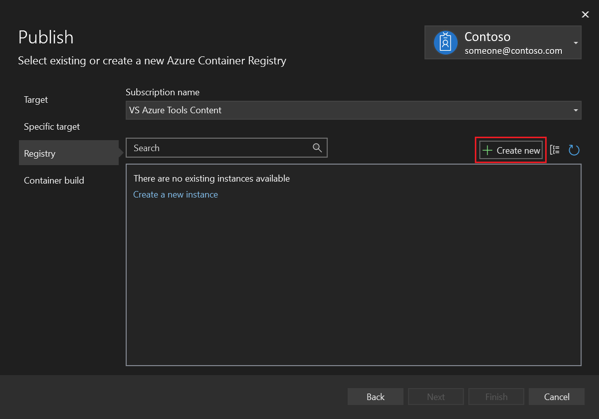
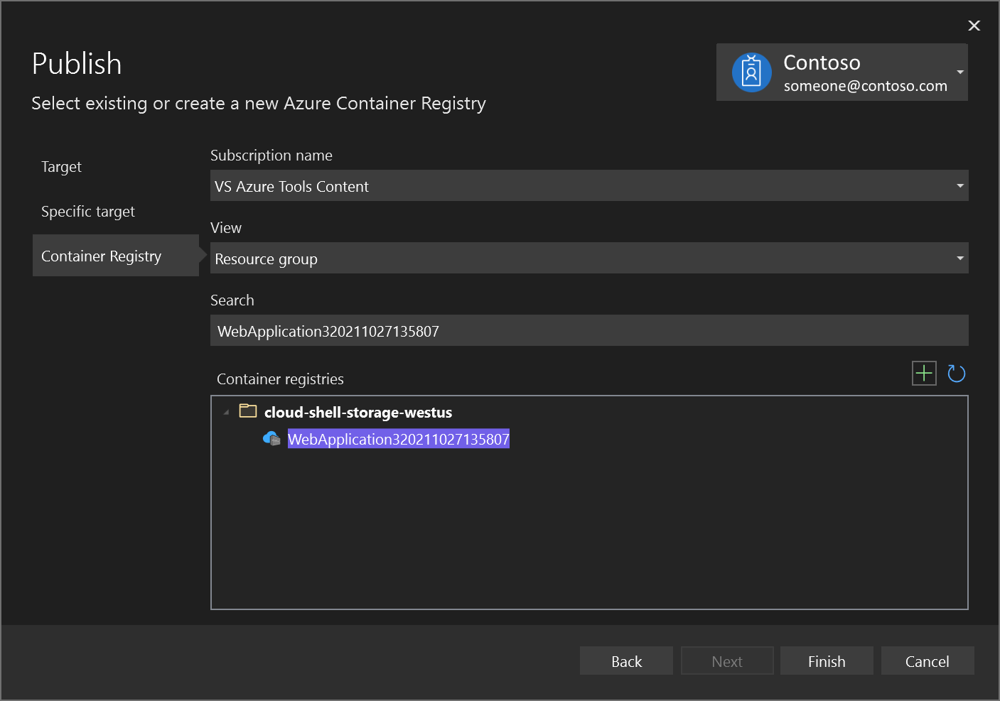

# Quickstart: Docker in Visual Studio

 [!INCLUDE [Visual Studio](~/includes/applies-to-version/vs-windows-only.md)]

::: moniker range="vs-2019"

[!include[Visual Studio Container Tools](includes/vs-2019/container-tools.md)]

::: moniker-end
::: moniker range=">=vs-2022"

With Visual Studio, you can easily build, debug, and run containerized .NET, ASP.NET, and ASP.NET Core apps and publish them to Azure Container Registry, Docker Hub, Azure App Service, or your own container registry. In this article, we'll publish an ASP.NET Core app to Azure Container Registry.

## Prerequisites

* [Docker Desktop](https://hub.docker.com/editions/community/docker-ce-desktop-windows)
* [Visual Studio 2022](https://visualstudio.microsoft.com/downloads) with the **Web Development**, **Azure Tools** workload, and/or **.NET desktop development** workload installed
* To publish to Azure Container Registry, an Azure subscription. [Sign up for a free trial](https://azure.microsoft.com/free/dotnet/).
:::moniker range=">=vs-2022"
* [.NET 8 SDK](https://dotnet.microsoft.com/download/) for development with .NET 8 (required to run your container apps with non-elevated user permissions)
:::moniker-end

## Installation and setup

For Docker installation, first review the information at [Docker Desktop for Windows: What to know before you install](https://docs.docker.com/docker-for-windows/install/#what-to-know-before-you-install). Next, install [Docker Desktop](https://hub.docker.com/editions/community/docker-ce-desktop-windows).

## Add a project to a Docker container

1. Create a new project using the **ASP.NET Core Web App** template or if you want to use the .NET Framework instead of .NET Core, choose **ASP.NET Web Application (.NET Framework)**.
1. On the **Create new web application** screen, make sure the **Enable Docker Support** checkbox is selected.

   

   The screenshot shows .NET 6.0; if you're using .NET Framework, it looks a bit different.

1. Select the type of container you want (Windows or Linux) and click **Create**.

## Dockerfile overview

A *Dockerfile*, the recipe for creating a final Docker image, is created in the project. Refer to [Dockerfile reference](https://docs.docker.com/engine/reference/builder/) for an understanding of the commands within it:

```dockerfile
#See https://aka.ms/containerfastmode to understand how Visual Studio uses this Dockerfile to build your images for faster debugging.

FROM mcr.microsoft.com/dotnet/aspnet:6.0 AS base
WORKDIR /app
EXPOSE 80
EXPOSE 443

FROM mcr.microsoft.com/dotnet/sdk:6.0 AS build
WORKDIR /src
COPY ["WebApplication3/WebApplication3.csproj", "WebApplication3/"]
RUN dotnet restore "WebApplication3/WebApplication3.csproj"
COPY . .
WORKDIR "/src/WebApplication3"
RUN dotnet build "WebApplication3.csproj" -c Release -o /app/build

FROM build AS publish
RUN dotnet publish "WebApplication3.csproj" -c Release -o /app/publish

FROM base AS final
WORKDIR /app
COPY --from=publish /app/publish .
ENTRYPOINT ["dotnet", "WebApplication3.dll"]
```

The preceding *Dockerfile* is based on the [Microsoft Container Registry (MCR)](https://azure.microsoft.com/blog/microsoft-syndicates-container-catalog/) .NET 6 image image, and includes instructions for modifying the base image by building your project and adding it to the container. If you're using the .NET Framework, the base image will be different. 

When the new project dialog's **Configure for HTTPS** check box is checked, the *Dockerfile* exposes two ports. One port is used for HTTP traffic; the other port is used for HTTPS. If the check box isn't checked, a single port (80) is exposed for HTTP traffic.

::: moniker range=">=vs-2022"
With Visual Studio 2022 version 17.7 or later, you can target .NET 8. In that case, you have the benefit of being able to run your app more securely, as a normal user, rather than with elevated permissions. To enable this, add the line `USER app` to the Dockerfile in the base image. Also, because port 80 is restricted for normal users, expose ports 8080 and 8081 instead of 80 and 443. Port 8080 is used for HTTP traffic, and port 8081 is used for HTTPS. The default Dockerfile generated by Visual Studio for .NET 8 projects already has this configuration.

```dockerfile
FROM mcr.microsoft.com/dotnet/aspnet:8.0-preview AS base
USER app
WORKDIR /app
EXPOSE 8080
EXPOSE 8081
```

:::moniker-end

## Debug

Select **Docker** from the debug drop-down in the toolbar, and start debugging the app. You might see a message with a prompt about trusting a certificate; choose to trust the certificate to continue.

The **Container Tools** option in the **Output** window shows what actions are taking place. The first time, it might take a while to download the base image, but it's much faster on subsequent runs.

After building, the browser comes up and your app's home page is shown. In the browser's address bar, you can see the localhost URL and port number for debugging.

>[!NOTE]
> If you need to change ports for debugging, you can do that in the *launchSettings.json* file. See [Container Launch Settings](container-launch-settings.md).

## Containers window

You can use the **Containers** window to view running containers on your machine, as well as images that you have available.

Open the **Containers** window by using the search box in the IDE (press **Ctrl**+**Q** to use it), type in `container`, and choose the **Containers** window from the list.

You can mount the **Containers** window in a convenient place, such as below the editor, by moving it around and following the window placement guides.

In the window, find your container and step through each tab to view the environment variables, port mappings, logs, and the filesystem.


For more information, see [Use the Containers window](view-and-diagnose-containers.md).

## Publish Docker images

Once the develop and debug cycle of the app is completed, you can create a production image of the app.

1. Change the configuration drop-down to **Release** and build the app.
1. Right-click your project in **Solution Explorer** and choose **Publish**.
1. On the **Publish** dialog, select the **Docker Container Registry** tab.

   

1. Choose **Create New Azure Container Registry**.

   

1. Fill in your desired values in the **Create a new Azure Container Registry**.

    | Setting      | Suggested value  | Description                                |
    | ------------ |  ------- | -------------------------------------------------- |
    | **DNS Prefix** | Globally unique name | Name that uniquely identifies your container registry. |
    | **Subscription** | Choose your subscription | The Azure subscription to use. |
    | **[Resource Group](/azure/azure-resource-manager/resource-group-overview)** | myResourceGroup |  Name of the resource group in which to create your container registry. Choose **New** to create a new resource group.|
    | **[SKU](/azure/container-registry/container-registry-skus)** | Standard | Service tier of the container registry  |
    | **Registry Location** | A location close to you | Choose a Location in a [region](https://azure.microsoft.com/regions/) near you or near other services that will use your container registry. |

    

1. Click **Create**. The **Publish** dialog now shows the created registry.

   

1. Choose **Finish** to complete the process of publishing your container image to the newly created registry in Azure.

   :::image type="content" source="media/container-tools/vs-2022/publish-succeeded.png" alt-text="Screenshot showing successful publish." lightbox="media/container-tools/vs-2022/publish-succeeded.png" :::

## Next steps

You can now pull the container from the registry to any host capable of running Docker images, for example [Azure Container Instances](/azure/container-instances/container-instances-tutorial-deploy-app).

::: moniker-end

## Additional resources

* [Container development with Visual Studio](./index.yml)
* [Troubleshoot Visual Studio development with Docker](troubleshooting-docker-errors.md)
* [Visual Studio Container Tools GitHub repository](https://github.com/Microsoft/DockerTools)
