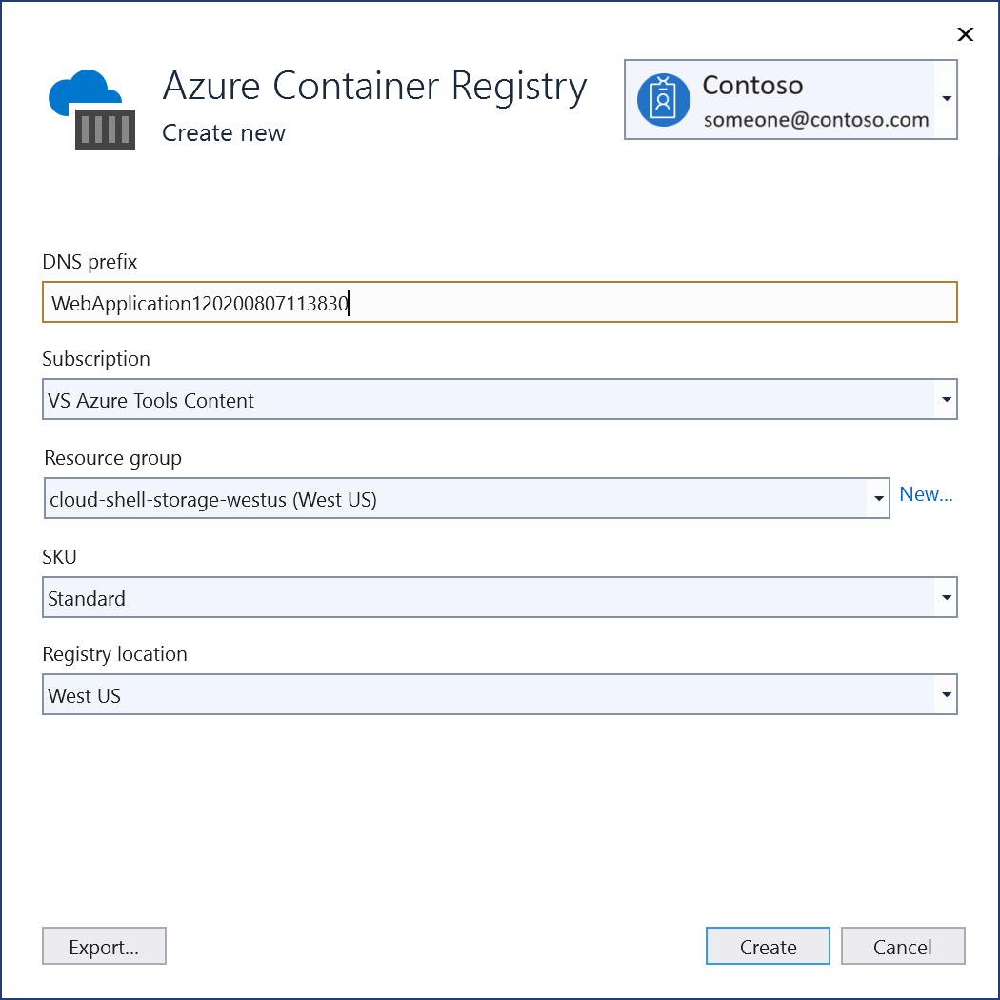
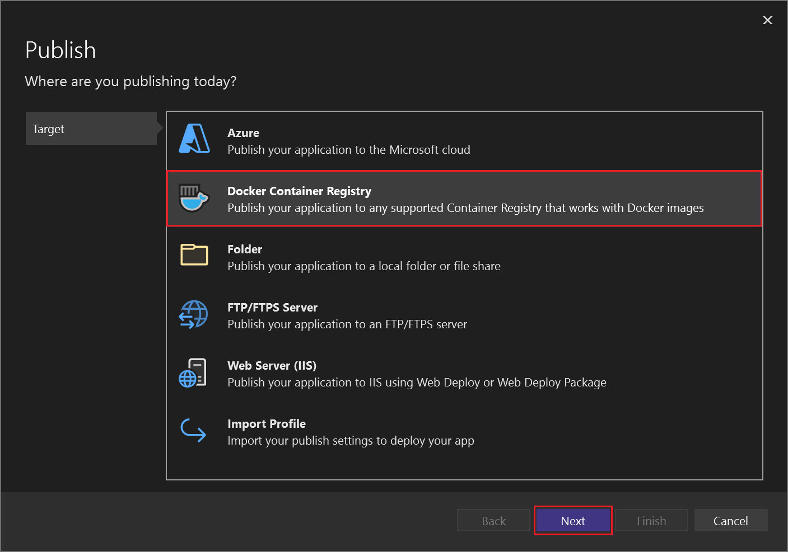

# Deploy an ASP.NET container to a container registry using Visual Studio

 [!INCLUDE [Visual Studio](~/includes/applies-to-version/vs-not-mac.md)]

## Overview

Docker is a lightweight container engine, similar in some ways to a virtual machine, which you can use to host applications and services.
This tutorial walks you through using Visual Studio to publish your containerized application to an [Azure Container Registry](https://azure.microsoft.com/services/container-registry).

If you don't have an Azure subscription, create a [free account](https://azure.microsoft.com/free/dotnet/?utm_source=acr-publish-doc&utm_medium=docs&utm_campaign=docs) before you begin.

## Prerequisites

To complete this tutorial:

::: moniker range="vs-2017"
* Install the latest version of [Visual Studio 2017](https://visualstudio.microsoft.com/vs/older-downloads/?utm_medium=microsoft&utm_source=docs.microsoft.com&utm_campaign=vs+2017+download)with the "ASP.NET and web development" workload
* Install [Docker Desktop for Windows](https://docs.docker.com/desktop/windows/install/)
::: moniker-end
::: moniker range="vs-2019"
* Install the latest version of [Visual Studio 2019](https://visualstudio.microsoft.com/downloads) with the "ASP.NET and web development" workload
* Install [Docker Desktop for Windows](https://docs.docker.com/desktop/windows/install/)
::: moniker-end
::: moniker range=">=vs-2022"
* Install the latest version of [Visual Studio 2022](https://visualstudio.microsoft.com/downloads) with the "ASP.NET and web development" workload
* Install [Docker Desktop for Windows](https://docs.docker.com/desktop/windows/install/)
:::moniker-end

## Create an ASP.NET Core web app

The following steps guide you through creating a basic ASP.NET Core app that will be used in this tutorial. If you already have a project, you can skip this section.

::: moniker range="vs-2017"
[!INCLUDE [create-aspnet5-app](../azure/includes/create-aspnet5-app.md)]
::: moniker-end
::: moniker range="vs-2019"
[!INCLUDE [create-aspnet5-app](../azure/includes/vs-2019/create-aspnet5-app-2019.md)]
::: moniker-end
:::moniker range=">=vs-2022"
[!INCLUDE [create-aspnet5-app](../azure/includes/vs-2022/create-aspnet5-app-2022.md)]
::: moniker-end

::: moniker range="vs-2017"

## Publish your container to Azure Container Registry

1. Right-click your project in **Solution Explorer** and choose **Publish**.
2. On the **Publish target** dialog, select **Container Registry**.
3. Choose **New Azure Container Registry** and click **Publish**.
4. Fill in your desired values in the **Create a new Azure Container Registry**.

    | Setting      | Suggested value  | Description                                |
    | ------------ |  ------- | -------------------------------------------------- |
    | **DNS Prefix** | Globally unique name | Name that uniquely identifies your container registry. |
    | **Subscription** | Choose your subscription | The Azure subscription to use. |
    | **[Resource Group](/azure/azure-resource-manager/resource-group-overview)** | myResourceGroup |  Name of the resource group in which to create your container registry. Choose **New** to create a new resource group.|
    | **[SKU](/azure/container-registry/container-registry-skus)** | Standard | Service tier of the container registry  |
    | **Registry Location** | A location close to you | Choose a Location in a [region](https://azure.microsoft.com/regions/) near you or near other services that will use your container registry. |

    

5. Click **Create**
::: moniker-end

::: moniker range="vs-2019"
## Publish your container to Azure Container Registry
1. Right-click your project in **Solution Explorer** and choose **Publish**.
2. On the **Publish** dialog, select **Docker Container Registry**.

   

3. Choose **Create New Azure Container Registry**.
 
   

4. Fill in your desired values in the **Azure Container Registry** screen.

    | Setting      | Suggested value  | Description                                |
    | ------------ |  ------- | -------------------------------------------------- |
    | **DNS Prefix** | Globally unique name | Name that uniquely identifies your container registry. |
    | **Subscription** | Choose your subscription | The Azure subscription to use. |
    | **[Resource Group](/azure/azure-resource-manager/resource-group-overview)** | myResourceGroup |  Name of the resource group in which to create your container registry. Choose **New** to create a new resource group.|
    | **[SKU](/azure/container-registry/container-registry-skus)** | Standard | Service tier of the container registry  |
    | **Registry Location** | A location close to you | Choose a Location in a [region](https://azure.microsoft.com/regions/) near you or near other services that will use your container registry. |

    

5. Click **Create**.

6. Choose **Finish** to complete the process.
::: moniker-end

::: moniker range=">=vs-2022"
## Publish your container to Azure Container Registry
1. Right-click your project in **Solution Explorer** and choose **Publish**.
2. On the **Publish** dialog, select **Docker Container Registry**.

   

3. Choose **Create New Azure Container Registry**.
 
   

4. Fill in your desired values in the **Azure Container Registry** screen.

    | Setting      | Suggested value  | Description                                |
    | ------------ |  ------- | -------------------------------------------------- |
    | **DNS Prefix** | Globally unique name | Name that uniquely identifies your container registry. |
    | **Subscription** | Choose your subscription | The Azure subscription to use. |
    | **[Resource Group](/azure/azure-resource-manager/resource-group-overview)** | myResourceGroup |  Name of the resource group in which to create your container registry. Choose **New** to create a new resource group.|
    | **[SKU](/azure/container-registry/container-registry-skus)** | Standard | Service tier of the container registry  |
    | **Registry Location** | A location close to you | Choose a Location in a [region](https://azure.microsoft.com/regions/) near you or near other services that will use your container registry. |

    

5. Click **Create**.

6. Choose **Finish** to complete the process.
::: moniker-end

You can now pull the container from the registry to any host capable of running Docker images, for example [Azure Container Instances](/azure/container-instances/container-instances-tutorial-deploy-app).

## See also

[Quickstart: Deploy a container instance in Azure using the Azure CLI](/azure/container-instances/container-instances-quickstart)
