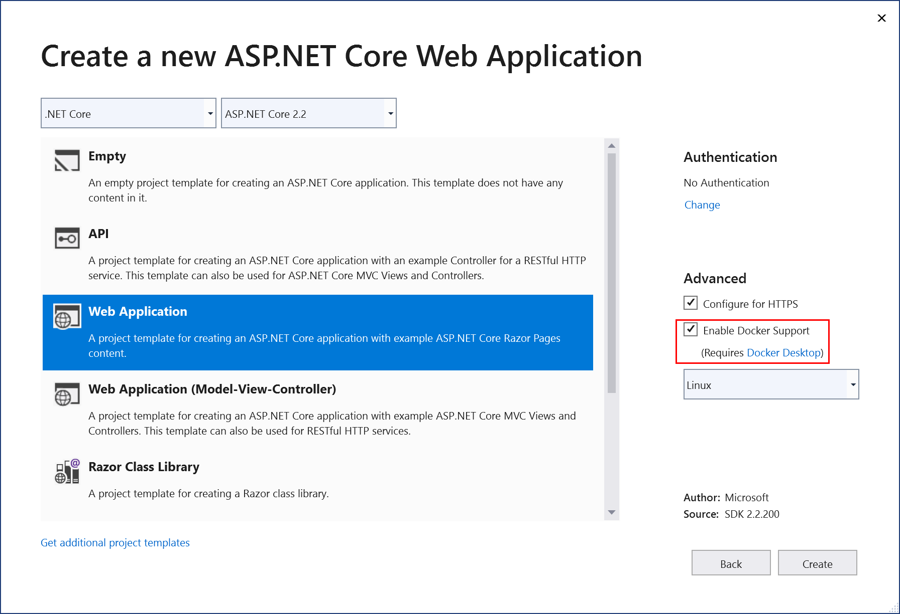
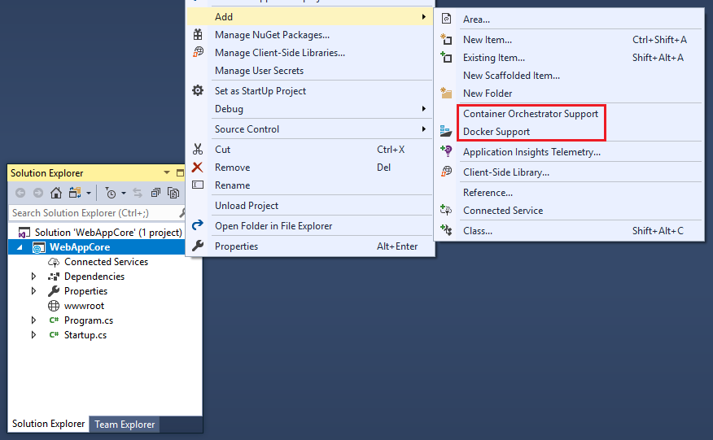
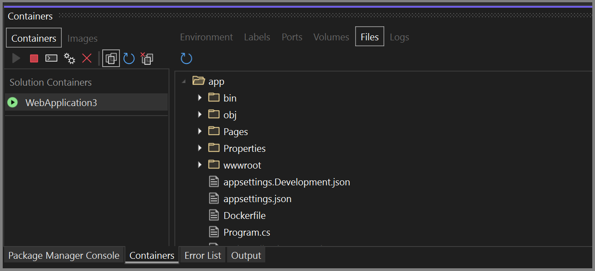
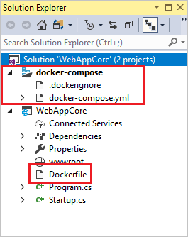

# Visual Studio Container Tools for Docker

The tools included in Visual Studio for developing with Docker containers are easy to use, and greatly simplify building, debugging, and deployment for containerized applications. You can work with a container for a single project, or use container orchestration with Docker Compose or Service Fabric to work with multiple services in containers.

::: moniker range="vs-2019"

## Prerequisites

* [Docker Desktop](https://hub.docker.com/editions/community/docker-ce-desktop-windows)
* [Visual Studio 2019](https://visualstudio.microsoft.com/downloads/?cid=learn-onpage-download-cta) with the **Web Development**, **Azure Tools** workload, and/or **.NET Core cross-platform development** workload installed
* [.NET Core Development Tools](https://dotnet.microsoft.com/download/dotnet-core/) for development with .NET Core.
* To publish to Azure Container Registry, an Azure subscription. [Sign up for a free trial](https://azure.microsoft.com/offers/ms-azr-0044p/).

## Docker support in Visual Studio

Docker support is available for ASP.NET projects, ASP.NET Core projects, and .NET Core and .NET Framework console projects.

The support for Docker in Visual Studio has changed over a number of releases in response to customer needs. There are two levels of Docker support you can add to a project, and the supported options vary by the type of project and the version of Visual Studio. With some supported project types, if you just want a container for a single project, without using orchestration, you can do that by adding Docker support.  The next level is container orchestration support, which adds appropriate support files for the particular orchestrator you choose.

With Visual Studio 2019, you can use Docker Compose, Kubernetes, and Service Fabric as container orchestration services.

> [!NOTE]
> When creating a .NET Framework or .NET Core console project, there is no option to **Add Docker support**. After a .NET Core console application project is created, the **Add Docker support** option is available. .NET Framework console application projects do not support the **Add Docker support** option after the project is created. After creation both .NET Framework or .NET Core console projects support the **Add Container Orchestrator Support** option using Service Fabric or Docker Compose.

In Visual Studio 2019 version 16.4 and later, the **Containers** window is available, which lets you view running containers, browse available images, view environment variables, logs, and port mappings, inspect the filesystem, attach a debugger, or open a terminal window inside the container environment. See [Use the Containers window](view-and-diagnose-containers.md).

::: moniker-end

::: moniker range=">=vs-2022"

## Prerequisites

* [Docker Desktop](https://www.docker.com/get-docker)
* [Visual Studio 2022](https://visualstudio.microsoft.com/downloads/?cid=learn-onpage-download-cta) with the **Web Development**, **Azure Tools** workload, and/or **.NET desktop development** workload installed
* To publish to Azure Container Registry, an Azure subscription. [Sign up for a free trial](https://azure.microsoft.com/offers/ms-azr-0044p/).

## Docker support in Visual Studio

Docker support is available for ASP.NET projects, ASP.NET Core projects, and .NET Core and .NET Framework console projects.

The support for Docker in Visual Studio has changed over a number of releases in response to customer needs. There are two levels of Docker support you can add to a project, and the supported options vary by the type of project and the version of Visual Studio. With some supported project types, if you just want a container for a single project, without using orchestration, you can do that by adding Docker support.  The next level is container orchestration support, which adds appropriate support files for the particular orchestrator you choose.

With Visual Studio 2022, you can use Docker Compose or Service Fabric as container orchestration services.

> [!NOTE]
> If you are using the full .NET Framework console project template, the supported option is **Add Container Orchestrator support** after project creation, with options to use Service Fabric or Docker Compose. Adding support at project creation and **Add Docker support** for a single project without orchestration are not available options.

In Visual Studio 2022, the **Containers** window is available, which lets you view running containers, browse available images, view environment variables, logs, and port mappings, inspect the filesystem, attach a debugger, or open a terminal window inside the container environment. See [Use the Containers window](view-and-diagnose-containers.md).

::: moniker-end

> [!NOTE]
> Docker's licensing requirements might be different for different versions of Docker Desktop. Refer to the [Docker documentation](https://docs.docker.com/subscription/) to understand the current licensing requirements for using your version of Docker Desktop for development in your situation.

### Adding Docker support

You can enable Docker support during project creation by selecting **Enable Docker Support** when creating a new project, as shown in the following screenshot:

::: moniker range="vs-2019"

::: moniker-end
::: moniker range=">=vs-2022"

::: moniker-end

> [!NOTE]
> For .NET Framework projects (not .NET Core), only Windows containers are available.

You can add Docker support to an existing project by selecting **Add** > **Docker Support** in **Solution Explorer**. The **Add > Docker Support** and **Add > Container Orchestrator Support** commands are located on the right-click menu (or context menu) of the project node for an ASP.NET Core project in **Solution Explorer**, as shown in the following screenshot:

:::moniker range="<=vs-2019"

:::moniker-end
:::moniker range=">=vs-2022"

:::moniker-end

When you add or enable Docker support, Visual Studio adds the following to the project:

* a *Dockerfile* file
* a .dockerignore file
* a NuGet package reference to the Microsoft.VisualStudio.Azure.Containers.Tools.Targets

The Dockerfile you add will resemble the following code. In this example, the project was named `WebApplication-Docker`, and you chose Linux containers:

:::moniker range="<=vs-2019"

```Dockerfile
#See https://aka.ms/containerfastmode to understand how Visual Studio uses this Dockerfile to build your images for faster debugging.

FROM mcr.microsoft.com/dotnet/aspnet:3.1 AS base
WORKDIR /app
EXPOSE 80
EXPOSE 443

FROM mcr.microsoft.com/dotnet/sdk:3.1 AS build
WORKDIR /src
COPY ["WebApplication-Docker/WebApplication-Docker.csproj", "WebApplication-Docker/"]
RUN dotnet restore "WebApplication-Docker/WebApplication-Docker.csproj"
COPY . .
WORKDIR "/src/WebApplication-Docker"
RUN dotnet build "WebApplication-Docker.csproj" -c Release -o /app/build

FROM build AS publish
RUN dotnet publish "WebApplication-Docker.csproj" -c Release -o /app/publish

FROM base AS final
WORKDIR /app
COPY --from=publish /app/publish .
ENTRYPOINT ["dotnet", "WebApplication-Docker.dll"]
```

:::moniker-end
:::moniker range=">=vs-2022"

```dockerfile
#See https://aka.ms/containerfastmode to understand how Visual Studio uses this Dockerfile to build your images for faster debugging.

FROM mcr.microsoft.com/dotnet/aspnet:6.0 AS base
WORKDIR /app
EXPOSE 80
EXPOSE 443

FROM mcr.microsoft.com/dotnet/sdk:6.0 AS build
WORKDIR /src
COPY ["WebApplication-Docker/WebApplication-Docker.csproj", "WebApplication-Docker/"]
RUN dotnet restore "WebApplication-Docker/WebApplication-Docker.csproj"
COPY . .
WORKDIR "/src/WebApplication-Docker"
RUN dotnet build "WebApplication-Docker.csproj" -c Release -o /app/build

FROM build AS publish
RUN dotnet publish "WebApplication-Docker.csproj" -c Release -o /app/publish

FROM base AS final
WORKDIR /app
COPY --from=publish /app/publish .
ENTRYPOINT ["dotnet", "WebApplication-Docker.dll"]
```

:::moniker-end

## Use the Containers window

The **Containers** window lets you view containers and images on your machine and see what's going on with them. You can view the filesystem, volumes mounted, environment variables, ports used, and examine log files.

Open the **Containers** window by using the quick launch (**Ctrl**+**Q**) and typing `containers`. You can use the docking controls to put the window somewhere. Because of the width of the window, it works best when docked at the bottom of the screen.

Select a container, and use the tabs to view the information that's available. To check it out, run your Docker-enabled app, open the **Files** tab, and expand the **app** folder to see your deployed app on the container.

:::moniker range="<=vs-2019"

:::moniker-end
:::moniker range=">=vs-2022"

:::moniker-end

For more information, see [Use the Containers window](view-and-diagnose-containers.md).

## Docker Compose support

When you want to compose a multi-container solution using Docker Compose, add container orchestrator support to your projects. This lets you run and debug a group of containers (a whole solution or group of projects) at the same time if they're defined in the same *docker-compose.yml* file.

To add container orchestrator support using Docker Compose, right-click on the project node in **Solution Explorer**, and choose **Add > Container Orchestrator Support**. Then choose **Docker Compose** to manage the containers.

After you add container orchestrator support to your project, you see a *Dockerfile* added to the project (if there wasn't one there already) and a **docker-compose** folder added to the solution in **Solution Explorer**, as shown here:

:::moniker range="<=vs-2019"

:::moniker-end
:::moniker range=">=vs-2022"

:::moniker-end

If *docker-compose.yml* already exists, Visual Studio just adds the required lines of configuration code to it.

Repeat the process with the other projects that you want to control using Docker Compose.

If you work with a large number of services, you can save time and computing resources by selecting which subset of services you want to start in your debugging session. See [Start a subset of Compose services](launch-profiles.md).

> [!NOTE]
> Note that remote Docker hosts are not supported in Visual Studio tooling.

## Service Fabric support

With Service Fabric tools in Visual Studio, you can develop and debug for Azure Service Fabric, run and debug locally, and deploy to Azure.

Visual Studio 2019 and later support developing containerized microservices using Windows containers and Service Fabric orchestration.

For a detailed tutorial, see
[Tutorial: Deploy a .NET application in a Windows container to Azure Service Fabric](/azure/service-fabric/service-fabric-host-app-in-a-container).

For more information on Azure Service Fabric, see [Service Fabric](/azure/service-fabric).

## Continuous delivery and continuous integration (CI/CD)

Visual Studio integrates readily with Azure Pipelines for automated and continuous integration and delivery of changes to your service code and configuration. To get started, see [Create your first pipeline](/azure/devops/pipelines/create-first-pipeline?view=azure-devops&tabs=tfs-2018-2&preserve-view=true).

For Service Fabric, see [Tutorial: Deploy your ASP.NET Core app to Azure Service Fabric by using Azure DevOps Projects](/azure/devops-project/azure-devops-project-service-fabric).

## Next steps

For further details on the services implementation and use of Visual Studio tools for working with containers, read the following articles:

[Debugging apps in a local Docker container](edit-and-refresh.md)

[Deploy an ASP.NET container to a container registry using Visual Studio](hosting-web-apps-in-docker.md)
