# Use the Containers window

 [!INCLUDE [Visual Studio](~/includes/applies-to-version/vs-windows-only.md)]

You can view what's going on inside the containers that host your app by using the **Containers** window. If you're used to using the command prompt to run Docker commands to view and diagnose what's going on with your containers, this window provides a more convenient way to monitor your containers without leaving the Visual Studio IDE.

You can also view information about container images using the **Containers** window.

## Prerequisites

:::moniker range="vs-2019"

- [Docker Desktop](https://hub.docker.com/editions/community/docker-ce-desktop-windows)
- [Visual Studio 2019 version 16.4](https://visualstudio.microsoft.com/downloads) or later.
:::moniker-end
:::moniker range=">=vs-2022"
- [Docker Desktop](https://hub.docker.com/editions/community/docker-ce-desktop-windows)
- [Visual Studio 2022](https://visualstudio.microsoft.com/downloads) or [Visual Studio 2019 version 16.4](https://visualstudio.microsoft.com/downloads) or later.
- For the Docker Compose node, [Visual Studio 2022 version 17.7 or later](https://visualstudio.microsoft.com/downloads)

:::moniker-end

## View information about your containers

The **Containers** window opens automatically when you start a containerized .NET project. To view your containers in Visual Studio at any time, use **Ctrl**+**Q** to activate the Visual Studio Search box, and type `Containers` and choose the first item. You can also open the **Containers** window from the main menu. Use the menu path  **View** > **Other Windows** > **Containers**.  

:::moniker range="vs-2019"
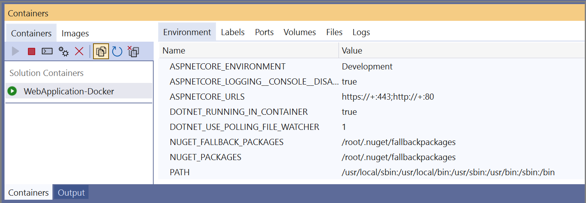
:::moniker-end
:::moniker range="vs-2022"
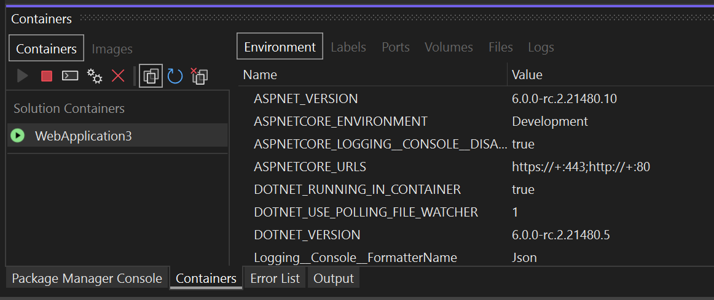
:::moniker-end

On the left side, you see the list of containers on your local machine. The containers associated with your solution are shown under **Solution Containers**. To the right, you see a pane with tabs for **Environment**, **Labels**, **Ports**, **Volumes**, **Logs**, and **Files**.

> [!TIP]
> You can easily customize where the **Containers** tool window is docked in Visual Studio. See [Customizing window layouts in Visual Studio](../ide/customizing-window-layouts-in-visual-studio.md). By default, the **Containers** window is docked with the **Watch** window when the debugger is running.

:::moniker range=">=vs-2022"

If you're using Docker Compose and Visual Studio 2022 version 17.7 or later, you see a tree of nodes for your solution and its Docker Compose project, with a parent node for the solution and child nodes for each project, as you can see the following image:

:::moniker-end

## View environment variables

The **Environment** tab shows the environment variables in the container. For your app's container, you can set these variables in many ways, for example, in the Dockerfile, in a .env file, or by using the -e option when you start a container using a Docker command.

:::moniker range="vs-2019"

:::moniker-end
:::moniker range=">=vs-2022"

:::moniker-end
> [!NOTE]
> Any changes to the environment variables aren't reflected in real time. Also, the environment variables in this tab are the system environment variables on the container, and do not reflect user environment variables local to the app.

## View labels

The **Labels** tab shows the labels for the container. Labels are a way of setting custom metadata on Docker objects. Some labels are set automatically by Visual Studio.

:::moniker range="vs-2019"
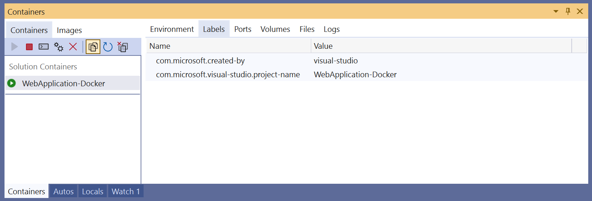
:::moniker-end
:::moniker range=">=vs-2022"

:::moniker-end

## View port mappings

On the **Ports** tab, you can check the port mappings that are in effect for your container.

:::moniker range="vs-2019"
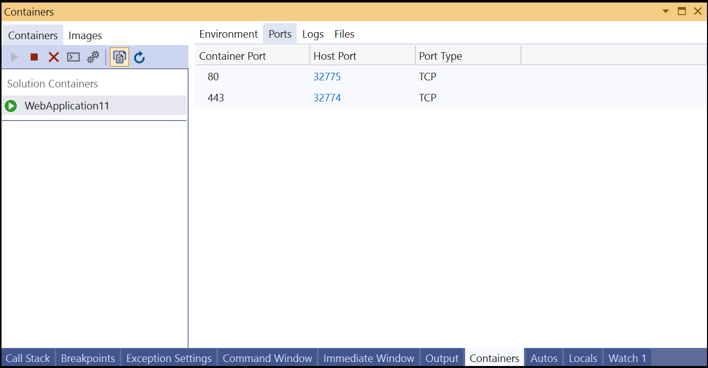
:::moniker-end
:::moniker range=">=vs-2022"
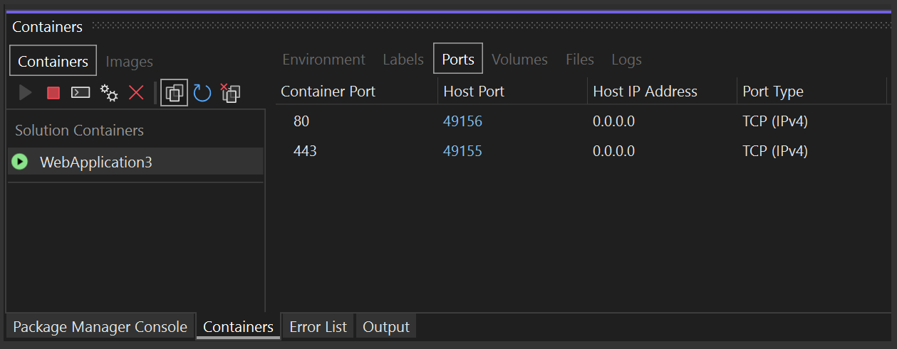
:::moniker-end
Well-known ports are linked, so if there's content available on a port, you can click on the link to open the browser.

## View volumes

The **Volumes** tab shows the volumes (mounted filesystem nodes) on the container.

:::moniker range="vs-2019"

:::moniker-end
:::moniker range=">=vs-2022"

:::moniker-end

## View logs

The **Logs** tab shows the results of the `docker logs` command. By default, the tab shows stdout and stderr streams on a container, but you can configure the output. For details, see [Docker logging](https://docs.docker.com/config/containers/logging/).  By default, the **Logs** tab streams the logs, but you can pause that by choosing the **Stream** button on the tab. If you press **Stream** again, the streaming resumes from where it left off.

:::moniker range="vs-2019"
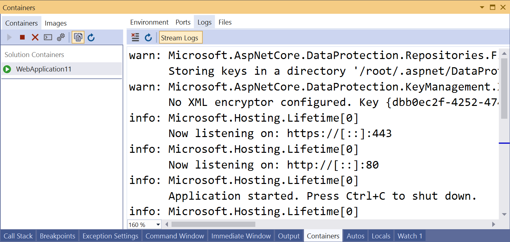
:::moniker-end
:::moniker range=">=vs-2022"
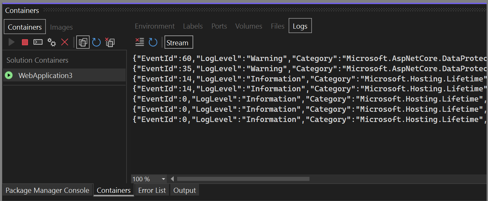
:::moniker-end

To clear the logs, use the **Clear** button on the **Logs** tab.  To get all the logs, use the **Refresh** button.

> [!NOTE]
> Visual Studio automatically redirects stdout and stderr to the **Output** window when you run without debugging with Windows containers, so Windows containers started from Visual Studio using **Ctrl**+**F5** will not display logs in this tab; use the **Output** window instead.

:::moniker range=">=vs-2022"
If you're using Docker Compose with Visual Studio 2022 version 17.7 or later, you have the option of viewing logs separately, or interleaved into a single output stream. If you select the parent node for the solution, you see interleaved logs from all the running containers. The first column on each line shows the container that produced that line of output. If you only want to see the logs for one container by itself, select that specific project's node.

:::moniker-end

## View the filesystem

On the **Files** tab, you can view the container's filesystem, including the app folder that contains your project.

:::moniker range="vs-2019"
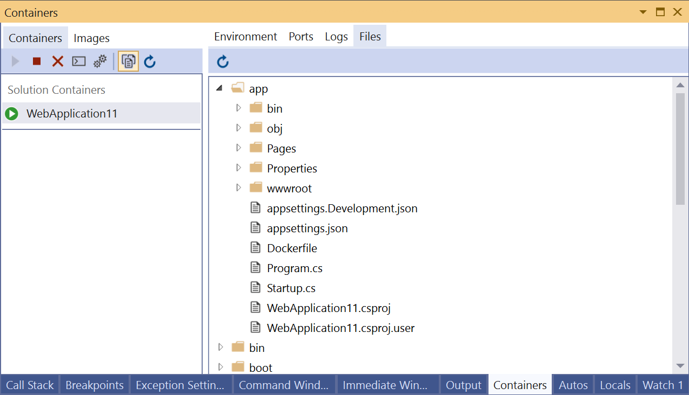
:::moniker-end
:::moniker range=">=vs-2022"

:::moniker-end

To open files in Visual Studio, browse to the file and double-click it, or right-click and choose **Open**. Visual Studio opens files in read-only mode.

:::moniker range="vs-2019"
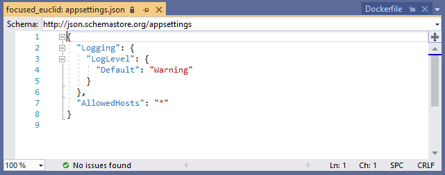
:::moniker-end
:::moniker range="vs-2022"
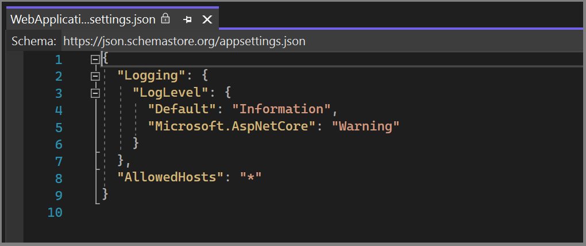
:::moniker-end

Using the **Files** tab, you can view application logs such as IIS logs, configuration files, and other content files in your container's filesystem.

:::moniker range=">=vs-2022"
In Visual Studio 2022 version 17.7 or later, when targeting .NET 8 or later, the Dockerfile might contain the  `USER app` command, which specifies to run the app with normal user permissions. The **Files** tab uses the those permissions as well, and so you might not be able to view some folders, if those folders are set to require elevated permissions to view.
:::moniker-end

## Start, stop, and remove containers

By default, the **Containers** window shows all containers on the machine that Docker manages. You can use the toolbar buttons to start, stop, or remove (delete) a container you no longer want.  This list is dynamically updated as containers are created or removed.

To select multiple containers, for example, to remove more than one at a time, use **Ctrl+Click**. If you try to start more than 10 containers, you are prompted to confirm this. You can disable the confirmation prompt if desired.

## Open a terminal window in a running container

You can open a terminal window (command prompt or interactive shell) in the container by using the **Open Terminal Window** button in the **Container** window.

:::moniker range="vs-2019"
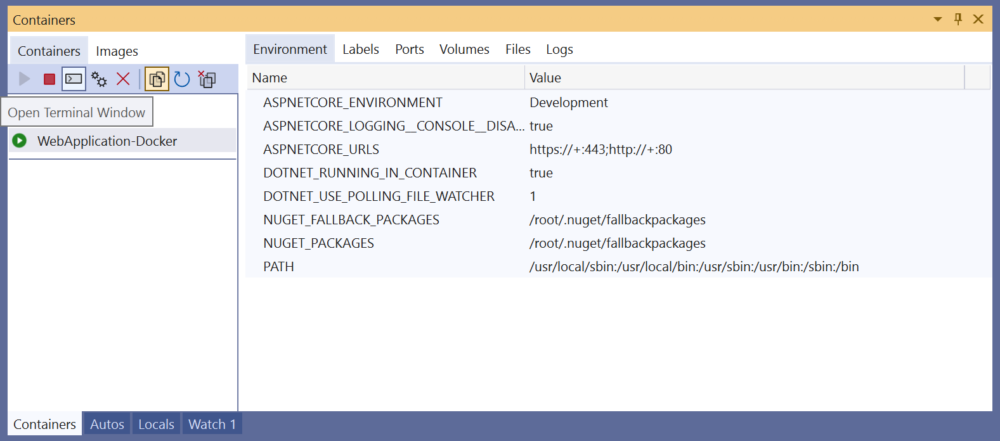
:::moniker-end
:::moniker range=">=vs-2022"
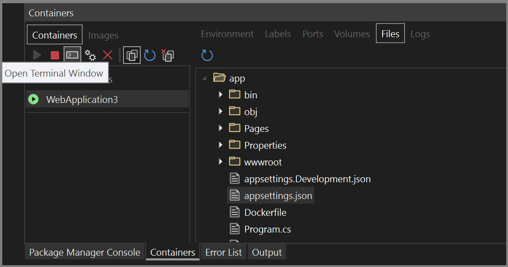
:::moniker-end

For Windows containers, the Windows command prompt opens. For Linux containers, it opens a window using the bash shell.

:::moniker range="vs-2019"
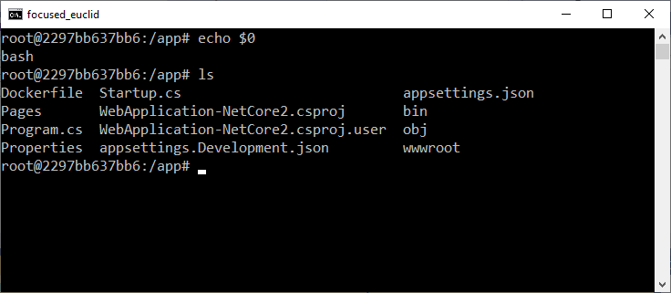
:::moniker-end
:::moniker range=">=vs-2022"
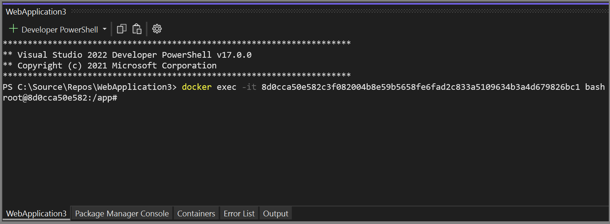
:::moniker-end

:::moniker range=">=vs-2022"
If you're targeting .NET 8, your Dockerfile can specify the `USER app` command, which means your app runs with normal user permissions, rather then elevated permissions. The Dockerfile generated by Visual Studio includes this in Visual Studio 2022 version 17.7 and later, if you're targeting .NET 8 or later. The terminal opens with the same permissions as the app uses to run. So if the Dockerfile specifies the `app` user, it runs with normal permissions; otherwise, the terminal runs with elevated permissions.
:::moniker-end

Normally, the terminal window opens outside Visual Studio as a separate window. If you want a command-line environment integrated into the Visual Studio IDE as a dockable tool window, you can install [Whack Whack Terminal](https://marketplace.visualstudio.com/items?itemName=DanielGriffen.WhackWhackTerminal).

## Attach the debugger to a process

You can attach the debugger to a process that is running in the container by using the **Attach to Process** button on the Containers window toolbar. When you use this button, the **Attach to Process** dialog appears and shows the available processes that are running in the container.  

:::moniker range="vs-2019"
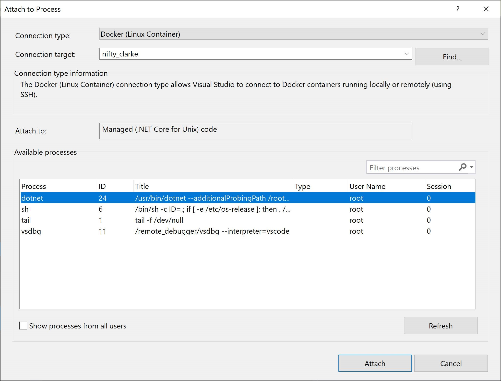
:::moniker-end
:::moniker range=">=vs-2022"

:::moniker-end

You can attach to managed processes in the container. To look for a process in another container, use the **Find** button and select another container on the **Select Docker Container** dialog.

## Viewing images

You can also view images on the local machine by using the **Images** tab in the **Containers** window. Images pulled from external repositories are grouped together in a treeview.

:::moniker range="vs-2019"
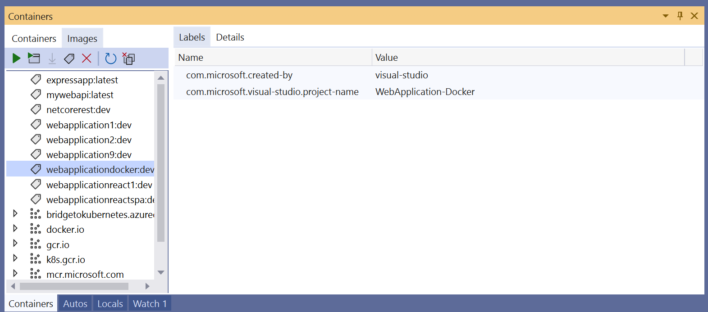
:::moniker-end
:::moniker range=">=vs-2022"

:::moniker-end

The window has only the tabs applicable to images: **Labels** and **Details**. The **Details** tab shows the configuration details for the image in JSON format.

:::moniker range="vs-2019"

:::moniker-end
:::moniker range=">=vs-2022"
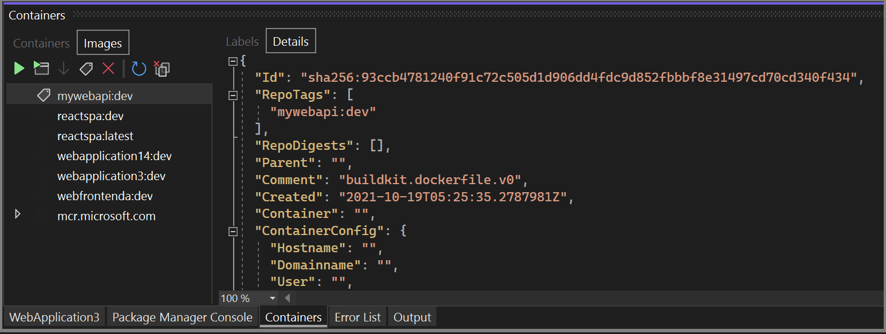
:::moniker-end

To remove an image, right-click on the image in the treeview and choose **Remove**, or select the image, and use the **Remove** button on the toolbar.

## Prune containers and images

You can easily remove containers and images you're not using anymore by using the **Prune** button on the **Containers** window toolbar.

:::moniker range="vs-2019"

:::moniker-end
:::moniker range=">=vs-2022"
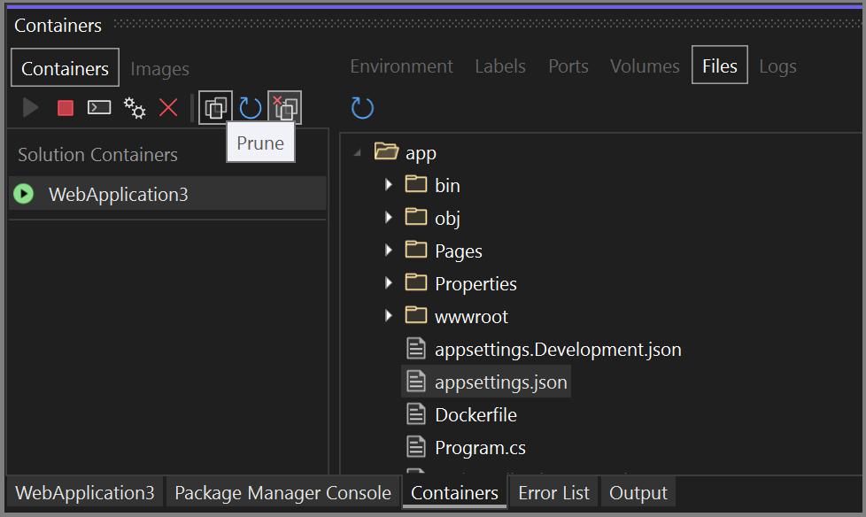
:::moniker-end

You'll be asked to confirm that you want to remove all your unused containers.

When the **Images** tab is selected, the **Prune** button will ask if you want to remove all dangling images. Dangling images are images of layers that are no longer associated with a tagged image. Removing them occasionally helps conserve disk space.

## Configuration options

The confirmation dialogs for various tasks, such as removing containers and images, or launching more than 10 containers at a time, may be configured. You can disable each prompt by using the checkbox on the dialog. You can also enable or disable these options by using the settings at **Tools** > **Options** > **Container Tools** > **Containers Tool Window**. See [Configure Container Tools](container-tools-configure.md).

## Next steps

Learn more about the Container Tools available in Visual Studio by reading the [Container Tools Overview](overview.md).

## See also

[Container Development in Visual Studio](./index.yml)
