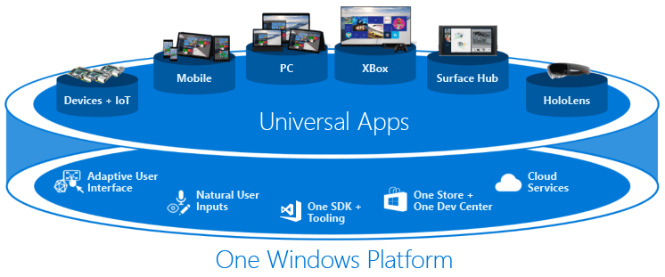

# Develop apps for the Universal Windows Platform (UWP)

With the Universal Windows Platform and our one Windows core, you can run the same app on any Windows 10 device, from phones to desktops. Create these Universal Windows apps with Visual Studio and the Universal Windows App development tools.

Run your app on a Windows 10 phone, a Windows 10 desktop, or an Xbox. It's the same app package! With the introduction of the Windows 10 single, unified core, one app package can run across all platforms. Several platforms have extension SDKs that you can add to your app to take advantage of platform-specific behaviors. For example, an extension SDK for mobile handles the back button being pressed on a Windows phone. If you reference an extension SDK in your project, then just add runtime checks to test if that SDK is available on that platform. That's how you can have the same app package for each platform!

**What is the Windows core?**

For the first time, Windows has been refactored to have a common core across all Windows 10 platforms. There is one common source, one common Windows kernel, one file I/O stack, and one app model. For the UI, there is just one XAML UI framework and one HTML UI framework. You can concentrate on creating a great app, because we've made it easy to have your app run on different Windows 10 devices.

**What exactly is the Universal Windows Platform?**

The Universal Windows Platform is simply a collection of contracts and versions. These allow you to target where your app can run. You no longer target an operating system; now you target one or more device families. Learn more details by reading [Intro to the Universal Windows Platform](/windows/uwp/get-started/universal-application-platform-guide).

## Requirements

The Universal Windows App development tools come with emulators that you can use to see how your app looks on different devices. If you want to use these emulators, you need to install this software on a physical machine. The physical machine must run Windows 8.1 (x64) Professional edition or higher, and have a processor that supports Client Hyper-V and Second Level Address Translation (SLAT). The emulators cannot be used when Visual Studio is installed on a virtual machine.

Here is the list of software that you need:

- [Windows 10](https://support.microsoft.com/help/17777/downloads-for-windows). Visual Studio 2019 supports UWP development only on Windows 10. For more details, see Visual Studio [Platform targeting](/visualstudio/releases/2019/compatibility/) and [System requirements](/visualstudio/releases/2019/system-requirements/).

- [Visual Studio](https://visualstudio.microsoft.com/downloads/?cid=learn-onpage-download-cta). You will also need the optional Universal Windows Platform development workload.

     

After installing this software, you need to enable your Windows 10 device for development. See [Enable your device for development](/windows/uwp/get-started/enable-your-device-for-development). You no longer need a developer license for each Windows 10 device.

## Universal Windows apps

Choose your preferred development language from C#, Visual Basic, C++ or JavaScript to create a Universal Windows Platform app for Windows 10 devices. Read [Create your first app](/windows/uwp/get-started/your-first-app).

If you have existing Windows Store 8.1 apps, Windows Phone 8.1 apps, or Universal Windows apps that were created with Visual Studio 2015, you'll need to port these apps to use the latest Universal Windows Platform. See [Move from Windows Runtime 8.x to UWP](/windows/uwp/porting/w8x-to-uwp-root).

After you create your Universal Windows app, you must package your app to install it on a Windows 10 device or submit it to the Windows Store. See [Packaging apps](/windows/uwp/packaging/index).

## Related content

- [Cross-platform mobile development in Visual Studio](../cross-platform/cross-platform-mobile-development-in-visual-studio.md)
