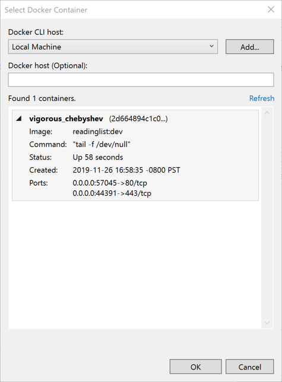
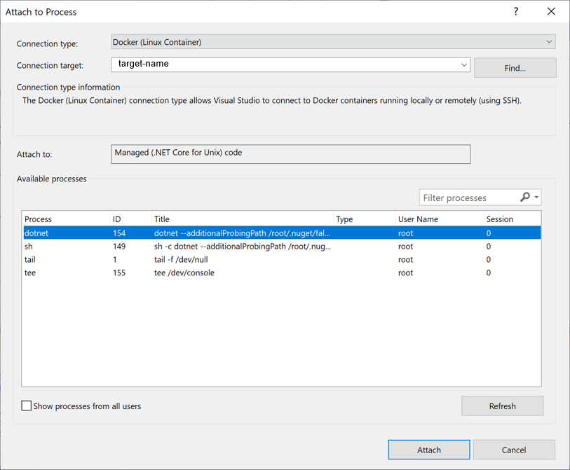
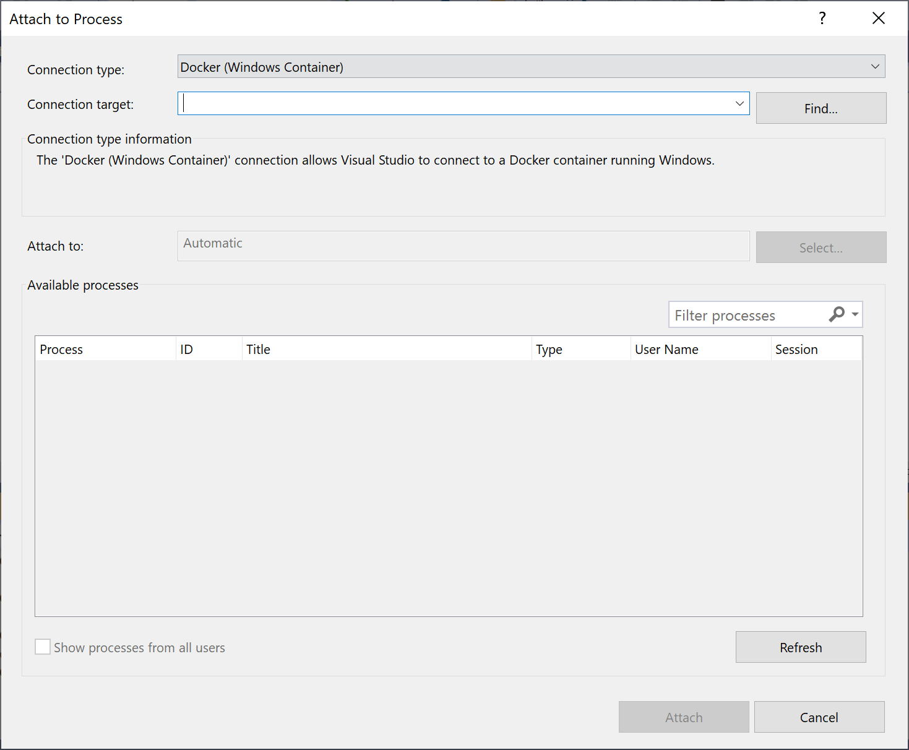

# Attach to a process running on a Docker container 

 [!INCLUDE [Visual Studio](~/includes/applies-to-version/vs-windows-only.md)]

You can debug apps running in either a Windows Docker Container or a Linux .NET Core Docker container using Visual Studio.

## Prerequisites

If it's not already present on the Linux server, you need to install SSH server, unzip and install with either curl or wget. For example, on Ubuntu you can do that by running:

``` cmd
sudo apt-get install openssh-server unzip curl
```

SFTP must be enabled as well. Most SSH distributions install and enable SFTP by default, but that is not always the case.

## Attach to a process running on a Linux Docker container

You can attach the Visual Studio debugger to a process running in a Linux .NET Core Docker container on your local or remote machine using the **Attach to Process** dialog box.

> [!IMPORTANT]
> To use this feature, you must install the .NET Core Cross-Platform Development workload and have local access to the source code.

**To attach to a running process in a Linux Docker container:**

1. In Visual Studio, select **Debug > Attach to Process (CTRL+ALT+P)** to open the **Attach to Process** dialog box.


2. Set the **Connection type** to **Docker (Linux Container)**.
3. Select **Find...** to set the **Connection target** via the **Select Docker Container** dialog box.

    You can debug a Docker container process either locally or remotely.

    **To debug a Docker container process locally:**
    1. Set **Docker CLI host** to **Local Machine**.
    1. Select a running container to attach to from the list and hit **OK**.

    

    **B. To debug a Docker container process remotely:**

    > [!NOTE]
    > There are two options for connecting remotely to a running process in a Docker container. The first option, to use SSH, is ideal if you don't have Docker tools installed on your local machine.  If you do have Docker tools installed locally and you have a Docker daemon that's configured to accept remote requests, try the second option, using a Docker daemon.

    1. ***To connect to a remote machine via SSH:***
        1. Select **Add...** to connect to a remote system.<br/>
        
        1. Select a running container to attach to after connecting to the SSH or daemon successfully and hit **OK**.

    1. ***To set the target to a remote container running a process via a [Docker daemon](https://docs.docker.com/engine/reference/commandline/dockerd/)***
        1. Specify the daemon address (i.e. via TCP, IP, etc.) under **Docker host (Optional)** and click the refresh link.
        1. Select a running container to attach to after connecting to the daemon successfully and hit **OK**.

4. Choose the corresponding container process from the list of **Available processes** and select **Attach** to start debugging your C# container process in Visual Studio!

    

## Attach to a process running on a Windows Docker container

You can attach the Visual Studio debugger to a process running in a Windows Docker container on your local machine using the **Attach to Process** dialog box.

> [!IMPORTANT]
> To use this feature with a .NET Core process, you must install the .NET Core Cross-Platform Development workload and have local access to the source code.

**To attach to a running process in a Windows Docker container:**

1. In Visual Studio, select **Debug > Attach to Process** (or **CTRL+ALT+P**) to open the **Attach to Process** dialog box.

   

2. Set the **Connection type** to **Docker (Windows Container)**.
3. Select **Find...** to set the **Connection target** using the **Select Docker Container** dialog box.

    > [!IMPORTANT]
    > The target process must have the same processor architecture as the Docker Windows container it is running on.

   Setting the target to a remote container via SSH is currently unavailable and can only be done using a Docker daemon.

    ***To set the target to a remote container running a process via a [Docker daemon](https://docs.docker.com/engine/reference/commandline/dockerd/)***
    1. Specify the daemon address (i.e. via TCP, IP, etc.) under **Docker host (Optional)** and click the refresh link.

    1. Select a running container to attach to after connecting to the daemon successfully and choose OK.

4. Choose the corresponding container process from the list of **Available processes** and select **Attach** to start debugging your C# container process.

    

5. Choose the corresponding container process from the list of available processes and choose **Attach** to start debugging your C# container process.