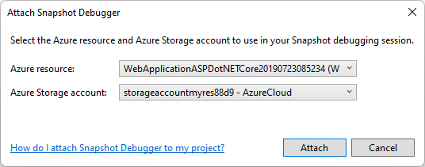
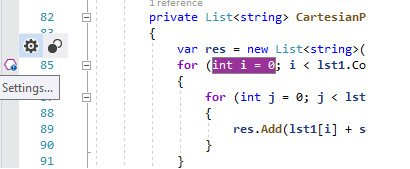
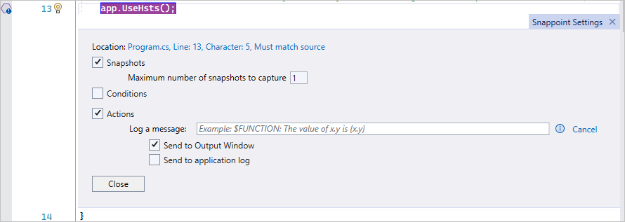

# Use time travel debugging to record and replay ASP.NET apps on Azure VMs

 [!INCLUDE [Visual Studio](~/includes/applies-to-version/vs-windows-only.md)]

Time travel debugging in Visual Studio Enterprise can record a web app running on an Azure virtual machine (VM), and then accurately reconstruct and replay the execution path. Time Travel Debugging (TTD) was added to Visual Studio 2019 Enterprise as a preview feature, and is now integrated into the Visual Studio Snapshot Debugger.

Time travel debugging lets you rewind and replay each line of code as many times as you want. This procedure can help you isolate and identify problems that might occur only in production environments.

Capturing a time travel debugging recording doesn't halt your app, but it adds significant overhead to the running process. The amount of slowdown depends on factors like process size and the number of active threads.

In this tutorial, you:

> [!div class="checklist"]
> * Start the Snapshot Debugger with TTD.
> * Set a snappoint and collect a time travel recording.
> * Debug the time travel recording.

## Prerequisites

- [Visual Studio Enterprise 2019 or higher](https://visualstudio.microsoft.com/vs) with the **Azure development workload** installed.

  In the Visual Studio Installer, make sure **Snapshot Debugger** is selected under **Debugging and testing** on the **Individual components** tab.

- An ASP.NET (AMD64) web app running on .NET Framework 4.8 or later on an Azure VM.

## Attach the Snapshot Debugger

1. Open the project for the app you want to debug.

   > [!IMPORTANT]
   > Make sure to open the same version of source code that's published to your Azure VM.

1. Choose **Debug > Attach Snapshot Debugger**. Select the Azure VM your web app is deployed to, and an Azure Storage account, and then select **Attach**.

   

   > [!IMPORTANT]
   > The first time you select **Attach Snapshot Debugger**, IIS automatically restarts on your VM.

1. Visual Studio is now in snapshot debugging mode.

   

   > [!NOTE]
   > The Application Insights site extension also supports Snapshot Debugging. If you get a **site extension out of date** error message, see [Site Extension Upgrade](../debugger/debug-live-azure-apps-troubleshooting.md#site-extension-upgrade) for upgrading details.

1. The metadata for the modules isn't initially activated. Navigate to the web app to load the modules.

   The **Modules** window shows you when all the modules are loaded for the Azure VM. To open the **Modules** window, select **Debug** > **Windows** > **Modules**.

   

   Once all modules are loaded, you can select the **Start Collection** button in the Visual Studio toolbar.

## Set a snappoint

1. To set a snappoint, in the code editor, click the left gutter next to a method you're interested in. Make sure you know that the code executes.

   

1. Right-click the snappoint hollow sphere icon and choose **Actions** to show the **Snapshot Settings** window.

   

## Take the snapshot

Select **Start Collection** in the toolbar to turn on the snappoint.

When you turn on the snappoint, it captures a snapshot when the line of code it's placed on executes. The execution might require a request on your server. To force your snappoint to hit, go to the browser view of your website and take any required actions.

By default, the snappoint captures only one snapshot. After the snappoint captures a snapshot, it turns off. If you want to capture another snapshot at the snappoint, you can turn the snappoint back on by selecting **Update Collection**.

## Debug a time travel recording

1. When the snappoint is hit, a snapshot appears in the **Diagnostic Tools** window. If this window isn't open, open it by selecting **Debug** > **Windows** > **Show Diagnostic Tools**.

   

1. Select **View Snapshot** to open the time travel recording in the code editor.

   - You can execute every line of code that time travel debugging recorded by using the **Continue** and **Reverse Continue** buttons.

   - You can also use the **Debug** toolbar to **Show Next Statement**, **Step Into**, **Step Over**, **Step Out**, **Step Back Into**, **Step Back Over**, and **Step Back Out**.

     

   - You can also use the Visual Studio **Locals**, **Watches**, and **Call Stack** windows, and evaluate expressions.

The website is still live, and end users aren't impacted by time travel debugging activity.

For more information and help, see [Troubleshooting and known issues for snapshot debugging in Visual Studio](../debugger/debug-live-azure-apps-troubleshooting.md).

## Set a conditional snappoint

If it's difficult to recreate a particular state in your app, consider using a conditional snappoint. Conditional snappoints help you avoid collecting a recording until the app enters a desired state, such as when a variable has a particular value. For more information about setting conditions based on expressions, filters, or hit counts, see [Breakpoint conditions](using-breakpoints.md#breakpoint-conditions).

## Next steps

In this tutorial, you learned how to use the Snapshot Debugger to collect a time travel recording for Azure VMs. Learn more about snapshot debugging:

> [!div class="nextstepaction"]
> [FAQ for snapshot debugging](../debugger/debug-live-azure-apps-faq.yml)