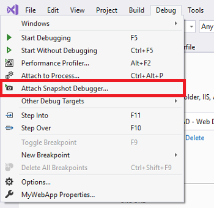
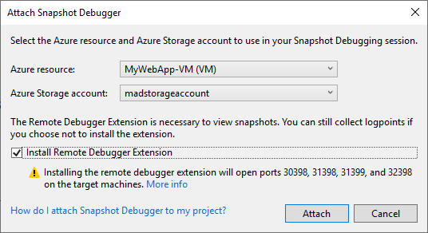

# Debug live ASP.NET apps on Azure virtual machines and Azure virtual machine scale sets using the Snapshot Debugger

The Snapshot Debugger takes a snapshot of your in-production apps when code that you're interested in executes. To instruct the debugger to take a snapshot, you set snappoints and logpoints in your code. The debugger lets you see exactly what went wrong, without impacting traffic of your production application. The Snapshot Debugger can help you dramatically reduce the time it takes to resolve issues that occur in production environments.

Snappoints and logpoints are similar to breakpoints, but unlike breakpoints, snappoints don't halt the application when hit. Typically, capturing a snapshot at a snappoint takes 10-20 milliseconds.

In this tutorial, you will:

> [!div class="checklist"]
> * Start the Snapshot Debugger
> * Set a snappoint and view a snapshot
> * Set a logpoint

## Prerequisites

* Snapshot Debugger for Azure Virtual Machines (VM) and Azure Virtual Machine Scale Sets is only available for Visual Studio 2019 Enterprise or higher with the **Azure development workload**. (Under the **Individual components** tab, you find it under **Debugging and testing** > **Snapshot debugger**.)

    If it's not already installed, install [Visual Studio 2019 Enterprise](https://visualstudio.microsoft.com/vs/).

* Snapshot collection is available for the following Azure Virtual Machines\Virtual Machine Scale Sets web apps:
  * ASP.NET applications running on .NET Framework 4.6.1 or later.
  * ASP.NET Core applications running on .NET Core 2.0 or later on Windows.

  > [!NOTE]
  >  Visual Studio Enterprise running on 32-bit Windows will not be able to view snapshots.

## Open your project and start the Snapshot Debugger

1. Open the project you would like to snapshot debug.

    > [!IMPORTANT]
    > To snapshot debug, you need to open the *same version of source code* that is published to your Azure Virtual Machine\Virtual Machine Scale Set service.

1. Choose **Debug > Attach Snapshot Debugger...**. Select the Azure Virtual Machine\Virtual Machine Scale Set your web app is deployed to and an Azure storage account, and then click **Attach**. Snapshot Debugger also supports [Azure Kubernetes Service](debug-live-azure-kubernetes.md) and [Azure App Service](debug-live-azure-applications.md).

    

    

    > [!IMPORTANT]
    > The first time you select **Attach Snapshot Debugger** for your VM, IIS is automatically restarted.
    > The first time you select **Attach Snapshot Debugger** for your Virtual Machine Scale Sets, requires the manual upgrade of each instance of the Virtual Machine Scale Sets.

    > [!NOTE]
    > (Visual Studio 2019 version 16.2 and above) Snapshot Debugger has enabled Azure cloud support. Make sure that both the Azure resource and Azure Storage account you select are from the same cloud. Please contact your Azure administrator if you have questions about your enterprise's [Azure compliance](https://azure.microsoft.com/overview/trusted-cloud/) configurations.

    The metadata for the **Modules** won't initially be activated, navigate to the web app and the **Start Collection** button will become active. Visual Studio is now in snapshot debugging mode.

    

    > [!NOTE]
    > For VMSS the user is required to manually upgrade the instances in their Virtual Machine Scale Sets after attaching the Snapshot Debugger for the first time.

    The **Modules** window shows you when all the modules have loaded for the Azure Virtual Machine\Virtual Machine Scale Set (choose **Debug > Windows > Modules** to open this window).

    

## Set a snappoint

1. In the code editor, click the left gutter next to a line of code you're interested in to set a snappoint. Make sure it's code that you know will execute.

    

1. Click **Start Collection** to turn on the snappoint.

    

    > [!TIP]
    > You can't step when viewing a snapshot, but you can place multiple snappoints in your code to follow execution at different lines of code. If you have multiple snappoints in your code, the Snapshot Debugger makes sure that the corresponding snapshots are from the same end-user session. The Snapshot Debugger does this even if there are many users hitting your app.

## Take a snapshot

Once a snappoint is set, you can either manually generate a snapshot by going to the browser view of your web site and running the line of code marked or wait for your users to generate one from their usage of the site.

## Inspect snapshot data

1. When the snappoint is hit, a snapshot appears in the Diagnostic Tools window. To open this window, choose **Debug > Windows > Show Diagnostic Tools**.

    

1. Double-click the snappoint to open the snapshot in the code editor.

    

    From this view, you can hover over variables to view DataTips, use the **Locals**, **Watches**, and **Call Stack** windows, and also evaluate expressions.

    The website itself is still live and end users aren't affected. Only one snapshot is captured per snappoint by default: after a snapshot is captured the snappoint turns off. If you want to capture another snapshot at the snappoint, you can turn the snappoint back on by clicking **Update Collection**.

You can also add more snappoints to your app and turn them on with the **Update Collection** button.

**Need help?** See the [Troubleshooting and known issues](../debugger/debug-live-azure-apps-troubleshooting.md) and [FAQ for snapshot debugging](../debugger/debug-live-azure-apps-faq.yml) pages.

## Set a conditional snappoint

If it's difficult to recreate a particular state in your app, consider using a conditional snappoint. Conditional snappoints help you control when to take a snapshot such as when a variable contains a particular value that you want to inspect. You can set conditions using expressions, filters, or hit counts.

#### To create a conditional snappoint

1. Right-click a snappoint icon (the hollow sphere) and choose **Settings**.

   

1. In the snappoint settings window, type an expression.

   

   In the preceding illustration, the snapshot is only taken for the snappoint when `visitor.FirstName == "Dan"`.

## Set a logpoint

In addition to taking a snapshot when a snappoint is hit, you can also configure a snappoint to log a message (that is, create a logpoint). You can set logpoints without having to redeploy your app. Logpoints are executed virtually and cause no impact or side effects to your running application.

#### To create a logpoint

1. Right-click a snappoint icon (the blue hexagon) and choose **Settings**.

1. In the snappoint settings window, select **Actions**.

    

1. In the **Message** field, you can enter the new log message you want to log. You can also evaluate variables in your log message by placing them inside curly braces.

    If you choose **Send to Output Window**, when the logpoint is hit, the message appears in the Diagnostic Tools window.

    

    If you choose **Send to application log**, when the logpoint is hit, the message appears anywhere that you can see messages from `System.Diagnostics.Trace` (or `ILogger` in .NET Core), such as [App Insights](/azure/application-insights/app-insights-asp-net-trace-logs).

## Next steps

In this tutorial, you've learned how to use the Snapshot Debugger for Azure Virtual Machines and Azure Virtual Machine Scale Sets. You may want to read more details about this feature.

> [!div class="nextstepaction"]
> [FAQ for snapshot debugging](../debugger/debug-live-azure-apps-faq.yml)
