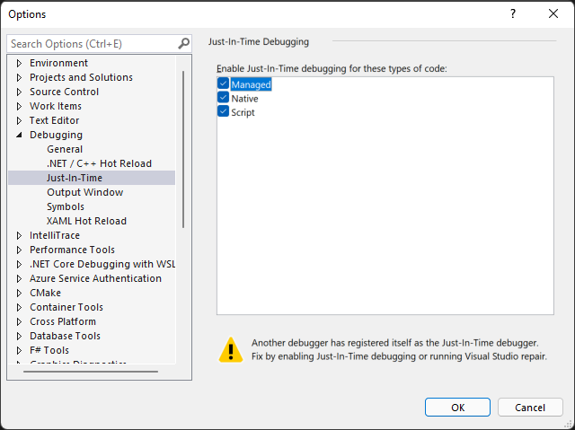
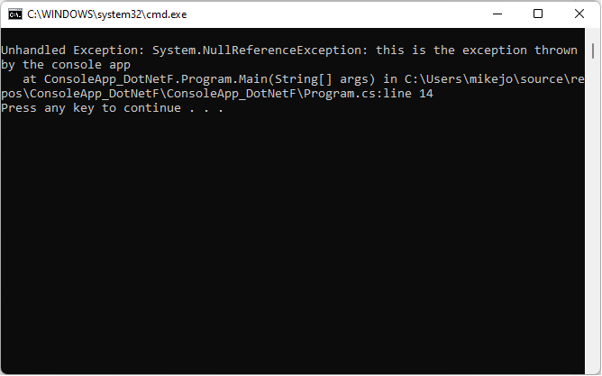
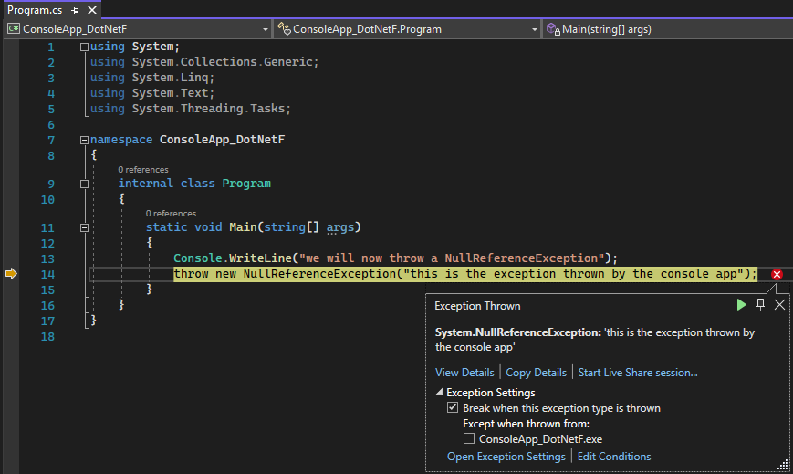

# Debug using the Just-In-Time Debugger in Visual Studio

 [!INCLUDE [Visual Studio](~/includes/applies-to-version/vs-windows-only.md)]

Just-In-Time debugging can launch Visual Studio automatically when an app running outside Visual Studio errors or crashes. With Just-In-Time debugging, you can test apps outside of Visual Studio, and open Visual Studio to begin debugging when a problem occurs.

Just-In-Time debugging works for Windows desktop apps. It does not work for Universal Windows Apps, or for managed code that is hosted in a native application, such as Visualizers.

> [!TIP]
> If you just want to stop the Just-In-Time Debugger dialog box from appearing, but don't have Visual Studio installed, see [Disable the Just-In-Time Debugger](../debugger/just-in-time-debugging-in-visual-studio.md). If you once had Visual Studio installed, you may need to [disable Just-In-Time debugging from the Windows registry](#disable-just-in-time-debugging-from-the-windows-registry).

## <a name="BKMK_Enabling"></a> Enable or disable Just-In-Time debugging in Visual Studio


>[!NOTE]
>To enable or disable Just-In-Time debugging, you must be running Visual Studio as an administrator. Enabling or disabling Just-In-Time debugging sets a registry key, and administrator privileges may be required to change that key. To open Visual Studio as an administrator, right-click the Visual Studio app and choose **Run as administrator**.

You can configure Just-In-Time debugging from the Visual Studio **Tools** > **Options** (or **Debug** > **Options**) dialog box.

**To enable or disable Just-In-Time debugging:**

1. On the **Tools** or **Debug** menu, select **Options** > **Debugging** > **Just-In-Time**.

   


>[!NOTE]
>If the Just-In-Time menu option is not shown ensure the Just-In-Time debugger is installed using the Visual Studio Installer.

1. In the **Enable Just-In-Time debugging for these types of code** box, select the types of code you want Just-In-Time debugging to debug: **Managed**, **Native**, and/or **Script**.

1. Select **OK**.

If you enable the Just-In-Time debugger, but it doesn't open when an app crashes or errors, see [Troubleshoot Just-In-Time debugging](#jit_errors).

## Disable Just-In-Time debugging from the Windows registry

Just-In-Time debugging may still be enabled even if Visual Studio is no longer installed on your computer. If Visual Studio is no longer installed, you can disable Just-In-Time debugging by editing the Windows registry.

**To disable Just-In-Time debugging by editing the registry:**

1. From the Windows **Start** menu, run the **Registry Editor** (*regedit.exe*).

2. In the **Registry Editor** window, locate and delete the following registry entries if they exist:

    - **HKEY_LOCAL_MACHINE\SOFTWARE\Wow6432Node\Microsoft\\.NETFramework\DbgManagedDebugger**

    - **HKEY_LOCAL_MACHINE\SOFTWARE\Wow6432Node\Microsoft\Windows NT\CurrentVersion\AeDebug\Debugger**

    :::image type="content" source="../debugger/media/dbg-jit-registry.png" alt-text="JIT registry key" border="true":::

3. Also delete the following registry entries if they exist:

    - **HKEY_LOCAL_MACHINE\SOFTWARE\Microsoft\\.NETFramework\DbgManagedDebugger**

    - **HKEY_LOCAL_MACHINE\SOFTWARE\Microsoft\Windows NT\CurrentVersion\AeDebug\Debugger**

    Make sure not to delete or change any other registry keys.

4. Close the **Registry Editor** window.

## Enable Just-In-Time debugging of a Windows Form

By default, Windows Form apps have a top-level exception handler that lets the app keep running if it can recover. If a Windows Forms app throws an unhandled exception, it shows the following dialog:


To enable Just-In-Time debugging instead of standard Windows Form error handling, add these settings:

- In the `system.windows.forms` section of the *machine.config* or *\<app name>.exe.config* file, set the `jitDebugging` value to `true`:

    ```xml
    <configuration>
        <system.windows.forms jitDebugging="true" />
    </configuration>
    ```

- In a C++ Windows Form application, also set `DebuggableAttribute` to `true` in a *.config* file or in your code. If you compile with [/Zi](/cpp/build/reference/z7-zi-zi-debug-information-format) and without [/Og](/cpp/build/reference/og-global-optimizations), the compiler sets this attribute for you. If you want to debug a non-optimized release build, however, you must set `DebuggableAttribute` by adding the following line in your app's *AssemblyInfo.cpp* file:

   ```cpp
   [assembly:System::Diagnostics::DebuggableAttribute(true, true)];
   ```

   For more information, see <xref:System.Diagnostics.DebuggableAttribute>.

## <a name="BKMK_Using_JIT"></a>Use Just-In-Time debugging

This example walks you through Just-In-Time debugging when an app throws an error.

- You must have Visual Studio installed to follow these steps. If you don't have Visual Studio, you can download the free [Visual Studio Community Edition](https://visualstudio.microsoft.com/thank-you-downloading-visual-studio/?sku=Community&rel=15).

- Make sure Just-In-Time debugging is [enabled](#BKMK_Enabling) in **Tools** > **Options** > **Debugging** > **Just-In-Time**.

For this example, you'll make a C# console app in Visual Studio that throws a [NullReferenceException](/dotnet/api/system.nullreferenceexception).

1. In Visual Studio, create a C# console app (**File** > **New** > **Project** > **Visual C#** > **Console Application**) named *ThrowsNullException*. For more information about creating projects in Visual Studio, see [Walkthrough: Create a simple application](../get-started/csharp/tutorial-wpf.md).

1. When the project opens in Visual Studio, open the *Program.cs* file. Replace the Main() method with the following code, which prints a line to the console and then throws a NullReferenceException:

   ```csharp
   static void Main(string[] args)
   {
       Console.WriteLine("we will now throw a NullReferenceException");
       throw new NullReferenceException("this is the exception thrown by the console app");
   }
   ```

1. To build the solution, choose either the **Debug** (default) or **Release** configuration, and then select **Build** > **Rebuild Solution**.

   > [!NOTE]
   > - Choose **Debug** configuration for the full debugging experience.
   > - If you select [Release](../debugger/how-to-set-debug-and-release-configurations.md) configuration, you must turn off [Just My Code](../debugger/just-my-code.md) for this procedure to work. Under **Tools** > **Options** > **Debugging**, deselect **Enable Just My Code**.

   For more information about build configurations, see [Understanding build configurations](../ide/understanding-build-configurations.md).

1. Open the built app *ThrowsNullException.exe* in your C# project folder (*...\ThrowsNullException\ThrowsNullException\bin\Debug* or *...\ThrowsNullException\ThrowsNullException\bin\Release*).

   You should see the following command window:

   

1. The **Choose Just-In-Time Debugger** dialog opens.

   

   Under **Available Debuggers**, select **New instance of \<your preferred Visual Studio version/edition>**, if not already selected.

1. Select **OK**.

   The ThrowsNullException project opens in a new instance of Visual Studio, with execution stopped at the line that threw the exception:

   

You can start debugging at this point. If you were debugging a real app, you would need to find out why the code is throwing the exception.

> [!CAUTION]
> If your app contains untrusted code, a security warning dialog box appears, enabling you to decide whether to proceed with debugging. Before you continue debugging, decide whether you trust the code. Did you write the code yourself? If the application is running on a remote machine, do you recognize the name of the process? If the app is running locally, consider the possibility of malicious code running on your computer. If you decide the code is trustworthy, select **OK**. Otherwise, select **Cancel**.

## <a name="jit_errors"></a> Troubleshoot Just-In-Time debugging

If Just-In-Time debugging doesn't start when an app crashes, even though it is enabled in Visual Studio:

- Windows Error Reporting could be taking over the error handling on your computer.

  To fix this issue, use Registry Editor to add a **DWORD Value** of **Disabled**, with **Value data** of **1**, to the following registry keys:

  - **HKEY_LOCAL_MACHINE\Software\WOW6432Node\Microsoft\Windows\Windows Error Reporting**
  
  - (For 32-bit machines) **HKEY_LOCAL_MACHINE\Software\Microsoft\Windows\Windows Error Reporting**

  For more information, see [.WER settings](/windows/desktop/wer/wer-settings).

- A known Windows issue may be causing the Just-In-Time debugger to fail.

  The fix is to add a **DWORD Value** of **Auto**, with **Value data** of **1**, to the following registry keys:

  - **HKEY_LOCAL_MACHINE\Software\WOW6432Node\Microsoft\Windows NT\CurrentVersion\AeDebug**

  - (For 32-bit machines) **HKEY_LOCAL_MACHINE\SOFTWARE\Microsoft\Windows NT\CurrentVersion\AeDebug**

You might see the following error messages during Just-In-Time debugging:

- **Unable to attach to the crashing process. The specified program is not a Windows or MS-DOS program.**

    The debugger tried to attach to a process running under another user.

    To work around this problem, in Visual Studio, open **Debug** > **Attach to Process** (or press **Ctrl** + **Alt** + **P**), and find the process you want to debug in the **Available Processes** list. If you do not know the name of the process, find the Process ID in the **Visual Studio Just-In-Time Debugger** dialog. Select the process in the **Available Processes** list, and select **Attach**. Select **No** to dismiss the Just-In-Time debugger dialog.

- **Debugger could not be started because no user is logged on.**

    There is no user logged onto the console, so there is no user session to display the Just-In-Time debugging dialog.

    To fix this problem, log onto the machine.

- **Class not registered.**

    The debugger tried to create a COM class that is not registered, probably due to an installation problem.

    To fix this problem, use the Visual Studio Installer to reinstall or repair your Visual Studio installation.

## See also

- [Debugger security](../debugger/debugger-security.md)
- [First look at the debugger](../debugger/debugger-feature-tour.md)
- [Options, Debugging, Just-In-Time dialog box](../debugger/just-in-time-debugging-options-dialog-box.md)
- [Security Warning: Attaching to a process owned by an untrusted user can be dangerous. If the following information looks suspicious or you are unsure, do not attach to this process](../debugger/security-warning-attaching-to-a-process-owned-by-an-untrusted-user.md)
