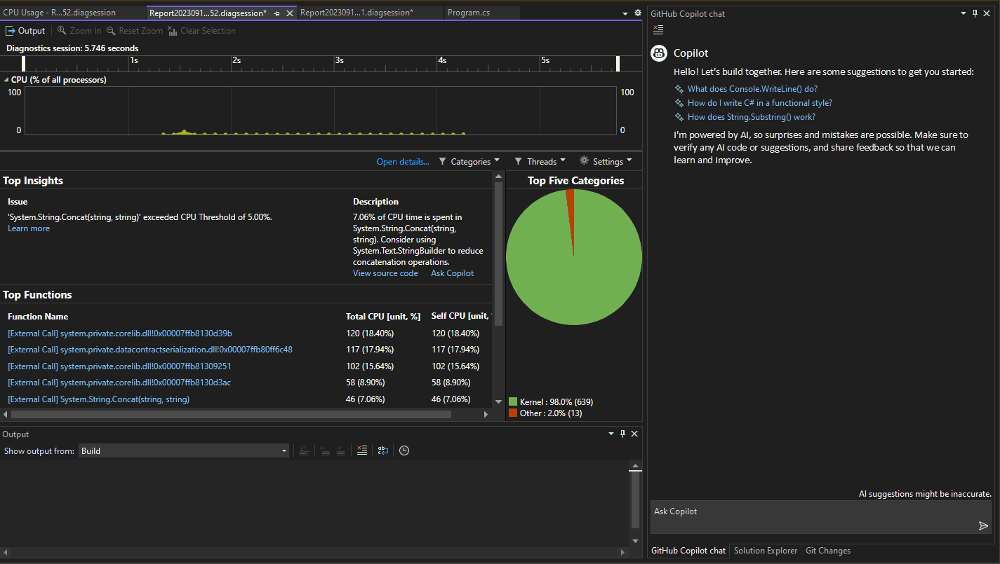

# Debug your app with Copilot

 [!INCLUDE [Visual Studio](~/includes/applies-to-version/vs-windows-only.md)]

GitHub Copilot chat for Visual Studio 2022 supports many interactive debugging scenarios, including AI-assisted chat for debugging questions related to your variables, the call stack, and other code elements, along with highly targeted help associated with an **Ask Copilot** link.

For related videos, see the [blog post announcement](https://devblogs.microsoft.com/visualstudio/simplified-code-refinement-and-debugging-with-github-copilot-chat/
).

## Prerequisites

To use Copilot with the debugging features, you must have Visual Studio 2022 version 17.7.4 or later, and a GitHub Copilot subscription.

For detailed information and installation instructions, see [Prerequisites & supported programming languages](../ide/visual-studio-github-copilot-extension.md#prerequisites--supported-programming-languages).

## AI-assisted auto insights

Copilot provides detailed information in the CPU Usage auto insights. It provides detailed information and insights for specific methods and properties, such as `String.Concat` and many other methods. With Copilot, ask questions about functions on the identified hot paths in your code, which can help you produce more efficient or cost-effective code.

When the CPU Usage tool provides auto insights in the Top Insights section, select **Ask Copilot** to learn from Copilot and start asking questions.

## AI-assisted exceptions

Copilot has access to exceptions, call stack, local variables, and code. By forming good questions based on the right parts of the data Visual Studio has when you’re at an exception, Copilot Chat can provide useful insights and fixes for the issue.

When you see an exception, select the **Ask Copilot** link to get AI-generated answers related to the specific exception and context.

If you have more questions, just ask Copilot!

## AI-assisted debugging

Copilot understands call stacks, frames, variable names, and values. As a result, you can pose detailed questions to the debugger-aware Copilot.

And Copilot answers!

