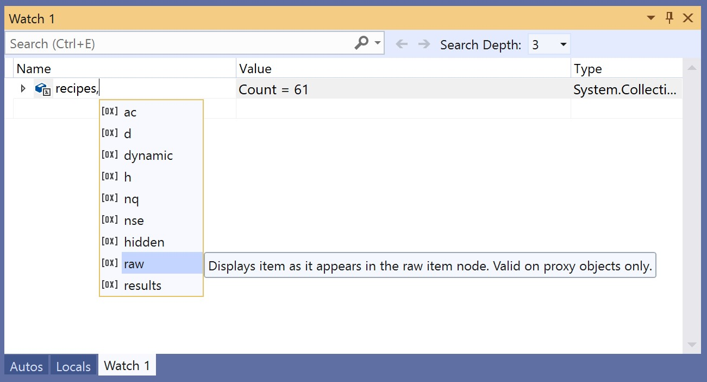

# Format specifiers in C# in the Visual Studio debugger

 [!INCLUDE [Visual Studio](~/includes/applies-to-version/vs-windows-only.md)]
You can change the format in which a value is displayed in the **Watch** window by using format specifiers. You can also use format specifiers in the **Immediate** window, the **Command** window, in [tracepoints](../debugger/using-breakpoints.md#BKMK_Print_to_the_Output_window_with_tracepoints), and in source windows. If you pause on an expression in those windows, the result will appear in a  [DataTip](../debugger/view-data-values-in-data-tips-in-the-code-editor.md) in the specified format display.

To use a format specifier, enter the variable expression followed by a comma and the appropriate specifier.

## Set format specifiers
We'll use the following example code:

```csharp
{
    int my_var1 = 0x0065;
    int my_var2 = 0x0066;
    int my_var3 = 0x0067;
}
```

Add the `my_var1` variable to the **Watch** window while debugging, **Debug** > **Windows** > **Watch** > **Watch 1**. Next, right-click the variable and select **Hexadecimal Display**. Now the **Watch** window shows the value 0x0065. To see this value as a decimal integer rather than a hexadecimal integer, add the decimal format specifier **, d** in the **Name** column after the variable name. The **Value** column now shows **101**.


::: moniker range=">= vs-2019" 

You can view and select from a list of available format specifiers by appending a comma (,) to the value in the **Watch** window. 



::: moniker-end

## Format specifiers
The following table describes the C# format specifiers for the Visual Studio debugger.

|Specifier|Format|Original Watch Value|Displays|
|---------------|------------|--------------------------|--------------|
|ac|Force evaluation of an expression, which can be useful when implicit evaluation of properties and implicit function calls is turned off.|Message "Implicit function evaluation is turned off by the user"|\<value>|
|d|decimal integer|0x0065|101|
|dynamic|Displays the specified object using a Dynamic View|Displays all the members of the object, including the Dynamic View|Displays only the Dynamic View|
|h|hexadecimal integer|61541|0x0000F065|
|nq|string with no quotes|"My String"|My String|
|nse|Specifies behavior, not format. Evaluates the expression with "No side effects". If the expression can’t be interpreted and can only be resolved by an evaluation (such as a function call), you will see an error instead.|N/A|N/A|
|hidden|Displays all public and non-public members|Displays public members|Displays all members|
|raw|Displays item as it appears in the raw item node. Valid on proxy objects only.|Dictionary\<T>|Raw view of Dictionary\<T>|
|results|Used with a variable of a type that implements IEnumerable or IEnumerable\<T>, usually the result of a query expression. Displays only the members that contain the query result.|Displays all the members|Displays the members the meet the conditions of the query|

## See also
- [Watch and QuickWatch windows](../debugger/watch-and-quickwatch-windows.md)
- [Autos and Locals windows](../debugger/autos-and-locals-windows.md)
