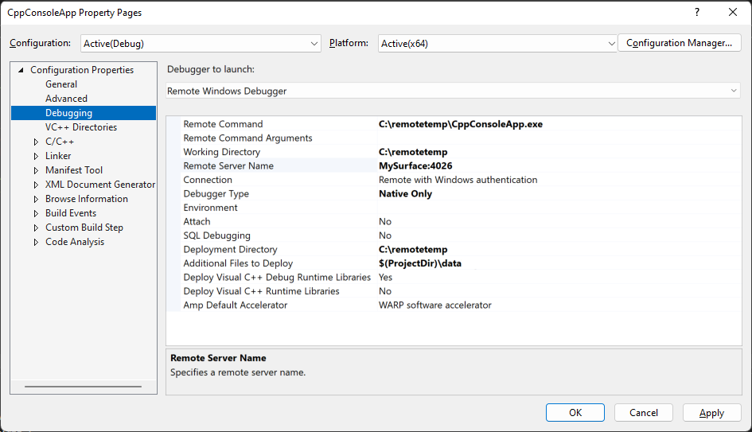

# Remote Debugging a C++ Project in Visual Studio

To debug a Visual Studio application on a different computer, install and run the remote tools on the computer where you will deploy your app, configure your project to connect to the remote computer from Visual Studio, and then deploy and run your app.

For information about remote debugging Universal Windows Apps (UWP), see [Debug an Installed App Package](debug-installed-app-package.md).

## Requirements

The remote debugger is supported on Windows 7 and newer and versions of Windows Server starting with Windows Server 2008 Service Pack 2. For a complete list of requirements, see [Requirements](../debugger/remote-debugging.md#requirements_msvsmon).

> [!NOTE]
> Debugging between two computers connected through a proxy is not supported. Debugging over a high latency or low bandwidth connection, such as dialup Internet, or over the Internet across countries/regions is not recommended and may fail or be unacceptably slow.

## Download and Install the remote tools

[!INCLUDE [remote-debugger-download](../debugger/includes/remote-debugger-download-cpp.md)]

> [!TIP]
> In some scenarios, it can be most efficient to run the remote debugger from a file share. For more information, see [Run the remote debugger from a file share](../debugger/remote-debugging.md#fileshare_msvsmon).

##  Set up the remote debugger

[!INCLUDE [remote-debugger-configuration](../debugger/includes/remote-debugger-configuration.md)]

> [!NOTE]
> If you need to add permissions for additional users, change the authentication mode, or port number for the remote debugger, see [Configure the remote debugger](../debugger/remote-debugging.md#configure_msvsmon).

##  Remote debug a C++ project
 In the following procedure, the path of the project is C:\remotetemp, and the name of the remote computer is **MySurface**.

1. Create a C++ Console application named **CppConsoleApp**

2. Set a breakpoint somewhere in the application that is easily reached, for example in **CppConsoleApp.cpp**, in the `main` function.

3. In Solution Explorer, right-click on the project and select **Properties**. Open the **Debugging** tab.

4. Set the **Debugger to launch** to **Remote Windows Debugger**.

    

5. Make the following changes to the properties:

   |Setting|Value|
   |-|-|
   |Remote Command|C:\remotetemp\CppConsoleApp.exe|
   |Working Directory|C:\remotetemp|
   |Remote Server Name|MySurface:*portnumber*|
   |Connection|Remote with Windows Authentication|
   |Debugger Type|Native Only|
   |Deployment Directory|C:\remotetemp|
   |Additional Files to Deploy|$(ProjectDir)\data|

    If you deploy additional folders, and want all the files in a folder deployed to the same folder, specify a folder name.

   For more information on the properties, see [Project settings for a C++ Debug configuration](../debugger/project-settings-for-a-cpp-debug-configuration.md).

6. In Solution Explorer, right-click the solution and choose **Configuration Manager**.

7. For the **Debug** configuration, select the **Deploy** check box.

    

8. Start debugging (**Debug > Start Debugging**, or **F5**).

9. The executable is automatically deployed to the remote computer.

10. If prompted, enter network credentials to connect to the remote machine.

     The required credentials are specific to your network's security configuration. For example, on a domain computer, you might choose a security certificate or enter your domain name and password. On a non-domain machine, you might enter the machine name and a valid user account name, like <strong>MySurface\name@something.com</strong>, along with the correct password.

11. On the Visual Studio computer, you should see that execution is stopped at the breakpoint.

    > [!TIP]
    > Alternatively, you can deploy the files as a separate step. In the **Solution Explorer,** right-click the project node and then choose **Deploy**.

    If you have non-code files that are required by the application, you can specify them in a semicolon delimited list in **Additional Files to Deploy** on the **Remote Windows Debugger** page.

    Alternatively, you can include the files in your project, and set the **Content** property to **Yes** in the **Properties** page for each file. These files are copied to the **Deployment Directory** specified on the **Remote Windows Debugger** page. You can also change the **Item Type** to **Copy File** and specify additional properties there if you need the files to be copied to a subfolder of the **Deployment Directory**.

## Set Up Debugging with Remote Symbols

You should be able to debug your code with the symbols you generate on the Visual Studio computer. The performance of the remote debugger is much better when you use local symbols.

If you must use remote symbols, you need to specify the remote symbols in Visual Studio by adding a Windows file share to the symbol search path in **Tools > Options > Debugging > Symbols**.

## Related content
- [Debugging in Visual Studio](../debugger/index.yml)
- [First look at the debugger](../debugger/debugger-feature-tour.md)
- [Configure the Windows Firewall for Remote Debugging](../debugger/configure-the-windows-firewall-for-remote-debugging.md)
- [Remote Debugger Port Assignments](../debugger/remote-debugger-port-assignments.md)
- [Remote Debugging ASP.NET on a Remote IIS Computer](../debugger/remote-debugging-aspnet-on-a-remote-iis-computer.md)
- [Remote Debugging Errors and Troubleshooting](../debugger/remote-debugging-errors-and-troubleshooting.md)