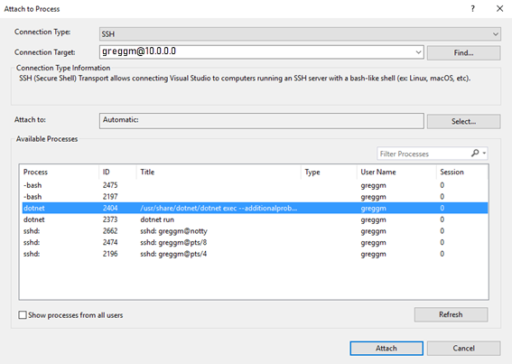
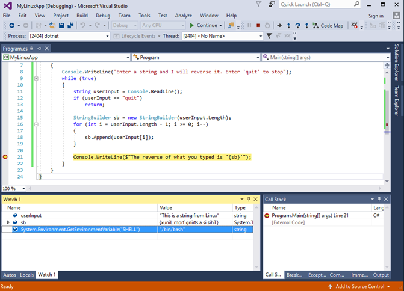

# Debug .NET Core on Linux using SSH by attaching to a process

 [!INCLUDE [Visual Studio](~/includes/applies-to-version/vs-not-mac.md)]

Starting in Visual Studio 2017, you can attach to .NET Core processes running on a local or remote Linux deployment over SSH. This article describes how to set up debugging and how to debug. For debugging scenarios using Docker containers, see [Attach to a process running on a Docker container](../debugger/attach-to-process-running-in-docker-container.md) and the [container tools](../containers/edit-and-refresh.md) articles instead. To debug Linux on WSL 2 from Visual Studio (no attach to process), see [Debug .NET Core Apps in WSL 2 with Visual Studio](../debugger/debug-dotnet-core-in-wsl-2.md).

## Prerequisites

- On the Visual Studio computer, you need to install either the **ASP.NET and web development** workload or the **.NET Core cross-platform development** workload.

- On the Linux server, you need to install SSH server, unzip and install with either curl or wget. For example, on Ubuntu you can do that by running:

  ``` cmd
  sudo apt-get install openssh-server unzip curl
  ```

  SFTP must be enabled as well as SSH. Most SSH distributions install and enable SFTP by default, but that is not always the case.

- On the Linux server, [install the .NET runtime on Linux](/dotnet/core/install/linux), and find the page matching your Linux distribution (such as Ubuntu). The .NET SDK is not required.

- For comprehensive ASP.NET Core instructions, see [Host ASP.NET Core on Linux with Nginx](/aspnet/core/host-and-deploy/linux-nginx) and [Host ASP.NET Core on Linux with Apache](/aspnet/core/host-and-deploy/linux-apache).

## Prepare your application for debugging

To prepare your application for debugging:

- Consider using a Debug configuration when you build the application. It is much harder to debug retail-compiled code (a Release configuration) than debug-compiled code. If you need to use a Release configuration, first disable Just My Code. To disable this setting, choose **Tools** > **Options** > **Debugging**, and then deselect **Enable Just My Code**.

- Make sure your project is configured to produce [portable PDBs](https://github.com/OmniSharp/omnisharp-vscode/wiki/Portable-PDBs) (which is the default setting), and make sure the PDBs are in the same location as the DLL. To configure this in Visual Studio, right-click the project, then choose **Properties** > **Build** > **Advanced** > **Debugging Information**.

## Build and deploy the application

You can use several methods to deploy the app prior to debugging. For example, you can:

- Copy sources to the target computer and build with ```dotnet build``` on the Linux machine.

- Build the app on Windows, and then transfer the build artifacts to the Linux machine. (The build artifacts consist of the application itself, the portable PDBs, any runtime libraries it might depend on, and the *.deps.json* file.)

When the app is deployed, start the application.

## Attach the debugger

When the application is running on the Linux machine, you are ready to attach the debugger.

1. In Visual Studio, choose **Debug** > **Attach to Process…**.

1. In the **Connection Type** list, select **SSH**.

1. Change the **Connection Target** to the IP address or host name of the target computer.

   If you haven't already provided credentials, you will be prompted to enter a password and/or private key file.

   There are no port requirements to configure, except the port that the SSH server is running on.

1. Find the process that you would like to debug.

   Your code runs either in a unique process name or a process named dotnet. To find the process that you're interested in, check the **Title** column, which shows the command line arguments for the process.

   In the following example, you see a list of processes from a remote Linux machine over an SSH transport displayed in the **Attach to Process** dialog box.

   

1. Choose **Attach**.

1. In the dialog that appears, select the type of code you would like to debug. Choose **Managed (.NET Core for Unix)**.

1. Use Visual Studio debugging features to debug the app.

   In the following example, you see the Visual Studio debugger stopped at a breakpoint in code running on a remote Linux machine.

   