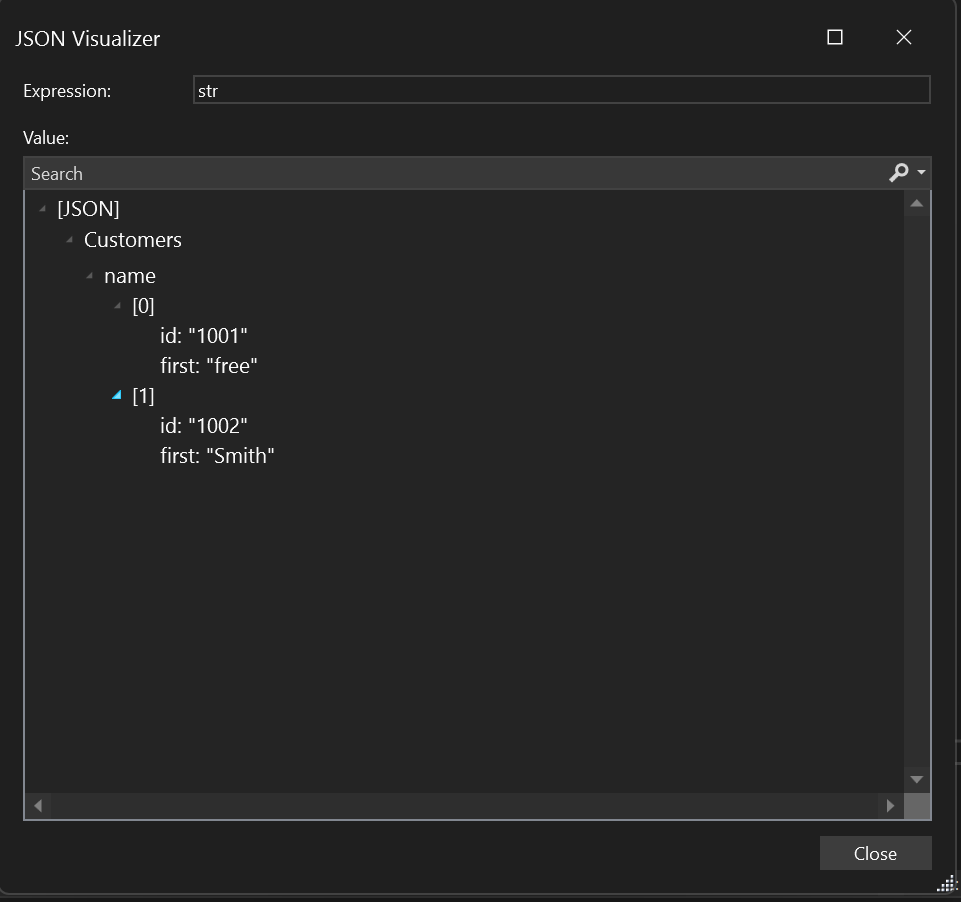

# String Visualizer dialog box

While you are debugging in Visual Studio, you can view strings with the built-in string visualizer. The string visualizer shows strings that are too long for a data tip or debugger window. It can also help you identify malformed strings.

The built-in string visualizers includes [Text](#text-string-data), [XML](#xml-string-data), [HTML](#html-string-data), and [JSON](#json-string-data) options. You can also open built-in visualizers for a few other types, such as [DataSet, DataTable, and DataView](../debugger/dataset-visualizer-dialog-box.md) objects, from the **Autos** or other debugger windows.

> [!NOTE]
> If you need to inspect XAML or WPF UI elements in a visualizer, see or [Inspect XAML properties while debugging](../xaml-tools/inspect-xaml-properties-while-debugging.md) or [How to use the WPF tree visualizer](../debugger/how-to-use-the-wpf-tree-visualizer.md).

To open the string visualizer, you must be paused during debugging. Hover over a variable that has a plain text, XML, HTML, or JSON string value, and select the magnifying glass icon .

## UIElement list

**Expression** field shows the variable or expression you're hovering over.

**Value** field shows the string value. A blank **Value** means that the chosen visualizer can't recognize the string. For example, the **XML Visualizer** shows a blank **Value** for a text string with no XML tags, or a JSON string. To view strings that the chosen visualizer can't recognize, choose the **Text Visualizer** instead. The **Text Visualizer** shows plain text.

### Text string data

The **Text Visualizer** shows plain text. If you need custom formatting for a C++ string, create a [Natvis visualization](../debugger/create-custom-views-of-native-objects.md).

### JSON string data

A well-formed JSON string appears similar to the following illustration in the JSON visualizer. Malformed JSON may display an error icon (or blank if unrecognized). To identify the JSON error, copy and paste the string into a JSON linting tool such as [JSLint](https://www.jslint.com/).

### XML string data

A well-formed XML string appears similar to the following illustration in the XML visualizer. Malformed XML may display without the XML tags, or blank if unrecognized.

### HTML string data

A well-formed HTML string appears as if rendered in a browser, as shown in the following illustration. Malformed HTML may display as plain text.

## See also

- [Create custom visualizers (C#, Visual Basic)](../debugger/create-custom-visualizers-of-data.md)
- [Data visualizations in Visual Studio for Mac](/visualstudio/mac/data-visualizations)