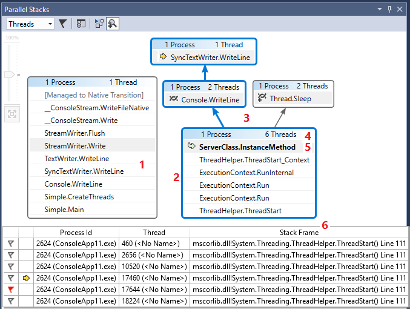
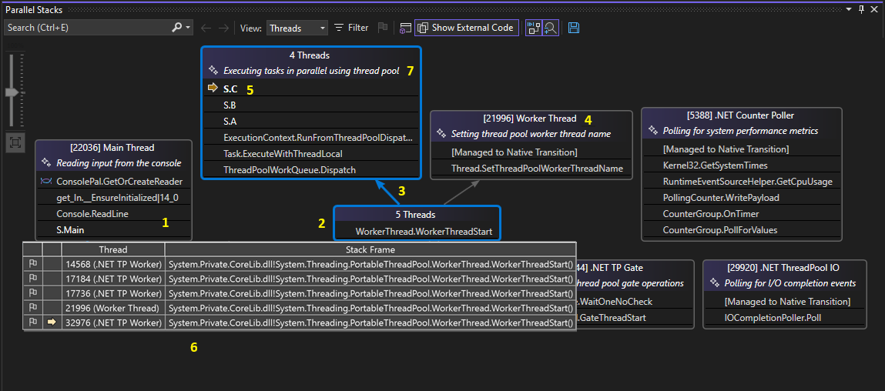
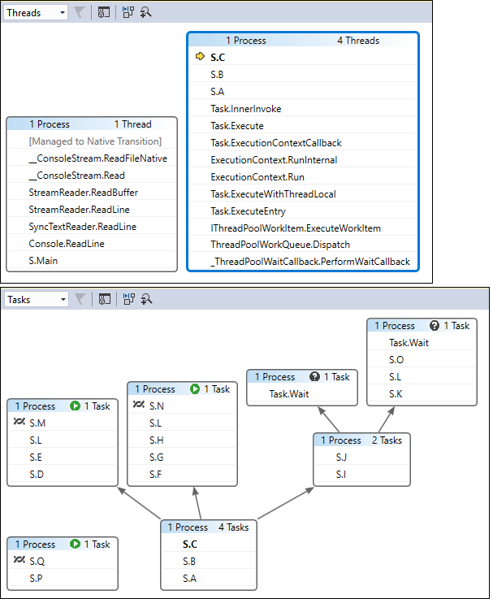
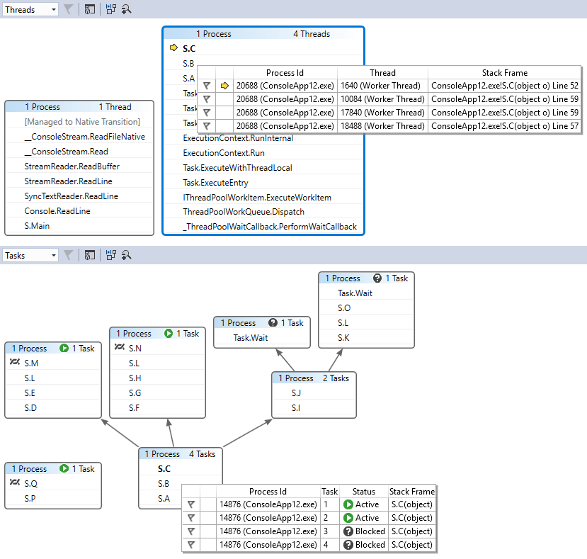
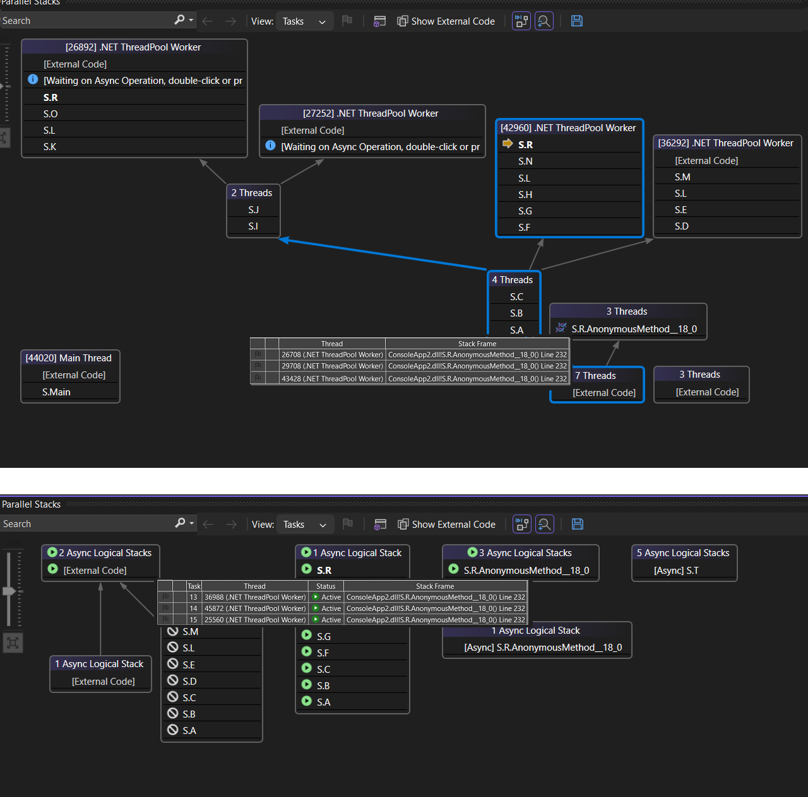

# View threads and tasks in the Parallel Stacks window (C#, Visual Basic, C++)

The **Parallel Stacks** window is useful for debugging multithreaded applications. It has several views:

- [Threads view](#threads-view) shows call stack information for all threads in the app. You can navigate between threads and stack frames on those threads.

- [Tasks view](#tasks-view) shows task-centered call stack information.
  - In managed code, **Tasks** view shows call stacks of <xref:System.Threading.Tasks.Task?displayProperty=fullName> objects.
  - In native code, **Tasks** view shows call stacks of [task groups](/cpp/parallel/concrt/task-parallelism-concurrency-runtime), [parallel algorithms](/cpp/parallel/concrt/parallel-algorithms), [asynchronous agents](/cpp/parallel/concrt/asynchronous-agents), and [lightweight tasks](/cpp/parallel/concrt/task-scheduler-concurrency-runtime).

- [Method View](#method-view) pivots the call stack on a selected method.

## Use the Parallel Stacks window

To open the **Parallel Stacks** window, you must be in a debugging session. Select **Debug** > **Windows** > **Parallel Stacks**.

### Toolbar controls

The **Parallel Stacks** window has the following toolbar controls:
::: moniker range="vs-2019"

|Icon|Control|Description|
|-|-|-|
||**Threads**/**Tasks** combo box|Switches the view between call stacks of threads and call stacks of tasks. For more information, see [Tasks view](#tasks-view) and [Threads view](#threads-view).|
||Show Only Flagged|Shows call stacks only for the threads that are flagged in other debugger windows, such as the **GPU Threads** window and the **Parallel Watch** window.|
||Toggle **Method View**|Switches between call stack views and **Method View**. For more information, see [Method View](#method-view).|
||Auto Scroll To Current Stack Frame|Autoscrolls the graph so that the current stack frame is in view. This feature is useful when you change the current stack frame from other windows, or when you hit a new breakpoint in large graphs.|
||Toggle Zoom Control|Shows or hides the zoom control at the left of the window.   Regardless of the visibility of the zoom control, you can also zoom by pressing **Ctrl** and turning the mouse wheel, or by pressing **Ctrl**+**Shift**+**+** to zoom in and **Ctrl**+**Shift**+**-** to zoom out. |

::: moniker-end
::: moniker range=">=vs-2022"

|Icon|Control|Description|
|-|-|-|
||**Threads**/**Tasks** combo box|Switches the view between call stacks of threads and call stacks of tasks. For more information, see [Tasks view](#tasks-view) and [Threads view](#threads-view).|
||**Filter** Control|Shows call stacks only for the specific set of threads that you're interested in.|
||Show Only Flagged|Shows call stacks only for the threads that are flagged in other debugger windows, such as the **GPU Threads** window and the **Parallel Watch** window.|
||Toggle **Method View**|Switches between call stack views and **Method View**. For more information, see [Method View](#method-view).|
||Auto Scroll To Current Stack Frame|Autoscrolls the graph so that the current stack frame is in view. This feature is useful when you change the current stack frame from other windows, or when you hit a new breakpoint in large graphs.|
||Toggle Zoom Control|Shows or hides the zoom control at the left of the window.   Regardless of the visibility of the zoom control, you can also zoom by pressing **Ctrl** and turning the mouse wheel, or by pressing **Ctrl**+**Shift**+**+** to zoom in and **Ctrl**+**Shift**+**-** to zoom out. |
||Search Control|With this feature you can easily search through stack frames and then use arrows to navigate between those results.|
||Save Control| Enables you to save/export the content from the parallel stack window as an image.|
||Show External Code Control| Using this feature, you can show/hide the stacks from the external code/libraries.|
::: moniker-end

### Stack Frame icons
The following icons provide information about the active and current stack frames in all views:

::: moniker range="vs-2019"
|Icon|Description|
|-|-|
||Indicates the current location (active stack frame) of the current thread.|
||Indicates the current location (active stack frame) of a non-current thread.|
||Indicates the current stack frame (the current debugger context). The method name is bold wherever it appears.|

::: moniker-end

::: moniker range=">=vs-2022"
Icon|Description|
|-|-|
||Indicates the current location (active stack frame) of the current thread.|
||Indicates the current location (active stack frame) of a non-current thread.|
||Indicates the current stack frame (the current debugger context). The method name is bold wherever it appears.|
||Indicates that the current stack frame has Critical status warning such as Deadlock.|
||Indicates the deadlocked node.|
||Indicates that the current stack frame has additional information such as Waiting on, Waiting on lock, owned by, etc. |
||Indicates that the current task is in blocked/waiting state, etc. |
||Indicates that the currently running task.|

::: moniker-end

### Context menu items
The following shortcut menu items are available when you right-click a method in **Threads** view or **Tasks** view. The last six items are the same as in the [Call Stack window](how-to-use-the-call-stack-window.md).

::: moniker range="vs-2019"

|Menu item|Description|
|-|-|
|**Flag**|Flags the selected item.|
|**Unflag**|Unflags the selected item.|
|**Freeze**|Freezes the selected item.|
|**Thaw**|Thaws the selected item.|
|**Switch To Frame**|Same as the corresponding menu command in the **Call Stack** window. However, in the **Parallel Stacks** window, one method may be in several frames. You can select the frame you want in the submenu for this item. If one of the stack frames is on the current thread, that frame is selected by default in the submenu.|
|**Go to Task** or **Go to Thread**|Switches to the **Task** or **Threads** view, and keeps the same stack frame highlighted.|
|**Go To Source Code**|Goes to the corresponding location in the source code window. |
|**Go To Disassembly**|Goes to the corresponding location in the **Disassembly** window.|
|**Show External Code**|Shows or hides external code.|
|**Hexadecimal Display**|Toggles between decimal and hexadecimal display.|
|**Show Threads in Source**|Flags the location of the thread in the source code window. |
|**Symbol Load Information**|Opens the **Symbol Load Information** dialog box.|
|**Symbol Settings**|Opens the **Symbol Settings** dialog box. |

::: moniker-end

::: moniker range=">=vs-2022"

|Menu item|Description|
|-|-|
|**Copy**|Copy the selected item.|
|**Select All Frames Below**|Selects all the frames under the selected stack.|
|**Flag**|Flags the selected item.|
|**Unflag**|Unflags the selected item.|
|**Freeze**|Freezes the selected item.|
|**Thaw**|Thaws the selected item.|
|**Switch To Frame**|Same as the corresponding menu command in the **Call Stack** window. However, in the **Parallel Stacks** window, one method may be in several frames. You can select the frame you want in the submenu for this item. If one of the stack frames is on the current thread, that frame is selected by default in the submenu.|
|**Go to Task** or **Go to Thread**|Switches to the **Task** or **Threads** view, and keeps the same stack frame highlighted.|
|**Go To Source Code**|Goes to the corresponding location in the source code window. |
|**Go To Disassembly**|Goes to the corresponding location in the **Disassembly** window.|
|**Show External Code**|Shows or hides external code.|
|**Hexadecimal Display**|Toggles between decimal and hexadecimal display.|
|**Show Threads in Source**|Flags the location of the thread in the source code window. |
|**Symbol Load Information**|Opens the **Symbol Load Information** dialog box.|
|**Symbol Settings**|Opens the **Symbol Settings** dialog box. |
::: moniker-end

## Threads view

In **Threads** view, the stack frame and call path of the current thread are highlighted in blue. The current location of the thread is shown by the yellow arrow.

To change the current stack frame, double-click a different method. This might also switch the current thread, depending on whether the method you select is part of the current thread or another thread.

When the **Threads** view graph is too large to fit into the window, a **Bird's Eye View** control appears in the window. You can move the frame in the control to navigate to different parts of the graph.

::: moniker range="vs-2019"

The following illustration shows one thread that goes from Main to a Managed to Native code transition. Six threads are in the current method. Two threads continue to Thread.Sleep, and two continue to Console.WriteLine and the current thread continues to SyncTextWriter.WriteLine.

 

The following table describes the main features of the **Threads** view:

|Callout|Element name|Description|
|-|-|-|
|1|Call stack segment or node|Contains a series of methods for one or more threads. If the frame has no arrow lines connected to it, the frame shows the entire call path for the thread(s).|
|2|Blue highlight|Indicates the call path of the current thread.|
|3|Arrow lines|Connect nodes to make up the entire call path for the thread(s).|
|4|Node header|Shows the number of processes and threads for the node.|
|5|Method|Represents one or more stack frames in the same method.|
|6|Tooltip on method|Appears when you hover over a method. In **Threads** view, the tooltip shows all threads, in a table similar to the **Threads** window. |

::: moniker-end

::: moniker range=">=vs-2022"

The following illustration shows the Main thread in a Managed to Native code transition. Five threads are in the current method. Four threads continue executing in the S.C method context, while one worker thread continues in a Managed to Native code transition, setting the name on a worker thread.

 

The following table describes the main features of the **Threads** view:

|Callout|Element name|Description|
|-|-|-|
|1|Call stack segment or node|Contains a series of methods for one or more threads. If the frame has no arrow lines connected to it, the frame shows the entire call path for the thread(s).|
|2|Blue highlight|Indicates the call path of the current thread.|
|3|Arrow lines|Connect nodes to make up the entire call path for the thread(s).|
|4|Node header|Shows the number of processes/threads, thread name, and thread ID for the node.|
|5|Method|Represents one or more stack frames in the same method.|
|6|Tooltip on method|Appears when you hover over a method. In **Threads** view, the tooltip shows all threads, in a table similar to the **Threads** window. |
|7|Thread description|AI-generated description of the thread. Starting in Visual Studio 2022 version 17.13 Preview 1, this description is present when [Copilot](../ide/visual-studio-github-copilot-install-and-states.md) is installed and activated. |
::: moniker-end

## Tasks view
If your app uses <xref:System.Threading.Tasks.Task?displayProperty=fullName> objects (managed code) or `task_handle` objects (native code) to express parallelism, you can use **Tasks** view. **Tasks** view shows call stacks of tasks instead of threads.

In **Tasks** view:

- Call stacks of threads that aren't running tasks aren't shown.
- Call stacks of threads that are running tasks are visually trimmed at the top and bottom, to show the most relevant frames for tasks.
- When several tasks are on one thread, the call stacks of those tasks are shown in separate nodes.

To see an entire call stack, switch back to **Threads** view by right-clicking in a stack frame and selecting **Go to Thread**.

The following illustration shows the **Threads** view at the top and the corresponding **Tasks** view at the bottom.

::: moniker range="vs-2019"

::: moniker-end

::: moniker range=">=vs-2022"

::: moniker-end

Hover over a method to show a tooltip with additional information. In **Tasks** view, the tooltip shows all the tasks in a table similar to the **Tasks** window.

The following image shows the tooltip for a method in the **Threads** view at the top and for the corresponding **Tasks** view at the bottom.

::: moniker range="vs-2019"

::: moniker-end

::: moniker range=">=vs-2022"

::: moniker-end
## Method View
From either **Threads** view or **Tasks** view, you can pivot the graph on the current method by selecting the **Toggle Method View** icon on the toolbar. **Method View** shows at a glance all methods on all threads that either call or are called by the current method. The following illustration shows how the same information looks in **Threads** view on the left and in **Method View** on the right.

::: moniker range="vs-2019"

::: moniker-end

::: moniker range=">=vs-2022"

::: moniker-end

If you switch to a new stack frame, you make that method the current method, and **Method View** shows all callers and callees for the new method. This may cause some threads to appear or disappear from the view, depending on whether that method appears on their call stacks. To return to the call stack view, select the **Method View** toolbar icon again.

## Debug threads and tasks with parallel stacks video tutorial
These video tutorials demonstrate how you can use the Threads and Tasks views of the Parallel Stacks window in Visual Studio 2022 to debug your multithreaded applications.

- [Debugging tasks with the Parallel Stacks window](/shows/visual-studio-toolbox/debugging-tasks-with-the-parallel-stacks-window)
- [Debugging threads with the Parallel Stacks window](/shows/visual-studio-toolbox/debugging-threads-with-the-parallel-stacks-window)

## Related content
- [Get started debugging a multithreaded application](../debugger/get-started-debugging-multithreaded-apps.md)
- [Walkthrough: Debug a parallel application](../debugger/walkthrough-debugging-a-parallel-application.md)
- [Switch to Another Thread While Debugging in Visual Studio](../debugger/how-to-switch-to-another-thread-while-debugging.md)
- [Debugging managed code](../debugger/debugging-managed-code.md)
- [Parallel programming](/dotnet/standard/parallel-programming/index)
- [Use the Tasks window](../debugger/using-the-tasks-window.md)
- [Task class](../extensibility/debugger/task-class-internal-members.md)
