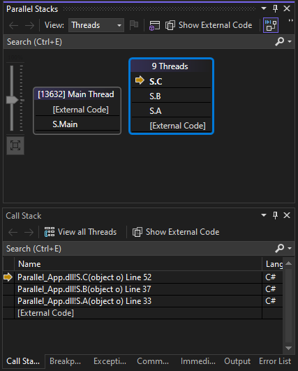
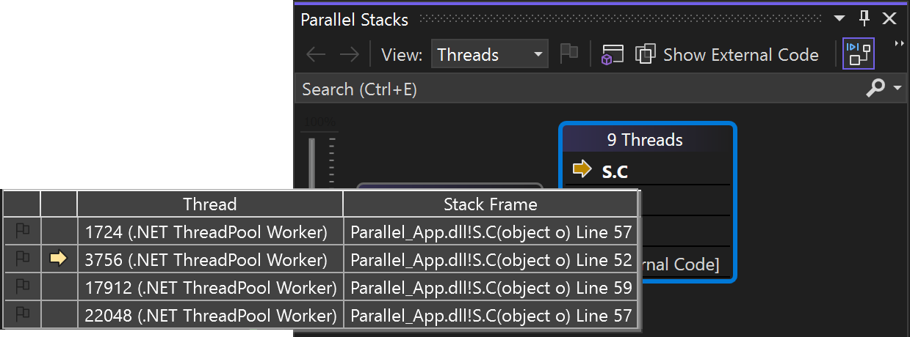
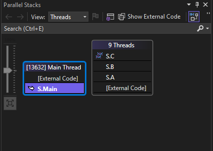
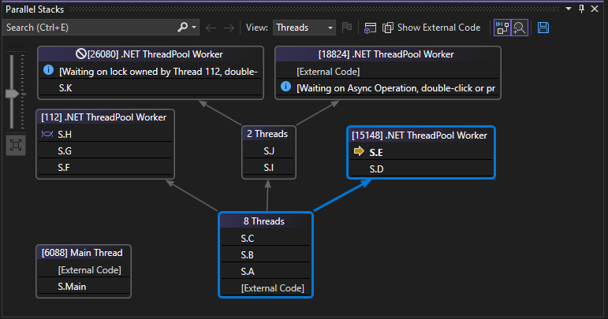
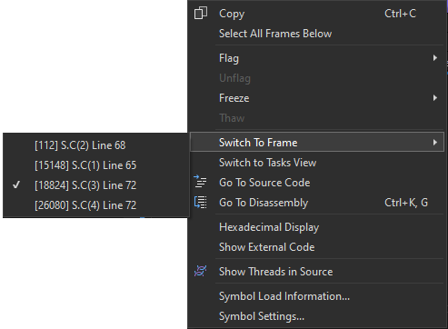
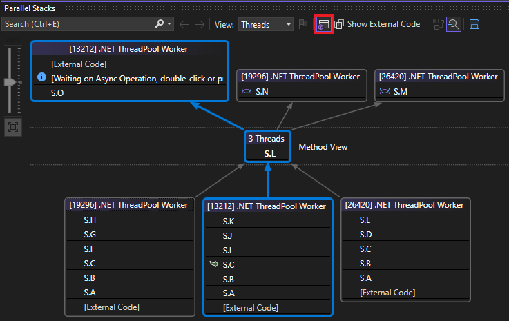
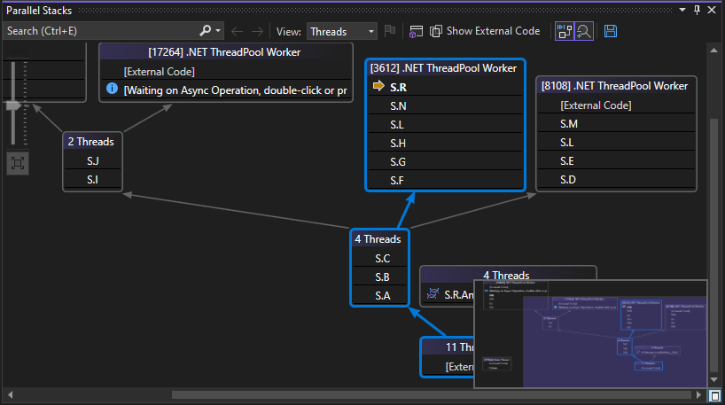
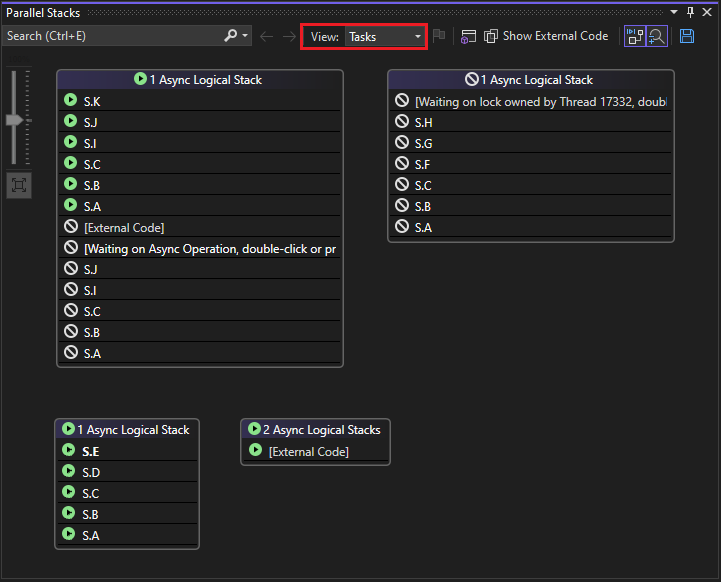
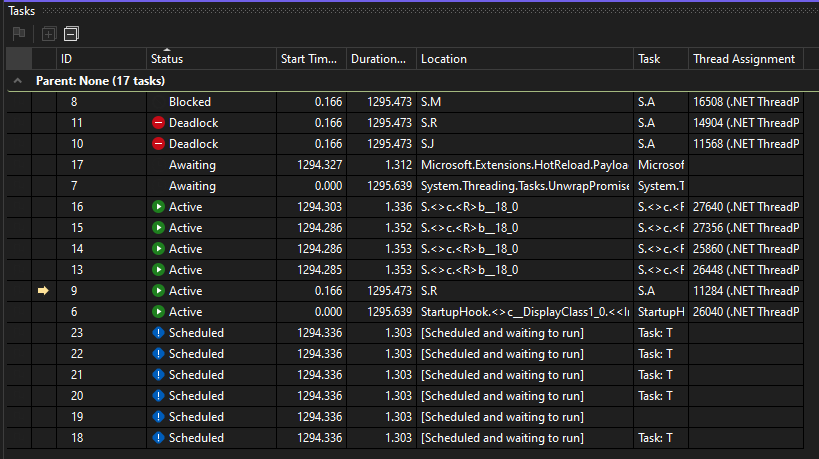
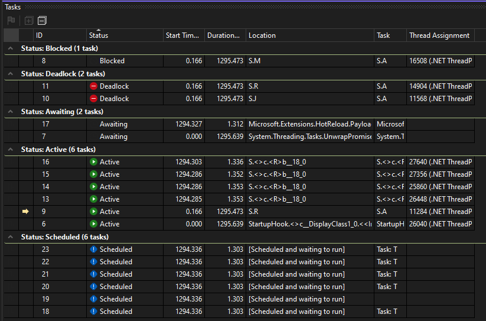

# Walkthrough: Debugging a Parallel Application in Visual Studio (C#, Visual Basic, C++)

This walkthrough shows how to use the **Parallel Tasks** and **Parallel Stacks** windows to debug a parallel application. These windows help you understand and verify the run-time behavior of code that uses the [Task Parallel Library (TPL)](/dotnet/standard/parallel-programming/task-parallel-library-tpl) or the [Concurrency Runtime](/cpp/parallel/concrt/concurrency-runtime). This walkthrough provides sample code that has built-in breakpoints. After the code breaks, the walkthrough shows how to use the **Parallel Tasks** and **Parallel Stacks** windows to examine it.

This walkthrough teaches these tasks:

- How to view the call stacks of all threads in one view.

- How to view the list of `System.Threading.Tasks.Task` instances that are created in your application.

- How to view the real call stacks of tasks instead of threads.

- How to navigate to code from the **Parallel Tasks** and **Parallel Stacks** windows.

- How the windows cope with scale through grouping, zooming, and other related features.

## Prerequisites

This walkthrough assumes that **Just My Code** is enabled (it's enabled by default in more recent versions of Visual Studio). On the **Tools** menu, select **Options**, expand the **Debugging** node, select **General**, and then select **Enable Just My Code (Managed only)**. If you don't set this feature, you can still use this walkthrough, but your results might differ from the illustrations.

### C# sample

If you use the C# sample, this walkthrough also assumes that External Code is hidden. To toggle whether external code is displayed, right-click the **Name** table header of the **Call Stack** window, and then select or clear **Show External Code**. If you don't set this feature, you can still use this walkthrough, but your results might differ from the illustrations.

### C++ sample

If you use the C++ sample, you can ignore references to External Code in this article. External Code only applies to the C# sample.

### Illustrations

The illustrations in this article are recorded on a quad core computer running the C# sample. Although you can use other configurations to complete this walkthrough, the illustrations might differ from what is displayed on your computer.

## Create the sample project

The sample code in this walkthrough is for an application that does nothing. The purpose of the exercise is to understand how to use the tool windows to debug a parallel application.

1. Open Visual Studio and create a new project.

   If the start window isn't open, choose **File** > **Start Window**.

   ::: moniker range=">=vs-2022"
   On the start window, choose **New project**.
   ::: moniker-end

   ::: moniker range="vs-2019"
   On the start window, choose **Create a new project**.
   ::: moniker-end

   On the **Create a new project** window, enter or type *console* in the search box. Next, choose **C#**, **C++**, or **Visual Basic** from the Language list, and then choose **Windows** from the Platform list.

   After you apply the language and platform filters, choose the **Console App** for .NET Core or C++, and then choose **Next**.

   > [!NOTE]
   > If you don't see the correct template, go to **Tools** > **Get Tools and Features...**, which opens the Visual Studio Installer. Choose the **.NET desktop development** or **Desktop development with C++** workload, then choose **Modify**.

   In the **Configure your new project** window, type a name or use the default name in the **Project name** box. Then, choose **Next** or **Create**, whichever option is available.

   For .NET Core, choose either the recommended target framework or .NET 8, and then choose **Create**.

   A new console project appears. After the project has been created, a source file appears.

1. Open the .cpp, .cs, or .vb code file in the project. Delete its contents to create an empty code file.

1. Paste the following code for your chosen language into the empty code file.

   ### [C#](#tab/csharp)
   :::code language="csharp" source="../snippets/csharp/VS_Snippets_Misc/debugger/cs/s.cs" id="Snippet1":::

   ### [VB](#tab/vb)
   :::code language="vb" source="../snippets/visualbasic/VS_Snippets_Misc/debugger/vb/module1.vb" id="Snippet1":::

   ### [C++](#tab/cpp)
   :::code language="cpp" source="../snippets/cpp/VS_Snippets_Misc/debugger/cpp/beta2_native.cpp" id="Snippet1":::

   ---

After you update the code file, save your changes and build the solution.

1. On the **File** menu, select **Save All**.

1. On the **Build** menu, select **Rebuild Solution**.

Notice there are four calls to `Debugger.Break` (`DebugBreak` in the C++ sample). Therefore, you don't have to insert breakpoints. Just running the application causes it to break in the debugger up to four times.

## Use the Parallel Stacks Window: Threads View

To begin, on the **Debug** menu, select **Start Debugging**. Wait until the first breakpoint is hit.

### View the call stack of a single thread

1. On the **Debug** menu, point to **Windows** and then select **Threads**. Dock the **Threads** window at the bottom of Visual Studio.

1. On the **Debug** menu, point to **Windows** and then select **Call Stack**. Dock the **Call Stack** window at the bottom Visual Studio.

1. Double-click a thread in the **Threads** window to make it current. Current threads have a yellow arrow. When you change the current thread, its call stack is displayed in the **Call Stack** window.

### Examine the Parallel Stacks window

On the **Debug** menu, point to **Windows** and then select **Parallel Stacks**. Make sure that **Threads** is selected in the box at the upper-left corner.

By using the **Parallel Stacks** window, you can view multiple call stacks at the same time in one view. The following illustration shows the **Parallel Stacks** window above the **Call Stack** window.

::: moniker range=">=vs-2022"

::: moniker-end

::: moniker range="vs-2019"

::: moniker-end

The call stack of the Main thread appears in one box and the call stacks for the other four threads are grouped in another box. Four threads are grouped together because their stack frames share the same method contexts; that is, they are in the same methods: `A`, `B`, and `C`. To view the thread IDs and names of the threads that share the same box, hover over the box with the header (**[#] Threads**). The current thread is displayed in bold.

::: moniker range=">=vs-2022"

::: moniker-end

::: moniker range="vs-2019"

::: moniker-end

The yellow arrow indicates the active stack frame of the current thread.

You can set how much detail to show for the stack frames (**Module Names**, **Parameter Types**, **Parameter Names**, **Parameter Values**, **Line Numbers** and **Byte Offsets**) by right-clicking in the **Call Stack** window.

A blue highlight around a box indicates that the current thread is part of that box. The current thread is also indicated by the bold stack frame in the tooltip. If you double-click the Main thread in the Threads window, you can observe that the highlight arrow in the **Parallel Stacks** window moves accordingly.

::: moniker range=">=vs-2022"

::: moniker-end

::: moniker range="vs-2019"

::: moniker-end

### Resume execution until the second breakpoint

To resume execution until the second breakpoint is hit, on the **Debug** menu, select **Continue**. The following illustration shows the thread tree at the second breakpoint.

::: moniker range=">=vs-2022"

::: moniker-end

::: moniker range="vs-2019"

::: moniker-end

At the first breakpoint, four threads all went from S.A to S.B to S.C methods. That information is still visible in the **Parallel Stacks** window, but the four threads have progressed further. One of them continued to S.D and then S.E. Another continued to S.F, S.G, and S.H. Two others continued to S.I and S.J, and from there one of them went to S.K and the other continued to nonuser External Code.

::: moniker range=">=vs-2022"
You can hover over stack frames to see thread IDs plus other frame details. The blue highlight indicates the current thread and the yellow arrow indicates the active stack frame of the current thread.
::: moniker-end

::: moniker range="vs-2019"
You can hover over the box header, for example, **1 Thread** or **2 Threads**, to see the thread IDs of the threads. You can hover over stack frames to see thread IDs plus other frame details. The blue highlight indicates the current thread and the yellow arrow indicates the active stack frame of the current thread.
::: moniker-end

The cloth-threads icon (interweaved lines) indicates the active stack frames of the noncurrent threads. In the **Call Stack** window, double-click S.B to switch frames. The **Parallel Stacks** window indicates the current stack frame of the current thread by using a curved arrow icon.

> [!NOTE]
> For a description of all the icons in the Parallel Stacks window, see [Using the Parallel Stacks window](../debugger/using-the-parallel-stacks-window.md#use-the-parallel-stacks-window).

In the **Threads** window, switch between threads and observe that the view in the **Parallel Stacks** window is updated.

You can switch to another thread, or to another frame of another thread, by using the shortcut menu in the **Parallel Stacks** window. For example, right-click S.J, point to **Switch To Frame**, and then select a command.

::: moniker range=">=vs-2022"

::: moniker-end

::: moniker range="vs-2019"

::: moniker-end

Right-click S.C and point to **Switch To Frame**. One of the commands has a check mark that indicates the stack frame of the current thread. You can switch to that frame of the same thread (only the curved arrow moves) or you can switch to the other thread (the blue highlight also moves). The following illustration shows the submenu.

::: moniker range=">=vs-2022"

::: moniker-end

::: moniker range="vs-2019"

::: moniker-end

::: moniker range="vs-2019"
When a method context is associated with just one stack frame, the box header displays **1 Thread** and you can switch to it by double-clicking. If you double-click a method context that has more than 1 frame associated with it, then the menu automatically pops up. As you hover over the method contexts, notice the black triangle at the right. Clicking that triangle also displays the shortcut menu.
::: moniker-end

For large applications that have many threads, you might want to focus on just a subset of threads. The **Parallel Stacks** window can display call stacks only for flagged threads. To flag threads, use the shortcut menu or the first cell of a thread.

On the toolbar, select the **Show Only Flagged** button next to the list box.

::: moniker range=">=vs-2022"

::: moniker-end

::: moniker range="vs-2019"

::: moniker-end

Now, only flagged threads show up in the **Parallel Stacks** window.

### Resume execution until the third breakpoint

1. To resume execution until the third breakpoint is hit, on the **Debug** menu, select **Continue**.

   When multiple threads are in the same method but the method wasn't at the beginning of the call stack, the method appears in different boxes. An example at the current breakpoint is S.L, which has three threads in it and appears in three boxes. Double-click S.L.

   ::: moniker range=">=vs-2022"
   
   ::: moniker-end

   ::: moniker range="vs-2019"
   
   ::: moniker-end

   Notice that S.L is bold in the other two boxes so that you can see where else it appears. If you want to see which frames call into S.L and which frames it calls, select the **Toggle Method View** button on the toolbar. The following illustration shows the method view of The **Parallel Stacks** window.

   ::: moniker range=">=vs-2022"
   
   ::: moniker-end

   ::: moniker range="vs-2019"
   
   ::: moniker-end

   Notice how the diagram pivoted on the selected method and positioned it in its own box in the middle of the view. The callees and callers appear on the top and bottom, respectively. Select the **Toggle Method View** button again to leave this mode.

   The shortcut menu of the **Parallel Stacks** window also has the following other items.

   - **Hexadecimal Display** toggles the numbers in the tooltips between decimal and hexadecimal.

   - **Symbol Settings** open the respective dialog boxes.

   - **Show Threads in Source** toggles the display of thread markers in your source code, which shows the location of threads in your source code.

   - **Show External Code** displays all the frames even if they aren't in user code. Try it to see the diagram expand to accommodate the other frames (which might be dimmed because you don't have symbols for them).

1. In the **Parallel Stacks** window, make sure that the **Auto Scroll to Current Stack Frame** button on the toolbar is on.

   When you have large diagrams and you step to the next breakpoint, you might want the view to auto scroll to the active stack frame of the current thread; that is, the thread that hit the breakpoint first.

1. Before you continue, in the **Parallel Stacks** window, scroll all the way to the left and all the way down.

### Resume execution until the fourth breakpoint

1. To resume execution until the fourth breakpoint is hit, on the **Debug** menu, select **Continue**.

   Notice how the view autoscrolled into place. Switch threads in the **Threads** window or switch stack frames in the **Call Stack** window and notice how the view always autoscrolls to the correct frame. Turn off **Auto Scroll to Current Tool Frame** option and view the difference.

   The **Bird's Eye View** also helps with large diagrams in the **Parallel Stacks** window. By default, the **Bird's Eye View** is on. But you can toggle it by clicking the button between the scroll bars on the lower-right corner of the window, as shown in the following illustration.

   ::: moniker range=">=vs-2022"
   
   ::: moniker-end

   ::: moniker range="vs-2019"
   
   ::: moniker-end

   In bird's eye view, you can move the rectangle to quickly pan around the diagram.

   Another way to move the diagram in any direction is to select a blank area of the diagram and drag it where you want it.

   To zoom in and out of the diagram, press and hold CTRL while you move the mouse wheel. Alternatively, select the Zoom button on the toolbar and then use the Zoom tool.

   ::: moniker range="vs-2019"
   You can also view the stacks in a top-down direction instead of bottom-up, by clicking the **Tools** menu, clicking **Options**, and then select or clear the option under the **Debugging** node.
   ::: moniker-end

1. Before you continue, on the **Debug** menu, select **Stop Debugging** to end execution.

## Use the Parallel Tasks Window and the Tasks View of the Parallel Stacks window

We recommended that you complete the earlier procedures before you continue.

Restart the application until the first breakpoint is hit:

1. On the **Debug** menu, select **Start Debugging** and wait for the first breakpoint to be hit.

1. On the **Debug** menu, point to **Windows** and then select **Threads**. Dock the **Threads** window at the bottom of Visual Studio.

1. On the **Debug** menu, point to **Windows** and select **Call Stack**. Dock the **Call Stack** window at the bottom of Visual Studio.

1. Double-click a thread in the **Threads** window to make it current. Current threads have the yellow arrow. When you change the current thread, the other windows are updated. Next, we examine tasks.

1. On the **Debug** menu, point to **Windows**, and then select **Tasks**. The following illustration shows the **Tasks** window.

   ::: moniker range=">=vs-2022"
   
   ::: moniker-end

   ::: moniker range="vs-2019"
   
   ::: moniker-end

   For each running Task, you can read its ID, which is returned by the same-named property, the ID and name of the thread that runs it, its location (hovering over that displays a tooltip that has the whole call stack). Also, under the **Task** column, you can see the method that was passed into the task; in other words, the starting point.

   You can sort any column. Notice the sort glyph that indicates the sort column and direction. You can also reorder the columns by dragging them left or right.

   The yellow arrow indicates the current task. You can switch tasks by double-clicking a task or by using the shortcut menu. When you switch tasks, the underlying thread becomes current and the other windows are updated.

   ::: moniker range=">=vs-2022"
   When you manually switch from one task to another, the arrow outline indicates the current debugger context for a noncurrent task.
   ::: moniker-end

   ::: moniker range="vs-2019"
   When you manually switch from one task to another, the yellow arrow moves, but a white arrow still shows the task that caused the debugger to break.
   ::: moniker-end

### Resume execution until the second breakpoint

To resume execution until the second breakpoint is hit, on the **Debug** menu, select **Continue**.

::: moniker range=">=vs-2022"
Previously, the **Status** column showed all tasks as Active, but now two of the tasks are Blocked. Tasks can be blocked for [many different reasons](/dotnet/standard/parallel-programming/potential-pitfalls-in-data-and-task-parallelism). In the **Status** column, hover over a waiting task to learn why it's blocked. For example, in the following illustration, task 11 is waiting on task 12.

::: moniker-end

::: moniker range="vs-2019"

Previously, the **Status** column showed all tasks as Active, but now two of the tasks are Blocked. Tasks can be blocked for [many different reasons](/dotnet/standard/parallel-programming/potential-pitfalls-in-data-and-task-parallelism). In the **Status** column, hover over a waiting task to learn why it's blocked. For example, in the following illustration, task 4 is waiting on task 5.

Task 4, in turn, is waiting on a monitor owned by the thread assigned to task 2. (Right-click the header row and choose **Columns** > **Thread Assignment** to view the thread assignment value for task 2).

::: moniker-end

You can flag a task by clicking the flag in the first column of the **Tasks** window.

You can use flagging to track tasks between different breakpoints in the same debugging session or to filter for tasks whose call stacks are shown in the **Parallel Stacks** window.

When you used the **Parallel Stacks** window earlier, you viewed the application threads. View the **Parallel Stacks** window again, but this time view the application tasks. Do this by selecting **Tasks** in the box on the upper left. The following illustration shows the Tasks View.

::: moniker range=">=vs-2022"

::: moniker-end

::: moniker range="vs-2019"

::: moniker-end

Threads that aren't currently executing tasks aren't shown in the Tasks View of the **Parallel Stacks** window. Also, for threads that execute tasks, some of the stack frames that aren't relevant to tasks are filtered from the top and bottom of the stack.

View the **Tasks** window again. Right-click any column header to see a shortcut menu for the column.

You can use the shortcut menu to add or remove columns. For example, the AppDomain column isn't selected; therefore, it isn't displayed in the list. Select **Parent**. The **Parent** column appears without values for any of the four tasks.

### Resume execution until the third breakpoint

To resume execution until the third breakpoint is hit, on the **Debug** menu, select **Continue**.

::: moniker range=">=vs-2022"

In this example run, notice that task 11 and task 12 are running on the same thread (show the **Thread Assignment** column if it's hidden). This information isn't displayed in the **Threads** window; seeing it here's another benefit of the **Tasks** window. To confirm this, view the **Parallel Stacks** window. Make sure that you're viewing **Tasks**. You can locate tasks 11 and 12 by scanning the tooltips on the **Parallel Stacks** window.

::: moniker-end
::: moniker range="vs-2019"

A new task, task 5, is now running and task 4 is now waiting. You can see why by hovering over the waiting task in the **Status** window. In the **Parent** column, notice that task 4 is the parent of task 5.

To better visualize the parent-child relationship, right-click the column header row and then select **Parent Child View**. You should see the following illustration.

Notice that task 4 and task 5 are running on the same thread (show the **Thread Assignment** column if it's hidden). This information isn't displayed in the **Threads** window; seeing it here's another benefit of the **Tasks** window. To confirm this, view the **Parallel Stacks** window. Make sure that you're viewing **Tasks**. Locate tasks 4 and 5 by double-clicking them in the **Tasks** window. When you do, the blue highlight in the **Parallel Stacks** window is updated. You can also locate tasks 4 and 5 by scanning the tooltips on the **Parallel Stacks** window.

In the **Parallel Stacks** window, right-click S.P, and then select **Go To Thread**. The window switches to Threads View and the corresponding frame is in view. You can see both tasks on the same thread.

This is another benefit of the Tasks View in the **Parallel Stacks** window, compared to the **Threads** window.
::: moniker-end

### Resume execution until the fourth breakpoint

To resume execution until the third breakpoint is hit, on the **Debug** menu, select **Continue**. Select the **ID** column header to sort by ID. You should see the following illustration.

::: moniker range=">=vs-2022"

Task 10 and task 11 are now waiting on each other and are blocked. There are also several new tasks that are now scheduled. Scheduled tasks are tasks that have been started in code but have not run yet. Therefore, their **Location** and **Thread Assignment** columns show default messages or are empty.
::: moniker-end

::: moniker range="vs-2019"

Because task 5 has completed, it's no longer displayed. If that isn't the case on your computer and the deadlock isn't shown, step one time by pressing **F11**.

Task 3 and task 4 are now waiting on each other and are blocked. There are also 5 new tasks that are children of task 2 and are now scheduled. Scheduled tasks are tasks that have been started in code but have not run yet. Therefore, their **Location** and **Thread Assignment** columns are empty.

View the **Parallel Stacks** window again. The header of each box has a tooltip that shows the thread IDs and names. Switch to Tasks View in the **Parallel Stacks** window. Hover over a header to see the task ID and name, and the status of the task, as shown in the following illustration.

::: moniker-end

You can group the tasks by column. In the **Tasks** window, right-click the **Status** column header and then select **Group by Status**. The following illustration shows the **Tasks** window grouped by status.

::: moniker range=">=vs-2022"

::: moniker-end

::: moniker range="vs-2019"

::: moniker-end

You can also group by any other column. By grouping tasks, you can focus on a subset of tasks. Each collapsible group has a count of the items that are grouped together.

The last feature of the **Tasks** window to examine is the shortcut menu that is displayed when you right-click a task.

The shortcut menu displays different commands, depending on the status of the task. The commands might include **Copy**, **Select All**, **Hexadecimal Display**, **Switch to Task**, **Freeze Assigned Thread**, **Freeze All Threads But This**, and **Thaw Assigned Thread**, and **Flag**.

You can freeze the underlying thread of a task, or tasks, or you can freeze all threads except the assigned one. A frozen thread is represented in the **Tasks** window as it is in the **Threads** window, by a blue *pause* icon.

## Summary

This walkthrough demonstrated the **Parallel Tasks** and **Parallel Stacks** debugger windows. Use these windows on real projects that use multithreaded code. You can examine parallel code written in C++, C#, or Visual Basic.

## Related content

- [Debugging Multithreaded Applications](../debugger/walkthrough-debugging-a-parallel-application.md)
- [First look at the debugger](../debugger/debugger-feature-tour.md)
- [Debugging Managed Code](../debugger/debugging-managed-code.md)
- [Parallel Programming](/dotnet/standard/parallel-programming/index)
- [Concurrency Runtime](/cpp/parallel/concrt/concurrency-runtime)
- [Using the Parallel Stacks Window](../debugger/using-the-parallel-stacks-window.md)
- [Using the Tasks Window](../debugger/using-the-tasks-window.md)
