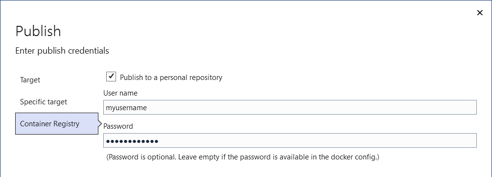
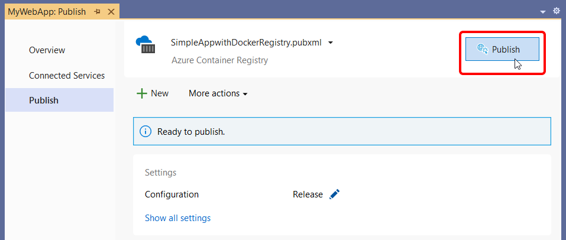
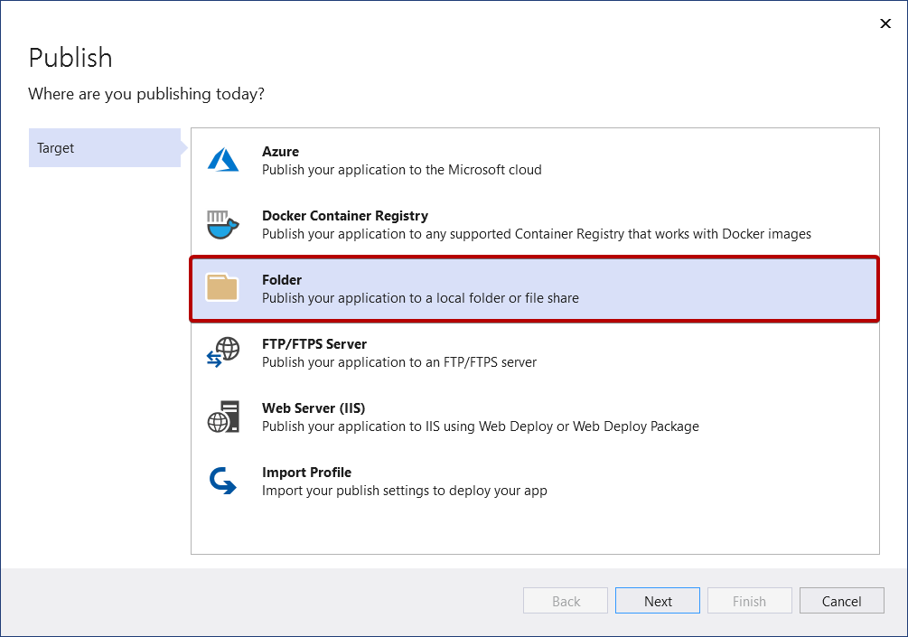
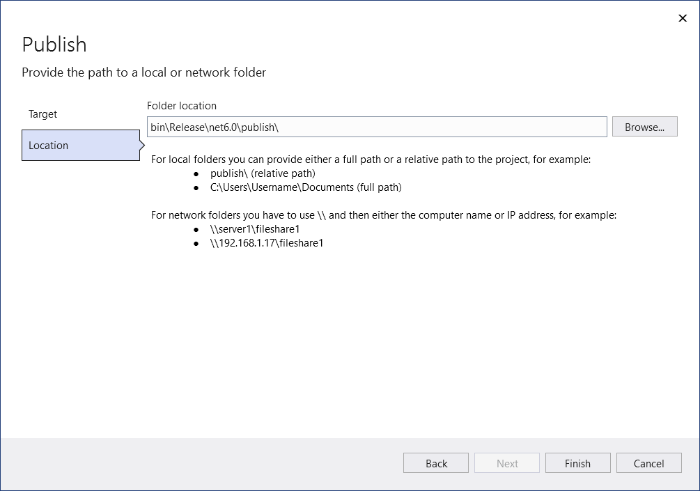
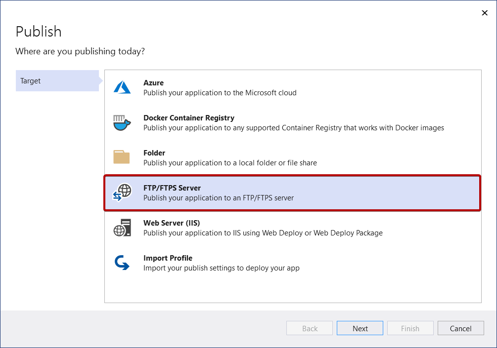
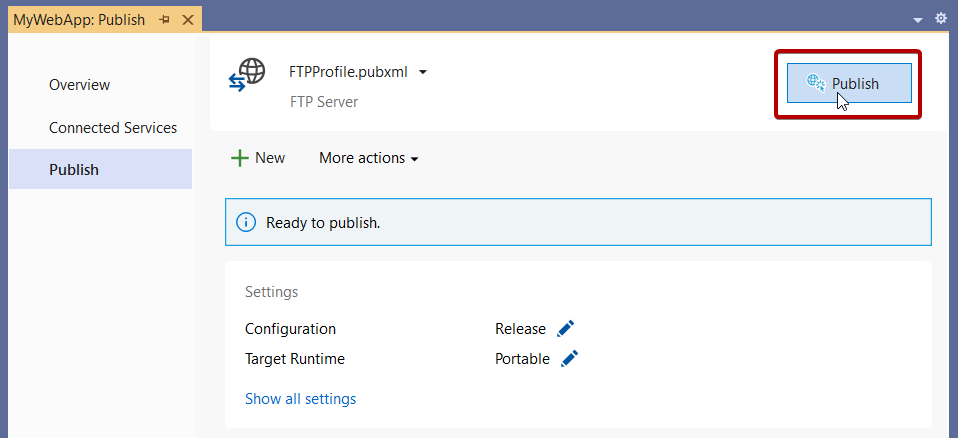
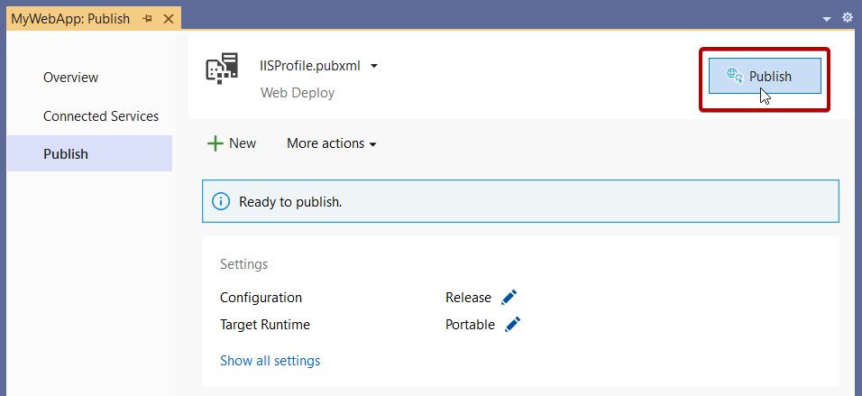

# Quickstart: Publish an ASP.NET web app

In this article, you'll learn how to publish your first ASP.NET web app to various locations including a local web server such as IIS and a remote cloud environment such as Azure App Service.

This article supports ASP.NET and ASP.NET Core.

## Prerequisites

You need [Visual Studio](https://www.visualstudio.com/downloads) installed with the ASP.NET and web development workload.

If you've already installed Visual Studio:

* Install the latest updates in Visual Studio by selecting **Help** > **Check for Updates**.
* Add the workload by selecting **Tools** > **Get Tools and Features**.

## Get started

In Solution Explorer, right-click your project and choose **Publish**.

If you're publishing this web app for the first time, next you see the Publish wizard.

> [!NOTE]
> Visual Studio filters the list of destinations depending on the type of web app.

## [Azure](#tab/azure)
## Publish your web app to Azure

For detailed steps on publishing your web app, see [Quickstart: Deploy an ASP.NET web app](/azure/app-service/quickstart-dotnetcore?tabs=netcore31&pivots=development-environment-vs#publish-your-web-app).

## [Docker](#tab/docker)
## Publish your web app to Docker Container Registry

You can publish your web app as a Docker container to any compatible Docker Container Registry.

Click **Next** and choose from the available options, such as Azure Container Registry or Docker Hub.

### Azure Container Registry

Next, for Azure Container Registry, either select an existing instance or create a new one.

### Docker Hub

Next, for Docker Hub, provide the publish credentials.

### Other Docker Container Registry

Next, for other Docker container registries, provide the URI and publish credentials.

### Finish the Publish wizard

Next, you see the summary page for the new [publish profile](./publish-overview.md) that you just created using the Publish wizard. Click **Publish** and Visual Studio deploys your web app to the specified Docker Container Registry.

> [!NOTE]
> The above screenshot is showing a publish profile targeting Azure Docker Registry, but the same Publish button is available for all three Docker Container Registry options.

## [Folder](#tab/folder)
## Publish your web app to a folder

You can publish your web app to both local and network folders.

First, provide the path and click **Finish** to complete the Publish wizard.

Next, you see the summary page for the new [publish profile](./publish-overview.md) that you just created using the Publish wizard. Click **Publish** and Visual Studio deploys your web app to the provided path.

You can come back to this summary page after you close it. Next time you right-click and choose **Publish**, Visual Studio opens this summary page. (To get back to the Publish wizard just click **New** in the summary page.)

## [FTP/FTPS](#tab/ftp-ftps)
## Publish your web app to an FTP/FTPS server

You can publish your web app using FTP or FTPS.

Provide the necessary connection details and choose **Finish**.

Next, you see the summary page for the new [publish profile](./publish-overview.md) that you just created using the Publish wizard. Click **Publish** and Visual Studio deploys your web app to the provided FTP or FTPS Server.

You can come back to this summary page after you close it. The next time you right-click and publish, Visual Studio opens this summary page. (To get back to the Publish wizard just click **New** in the summary page.)

## [Web Server](#tab/web-server)
## Publish your web app to Web Server (IIS)

You can publish your web app to IIS.

Pick the desired deployment mode (if you're unsure, use the default).

### Web Deploy

Provide the necessary connection details and choose **Finish**.

### Web Deploy Package

Click **Browse...** to open a Select Package Location dialog box and enter the path to where you want the package to be created, including the *.zip* file name.

### Finish the Publish wizard

Next, you see the summary page for the new [publish profile](./publish-overview.md) that you just created using the Publish wizard. Click **Publish** and Visual Studio deploys your web app to the specified IIS server.

## [Import profile](#tab/import-profile)
## Import Profile

You can import publish settings [from IIS](./tutorial-import-publish-settings-iis.md) and [Azure App Service](./tutorial-import-publish-settings-azure.md#create-the-publish-settings-file-in-azure-app-service)

---