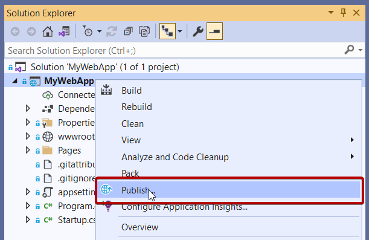
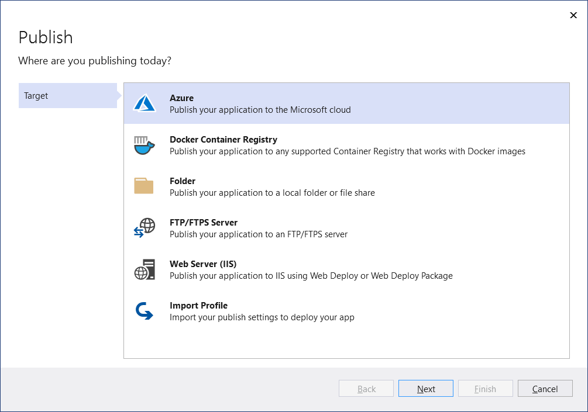
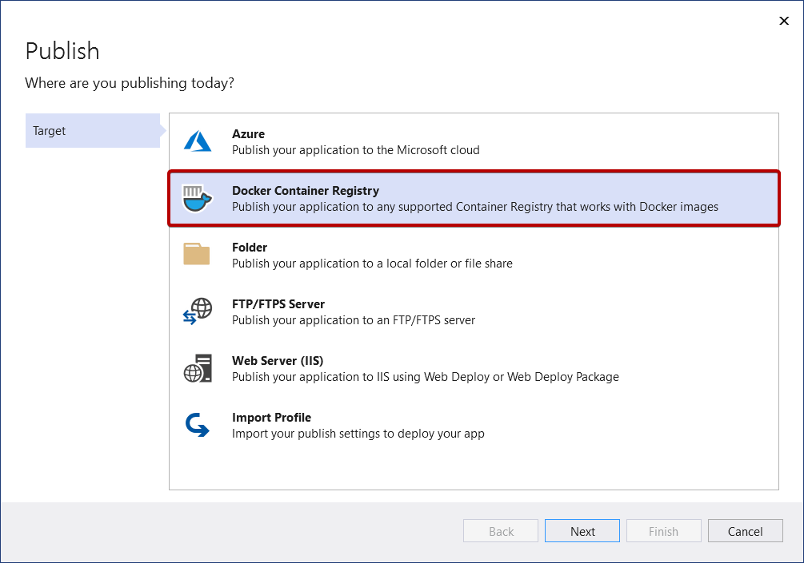
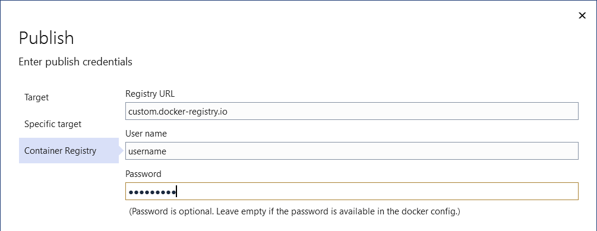
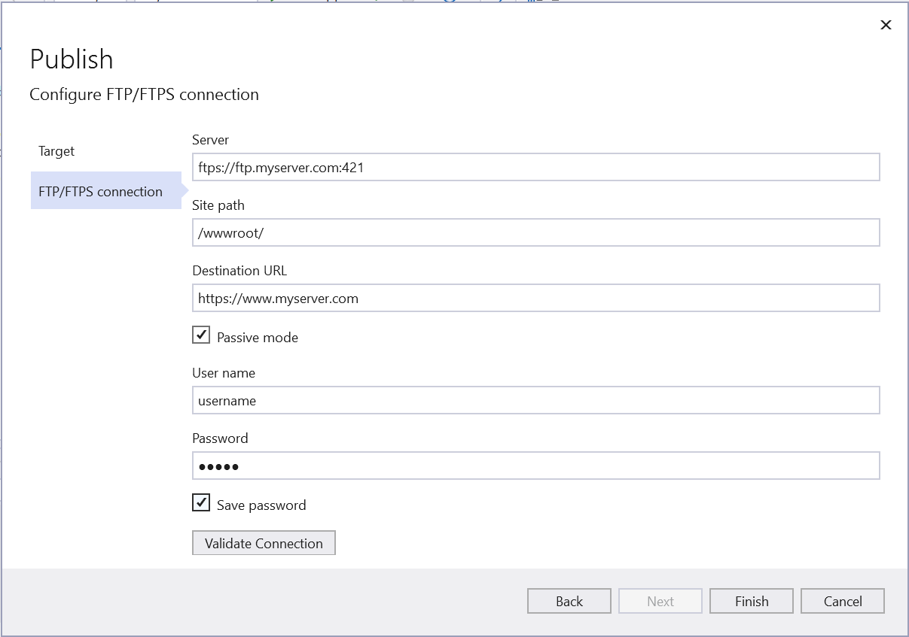
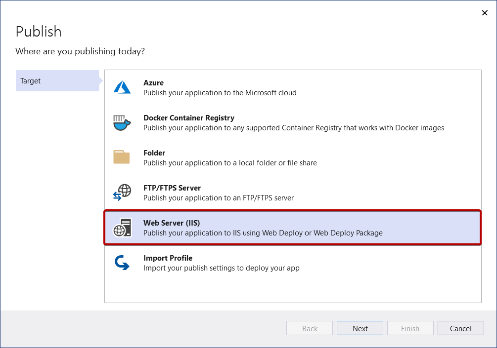
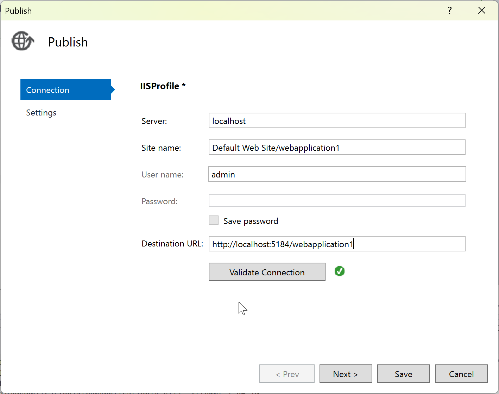

# Quickstart: Publish an ASP.NET web app

In this article, you'll learn how to publish your first ASP.NET web app to various locations including a local web server such as IIS and a remote cloud environment such as Azure App Service.

This article supports ASP.NET and ASP.NET Core.

> [!NOTE]
> This article covers manual deployment, which is great for quickly getting something up and running, but for larger projects and production scenarios, you might want to set up a deployment pipeline. You can use [GitHub Actions](../azure/azure-deployment-using-github-actions.md) or [Azure DevOps Pipelines](/azure/devops/pipelines/get-started/what-is-azure-pipelines) to set up automatic deployments with continuous integration for such scenarios.

## Prerequisites

You need [Visual Studio](https://www.visualstudio.com/downloads) installed with the ASP.NET and web development workload.

If you've already installed Visual Studio:

* Install the latest updates in Visual Studio by selecting **Help** > **Check for Updates**.
* Add the workload by selecting **Tools** > **Get Tools and Features**.

## Get started

In Solution Explorer, right-click your project and choose **Publish**.

If you're publishing this web app for the first time, next you see the Publish wizard.

> [!NOTE]
> Visual Studio filters the list of destinations depending on the type of web app.

## [Azure](#tab/azure)
## Publish your web app to Azure

For detailed steps on publishing your web app, see [Quickstart: Deploy an ASP.NET web app](/azure/app-service/quickstart-dotnetcore?tabs=netcore31&pivots=development-environment-vs#publish-your-web-app).

## [Docker](#tab/docker)
## Publish your web app to Docker Container Registry

You can publish your web app as a Docker container to any compatible Docker Container Registry.

Click **Next** and choose from the available options, such as Azure Container Registry or Docker Hub.

### Azure Container Registry

Next, for Azure Container Registry, either select an existing instance or create a new one.

### Docker Hub

Next, for Docker Hub, provide the publish credentials.

### Other Docker Container Registry

Next, for other Docker container registries, provide the URI and publish credentials.

### Finish the Publish wizard

Next, you see the summary page for the new [publish profile](./publish-overview.md) that you just created using the Publish wizard. Click **Publish** and Visual Studio deploys your web app to the specified Docker Container Registry.

> [!NOTE]
> The above screenshot is showing a publish profile targeting Azure Docker Registry, but the same Publish button is available for all three Docker Container Registry options.

## [Folder](#tab/folder)
## Publish your web app to a folder

You can publish your web app to both local and network folders.

First, provide the path and click **Finish** to complete the Publish wizard.

Next, you see the summary page for the new [publish profile](./publish-overview.md) that you just created using the Publish wizard. Click **Publish** and Visual Studio deploys your web app to the provided path.

You can come back to this summary page after you close it. Next time you right-click and choose **Publish**, Visual Studio opens this summary page. (To get back to the Publish wizard just click **New** in the summary page.)

## [FTP/FTPS](#tab/ftp-ftps)
## Publish your web app to an FTP/FTPS server

You can publish your web app using FTP or FTPS.

Provide the necessary connection details and choose **Finish**.

Next, you see the summary page for the new [publish profile](./publish-overview.md) that you just created using the Publish wizard. Click **Publish** and Visual Studio deploys your web app to the provided FTP or FTPS Server.

You can come back to this summary page after you close it. The next time you right-click and publish, Visual Studio opens this summary page. (To get back to the Publish wizard just click **New** in the summary page.)

## [Web Server](#tab/web-server)
## Publish your web app to Web Server (IIS)

You can publish your web app to IIS if IIS is configured. By default, IIS Express is installed, but you should install the IIS Management tools if you're deploying to IIS from Visual Studio. Note that you don't need to run Visual Studio as Administrator to deploy to IIS Express, only to full IIS.

### Configure the web server

On the remote web server, install the [Web Management Service](/iis/manage/remote-administration/remote-administration-for-iis-manager). Be sure to follow the instructions there to enable remote connections, and make sure the service is started, set up your credentials to remotely administer the web server, and verify them before attempting to deploy. Web Management Service is not required for a local IIS deployment. 

On the web server, install **IIS 6 Metabase Compatibility**. In Windows Settings, under **Programs and Features**, choose **Turn Windows features on or off**. Then under **Internet Information Services** > **Web Management Tools**, install **IIS 6 Management Compatibility**. Make sure that **IIS Metabase** and **IIS 6 configuration compatibility** are selected.

To configure IIS for ASP.NET Core applications, install the [.NET Core Hosting Bundle installer (direct download)](https://dotnet.microsoft.com/permalink/dotnetcore-current-windows-runtime-bundle-installer). For more information, see [.NET Core hosting bundle](/aspnet/core/host-and-deploy/iis/hosting-bundle).

If you're working with ASP.NET 4.8 or earlier, or if you need to configure IIS on Windows Server for publishing, you can find detailed steps in [Remote debugging ASP.NET on an IIS computer](../debugger/remote-debugging-aspnet-on-a-remote-iis-7-5-computer.md) and for ASP.NET Core, [Remote debugging ASP.NET Core on an IIS computer](../debugger/remote-debugging-aspnet-on-a-remote-iis-7-5-computer.md).

> [!WARNING]
> A web server must be configured with security best practices in mind. Refer to the [IIS documentation](/iis/) for recommended security practices. For IIS 8, see [Security Best Practices for IIS 8](/previous-versions/windows/it-pro/windows-server-2012-r2-and-2012/jj635855(v=ws.11)).

### Publish to IIS web server

Choose **Publish**, and then **Web Server (IIS)**.

Pick the desired deployment mode. Choose Web Deploy to immediately deploy the application to the specified server. Choose Web Deploy Package to create a packaged zip file that contains the deployment artifacts for later use by you or someone else.

### Web Deploy

Provide the necessary connection details and choose **Finish**. The following screenshot shows a web application published to the default IIS web site (Default Web Site) installed on the local development machine, with a port binding on port 5187. The Destination URL is optional. If not provided, the web site is not automatically launched on publish, and there won't be a link on the **Publish** screen to access the published site.

The first time you publish, create a username and password. These credentials are specific to WebDeploy deployment. Once they're created, you can't change them in Visual Studio, but you can reset them in IIS. See [Sites - Set Credentials dialog box](/previous-versions/windows/it-pro/windows-server-2012-R2-and-2012/hh831681(v=ws.11)#set-credentials-dialog-box). If you don't have the password, you can download a `.publishsettings` file, and read it from there. See [Import publish settings from IIS](./tutorial-import-publish-settings-iis.md).

> [!WARNING]
> Using username and password credentials is not the most secure method of authentication. Whenever possible, use alternative methods. For Web Deploy, use IIS Manager to configure authorized Windows users who can publish to the web server. See [Installing and Configuring Web Deploy on IIS 8.0 or Later](/iis/install/installing-publishing-technologies/installing-and-configuring-web-deploy-on-iis-80-or-later). If you do use password credentials, be sure to use a strong password, secure the password from being leaked or shared, and properly manage password rotation according to a fixed schedule.

For troubleshooting, see [Web Deploy error codes](/troubleshoot/developer/webapps/iis/deployment-migration/web-deploy-error-codes#ERROR_DESTINATION_NOT_REACHABLE).

### Web Deploy Package

Click **Browse...** to open a Select Package Location dialog box and enter the path to where you want the package to be created, including the *.zip* file name.

### Finish the Publish wizard

Next, you see the summary page for the new [publish profile](./publish-overview.md) that you just created using the Publish wizard. Click **Publish** and Visual Studio deploys your web app to the specified IIS server.

## [Import profile](#tab/import-profile)
## Import Profile

You can import publish settings [from IIS](./tutorial-import-publish-settings-iis.md) and [Azure App Service](./tutorial-import-publish-settings-azure.md#create-the-publish-settings-file-in-azure-app-service)

---

## Next steps

Manage settings for your web application deployment. By managing settings, you can control the .NET deployment options, as well as behaviors such as how to handle existing files that are not part of the deployment process at the deployment destination. See [Manage web deployment settings](web-deployment-settings.md).

## Related Content

- [.NET application deployment](/dotnet/core/deploying/)
