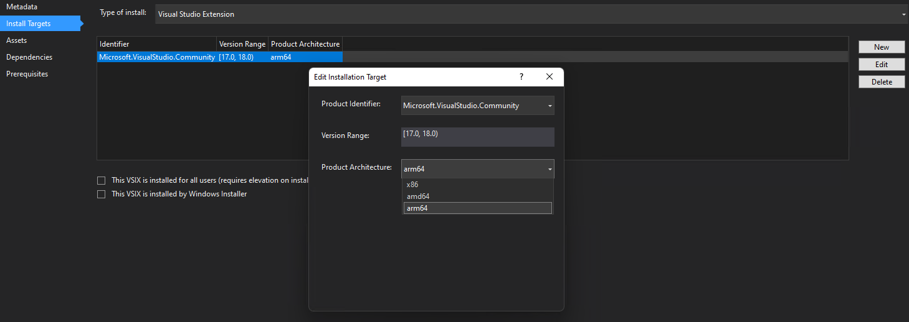

# Target Visual Studio 2022 (ARM64) when creating an extension in Visual Studio 2022

When you create a new VSIX project using Visual Studio 2022, the project is created from a template that targets Visual Studio 2022 (Amd64). If you want to target Visual Studio 2022 (ARM64), you must modify the created project.

Follow these steps on the VSIX project that should target Visual Studio 2022 (ARM64):

## Install Visual Studio and compile extensions

Install Visual Studio 2022 from [Visual Studio 2022 downloads](https://visualstudio.microsoft.com/downloads).

### Extensions written in a .NET language

The Visual Studio SDK that targets Visual Studio 2022 for managed extensions is exclusively on NuGet:

- The [Microsoft.VisualStudio.Sdk](https://www.nuget.org/packages/Microsoft.VisualStudio.Sdk/) (17.x versions) metapackage brings in most or all of the reference assemblies that you'll need.
- The [Microsoft.VSSDK.BuildTools](https://www.nuget.org/packages/Microsoft.VSSDK.BuildTools/) (17.x versions) package should be referenced from your VSIX project so it can build a Visual Studio 2022-compliant VSIX.

### Extensions written in C++

The Visual Studio SDK for extensions compiled with C++ is available with the installed Visual Studio SDK, as usual.
Extensions *must* be compiled specifically against the Visual Studio 2022 SDK and for ARM64.

## Add a Visual Studio 2022 target: ARM64

Add Visual Studio 2022:ARM64 support to your extension by using the following steps. 

- ### For Managed Visual Studio extensions:
  1. Open the VSIX project to your solution. This project will target Visual Studio 2022 :ARM64.
  2. Verify that the VSIX project builds properly. You might need to add references to match your original VSIX project to resolve any compiler errors.
  3. Use the package references 17.x (or earlier) in your Visual Studio 2022-targeted project file. Use the NuGet Package Manager or directly edit the project file.      
      - The [Microsoft.VisualStudio.Sdk](https://www.nuget.org/packages/Microsoft.VisualStudio.Sdk/) (17.x versions) metapackage brings in most or all of the reference assemblies that you'll need.
      - The [Microsoft.VSSDK.BuildTools](https://www.nuget.org/packages/Microsoft.VSSDK.BuildTools/) (17.x versions) package should be referenced from your VSIX project so it can build a Visual Studio 2022-compliant VSIX.
  4. Consider changing your project from building for **Any CPU** to targeting **ARM64**.
  5. Edit your *source.extension.vsixmanifest* file to reflect targeting Visual Studio 2022. Set the `<InstallationTarget>` tag to indicate Visual Studio 2022. Set the `ProductArchitecture` element to indicate an ARM64 payload.
     ```xml
      <InstallationTarget Id="Microsoft.VisualStudio.Community" Version="[17.0,18.0)">
         <ProductArchitecture>amd64</ProductArchitecture>
      </InstallationTarget>
      <InstallationTarget Id="Microsoft.VisualStudio.Community" Version="[17.0,18.0)">
         <ProductArchitecture>arm64</ProductArchitecture>
      </InstallationTarget>
      ```    
      
    >  A managed Visual Studio extension paylaod can target both Installations arm64 and amd64 when building for AnyCPU.

- ### For C++ Visual Studio extensions:
  1. Open the VSIX project to your solution. This project will target Visual Studio 2022 :ARM64.
  2. Verify that the VSIX project builds properly. You might need to add references to match your original VSIX project to resolve any compiler errors.
  3. Change your project from building for targeting **ARM64**. 
  4. Update dependency - Any dependency that your extension might have on a native module will have to be updated to an ARM64 image.
  5. Edit your *source.extension.vsixmanifest* file to reflect targeting Visual Studio 2022. Set the `<InstallationTarget>` tag to indicate Visual Studio 2022. Set the `ProductArchitecture` element to indicate an ARM64 payload.
      ```xml
      <InstallationTarget Id="Microsoft.VisualStudio.Community" Version="[17.0,18.0)">
         <ProductArchitecture>arm64</ProductArchitecture>
      </InstallationTarget>
      ```

    >  A Single C++ Visual Studio extension payload can not target both Installations arm64 and amd64.

At this point, you have a Visual Studio 2022-targeted extension VSIX. You should build your Visual Studio 2022-targeted VSIX project.


### Set the `<InstallationTarget>` tag to indicate Visual Studio 2022 using the Designer view
      

### Sample extension vsixmanifest: targets both AMD64 and ARM64 
   

### How to compile Managed Visual Studio extensions: targets only ARM64

   1. Add ARM64 configuration to your project (.csproj).
      
         
      
   2. Add ARM64 configuration to your project (.csproj).
      
         
    

### How to compile C++ Visual Studio extensions: targets only ARM64

   1. Select the ARM64 Target platform.
         

   2. Select the ARM64 library location.
      
      Required lib files can be found at : `[VSInstallatioPath]\VSSDK\VisualStudioIntegration\common\lib\arm64`
      
         
