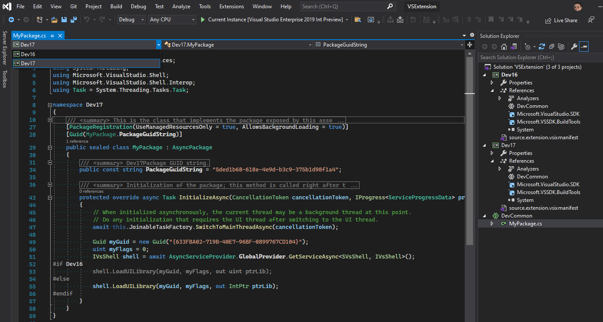

# Adding a Dev17 target to your Visual Studio extension

This document assumes you have completed the steps to [factor your VS extension with shared projects](shared-projects.md).

Proceed to add Dev17 support to your extension with these steps, which may be completed using Visual Studio 2019:

1. Add a New VSIX Project to your solution.
This will be the project that targets Dev17.
Remove any source code that came with the template, but *keep the `source.extension.vsixmanifest` file*.

1. On your new VSIX project, Add a shared project reference to the same shared project that your Dev16-targeting VSIX references.

   

1. Verify that the new VSIX project builds properly.
You may need to add references to match your original VSIX project to resolve any compiler errors.

1. For managed VS extensions, update your package references from 16.x (or earlier) to the 17.x package versions in your Dev17-targeted project file using the NuGet Package Manager or directly editing the project file:

    ```diff
    -<PackageReference Include="Microsoft.VisualStudio.SDK" Version="16.0.206" />
    +<PackageReference Include="Microsoft.VisualStudio.SDK" Version="17.0.0-preview.1" />
    -<PackageReference Include="Microsoft.VSSDK.BuildTools" Version="16.10.32" />
    +<PackageReference Include="Microsoft.VSSDK.BuildTools" Version="17.0.63-preview.1" />
    ```

   Note: use versions that are actually available from nuget.org.
   The ones used above are just for demonstration purposes.

   In many cases, package IDs have changed.
   Please refer to the [package/assembly mapping table](migrated-pia.md) for a list of changes in Dev17.

   Extensions written in C++ do not yet have an available SDK to compile with.

1. For VC++ projects, they must be compiled for amd64.
   For managed extensions, consider changing your project from building for Any CPU to targeting `x64`,
   to reflect that in Dev17 your extension always loads in a 64-bit process.
   Any CPU is fine too, but may produce warnings if you reference any x64-only native binaries.

   Any dependency your extension may have on a native module will have to be updated from an x86 image
   to an amd64 image.

1. Edit your `source.extension.vsixmanifest` file to reflect targeting Dev17.
   Set the `<InstallationTarget>` tag to reflect Dev17 and indicate an amd64 payload:

   ```xml
   <InstallationTarget Id="Microsoft.VisualStudio.Community" Version="[17.0,18.0)">
      <ProductArchitecture>amd64</ProductArchitecture>
   </InstallationTarget>
   ```

   Note that in Visual Studio 2019, the designer for this file does not expose the new `ProductArchitecture` element,
   so this change will need to be done with an xml editor,
   which you can access via the Open With command in Solution Explorer.

   This `ProductArchitecture` element is critical.
   Dev17 will *not* install your extension without it.

   | Element             | Values     | Description                                                                                                                                                                                                                                                                                                                                                                                 |
    |---------------------|------------|---------------------------------------------------------------------------------------------------------------------------------------------------------------------------------------------------------------------------------------------------------------------------------------------------------------------------------------------------------------------------------------------|
    | ProductArchitecture | X86, AMD64 | The platforms that are supported by this VSIX. Not case sensitive. One platform  per element and one element per  InstallTarget. For product versions less than 17.0 the default value is x86 and can be omitted.  For product versions 17.0 and greater this element is required and there is no default value. For Dev17 the only valid content for this element is "amd64". |

1. Make any other adjustments necessary in your source.extension.vsixmanifest to match the one that targets Dev16 (if any).
It is critical that the Id of the VSIX, in the `Identity` element of the manifest, is identical for both extensions.

At this point you have a Dev17-targeted extension VSIX.
You should build your Dev17-targeted VSIX project and [work through any build breaks that appear](code-changes.md).
If you do not have build breaks in your Dev17-targeted VSIX project,
congratulations: you're ready for [testing](testing.md)!
