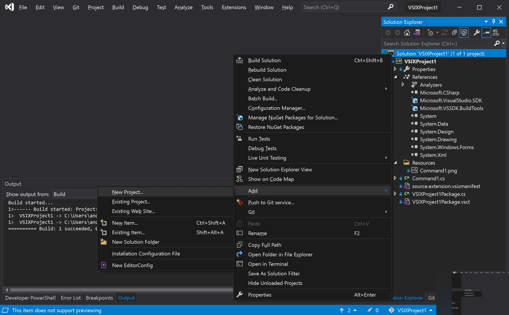
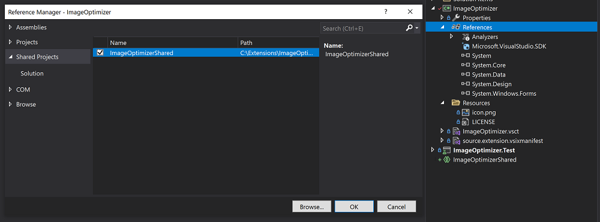
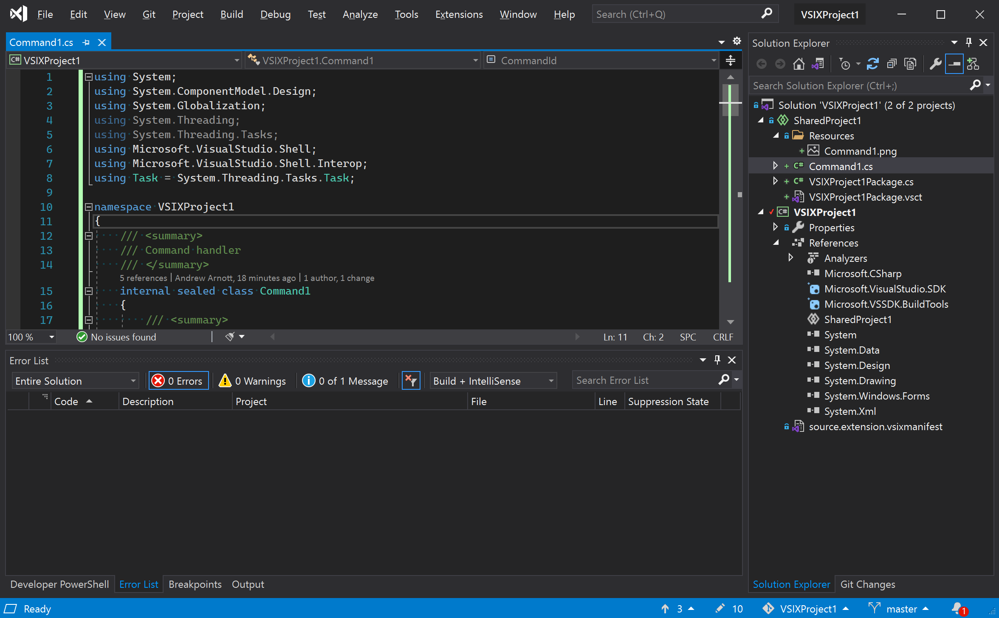
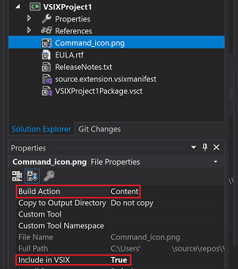

# Migrating your pre-Dev17 extension to use Shared Projects for multi-targeting

[Shared projects](/xamarin/cross-platform/app-fundamentals/shared-projects?tabs=windows)
are a project type that were introduced in Visual Studio 2015. Shared
projects in Visual Studio enable source code files to be shared
between multiple projects and build differently using conditional compilation symbols and unique sets of references.

Because Dev17 requires a distinct set of reference assemblies from all prior VS versions, our guidance is to use shared projects to conveniently multi-target your extension to pre-Dev17 and Dev17+, giving you code sharing but distinct references.

In the context of Visual Studio extensions you could have one VSIX project for Dev17 and later and one VSIX project for Visual Studio 2019 and earlier. Each of these would contain just a `source.extension.vsixmanifest` and the package references to either the 16.x SDK or the 17.x SDK.
These VSIX projects would also have a Shared Project Reference to a new Shared Project that will host all your source code that can be shared across the two VS versions.

As a starting point, for this document we will assume you already have a VSIX project that targets Dev16 and that you want your extension to work on Dev17.

All these steps can be completed with Visual Studio 2019.

1. If you have not already done so, [modernize your projects](modernize-projects.md) to ease steps later in this migration.

1. Add a new Shared Project to your solution for each existing project that references the VS SDK.
   
   

1. Add a reference from each VS SDK referencing project to its Shared Project counterpart.
   

1. Move all the source code (including .cs, .resx) from each VS SDK-referencing project to its Shared Project counterpart.
Leave the `source.extension.vsixmanifest` file in the VSIX project.
   

1. Metadata files (release notes, license, icons, etc.) and VSCT files should be moved to a shared directory and added as linked files to the VSIX project.
   
    - For Metadata files, set BuildAction to `Content` and set Include in VSIX to `true`.

      
    - For VSCT files, set BuildAction to `VSCTCompile` and don't include in VSIX.
      VS might complain that this is not supported, but you can manually change the build action by unloading the project and changing `Content` to `VSCTCompile`

    ```diff
    -<Content Include="..\SharedFiles\VSIXProject1Package.vsct">
    -  <Link>VSIXProject1Package.vsct</Link>
    -</Content>
    +<VSCTCompile Include="..\SharedFiles\VSIXProject1Package.vsct">
    +  <Link>VSIXProject1Package.vsct</Link>
    +  <ResourceName>Menus.ctmenu</ResourceName>
    +</VSCTCompile>
    ```

      

1. Build your project(s) to confirm you have not introduced any new errors.

Your project is now ready to [add Dev17 support](add-dev17-target.md).
