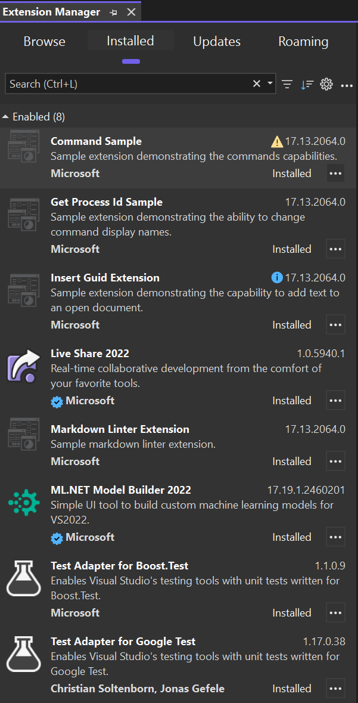

# .NET Companatibilty for VS.Extensbility Extensions

## Overview

The new VS.Extensibilty model allows extensions to be run outside the main VS process in a seperate .NET host process. Because .NET is used as the runtime to execute VS.Extensibility extensions, extensions built using the VS.Extensility framework must stay up-to-date with the publicly supported .NET long-term servicing (LTS) runtimes.

## .NET Runtime Support Model

The .NET runtime has it's own lifetime and servicing timelines, independent of Visual Studio. The current cadence sees a new .NET release every year, with odd-numbered major releases receiving 18 months of support, and even-numbered releases receiving long-term support (LTS) of 36 months. At any given time, Visual Studio will ship with the publicly available .NET LTS versions. For the official list of .NET runtimes and their liftimes, please see https://learn.microsoft.com/en-us/lifecycle/products/microsoft-net-and-net-core.

For Visual Studio, the versions shipped will be according to the below timeline.

| Date | Runtimes |
|--|--|
| November, 2025 | .NET 8, .NET 10 |
| November, 2026 | .NET 10, .NET 12 (preview) |
| November, 2027 | .NET 10, .NET 12 |
| November, 2028 | .NET 12, .NET 14 (preview) |
| November, 2029 | .NET 12, .NET 14 |
| ... | ... |

By default, Visual Studio will choose to use the oldest supported .NET LTS runtime that is not near end-of-life. However, starting 90 days from a runtime's end-of-life date, Visual Studio will switch to using the next latest supported .NET LTS runtime unless an extension does not declare support for the next latest version. In the cases where the extension does not declare support for the next latest version, it will continue on version that is near end-of-life until either (1) the version is no longer supported and therefore no longer shipped with VS, or (2) the extension developer updates the extension to support the next latest version, at which point it will be executed to run on the next latest version.

One thing to note is that while .NET builds are backwards compatible, .NET APIs are not. Although the likelihood of being affected by a breaking change between major .NET versions is low, it is not guaranteed that an application running on a previous .NET version will work on a newer one.

## Experiences

### End-user Experience

For end-users of VS.Extensibiltiy extensions, the experience of using and managing extensions will hardly change. VS will choose which .NET runtime to use for an extension based on the .NET versions that the extension has declared it's supported for and the .NET versions that are available with VS. There are only two scenarios where users will see any departure from the curerent experience:

* If an extension is only supported up to a .NET version that is near end-of-life, an info icon will be displayed on the extension tile in the Extension Manager window to inform the user that the extension is in danger of being unsupported.
* If an extension is only supported up to a .NET version that is past end-of-life, a warning icon will be displayed on the extension tile in the Extension Manager window to inform the user that the extension is being run as best-effort on a version of .NET that has not declared support for, and may not work correctly.

In both scenarios, the user should contact the extension developer and ask them to ensure the extension works on a supported .NET LTS version and publish the updated extension.

### Developer Experience

For developers of VS.Extensibility extensions, the F5 debugging experience has been updated to allow the selection of the .NET runtime to use when debugging or testing an extension. The objective of this experience is to facilitate compatability testing of VS.Extensbility extensions on different .NET runtimes.

Now, when the selected startup project is a VS.Extensbility project, a combo box with a list of the .NET runtimes that are shipped with VS will appear beside the debug launch button. Choosing a runtime and launching the debug will ensure that the debugged extension will be executed using the selected runtime. In the experimental instance, the extension tile in the Extension Manager tool window will display a test icon and specify the .NET version that it's being evaluated for.

