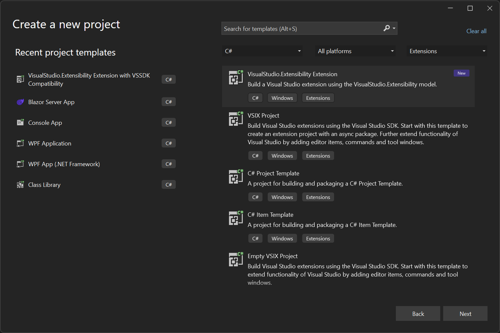
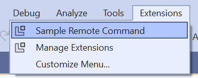

# Create your first Visual Studio extension

This document is a quickstart that shows how to create your first extension using VisualStudio.Extensibility. The extension runs out-of-process, meaning outside of the Visual Studio process.

## Prerequisites

* Visual Studio 2022 version 17.6 Preview 1 or higher with `.NET desktop development` workload.

* Install latest version of [VisualStudio.Extensibility Project System](https://marketplace.visualstudio.com/items?itemName=vsext.gladstone): With this extension, you can debug extension projects using F5. There is currently no other deployment mechanism supported.

* If you're updating from earlier builds, make sure to update VisualStudio.Extensibility Project System to latest version as there are breaking changes in VisualStudio.Extensibility packages.

## Create the extension project

* Use `VisualStudio.Extensibility Project` template to create a new extensibility project.



At this point, you're ready to start extending Visual Studio by adding commands and editor components to your extension.

## The Extension class

The template creates a class that extends `Extension`. This class is the first that is instantiated when your extension is loaded. In the `InitializeServices` method, you can add your own services to the service collection to make them available for dependency injection.

```csharp
[VisualStudioContribution]
internal class ExtensionEntrypoint : Extension
{
    protected override void InitializeServices(IServiceCollection serviceCollection)
    {
        base.InitializeServices(serviceCollection);

        // You can configure dependency injection here by adding services to the serviceCollection.
    }
}
```

You can also see the `VisualStudioContribution` attribute that is used to mark extension components that are meant to be consumed by Visual Studio. This attribute can be applied to classes implementing `IVisualStudioContributionClass` or static properties of a type implementing `IVisualStudioContributionProperty`.

## Add your first command

The template creates `Command1.cs` as your first command handler, which you can use as a starting point. Since we want to make Visual Studio aware of this command, and the `Command` class implements `IVisualStudioContributionClass`, the command is marked with the `VisualStudioContribution` attribute.

```csharp
[VisualStudioContribution]
internal class Command1 : Command
{
```

The command has a configuration property named `CommandConfiguration`, which defines its display name, icon and placement under the `Extensions` menu.

```csharp
    public override CommandConfiguration CommandConfiguration => new("%MyExtension.Command1.DisplayName%")
    {
        // Use this object initializer to set optional parameters for the command. The required parameter,
        // displayName, is set above. DisplayName is localized and references an entry in .vsextension\string-resources.json.
        Icon = new(ImageMoniker.KnownValues.Extension, IconSettings.IconAndText),
        Placements = new[] { CommandPlacement.KnownPlacements.ExtensionsMenu },
    };
```

Configuration properties are evaluated by the C# compiler when building the extension and their values are saved as extension metadata so that Visual Studio can read it without loading the extension assembly. For this reason, configuration properties have additional restrictions compared to normal properties (for example, they must be readonly).

You can see that the display name of the command is `"%MyExtension.Command1.DisplayName%"`, which references the `MyExtension.Command1.DisplayName` string in the `.vsextension/string-resources.json` file, allowing this string to be localized.

When the command is executed, Visual Studio will call in to `ExecuteCommandAsync` method where you can place a breakpoint. You can utilize `context` argument or `this.Extensibility` object to interact with Visual Studio.

For example, a command handler could be as below:

```csharp
public override async Task ExecuteCommandAsync(IClientContext context, CancellationToken cancellationToken)
{
    await context.ShowPromptAsync(
        "Hello from an extension!", 
        PromptOptions.OK, 
        cancellationToken);
}
```

For more information on how to add commands, please refer to [Commands](../extension-guides/command/command.md) section.

## Debug your extension

1. Make sure that your extension project is selected as startup project in Visual Studio, and press `F5` to start debugging.
2. Pressing `F5` builds your extension and deploy it to the experimental instance of Visual Studio version you're using. The debugger should attach once your extension is loaded.
3. You can find the new command in `Tools` menu as shown in the following image:

   

## Next steps

If you missed the introductory overviews, see [Welcome to the VisualStudio.Extensibility documentation](../visualstudio-extensibility.md#concepts).

Now create a slightly more interesting extension; see [Create a simple extension](tutorial-create-simple-extension.md).
