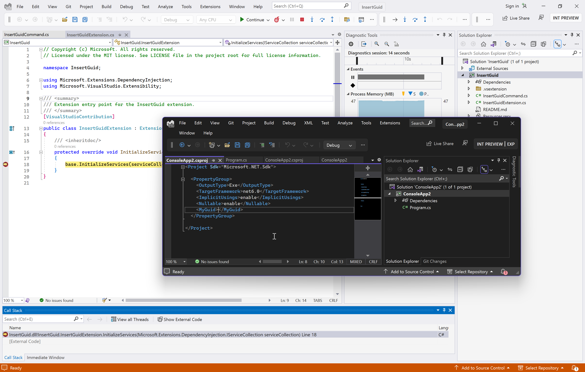

# Debug a Visual Studio extension

When you debug a Visual Studio extension, a special instance of Visual Studio called the Experimental Instance is used to host your extension while you run the debugger in main Visual Studio IDE. The two instances run independently side by side. This article describes how to debug extensions created with the VisualStudio.Extensibility SDK when they're running in the experimental instance of the VS IDE.

## Extension processes

The debugging process differs slightly depending on whether your extension runs in-process or out-of-process. See [Create your first VSSDK-compatible VisualStudio.Extensibility extension](in-proc-extensions.md). With an out-of-process extension, your extension runs in a dedicated process for Visual Studio extensions. This process, called `Microsoft.ServiceHub.Host.Extensibility`, brokers all the communication between Visual Studio's IDE process and the process that is hosting your extension. When you start an extension by using **F5**, Visual Studio launches the Visual Studio Experimental Instance and connects to the process that hosts your extension. You usually don't need to be concerned about the exact process, because when you launch the debugger from an extension project by pressing `F5` in the Visual Studio IDE, Visual Studio locates the right process to connect the debugger to.

When you start a debug session, your extension assembly and its symbols are not immediately loaded. Before your extension loads, Visual Studio keeps track of the places where the extension could be activated. This is managed in an internal instance of `VisualStudioContribution`. Even before your extension loads, Visual Studio has information about where it might be activated, such as when the user chooses a particular menu item, presses a toolbar button, or loads a file of a certain type into the editor.  You extension's assembly won't load until it's activated in the IDE. So, when debugging, the first thing you need to do is take action in the Visual Studio IDE to trigger the extension to load. For example, you might need to select your extension's menu item or toolbar button. At that point, your extension assembly is loaded, the initialization code is executed, and you can hit breakpoints and step through code. The first code to run in your extension is the `InitializeAsync` method on the `Extension` class, and the next method is `InitializeServices`.

## Visual Studio code and extension code

If your extension is in-process, the call stack includes Visual Studio stack frames as well as your extension's stack frames. Symbols are normally not available for Visual Studio, but you can see the calls where Visual Studio calls your extension.

With an out-of-process extension, you only see your extension's call stack; Visual Studio stack frames are in a separate process. Visual Studio calls into your extension through JsonRpc-compatible interfaces, the ServiceHub host routes the call, and then execution in your process begins in the callback. Control returns to Visual Studio when your callback returns.

State is passed your extension in various methods as needed and wrapped by an `IClientContext` instance for easy usage, but it is important to consider that it is a snapshot of the state, which could change between the time of the snapshot and the time when you're reading it from extension code or viewing it in the debugger.

There is some internal code in the ServiceHub host process that handles the RPC brokering. If a failure occurs in this layer, it is not visible to you. Such errors should be reported as product issues.

## Debug the extension in the experimental instance of Visual Studio

1. Open the extension project.
1. Set up a breakpoint, for example, in your extension's `InitializeServices` method on the main class derived from `Extension`. To set a breakpoint on a line of code, click on the line, and press `F9`.
1. From the main menu, choose **Debug > Start Debugging** or press `F5`. Visual Studio Experimental Instance is launched; at the same time, the ServiceHub host process starts.
1. Execute the steps in the experimental instance of Visual Studio that cause your extension to activate or to reproduce the scenario you're intending to debug.
1. Visual Studio stops at a breakpoint.

   

> [!TIP]
> It can be convenient to have multiple monitors, so you can see both the debugger and the experimental instance at the same time on two different monitors. You might want to change the Theme in the Experimental Instance to make it more obvious which IDE you're working with at any given time. See [How to personalize the IDE](/visualstudio/ide/quickstart-personalize-the-ide).

## Next steps

- [Learn more about debugging](/visualstudio/debugger/)

- [Learn more about extensions](../visualstudio-extensibility.md)
