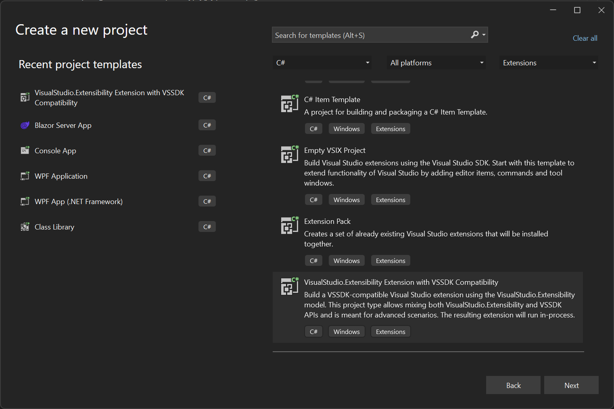

# Create your first VSSDK-compatible VisualStudio.Extensibility extension

While the VisualStudio.Extensibility model was created primarily to host extensions outside of the devenv.exe process, starting with Visual Studio 2022 17.4 Preview 1 it is possible to build a VisualStudio.Extensibility extension that are hosted within devenv.exe and can leverage traditional extensibility APIs provided by the [Microsoft.VisualStudio.Sdk](https://www.nuget.org/packages/Microsoft.VisualStudio.Sdk) packages.

The support of *in-proc* extensions is meant to allow early adopters to leverage the new VisualStudio.Extensibility APIs while relying on [Microsoft.VisualStudio.Sdk](https://www.nuget.org/packages/Microsoft.VisualStudio.Sdk) to cover any feature gap.

At this time, VSIX extensions containing VisualStudio.Extensibility references cannot be uploaded to the Visual Studio Marketplace due to VisualStudio.Extensibility being in preview status.

This document is a quick walkthrough on how to create your first VSSDK-compatible extension using the VisualStudio.Extensibility model.

## Prerequisites

* Visual Studio 2022.6 Preview 1 or higher with `.Net desktop development` workload. The latest minimum requirement will always be listed at [Announcements](../announcements.md) page.
* Install [VisualStudio.Extensibility Project System](https://marketplace.visualstudio.com/items?itemName=vsext.gladstone): This extension contains project templates for VisualStudio.Extensibility extensions.
* If you are updating from earlier builds, please make sure to update VisualStudio.Extensibility Project System to latest version as there are breaking changes in VisualStudio.Extensibility packages.

## Create the extension project

* Use the *VisualStudio.Extensibility Extension with VSSDK Compatibility* template to create a new solution.



## Debug your extension

* Set the *Container* project as *Startup Project*, press `F5` to start debugging.

* This will build your extension and deploy it to the experimental instance of Visual Studio version you are using. The debugger should attach once your extension is loaded.

* You can find the command in `Tools` menu as shown.


## Consuming Visual Studio SDK services from a VisualStudio.Extensibility extension

A VSSDK-compatible extension project references the [Microsoft.VisualStudio.Sdk](https://www.nuget.org/packages/Microsoft.VisualStudio.Sdk) package which allows access to all Visual Studio SDK's services.

Traditionally, such services are consumed through either [MEF](/visualstudio/extensibility/managed-extensibility-framework-in-the-editor) or the [AsyncServiceProvider](/dotnet/api/microsoft.visualstudio.shell.asyncserviceprovider). A VisualStudio.Extensibility extender is instead encouraged to leverage [.NET depedency injection](/dotnet/core/extensions/dependency-injection).

The `MefInjection<TService>` and `AsyncServiceProviderInjection<TService, TInterface>` classes (both from the `Microsoft.VisualStudio.Extensibility.VSSdkCompatibility` namespace) allow to consume the Visual Studio SDK's services by simply adding them to the constructor of a class that is instantiated through dependency injection (like a command, tool window or extension part).

The example below shows how the `DTE2` and `IBufferTagAggregatorFactoryService` services can be added to a command.

```CSharp
    [VisualStudioContribution]
    public class Command1 : Command
    {
        private TraceSource traceSource;
        private AsyncServiceProviderInjection<DTE, DTE2> dte;
        private MefInjection<IBufferTagAggregatorFactoryService> bufferTagAggregatorFactoryService;

        public Command1(
            VisualStudioExtensibility extensibility,
            TraceSource traceSource,
            AsyncServiceProviderInjection<DTE, DTE2> dte,
            MefInjection<IBufferTagAggregatorFactoryService> bufferTagAggregatorFactoryService)
            : base(extensibility)
        {
            this.dte = dte;
            this.bufferTagAggregatorFactoryService = bufferTagAggregatorFactoryService;
        }
    
        public override CommandConfiguration CommandConfiguration => new("Sample Remote Command")
        {
            Placements = new[] { CommandPlacement.KnownPlacements.ToolsMenu },
            Icon = new(ImageMoniker.KnownValues.Extension, IconSettings.IconAndText),
        };
```

## Anatomy of a VSSDK-compatible VisualStudio.Extensibility extension

While using the *VisualStudio.Extensibility Extension with VSSDK Compatibility* template takes care of setting up the entire solution, it is useful to know what are the basic components of a VSSDK-compatible VisualStudio.Extensibility extension and how it differs from the common variant described in the ["create your first extension" guide](create-your-first-extension.md).

### Container project

A VSSDK-compatible VisualStudio.Extensibility solution is composed of two projects:

1. a class library that references both the VisualStudio.Extensibility and Visual Studio SDK packages and contains all the code of the extension,
1. a container VSIX project that provides the ability to deploy the debug the extension.

This separation is a temporary solution while the VisualStudio.Extensibility is in preview and the final packaging and deployment design is being finalized.

The extender shouldn't add code, content or resources to the container project. The only goal of the container project is to include the assets provided by the other project.

### TargetFramework

Both the extension project and the container project must target the .NET version used by the target Visual Studio version. For Visual Studio 2022, they must target .NET Framework 4.7.2.

### RequiresInProcessHosting property

The `Extension` class must be configured with the `RequiresInProcessHosting = true` property that identifies the extension as being *in-process*.

```CSharp
[VisualStudioContribution]
internal class MyExtension : Extension
{
    public override ExtensionConfiguration? ExtensionConfiguration => new()
    {
        RequiresInProcessHosting = true,
    };

    ...
```
