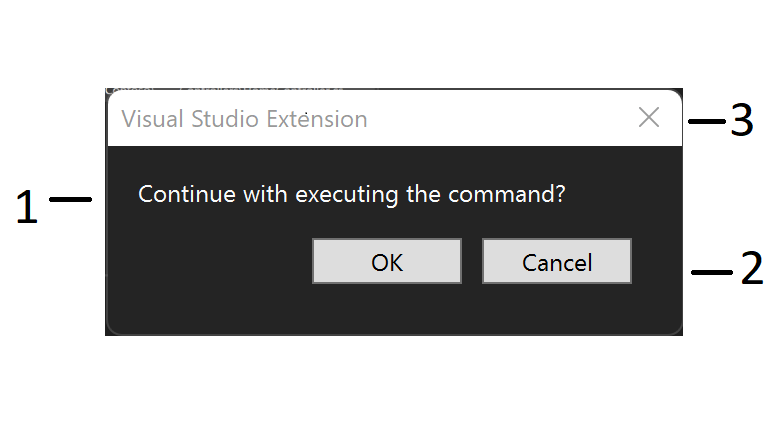

# Create Visual Studio user prompts

User prompts are a simple UI mechanism for prompting the user to make a selection. Prompting the user creates a dialog box with a message, one to three buttons for the choices, and a dismiss button.

> [!NOTE]
> The exact UI used to prompt users may change in future versions based on user feedback or other factors.

Common examples are requesting confirmation with an OK/Cancel prompt, or asking the user to choose among a small set of options (no more than three).

The user always has the option of dismissing the prompt without making a selection.

The choices presented to the user are mapped to return values of the type defined in the `TResult` type parameter.

## Parts of a user prompt



1. Message
2. Choice Buttons
3. Dismiss Button

## Get started

To get started, follow the [create the project](./../get-started/create-your-first-extension.md) section in the Getting Started section.

## Work with user prompts

This guide covers the following scenarios for working with User Prompts:

- [Display a user prompt](#display-a-user-prompt)
- [Use built-in options](#use-built-in-options)
- [Create a prompt with custom options](#create-a-prompt-with-custom-options)

## Display a user prompt

Creating a user prompt with the new Extensibility Model is as simple as calling the `ShowPromptAsync` method from the [ShellExtensibility](/dotnet/api/microsoft.visualstudio.extensibility.shell.shellextensibility) helpers and passing in your options.

### `ShellExtensibility.ShowPromptAsync<TResult>()`

The `ShowPromptAsync()` method takes three parameters:

| Parameter | Type | Required | Description |
| ----------|------|----------|-------------|
| message   | `string` | yes | The text of the message for the prompt. |
| options   | `PromptOptions<TResult>` | yes | Defines the user choices, mapping them to return values. |
| cancellationToken | [`CancellationToken`](/dotnet/api/system.threading.cancellationtoken) | Yes | The [`CancellationToken`](/dotnet/api/system.threading.cancellationtoken) for the async operation. When triggered, the prompt is force-closed. |

### Example

The following code inside a `Command` shows a user prompt with a simple message and an OK button.

```csharp
public override async Task ExecuteCommandAsync(IClientContext context, CancellationToken cancellationToken)
{
    await this.Extensibility.Shell().ShowPromptAsync("This is a user prompt.", PromptOptions.OK, cancellationToken))
}
```

## Use built-in options

Several sets of predefined `PromptOptions` are available in the SDK.

### OK

| Choice | Default | Return Value |
|--------|---------|--------------|
| "OK"   | Yes | true |
| _Dismissed_ | | false |

### OKCancel

| Choice | Default | Return Value |
|--------|---------|--------------|
| "OK"   | Yes | true |
| "Cancel" | No | false |
| _Dismissed_ | | false |

### RetryCancel

| Choice | Default | Return Value |
|--------|---------|--------------|
| "Retry" | Yes | true |
| "Cancel" | No | false |
| _Dismissed_ | | false |

### Example


Create a prompt with a single "OK" choice.

```csharp
public override async Task ExecuteCommandAsync(IClientContext context, CancellationToken ct)
{
    // Asking the user to confirm an operation.
    if (!await this.Extensibility.Shell().ShowPromptAsync("Continue with executing the command?", PromptOptions.OKCancel, ct))
    {
      return;
    }
    
    ...
}
```

If the user clicks "OK", `ShowPromptAsync` returns `true` when awaited. If the user clicks the dismiss button, it returns `false`.

#### Change the default choice of a built-in option to "Cancel"

```csharp
public override async Task ExecuteCommandAsync(IClientContext context, CancellationToken ct)
{
  // Asking the user to confirm an operation.
  if (!await this.Extensibility.Shell().ShowPromptAsync("Continue with executing the command?", PromptOptions.OKCancel.WithCancelAsDefault(), ct))
  {
    return;
  }
  
  ...
}
```

## Create a prompt with custom options


In addition to the built-in options, you can customize the choices presented to the user and the return value mapped to each.

Instead of using the sets defined in `PromptOptions`, create a new instance of `PromptOptions<TResult>` and pass it to `ShowPromptAsync`.

### Example

Start by creating a value type to define the return values:

```csharp
public enum TokenThemeResult
{
  None,
  Solarized,
  OneDark,
  GruvBox,
}
```

Then create the `PromptOptions<TResult>` instance and pass it to `ShowPromptAsync` along with the required `message` and `cancellationToken` arguments:

```csharp
public override async Task ExecuteCommandAsync(IClientContext context, CancellationToken ct)
{
  // Custom prompt
  var themeResult = await this.Extensibility.Shell().ShowPromptAsync(
    "Which theme should be used for the generated output?",
    new PromptOptions<TokenThemeResult>
    {
      Choices =
      {
        { "Solarized Is Awesome", TokenThemeResult.Solarized },
        { "OneDark Is The Best", TokenThemeResult.OneDark },
        { "GruvBox Is Groovy", TokenThemeResult.GruvBox },
      },
      DismissedReturns = TokenThemeResult.None,
      DefaultChoiceIndex = 2,
    },
    ct);

  Debug.WriteLine($"Selected Token Theme: {themeResult}");
}
```

The `Choices` collection maps the user choices to values in the `TokenThemeResult` enum. `DismissedReturns` sets the value that is returned if the user clicks the dismiss button. `DefaultChoiceIndex` is a zero-based index into the `Choices` collection that defines the default choice.

## Next steps

The following samples demonstrate how to work with user prompts:

- [UserPromptSample](https://github.com/Microsoft/VSExtensibility/tree/main/New_Extensibility_Model/Samples/UserPromptSample/)
- [MarkdownLinter](https://github.com/Microsoft/VSExtensibility/tree/main/New_Extensibility_Model/Samples/MarkdownLinter/)
