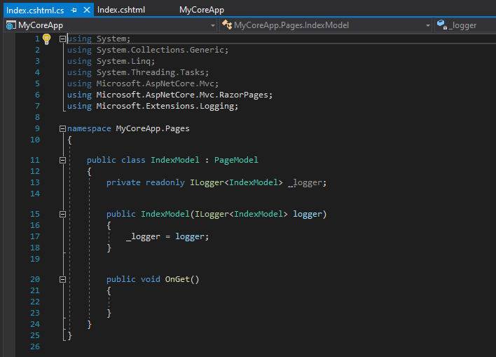
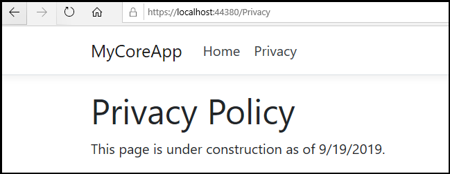
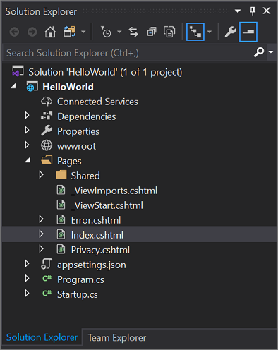
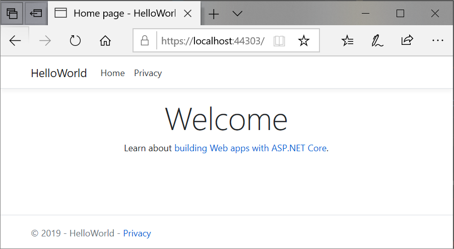
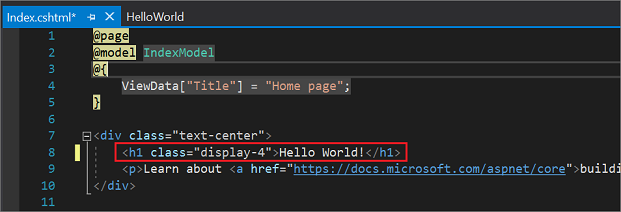
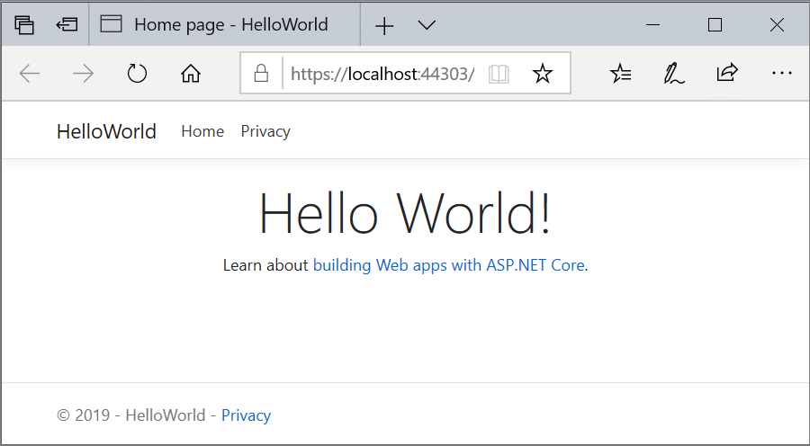

# Tutorial: Get started with C# and ASP.NET Core in Visual Studio

 [!INCLUDE [Visual Studio](~/includes/applies-to-version/vs-not-mac.md)]

In this tutorial for C# development with ASP.NET Core, you'll create a C# ASP.NET Core web app in Visual Studio.

This tutorial will show you how to:

> [!div class="checklist"]
>
> - Create a Visual Studio project
> - Create a C# ASP.NET Core web app
> - Make changes to the web app
> - Explore IDE features
> - Run the web app

## Prerequisites

   ::: moniker range="vs-2017"

   You need Visual Studio to complete this tutorial. Visit the [Visual Studio downloads page](https://visualstudio.microsoft.com/vs/older-downloads/?utm_medium=microsoft&utm_source=docs.microsoft.com&utm_campaign=vs+2017+download) for a free version.

   ::: moniker-end

   ::: moniker range=">=vs-2019"

   You need Visual Studio to complete this tutorial.
   Visit the [Visual Studio downloads page](https://visualstudio.microsoft.com/vs) for a free version.

   ::: moniker-end

- For more information about upgrading to the latest Visual Studio release, see [Visual Studio updates](../../install/update-visual-studio.md).

- To customize your Visual Studio experience, see [personalize the Visual Studio IDE and Editor](../../ide/quickstart-personalize-the-ide.md).

## Create a project

First, you'll create an ASP.NET Core project. The project type comes with all the template files you'll need to build a fully functional website.

::: moniker range="vs-2017"

1. Open Visual Studio 2017.

2. From the top menu bar, select **File** > **New** > **Project**.

3. In the **New Project** dialog box in the left pane, expand **Visual C#**, expand **Web** node, and then select **.NET Core**. In the middle pane, select **ASP.NET Core Web Application**. Next, name the file **MyCoreApp** and select **OK**.

   

### Add a workload (optional)

If you don't see the **ASP.NET Core Web Application** project template, you can get it by adding the **ASP.NET and web development** workload. You can add this workload in one of the two following ways, depending on which Visual Studio 2017 updates are installed on your machine.

#### Option 1: Use the New Project dialog box

1. Select the **Open Visual Studio Installer** link in the left pane of the **New Project** dialog box. Depending on your display settings, you might have to scroll to see it.

   

1. After the Visual Studio Installer launches, select the **ASP.NET and web development** workload, and then select **Modify**. Visual Studio may have to close, while installing the selected workload.

   

#### Option 2: Use the Tools menu bar

1. Cancel out of the **New Project** dialog box. Then, from the top menu bar, select **Tools** > **Get Tools and Features**.

1. After the Visual Studio Installer launches, select the **ASP.NET and web development** workload, and select **Modify**. Visual Studio may have to close, while installing the selected workload.

### Add a project template

1. In the **New ASP.NET Core Web Application** dialog box, select the **Web Application** project template.

1. Verify that **ASP.NET Core 2.1** appears in the top drop-down menu. Then, select **OK**.

   

   > [!NOTE]
   > If you don't see **ASP.NET Core 2.1** from the top drop-down menu, make sure that you are running the most recent release of Visual Studio. For more information about how to update your installation, see the [Update Visual Studio to the most recent release.](../../install/update-visual-studio.md) page.

::: moniker-end

::: moniker range="vs-2019"

1. On the start window, select **Create a new project**.

   :::image type="content" source="../../get-started/media/vs-2019/create-new-project-dark-theme.png" alt-text="Screenshot shows the start window for Visual Studio. Create a new project option is highlighted.":::

1. In the **Create a new project** window, select **C#** from the Language list. Next, select **Windows** from the platform list, and **Web** from the project types list.

      After you apply the language, platform, and project type filters, select the **ASP.NET Core Web App** template, and then select **Next**.

   :::image type="content" source="./media/vs-2019/csharp-create-new-project-aspnet-core.png" alt-text="Screenshot shows the ASP.NET Core Web App project template highlighted in the New Project dialog box.":::

   > [!NOTE]
   > If you don't see the **ASP.NET Core Web App** template, you can install it from the **Create a new project** window. In the **Not finding what you're looking for?** message, found at the bottom of the list of templates, select the **Install more tools and features** link.
   >
   > 
   >
   > Next, in the Visual Studio Installer, select **ASP.NET and web development**.
   >
   > 
   >
   > Select **Modify** in the Visual Studio Installer. You might be prompted to save your work. Next, select **Continue** to install the workload.

1. In the **Configure your new project** window, enter **MyCoreApp** in the **Project name** field. Then, select **Next**.

   :::image type="content" source="./media/vs-2019/csharp-name-your-aspnet-app.png" alt-text="Screenshot shows the Configure your new project window with MyCoreApp entered in the Project name field.":::

1. In the **Additional information** window, verify that **.NET Core 3.1** appears in the **Target Framework** field. From this window, you can enable Docker support and add authentication support. The drop-down menu for **Authentication Type** has the following four options:
    - **None**. No authentication.
    - **Individual accounts**. These authentications are stored in a local or Azure-based database.
    - **Microsoft identity platform**. This option uses Active Directory, Azure AD, or Microsoft 365 for authentication.
    - **Windows**. Suitable for intranet applications.

    Leave the **Enable Docker** box unchecked, and select **None** for Authentication Type. Next, select **Create**.

   :::image type="content" source="./media/vs-2019/aspnet-core-additional-information.png" alt-text="Screenshot shows the default settings in the Additional information window. The Framework value is .NET Core 3.1.":::

   Visual Studio will open up your new project.

::: moniker-end

::: moniker range=">=vs-2022"

1. On the start window, select **Create a new project**.

   :::image type="content" source="media/vs-2022/start-window-create-new-project.png" border="false" alt-text="Screenshot shows the start window for Visual Studio. Create a new project option is highlighted.":::

1. In the **Create a new project** window, select **C#** from the Language list. Next, select **Windows** from the platform list, and **Web** from the project types list.

      After you apply the language, platform, and project type filters, select the **ASP.NET Core Web App** template, and then select **Next**.

   :::image type="content" source="media/vs-2022/csharp-create-new-project-aspnet-core.png" border="false" alt-text="Screenshot shows the ASP.NET Core Web App project template selected and highlighted on the Create a new project page.":::

   > [!NOTE]
   > If you don't see the **ASP.NET Core Web App** template, you can install it from the **Create a new project** window. In the **Not finding what you're looking for?** message, found at the bottom of the list of templates,  select the **Install more tools and features** link.
   >
   > :::image type="content" source="media/vs-2022/not-finding-what-looking-for.png" alt-text="Screenshot shows the Install more tools and features link that is part of the Not finding what you're looking for message.":::
   >
   > Then, in the Visual Studio Installer, select the **ASP.NET and web development** workload.
   >
   > :::image type="content" source="media/vs-2022/aspnet-core-web-dev-workload.png" alt-text="Screenshot shows the ASP.NET and web development workload in the Visual Studio Installer.":::
   >
   > Select **Modify** in the Visual Studio Installer. You might be prompted to save your work. Next, select **Continue** to install the workload.

1. In the **Configure your new project** window, enter **MyCoreApp** in the **Project name** field. Then, select **Next**.

   :::image type="content" source="media/vs-2022/csharp-name-your-aspnet-app.png" border="false" alt-text="Screenshot shows the Configure your new project window with MyCoreApp entered in the Project name field.":::

1. In the **Additional information** window, verify that **.NET 6.0** appears in the **Target Framework** field. From this window, you can enable Docker support and add authentication support. The drop-down menu for **Authentication Type** has the following four options:
    - **None**. No authentication.
    - **Individual accounts**. These authentications are stored in a local or Azure-based database.
    - **Microsoft identity platform**. This option uses Active Directory, Azure AD, or Microsoft 365 for authentication.
    - **Windows**. Suitable for intranet applications.

    Leave the **Enable Docker** box unchecked, and select **None** for Authentication Type. Next, select **Create**.

   :::image type="content" source="media/vs-2022/aspnet-core-additional-information.png" border="false" alt-text="Screenshot shows the default settings in the Additional information window. The Framework value is .NET 6.0.":::

   Visual Studio will open up your new project.

::: moniker-end

### About your solution

This solution follows the **Razor Page** design pattern. It's different than the [Model-View-Controller (MVC)](/aspnet/core/tutorials/first-mvc-app/start-mvc?view=aspnetcore-2.1&tabs=aspnetcore2x&preserve-view=true) design pattern in that it's streamlined to include the model and controller code within the Razor Page itself.

::: moniker range="vs-2017"

## Tour your solution

 1. The project template creates a solution with a single ASP.NET Core project that is named **MyCoreApp**. Select the **Solution Explorer** tab to view its contents.

    

 1. Expand the **Pages** folder, and then expand **About.cshtml**.

     

 1. View the **About.cshtml** file in the code editor.

     

 1. Select the **About.cshtml.cs** file.

     

 1. View the **About.cshtml.cs** file in the code editor.

     

 1. The project contains a **wwwroot** folder that is the root for your website. Expand the folder to view its contents.

     

    You can put static site content&mdash;such as CSS, images, and JavaScript libraries&mdash;directly in the paths where you want them.

 1. The project also contains configuration files that manage the web app at run time. The default application [configuration](/aspnet/core/fundamentals/configuration) is stored in **appsettings.json**. However, you can override these settings by using **appsettings.Development.json**. Expand the **appsettings.json** node to view the **appsettings.Development.json** file.

     

## Run, debug, and make changes

1. Select the **IIS Express** button in the toolbar, to build and run the app in debug mode. Alternatively, press **F5**, or go to **Debug** > **Start Debugging** from the menu bar.

     

     > [!NOTE]
     > If you get an error message that says **Unable to connect to web server 'IIS Express'**, close Visual Studio and then relaunch the program as an administrator. You can do this by right-clicking the Visual Studio icon from the Start Menu, and then selecting the **Run as administrator** option from the context menu.
     >
     > You might also get a message that asks if you want to accept an IIS SSL Express certificate. To view the code in a web browser, select **Yes**, and then select **Yes** if you receive a follow-up security warning message.

1. Visual Studio launches a browser window. You should then see **Home**, **About**, and **Contact** pages in the menu bar. If you don't see the pages, select the "hamburger" menu item to view them.

    

1. Select **About** from the menu bar.

   

   Among other things, the **About** page in the browser renders the text that is set in the **About.cshtml** file.

   

1. Return to Visual Studio, and then press **Shift+F5** to stop debugging. This action closes the project in the browser window.

1. In Visual Studio, select **About.cshtml**. Then, delete the word _another_ and replace it with _file and directory_.

    

1. Select **About.cshtml.cs**. Then, clean up the `using` directives at the top of the file by using the following shortcut:

   Mouseover or select a greyed out `using` directive. A [Quick Actions](../../ide/quick-actions.md) light bulb will appear just below the caret or in the left margin. Select the light bulb, and then select **Remove Unnecessary Usings**.

   

     Visual Studio deletes the unnecessary `using` directives from the file.

1. Next, in the `OnGet()` method, change the body to the following code:

     ```csharp
     public void OnGet()
     {
         string directory = Environment.CurrentDirectory;
         Message = String.Format("Your directory is {0}.", directory);
     }
    ```

1. Notice that two wavy underlines appear under **Environment** and **String**. The wavy underlines appear because these types aren't in scope.

   

    Open the **Error List** toolbar to see the same errors listed there. If you don't see the **Error List** toolbar, go to **View** > **Error List** from the top menu bar.

   

1. Let's fix this error. In the code editor, place your cursor on either line that contains the error, and then select the Quick Actions light bulb in the left margin. Then, from the drop-down menu, select **using System;** to add this directive to the top of your file and resolve the errors.

   

1. Press **Ctrl**+**S** to save your changes, and then press **F5** to open your project in the web browser.

1. At the top of the website, select **About** to view your changes.

   

1. Close the web browser, press **Shift**+**F5** to stop debugging.

## Change your About page

1. In the **Solution Explorer**, expand the **Pages** folder, and then select **About.cshtml**.

   

   The **About.cshtml** file corresponds to a page that's titled **About** in the web app, which runs in a web browser.

   

   In the code editor, you'll see HTML code for the text that appears on the **About** page.

   

1. Replace _Use this area to provide additional information_ text with _Hello World!_

   

1. In the **Solution Explorer**, expand **About.cshtml** and then select **About.cshtml.cs**. This file also corresponds with the **About** page in the web browser.

   

   In the code editor, you'll see C# code that includes text for the _application description_ area of the **About** page.

   

1. Replace _Your application description page_ text with _What's my message?_

   

1. Select **IIS Express** or press **Ctrl**+**F5** to run the app and open it in a web browser.

   

1. In the web browser, you'll see your new changes on the **About** page.

   

1. Close the web browser, press **Shift**+**F5** to stop debugging, and save your project. You can now close Visual Studio.

### Review your work

View the following animation to check the work that you completed in the previous section:

  

::: moniker-end

::: moniker range="=vs-2019"

## Tour your solution

 1. The project template creates a solution with a single ASP.NET Core project that is named **MyCoreApp**. Select the **Solution Explorer** tab to view its contents.

    

 1. Expand the **Pages** folder.

     

 1. Select the **Index.cshtml** file, and view in the code editor.

     

 1. Each .cshtml file has an associated code file. To open the code file in the editor, expand the **Index.cshtml** node in Solution Explorer, and select the **Index.cshtml.cs** file.

     

 1. View the **Index.cshtml.cs** file in the code editor.

     

 1. The project contains a **wwwroot** folder that is the root for your website. Expand the folder to view its contents.

     

    You can put static site content&mdash;such as CSS, images, and JavaScript libraries&mdash;directly in the paths where you want them.

 1. The project also contains configuration files that manage the web app at run time. The default application [configuration](/aspnet/core/fundamentals/configuration) is stored in **appsettings.json**. However, you can override these settings by using **appsettings.Development.json**. Expand the **appsettings.json** file to view the **appsettings.Development.json** file.

     

## Run, debug, and make changes

1. Select the **IIS Express** button in the toolbar, to build and run the app in debug mode. Alternatively, press **F5**, or go to **Debug** > **Start Debugging** from the menu bar.

     

     > [!NOTE]
     > If you get an error message that says **Unable to connect to web server 'IIS Express'**, close Visual Studio and then relaunch the program as an administrator. You can do this by right-clicking the Visual Studio icon from the Start Menu, and then selecting the **Run as administrator** option from the context menu.
     >
     > You might also get a message that asks if you want to accept an IIS SSL Express certificate. To view the code in a web browser, select **Yes**, and then select **Yes** if you receive a follow-up security warning message.

1. Visual Studio launches a browser window. You should then see **Home** and **Privacy** pages in the menu bar.

1. Select **Privacy** from the menu bar. The **Privacy** page in the browser renders the text that is set in the **Privacy.cshtml** file.

   

1. Return to Visual Studio, and then press **Shift+F5** to stop debugging. This action closes the project in the browser window.

1. In Visual Studio, open **Privacy.cshtml** for editing. Next, delete the sentence, _Use this page to detail your site's privacy policy_ and replace it with _This page is under construction as of @ViewData["TimeStamp"]_.

    

1. Now, let's make a code change. Select **Privacy.cshtml.cs**. Next, clean up the `using` directives at the top of the file by using the following shortcut:

   Mouseover or select a greyed out `using` directive. A [Quick Actions](../../ide/quick-actions.md) light bulb will appear just below the caret or in the left margin. Select the light bulb, and then select **Remove unnecessary usings**.

   

   Now select **Preview changes** to see what will change.

   

   Select **Apply**. Visual Studio deletes the unnecessary `using` directives from the file.

1. Next, in the `OnGet()` method, change the body to the following code:

     ```csharp
     public void OnGet()
     {
        string dateTime = DateTime.Now.ToShortDateString();
        ViewData["TimeStamp"] = dateTime;
     }
    ```

1. Notice a wavy underline appears under **DateTime**. The wavy underline appears because this type isn't in scope.

   

    Open the **Error List** toolbar to see the same errors listed there. If you don't see the **Error List** toolbar, go to **View** > **Error List** from the top menu bar.

   

1. Let's fix this error. In the code editor, place your cursor on the line that contains the error, and then select the Quick Actions light bulb in the left margin. Then, from the drop-down menu, select **using System;** to add this directive to the top of your file and resolve the errors.

   

1. Press **F5** to open your project in the web browser.

1. At the top of the web site, select **Privacy** to view your changes.

   

1. Close the web browser, press **Shift**+**F5** to stop debugging.

## Change your Home page

1. In the **Solution Explorer**, expand the **Pages** folder, and then select **Index.cshtml**.

   

   The **Index.cshtml** file corresponds with your **Home** page in the web app, which runs in a web browser.

   

   In the code editor, you'll see HTML code for the text that appears on the **Home** page.

   

1. Replace the _Welcome_ text with _Hello World!_

   
    
1. Select **IIS Express** or press **Ctrl**+**F5** to run the app and open it in a web browser.

   

1. In the web browser, you'll see your new changes on the **Home** page.

   

1. Close the web browser, press **Shift**+**F5** to stop debugging, and save your project. You can now close Visual Studio.

::: moniker-end

::: moniker range=">=vs-2022"

## Tour your solution

 1. The project template creates a solution with a single ASP.NET Core project that is named **MyCoreApp**. Select the **Solution Explorer** tab to view its contents.

     :::image type="content" source="media/vs-2022/csharp-aspnet-razor-solution-explorer-mycoreapp.png" alt-text="Screenshot shows the MyCoreApp project selected and its content in the Solution Explorer in Visual Studio.":::

 1. Expand the **Pages** folder.

     :::image type="content" source="media/vs-2022/csharp-aspnet-solution-explorer-pages.png" alt-text="Screenshot shows the contents of the Pages folder in the Solution Explorer.":::

 1. Select the **Index.cshtml** file, and view in the code editor.

     :::image type="content" source="media/vs-2022/csharp-aspnet-index-cshtml.png" alt-text="Screenshot shows the Index.cshtml file open in the Visual Studio code editor.":::

 1. Each .cshtml file has an associated code file. To open the code file in the editor, expand the **Index.cshtml** node in Solution Explorer, and select the **Index.cshtml.cs** file.

     :::image type="content" source="media/vs-2022/csharp-aspnet-choose-index-cshtml.png" alt-text="Screenshot shows Index.cshtml file selected in the Solution Explorer in Visual Studio.":::

 1. View the **Index.cshtml.cs** file in the code editor.

     :::image type="content" source="media/vs-2022/csharp-aspnet-index-cshtml-editing.png" alt-text="Screenshot shows the Index.cshtml.cs file open in the Visual Studio code editor.":::

 1. The project contains a **wwwroot** folder that is the root for your website. Expand the folder to view its contents.

     :::image type="content" source="media/vs-2022/csharp-aspnet-razor-solution-explorer-wwwroot.png" alt-text="Screenshot shows the w w w root folder selected in the Solution Explorer in Visual Studio.":::

    You can put static site content&mdash;such as CSS, images, and JavaScript libraries&mdash;directly in the paths where you want them.

 1. The project also contains configuration files that manage the web app at run time. The default application [configuration](/aspnet/core/fundamentals/configuration) is stored in **appsettings.json**. However, you can override these settings by using **appsettings.Development.json**. Expand the **appsettings.json** file to view the **appsettings.Development.json** file.

     :::image type="content" source="media/vs-2022/csharp-aspnet-razor-solution-explorer-appsettingsjson.png" alt-text="Screenshot shows appsettings.json selected and expanded, which exposes appsettings.Development.json, in the Solution Explorer in Visual Studio.":::

## Run, debug, and make changes

1. Select the **IIS Express** button in toolbar, to build and run the app in debug mode. Alternatively, press **F5**, or go to **Debug** > **Start Debugging** from the menu bar.

     :::image type="content" source="media/vs-2022/csharp-aspnet-razor-iis-express.png" alt-text="Screenshot shows the I I S Express button highlighted in the toolbar in Visual Studio.":::

     > [!NOTE]
     > If you get an error message that says **Unable to connect to web server 'IIS Express'**, close Visual Studio and then relaunch the program as an administrator. You can do this by right-clicking the Visual Studio icon from the Start Menu, and then selecting the **Run as administrator** option from the context menu.
     >
     > You might also get a message that asks if you want to accept an IIS SSL Express certificate. To view the code in a web browser, select **Yes**, and then select **Yes** if you receive a follow-up security warning message.

1. Visual Studio launches a browser window. You should then see **Home** and **Privacy** pages in the menu bar.

1. Select **Privacy** from the menu bar. The **Privacy** page in the browser renders the text that is set in the **Privacy.cshtml** file.

   :::image type="content" source="media/vs-2022/csharp-aspnet-browser-page-privacy.png" alt-text="Screenshot shows the MyCoreApp Privacy page with the following text: Use this page to detail your site's privacy policy.":::

1. Return to Visual Studio, and then press **Shift+F5** to stop debugging. This action closes the project in the browser window.

1. In Visual Studio, open **Privacy.cshtml** for editing. Next, delete the sentence, _Use this page to detail your site's privacy policy_ and replace it with _This page is under construction as of @ViewData["TimeStamp"]_.

   :::image type="content" source="media/vs-2022/csharp-aspnet-privacy-cshtml-code-changed.png" alt-text="Screenshot shows the Privacy.cshtml file open in the Visual Studio code editor with the updated text.":::

1. Now, let's make a code change. Select **Privacy.cshtml.cs**. Then, clean up the `using` directives at the top of the file by selecting the following shortcut:

   Mouseover or select a greyed out `using` directive. A [Quick Actions](../../ide/quick-actions.md) light bulb will appear just below the caret or in the left margin. Select the light bulb, and then select **Remove unnecessary usings**.

   :::image type="content" source="media/vs-2022/csharp-aspnet-remove-unnecessary-usings.png" alt-text="Screenshot shows the Privacy.cshtml file in the Visual Studio code editor with the Quick Actions tooltip open and Preview changes highlighted.":::

   Now select **Preview changes** to see what will change.

   :::image type="content" source="media/vs-2022/csharp-aspnet-preview-changes.png" border="false" alt-text="Screenshot shows the Preview Changes dialog box. The dialog box shows the directive being removed, and previews the code change after the removal.":::

   Select **Apply**. Visual Studio deletes the unnecessary `using` directives from the file.

1. Next, create a string for the current date that is formatted for your culture or region by using the [DateTime.ToString](xref:System.DateTime.ToString%2A) method.

   - The first argument for the method specifies how the date should be displayed. This example uses the format specifier (`d`) which indicates the short date format.
   - The second argument is the [CultureInfo](/dotnet/api/system.globalization.cultureinfo) object that specifies the culture or region for the date. The second argument determines, among other things, the language of any words in the date, and the type of separators used.

Change the body of the `OnGet()` method to the following code:

   ```csharp
   public void OnGet()
   {
      string dateTime = DateTime.Now.ToString("d", new CultureInfo("en-US"));
      ViewData["TimeStamp"] = dateTime;
   }
   ```

1. Notice that a wavy underline appears under **CultureInfo**. The wavy underline appears because this type isn't in scope.

   :::image type="content" source="media/vs-2022/csharp-aspnet-add-new-onget-method.png" alt-text="Screenshot shows an error mark, in the form of a wavy underline, for CultureInfo in the Visual Studio code editor.":::

    Open the **Error List** toolbar to see the same error listed there. If you don't see the **Error List** toolbar, go to **View** > **Error List** from the top menu bar.

   :::image type="content" source="media/vs-2022/csharp-aspnet-error-list.png" alt-text="Screenshot shows the Error List toolbar in Visual Studio with CultureInfo listed, and is missing a using directive.":::

1. Let's fix this error. In the code editor, place your cursor on the line that contains the error, and then select the Quick Actions light bulb in the left margin. Then, from the drop-down menu, select **using System.Globalization;** to add this directive to the top of your file and resolve the errors.

   :::image type="content" source="media/vs-2022/csharp-aspnet-add-usings.png" alt-text="Screenshot shows the Quick Actions options from its drop-down menu with a mouseover on System.Globalization directive.":::

1. Press **F5** to open your project in the web browser.

1. At the top of the web site, select **Privacy** to view your changes.

   :::image type="content" source="media/vs-2022/csharp-aspnet-browser-page-privacy-changed.png" alt-text="Screenshot showing the Privacy page of the MyCoreApp that includes the changes made to add the date.":::

1. Close the web browser, press **Shift**+**F5** to stop debugging.

## Change your Home page

1. In the **Solution Explorer**, expand the **Pages** folder, and then select **Index.cshtml**.

   :::image type="content" source="media/vs-2022/csharp-aspnet-index-page-cshtml-file.png" alt-text="Screenshot shows Index.cshtml selected under the Pages node in the Solution Explorer.":::

   The **Index.cshtml** file corresponds with your **Home** page in the web app, which runs in a web browser.

   :::image type="content" source="media/vs-2022/csharp-aspnet-index-page.png" alt-text="Screenshot shows the Home page for the web app in the browser window.":::

   In the code editor, you'll see HTML code for the text that appears on the **Home** page.

   :::image type="content" source="media/vs-2022/csharp-aspnet-index-cshtml-hello.png" alt-text="Screenshot shows the Index.cshtml file for the Home page in the Visual Studio code editor.":::

1. Replace the _Welcome_ text with _Hello World!_

   :::image type="content" source="media/vs-2022/csharp-aspnet-index-cshtml-page-hello-world.png" alt-text="Screenshot shows the Index.cshtml file in the Visual Studio code editor with the 'Welcome' text changed to 'Hello World!'.":::
    
1. Select **IIS Express** or press **Ctrl**+**F5** to run the app and open it in a web browser.

   :::image type="content" source="media/vs-2022/csharp-aspnet-generic-iis-button.png" alt-text="Screenshot shows the IIS Express button highlighted in the toolbar for Visual Studio.":::

1. In the web browser, you'll see your new changes on the **Home** page.

   :::image type="content" source="media/vs-2022/csharp-aspnet-index-page-hello-world.png" alt-text="Screenshot shows the Home page for the web app in the browser window. The updated text says 'Hello World!'":::

1. Close the web browser, press **Shift**+**F5** to stop debugging, and save your project. You can now close Visual Studio.

::: moniker-end

## Next steps

Congratulations on completing this tutorial! We hope you enjoyed learning about C#, ASP.NET Core, and the Visual Studio IDE. To learn more about creating a web app or website with C# and ASP.NET, continue with the following tutorial:

> [!div class="nextstepaction"]
> [Create a Razor Pages web app with ASP.NET Core](/aspnet/core/tutorials/razor-pages/?view=aspnetcore-2.1&preserve-view=true)

Or, learn how to containerize your web app with Docker:

> [!div class="nextstepaction"]
> [Container Tools in Visual Studio](../../containers/overview.md)

## See also

[Publish your web app to Azure App Service by using Visual Studio](../../deployment/quickstart-deploy-aspnet-web-app.md)
