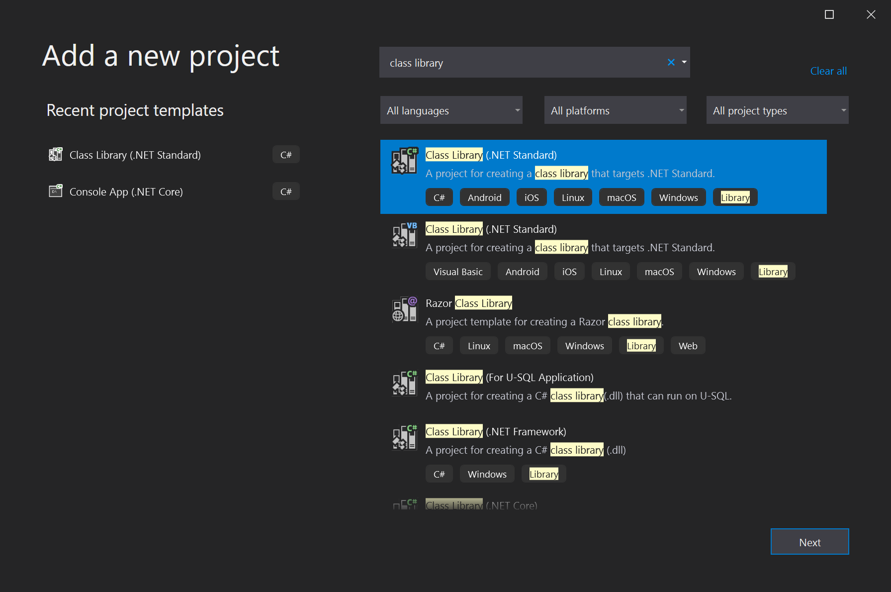
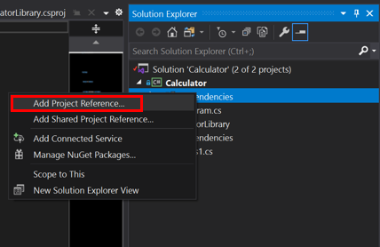
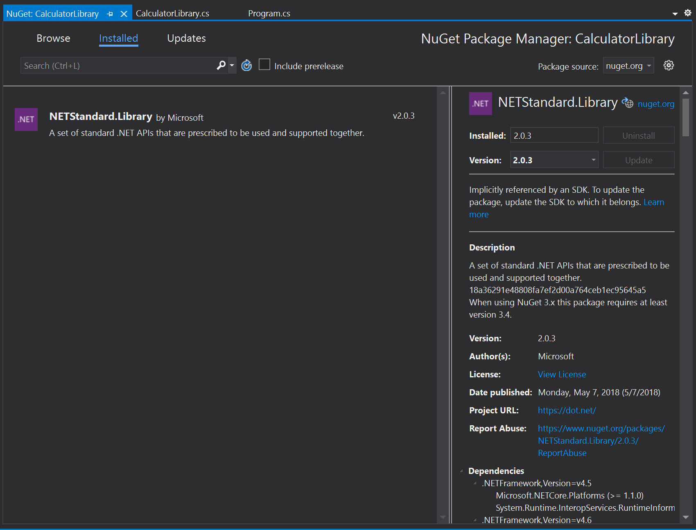

# Tutorial: Extend a simple C# console app

In this tutorial, you'll learn how to use Visual Studio to extend the console app you created in the first part. You'll learn some of the features in Visual Studio that you'll need for daily development, such as managing multiple projects, and referencing third-party packages.

If you just completed the [first part](tutorial-console.md) of this series, you already have the Calculator console app.  To skip part 1, you can start by opening the project from a GitHub repo. The C# Calculator app is in the [vs-tutorial-samples repo](https://github.com/MicrosoftDocs/vs-tutorial-samples), so you can just follow the steps in [Tutorial: Open a project from a repo](../tutorial-open-project-from-repo.md) to get started.

## Add a new project

Real-world code involves many projects working together in a solution. Now, let's add another project to the Calculator app. This will be a class library that provides some of the calculator functions.

1. In Visual Studio, you can use the top-level menu command **File** > **Add** > **New Project** to add a new project, but you can also right-click on the existing project name (called the "project node") and open up the project's shortcut menu (or context menu). This shortcut menu contains many ways to add functionality to your projects. So, right-click on your project node in **Solution Explorer**, and choose **Add** > **New Project**.

1. Choose the C# project template **Class library (.NET Standard)**.

   

1. Type the project name **CalculatorLibrary**, and choose **Create**. Visual Studio creates the new project and adds it to the solution.

   

1. Instead of having *Class1.cs*, rename the file **CalculatorLibrary.cs**. You can click on the name in **Solution Explorer** to rename it, or right-click and choose **Rename**, or press the **F2** key.

   You might get asked if you want to rename any references to `Class1` in the file. It doesn't matter how you answer, since you'll be replacing the code in a future step.

1. We now have to add a project reference, so that the first project can use APIs exposed by the new class library.  Right-click on the **References** node in the first project and choose **Add Project Reference**.

   

   The **Reference Manager** dialog box appears. This dialog box lets you add references to other projects, as well assemblies and COM DLLs that your projects need.

   

1. In the **Reference Manager** dialog box, select the checkbox for the **CalculatorLibrary** project, and choose **OK**.  The project reference appears under a **Projects** node in **Solution Explorer**.

   

1. In *Program.cs*, select the `Calculator` class and all its code, and press **CTRL+X** to cut it from Program.cs. Then in **CalculatorLibrary**, in *CalculatorLibrary.cs*, paste the code into the `CalculatorLibrary` namespace. Then, make the Calculator class `public` to expose it outside the library. The code in *CalculatorLibrary.cs* should now resemble the following code:

   ```csharp
   using System;

    namespace CalculatorLibrary
    {
        public class Calculator
        {
            public static double DoOperation(double num1, double num2, string op)
            {
                double result = double.NaN; // Default value is "not-a-number" which we use if an operation, such as division, could result in an error.

                // Use a switch statement to do the math.
                switch (op)
                {
                    case "a":
                        result = num1 + num2;
                        break;
                    case "s":
                        result = num1 - num2;
                        break;
                    case "m":
                        result = num1 * num2;
                        break;
                    case "d":
                        // Ask the user to enter a non-zero divisor.
                        if (num2 != 0)
                        {
                            result = num1 / num2;
                        }
                        break;
                    // Return text for an incorrect option entry.
                    default:
                        break;
                }
                return result;
            }
        }
    }
   ```

1. The first project has a reference, but you'll see an error that the Calculator.DoOperation call doesn't resolve. That's because CalculatorLibrary is in a difference namespace, so add `CalculatorLibrary` namespace for a fully qualified reference.

   ```csharp
   result = CalculatorLibrary.Calculator.DoOperation(cleanNum1, cleanNum2, op);
   ```

   Try adding a using directive to the beginning of the file instead:

   ```csharp
   using CalculatorLibrary;
   ```

   This change should let you remove the CalculatorLibrary namespace from the call site, but there's now an ambiguity. Is `Calculator` the class in CalculatorLibrary, or is Calculator the namespace?  To resolve the ambiguity, rename the namespace `CalculatorProgram`.

   ```csharp
   namespace CalculatorProgram
   ```

## Reference .NET libraries: write to a log

1. Suppose you now want to add a log of all the operations, and write it out to a text file. The .NET `Trace` class provides this functionality. (It's useful for basic print debugging techniques as well.)  The Trace class is in System.Diagnostics, and we'll need System.IO classes like `StreamWriter`, so start by adding the using directives:

   ```csharp
   using System.IO;
   using System.Diagnostics;
   ```

1. Looking at how the Trace class is used, you need to hold onto a reference for the class, which is associated with a filestream. That means, the calculator would work better as an object, so let's add a constructor.

   ```csharp
   public Calculator()
        {
            StreamWriter logFile = File.CreateText("calculator.log");
            Trace.Listeners.Add(new TextWriterTraceListener(logFile));
            Trace.AutoFlush = true;
            Trace.WriteLine("Starting Calculator Log");
            Trace.WriteLine(String.Format("Started {0}", System.DateTime.Now.ToString()));
        }

    public double DoOperation(double num1, double num2, string op)
        {
   ```

1. And we need to change the static `DoOperation` method into a member method.  Let's also add output to each calculation for the log, so that DoOperation looks like the following code:

   ```csharp
   public double DoOperation(double num1, double num2, string op)
   {
        double result = double.NaN; // Default value is "not-a-number" which we use if an operation, such as division, could result in an error.

        // Use a switch statement to do the math.
        switch (op)
        {
            case "a":
                result = num1 + num2;
                Trace.WriteLine(String.Format("{0} + {1} = {2}", num1, num2, result));
                break;
            case "s":
                result = num1 - num2;
                Trace.WriteLine(String.Format("{0} - {1} = {2}", num1, num2, result));
                break;
            case "m":
                result = num1 * num2;
                Trace.WriteLine(String.Format("{0} * {1} = {2}", num1, num2, result));
                break;
            case "d":
                // Ask the user to enter a non-zero divisor.
                if (num2 != 0)
                {
                    result = num1 / num2;
                    Trace.WriteLine(String.Format("{0} / {1} = {2}", num1, num2, result));
                }
                    break;
            // Return text for an incorrect option entry.
            default:
                break;
        }
        return result;
    }
   ```

1. Now back in Program.cs, the static call is flagged with a red squiggly. To fix it, create a `calculator` variable by adding the following line just before the while loop:

   ```csharp
   Calculator calculator = new Calculator();
   ```

   And modify the call site for `DoOperation` as follows:

   ```csharp
   result = calculator.DoOperation(cleanNum1, cleanNum2, op);
   ```

1. Run the program again, and when done, right-click on the project node and choose **Open folder in File Explorer**, then navigate down in File Explorer to the output folder. It might be *bin/Debug/netcoreapp3.1*, and open the *calculator.log* file.

    ```output
    Starting Calculator Log
    Started 7/9/2020 1:58:19 PM
    1 + 2 = 3
    3 * 3 = 9
    ```

## Add a NuGet Package: write to a JSON file

1. Now suppose we want to output the operations in a JSON format, a popular and portable format for storing object data. To implement that functionality, we will need to reference the NuGet package Newtonsoft.Json. NuGet packages are the primary vehicle for distribution of .NET class libraries. In **Solution Explorer**, right-click on the **References** node for the CalculatorLibrary project, and choose **Manage NuGet Packages**.

   

   The NuGet Package Manager opens.

   

1. Search for Newtonsoft.Json package, and choose **Install**.

   

   The package is downloaded, and added to your project and a new entry appears in the References node in **Solution Explorer**.

1. Add a using directive for the System.IO and Newtonsoft.Json package at the beginning of *CalculatorLibrary.cs*.

   ```csharp
   using Newtonsoft.Json;
   ```

1. Now replace the constructor for Calculator with the following code, and create the JsonWriter member object:

   ```csharp
        JsonWriter writer;

        public Calculator()
        {
            StreamWriter logFile = File.CreateText("calculatorlog.json");
            logFile.AutoFlush = true;
            writer = new JsonTextWriter(logFile);
            writer.Formatting = Formatting.Indented;
            writer.WriteStartObject();
            writer.WritePropertyName("Operations");
            writer.WriteStartArray();
        }
   ```

1. Modify the `DoOperation` method to add the JSON writer code:

   ```csharp
        public double DoOperation(double num1, double num2, string op)
        {
            double result = double.NaN; // Default value is "not-a-number" which we use if an operation, such as division, could result in an error.
            writer.WriteStartObject();
            writer.WritePropertyName("Operand1");
            writer.WriteValue(num1);
            writer.WritePropertyName("Operand2");
            writer.WriteValue(num2);
            writer.WritePropertyName("Operation");
            // Use a switch statement to do the math.
            switch (op)
            {
                case "a":
                    result = num1 + num2;
                    writer.WriteValue("Add");
                    break;
                case "s":
                    result = num1 - num2;
                    writer.WriteValue("Subtract");
                    break;
                case "m":
                    result = num1 * num2;
                    writer.WriteValue("Multiply");
                    break;
                case "d":
                    // Ask the user to enter a non-zero divisor.
                    if (num2 != 0)
                    {
                        result = num1 / num2;
                        writer.WriteValue("Divide");
                    }
                    break;
                // Return text for an incorrect option entry.
                default:
                    break;
            }
            writer.WritePropertyName("Result");
            writer.WriteValue(result);
            writer.WriteEndObject();

            return result;
        }
   ```

1. You'll need to add a method to finish the JSON syntax once the user is done entering operation data.

   ```csharp
    public void Finish()
    {
        writer.WriteEndArray();
        writer.WriteEndObject();
        writer.Close();
    }
   ```

1. And in *Program.cs*, add a call to Finish at the end.

   ```csharp
            // And call to close the JSON writer before return
            calculator.Finish();
            return;
        }
   ```

1. Build and run the app, and after you're done entering a few operations, close the app properly by using the 'n' command.  Now, open the calculatorlog.json file and you should see something like the following:

   ```json
   {
    "Operations": [
        {
        "Operand1": 2.0,
        "Operand2": 3.0,
        "Operation": "Add",
        "Result": 5.0
        },
        {
        "Operand1": 3.0,
        "Operand2": 4.0,
        "Operation": "Multiply",
        "Result": 12.0
        }
    ]
   }
   ```

## Debug: set and hit a breakpoint

The Visual Studio debugger is a powerful tool that allows you to run your code step by step, to find the exact point where you made a programming mistake. You then understand what corrections you need to make in your code. Visual Studio allows you to make temporary changes so you can continue running the program.

1. In *Program.cs*, click the margin to the left of the following code (or, open the shortcut menu and choose **Breakpoint** > **Insert Breakpoint**, or press **F9**):

   ```csharp
   result = calculator.DoOperation(cleanNum1, cleanNum2, op);
   ```

   The red circle that appears indicates a breakpoint. You can use breakpoints to pause your app and inspect code. You can set a breakpoint on any executable line of code.

   

1. Build and run the app.

1. In the running app, type some values for the calculation:

   - For the first number, type **8** and enter it.
   - For the second number, type **0** and enter it.
   - For the operator, let's have some fun; type **d** and enter it.

   The app suspends where you created the breakpoint, which is indicated by the yellow pointer on the left and the highlighted code. The highlighted code has not yet executed.

   

   Now, with the app suspended you can inspect your application state.

## Debug: view variables

1. In the highlighted code, hover over variables such as `cleanNum1` and `op`. You see the current values for these variables (`8` and `d`, respectively), which appear in DataTips.

   

   When debugging, checking to see whether variables hold the values you expect them to hold is often critical to fixing issues.

2. In the lower pane, look at the **Locals** window. (If it's closed, choose **Debug** > **Windows** > **Locals** to open it.)

   In the Locals window, you see each variable that is currently in scope, along with its value and type.

   

3. Look at the **Autos** window.

   The Autos window is similar to the **Locals** window, but it shows the variables immediately preceding and following the current line of code where your app is paused.

   Next, you will execute code in the debugger one statement at a time, which is called *stepping*.

## Debug: step through code

1. Press **F11** (or **Debug** > **Step Into**).

   Using the Step Into command, the app executes the current statement and advances to the next executable statement (usually the next line of code). The yellow pointer on the left always indicates the current statement.

   

   You've just stepped into the `DoOperation` method in the `Calculator` class.

1. To get a hierarchical look at your program flow, look at the **Call Stack** window. (If it's closed, choose **Debug** > **Windows** > **Call Stack**.)

   

   This view shows the current `Calculator.DoOperation` method, indicated by the yellow pointer, and the second row shows the function that called it, from the `Main` method in *Program.cs*. The **Call Stack** window shows the order in which methods and functions are getting called. In addition, it provides access to many debugger features, such as **Go to Source Code**, from the shortcut menu.

1. Press **F10** (or **Debug** > **Step Over**) several times until the app pauses on the `switch` statement.

   ```csharp
   switch (op)
   {
   ```

   The Step Over command is similar to the Step Into command, except that if the current statement calls a function, the debugger runs the code in the called function and doesn't suspend execution until the function returns. Step Over is a faster way to navigate code if you're not interested in a particular function.

1. Press **F10** one more time so that the app pauses on the following line of code.

   ```csharp
   if (num2 != 0)
   {
   ```

   This code checks for a divide-by-zero case. If the app continues, it will throw a general exception (an error), but let's say you consider this a bug, and want to do something else, like view the actual returned value in the console. One option is to use a debugger feature called Edit-and-continue to make changes to the code and then continue debugging. However, we will show you a different trick to temporarily modify the execution flow.

## Debug: test a temporary change

1. Select the yellow pointer, currently paused on the `if (num2 != 0)` statement, and drag it to the following statement.

   ```csharp
   result = num1 / num2;
   ```

   By doing this, the app completely skips the `if` statement, so you can see what happens when you divide by zero.

1. Press **F10** to execute the line of code.

1. Hover over the `result` variable and you see it stores a value of `Infinity`.

   In C#, `Infinity` is the result when you divide by zero.

1. Press **F5** (or, **Debug** > **Continue Debugging**).

   The Infinity symbol shows up in the console as the result of the math operation.

1. Close the app properly by using the 'n' command.

## Next steps

Congratulations on completing this tutorial! To learn even more, continue with the following tutorials.

> [!div class="nextstepaction"]
> [Continue with more C# tutorials](/dotnet/csharp/tutorials/)

> [!div class="nextstepaction"]
> [Continue with Visual Studio IDE overview](/../visual-studio-ide.md)

## See also

* [C# IntelliSense](../../ide/visual-csharp-intellisense.md)
* [Learn to debug C# code in Visual Studio](tutorial-debugger.md)
