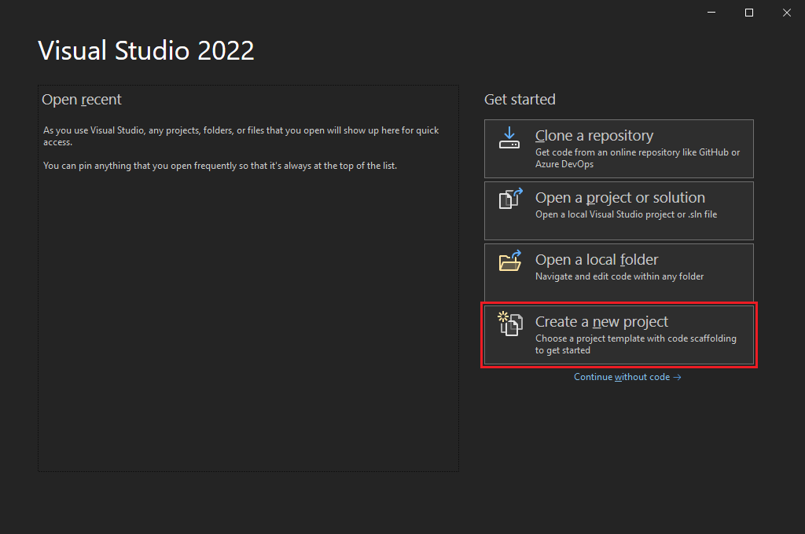
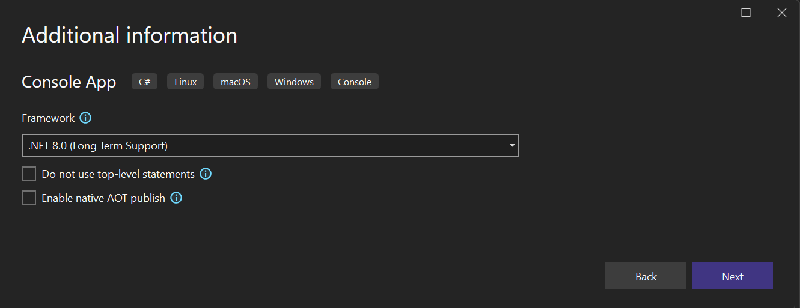
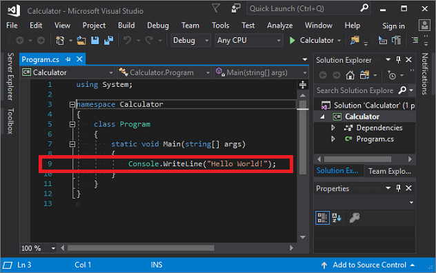
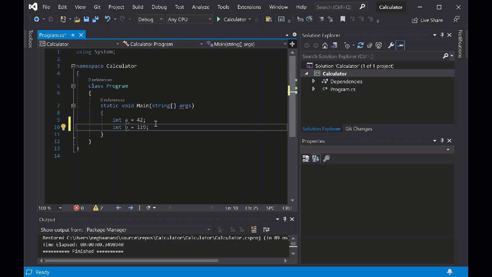
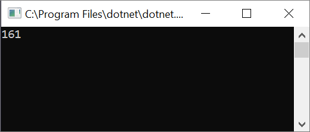
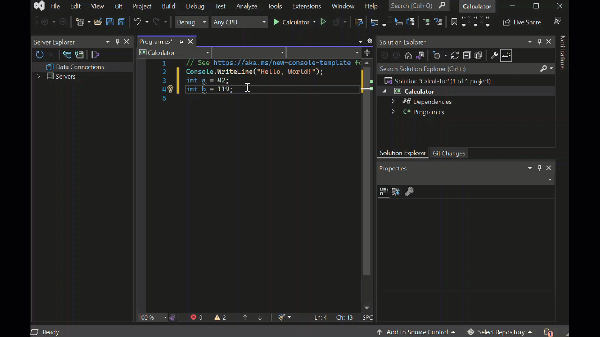
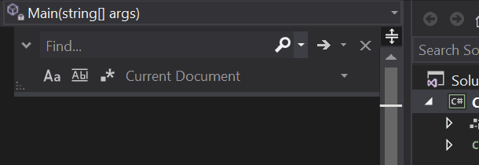
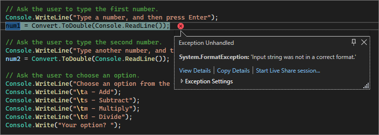

# Tutorial: Create a simple C# console app in Visual Studio (part 1 of 2)

 [!INCLUDE [Visual Studio](~/includes/applies-to-version/vs-windows-only.md)]

In this tutorial, you use Visual Studio to create and run a C# console app, and explore some features of the Visual Studio integrated development environment (IDE). This tutorial is part 1 of a two-part tutorial series.

In this tutorial, you:

> [!div class="checklist"]
> * Create a Visual Studio project.
> * Create a C# console app.
> * Debug your app.
> * Close your app.
> * Inspect your complete code.

[In part 2](tutorial-console-part-2.md), you extend this app to add more projects, learn debugging tricks, and reference third-party packages.

## Prerequisites

You must have Visual Studio installed.

If you haven't already installed Visual Studio, go to the [Visual Studio downloads](https://visualstudio.microsoft.com/downloads/?cid=learn-onpage-download-cta) page to install it for free.

## Create a project

To start, create a C# application project. The project type comes with all the template files you need.

::: moniker range="vs-2019"

1. Open Visual Studio, and choose **Create a new project** in the Start window.

   

1. In the **Create a new project** window, choose **C#** from the Language list. Next, choose **Windows** from the Platform list and **Console** from the project types list.

   After you apply the language, platform, and project type filters, choose the **Console Application** template, and then select **Next**.

   > [!NOTE]
   > If you don't see the **Console Application** template, select **Install more tools and features**.
   >
   > 
   >
   > Then, in the Visual Studio Installer, choose the **.NET Core cross-platform development** workload.
   >
   > 
   >
   > After that, choose the **Modify** button in the Visual Studio Installer. You might be prompted to save your work; if so, do so. Next, choose **Continue** to install the workload. Then, return to step 2 in this "[Create a project](#create-a-project)" procedure.

1. In the **Configure your new project** window, type or enter *Calculator* in the **Project name** box. Then, choose **Next**.

    :::image type="content" source="./media/vs-2019/csharp-name-your-calculator-project.png" alt-text="Screenshot that shows naming your project 'Calculator' in the 'Configure your new project' window.":::

1. In the **Additional information** window, **.NET Core 3.1** should already be selected for your target framework. If not, select **.NET Core 3.1**. Then, choose **Create**.

    :::image type="content" source="./media/vs-2019/csharp-target-framework.png" alt-text="Screenshot that shows making sure .NET Core 3.1 is selected in the 'In the 'Additional information' window.":::

   Visual Studio opens your new project, which includes default "Hello World" code.
   To view it in the editor, select the code file *Program.cs* in the Solution Explorer window, which is typically on the right-hand side of Visual Studio.

   The default "Hello World" code calls the <xref:System.Console.WriteLine%2A> method to display the literal string "Hello, World!" in the console window. If you press F5, you can run the default program in Debug mode. After the application runs in the debugger, the console window stays open. Press any key to close the console window.

::: moniker-end
::: moniker range=">=vs-2022"

1. Open Visual Studio, and choose **Create a new project** in the Start window.

   

1. In the **Create a new project** window, select **All languages**, and then choose **C#** from the dropdown list. Choose **Windows** from the **All platforms** list, and choose **Console** from the **All project types** list.

   After you apply the language, platform, and project type filters, choose the **Console App** template, and then select **Next**.

   > [!NOTE]
   > If you don't see the **Console App** template, select **Install more tools and features**.
   >
   > 
   >
   > In the Visual Studio Installer, choose the **.NET desktop development** workload, and then select **Modify**.
   >
   > 

1. In the **Configure your new project** window, type or enter *Calculator* in the **Project name** box, and then select **Next**.

   

1. In the **Additional information** window, select **.NET 7.0** for your target framework, then select **Create**.

   

   Visual Studio opens your new project, which includes default "Hello World" code.

   To view it in the editor, select the code file *Program.cs* in the Solution Explorer window, which is typically on the right-hand side of Visual Studio.

   The single code statement calls the <xref:System.Console.WriteLine%2A> method to display the literal string "Hello, World!" in the console window. If you press F5, you can run the default program in Debug mode. After the application runs in the debugger, the console window stays open. Press any key to close the console window.
   
   > [!NOTE]
   > Starting with .NET 6, new projects using the console template generate different code than previous versions. To learn more, see the [New C# templates generate top-level statements](/dotnet/core/tutorials/top-level-templates) page. 

::: moniker-end

## Create the app

In this section, you:

- Explore some basic integer math in C#.
- Add code to create a basic calculator app.
- Debug the app to find and fix errors.
- Refine the code to make it more efficient.

### Explore integer math

Start with some basic integer math in C#.

::: moniker range="<=vs-2019"
1. In the code editor, delete the default "Hello World" code.

    

   Specifically, delete the line that says, `Console.WriteLine("Hello World!");`.

1. In its place, type the following code:

    ```csharp
            int a = 42;
            int b = 119;
            int c = a + b;
            Console.WriteLine(c);
            Console.ReadKey();
    ```

    Notice that when you do so, the IntelliSense feature in Visual Studio offers you the option to autocomplete the entry.

    

1. Choose the green **Start** button next to **Calculator** to build and run your program, or press **F5**.

   

   A console window opens that reveals the sum of 42 + 119, which is **161**.

    

1. **(Optional)** You can change the operator to change the result. For example, you can change the `+` operator in the `int c = a + b;` line of code to `-` for subtraction, `*` for multiplication, or `/` for division. Then, when you run the program, the result changes, too.

1. Close the console window.
::: moniker-end

::: moniker range=">=vs-2022"
1. In **Solution Explorer**, in the right pane, select **Program.cs** to display the file in the code editor

1. In the code editor, replace the default "Hello World" code that says `Console.WriteLine("Hello World!");`.

    

   Replace the line with the following code:

   ```csharp
       int a = 42;
       int b = 119;
       int c = a + b;
       Console.WriteLine(c);
       Console.ReadKey();
   ```

    If you type the code, the Visual Studio IntelliSense feature offers you the option to autocomplete the entry.

    

1. To build and run your app, press **F5**, or select the green arrow next to the name **Calculator** in the top toolbar.

   

   A console window opens that shows the sum of 42 + 119, which is **161**.

    

1. Close the console window.

1. Optionally, you can change the operator to change the result. For example, you can change the `+` operator in the `int c = a + b;` line of code to `-` for subtraction, `*` for multiplication, or `/` for division. When you run the app, the result changes accordingly.

::: moniker-end

### Add code to create a calculator

Continue by adding a more complex set of calculator code to your project.

::: moniker range="<=vs-2019"

1. In the code editor, replace all the code in *Program.cs* with the following new code:

    ```csharp
        using System;

        namespace Calculator
        {
            class Program
            {
                static void Main(string[] args)
                {
                    // Declare variables and then initialize to zero.
                    int num1 = 0; int num2 = 0;
    
                    // Display title as the C# console calculator app.
                    Console.WriteLine("Console Calculator in C#\r");
                    Console.WriteLine("------------------------\n");
    
                    // Ask the user to type the first number.
                    Console.WriteLine("Type a number, and then press Enter");
                    num1 = Convert.ToInt32(Console.ReadLine());
    
                    // Ask the user to type the second number.
                    Console.WriteLine("Type another number, and then press Enter");
                    num2 = Convert.ToInt32(Console.ReadLine());
    
                    // Ask the user to choose an option.
                    Console.WriteLine("Choose an option from the following list:");
                    Console.WriteLine("\ta - Add");
                    Console.WriteLine("\ts - Subtract");
                    Console.WriteLine("\tm - Multiply");
                    Console.WriteLine("\td - Divide");
                    Console.Write("Your option? ");
    
                    // Use a switch statement to do the math.
                    switch (Console.ReadLine())
                    {
                        case "a":
                            Console.WriteLine($"Your result: {num1} + {num2} = " + (num1 + num2));
                            break;
                        case "s":
                            Console.WriteLine($"Your result: {num1} - {num2} = " + (num1 - num2));
                            break;
                        case "m":
                            Console.WriteLine($"Your result: {num1} * {num2} = " + (num1 * num2));
                            break;
                        case "d":
                            Console.WriteLine($"Your result: {num1} / {num2} = " + (num1 / num2));
                            break;
                    }
                    // Wait for the user to respond before closing.
                    Console.Write("Press any key to close the Calculator console app...");
                    Console.ReadKey();
                }
            }
        }
    ```

1. Select the **Calculator** button or press **F5** to run your app.

   A console window opens.

1. In the console window, follow the prompts to add the numbers **42** and **119** together.

   Your app should look similar to the following screenshot:

    

::: moniker-end

::: moniker range=">=vs-2022"

1. In the code editor, replace all the code in *Program.cs* with the following new code:

    ```csharp
        // Declare variables and then initialize to zero.
        int num1 = 0; int num2 = 0;
    
        // Display title as the C# console calculator app.
        Console.WriteLine("Console Calculator in C#\r");
        Console.WriteLine("------------------------\n");
    
        // Ask the user to type the first number.
        Console.WriteLine("Type a number, and then press Enter");
        num1 = Convert.ToInt32(Console.ReadLine());
    
        // Ask the user to type the second number.
        Console.WriteLine("Type another number, and then press Enter");
        num2 = Convert.ToInt32(Console.ReadLine());
    
        // Ask the user to choose an option.
        Console.WriteLine("Choose an option from the following list:");
        Console.WriteLine("\ta - Add");
        Console.WriteLine("\ts - Subtract");
        Console.WriteLine("\tm - Multiply");
        Console.WriteLine("\td - Divide");
        Console.Write("Your option? ");
    
        // Use a switch statement to do the math.
        switch (Console.ReadLine())
        {
            case "a":
                Console.WriteLine($"Your result: {num1} + {num2} = " + (num1 + num2));
                break;
            case "s":
                Console.WriteLine($"Your result: {num1} - {num2} = " + (num1 - num2));
                break;
            case "m":
                Console.WriteLine($"Your result: {num1} * {num2} = " + (num1 * num2));
                break;
            case "d":
                Console.WriteLine($"Your result: {num1} / {num2} = " + (num1 / num2));
                break;
        }
        // Wait for the user to respond before closing.
        Console.Write("Press any key to close the Calculator console app...");
        Console.ReadKey();
    ```

1. Select the **Calculator** button or press **F5** to run your app.

   A console window opens.

1. In the console window, follow the prompts to add the numbers **42** and **119** together.

   Your app should look similar to the following screenshot:

    

::: moniker-end

### Add decimal functionality

Now, tweak the code to add more functionality.

The current calculator app only accepts and returns whole numbers. For example, if you run the app and divide the number 42 by the number 119, your result is zero, which isn't exact.


To fix the code to improve precision by handling decimals:

1. From *Program.cs* in the Visual Studio editor, press **Ctrl**+**H** to open the **Find and Replace** control.

1. Type *int* in the control, and type *float* in the **Replace** field.

1. Select the icons for **Match case** and **Match whole word** in the control, or press **Alt**+**C** and **Alt**+**W**.

1. Select the **Replace all** icon or press **Alt**+**A** to run the search and replace.

    

1. Run your calculator app again, and divide the number **42** by the number **119**.

   The app now returns a decimal number instead of zero.

    

Now the app can produce decimal results. Make a few more tweaks to the code so the app can calculate decimals too.

1. Use the **Find and Replace** control to change each instance of the `float` variable to `double`, and to change each instance of the `Convert.ToInt32` method to `Convert.ToDouble`.

1. Run your calculator app, and divide the number **42.5** by the number **119.75**.

   The app now accepts decimal values, and returns a longer decimal numeral as its result.

    

   In the [Revise the code](#revise-the-code) section, you reduce the number of decimal places in the results.

## Debug the app

You've improved your basic calculator app, but your app doesn't yet handle exceptions, such as user input errors. For example, if users try to divide by zero, or enter an unexpected character, the app might stop working, return an error, or return an unexpected nonnumeric result.

Let's walk through a few common user input errors, locate them in the debugger if they appear there, and fix them in the code.

> [!TIP]
> For more information about the debugger and how it works, see [First look at the Visual Studio debugger](../../debugger/debugger-feature-tour.md).

### Fix the "divide by zero" error

If you try to divide a number by zero, the console app might freeze, and then shows you what's wrong in the code editor.

   

> [!NOTE]
> Sometimes the app doesn't freeze, and the debugger doesn't show a divide-by-zero error. Instead, the app might return an unexpected nonnumeric result, such as an infinity symbol. The following code fix still applies.

To change the code to handle this error:

1. In *Program.cs*, replace the code for `case "d":` with the following code:

   ```csharp
            // Ask the user to enter a non-zero divisor until they do so.
                while (num2 == 0)
                {
                    Console.WriteLine("Enter a non-zero divisor: ");
                    num2 = Convert.ToInt32(Console.ReadLine());
                }
                Console.WriteLine($"Your result: {num1} / {num2} = " + (num1 / num2));
                break;
        }
    ```

   After you replace the code, the section with the `switch` statement should look similar to the following screenshot:

   

Now, when you divide any number by zero, the app asks for another number, and keeps asking until you provide a nonzero number.

   

### Fix the "format" error

If you enter an alphabetic character when the app expects a numeric character, the app freezes. Visual Studio shows you what's wrong in the code editor.

   ::: moniker range="<=vs-2019"
   
   ::: moniker-end
   ::: moniker range=">=vs-2022"
   
   ::: moniker-end

To prevent this exception, you can refactor the code you've previously entered.

#### Revise the code

Rather than rely on the `program` class to handle all the code, you can divide your app into two classes: `Calculator` and `Program`.

The `Calculator` class handles the bulk of the calculation work, and the `Program` class handles the user interface and error-handling work.

Let's get started.

1. In *Program.cs*, delete everything and add the following new `Calculator` class:

    ```csharp
    class Calculator
    {
        public static double DoOperation(double num1, double num2, string op)
        {
            double result = double.NaN; // Default value is "not-a-number" if an operation, such as division, could result in an error.

            // Use a switch statement to do the math.
            switch (op)
            {
                case "a":
                    result = num1 + num2;
                    break;
                case "s":
                    result = num1 - num2;
                    break;
                case "m":
                    result = num1 * num2;
                    break;
                case "d":
                    // Ask the user to enter a non-zero divisor.
                    if (num2 != 0)
                    {
                        result = num1 / num2;
                    }
                    break;
                // Return text for an incorrect option entry.
                default:
                    break;
            }
            return result;
        }
    }

    ```

1. Also add a new  `Program` class, as follows:

    ```csharp
    class Program
    {
        static void Main(string[] args)
        {
            bool endApp = false;
            // Display title as the C# console calculator app.
            Console.WriteLine("Console Calculator in C#\r");
            Console.WriteLine("------------------------\n");

            while (!endApp)
            {
                // Declare variables and set to empty.
                string numInput1 = "";
                string numInput2 = "";
                double result = 0;

                // Ask the user to type the first number.
                Console.Write("Type a number, and then press Enter: ");
                numInput1 = Console.ReadLine();

                double cleanNum1 = 0;
                while (!double.TryParse(numInput1, out cleanNum1))
                {
                    Console.Write("This is not valid input. Please enter an integer value: ");
                    numInput1 = Console.ReadLine();
                }

                // Ask the user to type the second number.
                Console.Write("Type another number, and then press Enter: ");
                numInput2 = Console.ReadLine();

                double cleanNum2 = 0;
                while (!double.TryParse(numInput2, out cleanNum2))
                {
                    Console.Write("This is not valid input. Please enter an integer value: ");
                    numInput2 = Console.ReadLine();
                }

                // Ask the user to choose an operator.
                Console.WriteLine("Choose an operator from the following list:");
                Console.WriteLine("\ta - Add");
                Console.WriteLine("\ts - Subtract");
                Console.WriteLine("\tm - Multiply");
                Console.WriteLine("\td - Divide");
                Console.Write("Your option? ");

                string op = Console.ReadLine();

                try
                {
                    result = Calculator.DoOperation(cleanNum1, cleanNum2, op);
                    if (double.IsNaN(result))
                    {
                        Console.WriteLine("This operation will result in a mathematical error.\n");
                    }
                    else Console.WriteLine("Your result: {0:0.##}\n", result);
                }
                catch (Exception e)
                {
                    Console.WriteLine("Oh no! An exception occurred trying to do the math.\n - Details: " + e.Message);
                }

                Console.WriteLine("------------------------\n");

                // Wait for the user to respond before closing.
                Console.Write("Press 'n' and Enter to close the app, or press any other key and Enter to continue: ");
                if (Console.ReadLine() == "n") endApp = true;

                Console.WriteLine("\n"); // Friendly linespacing.
            }
            return;
        }
    }
    ```

1. Select the **Calculator** button or press **F5** to run your app.

1. Follow the prompts and divide the number **42** by the number **119**. Your results should look similar to the following screenshot:

   ::: moniker range="<=vs-2019"
   
   ::: moniker-end
   ::: moniker range=">=vs-2022"
   
   ::: moniker-end

   You can now run more calculations until you choose to close the console app. There are also fewer decimal places in the results. And if you enter an incorrect character, you get an appropriate error response.

## Close the app

1. If you haven't already done so, close the Calculator app.

1. Close the **Output** pane in Visual Studio.

   

1. In Visual Studio, press **Ctrl**+**S** to save your app.

[!INCLUDE[../includes/git-source-control.md](../includes/git-source-control.md)]

## Review: Code complete

In this tutorial, you made many changes to the Calculator app. The app now handles computing resources more efficiently, and handles most user input errors.

Here's the complete code, all in one place:

```csharp

class Calculator
{
    public static double DoOperation(double num1, double num2, string op)
    {
        double result = double.NaN; // Default value is "not-a-number" which we use if an operation, such as division, could result in an error.

        // Use a switch statement to do the math.
        switch (op)
        {
            case "a":
                result = num1 + num2;
                break;
            case "s":
                result = num1 - num2;
                break;
            case "m":
                result = num1 * num2;
                break;
            case "d":
                // Ask the user to enter a non-zero divisor.
                if (num2 != 0)
                {
                    result = num1 / num2;
                }
                break;
            // Return text for an incorrect option entry.
            default:
                break;
        }
        return result;
    }
}

class Program
{
    static void Main(string[] args)
    {
        bool endApp = false;
        // Display title as the C# console calculator app.
        Console.WriteLine("Console Calculator in C#\r");
        Console.WriteLine("------------------------\n");

        while (!endApp)
        {
            // Declare variables and set to empty.
            string numInput1 = "";
            string numInput2 = "";
            double result = 0;

            // Ask the user to type the first number.
            Console.Write("Type a number, and then press Enter: ");
            numInput1 = Console.ReadLine();

            double cleanNum1 = 0;
            while (!double.TryParse(numInput1, out cleanNum1))
            {
                Console.Write("This is not valid input. Please enter an integer value: ");
                numInput1 = Console.ReadLine();
            }

            // Ask the user to type the second number.
            Console.Write("Type another number, and then press Enter: ");
            numInput2 = Console.ReadLine();

            double cleanNum2 = 0;
            while (!double.TryParse(numInput2, out cleanNum2))
            {
                Console.Write("This is not valid input. Please enter an integer value: ");
                numInput2 = Console.ReadLine();
            }

            // Ask the user to choose an operator.
            Console.WriteLine("Choose an operator from the following list:");
            Console.WriteLine("\ta - Add");
            Console.WriteLine("\ts - Subtract");
            Console.WriteLine("\tm - Multiply");
            Console.WriteLine("\td - Divide");
            Console.Write("Your option? ");

            string op = Console.ReadLine();

            try
            {
                result = Calculator.DoOperation(cleanNum1, cleanNum2, op);
                if (double.IsNaN(result))
                {
                    Console.WriteLine("This operation will result in a mathematical error.\n");
                }
                else Console.WriteLine("Your result: {0:0.##}\n", result);
            }
            catch (Exception e)
            {
                Console.WriteLine("Oh no! An exception occurred trying to do the math.\n - Details: " + e.Message);
            }

            Console.WriteLine("------------------------\n");

            // Wait for the user to respond before closing.
            Console.Write("Press 'n' and Enter to close the app, or press any other key and Enter to continue: ");
            if (Console.ReadLine() == "n") endApp = true;

            Console.WriteLine("\n"); // Friendly linespacing.
        }
        return;
    }
}

```

## Next steps

Continue with the second part of this tutorial:

> [!div class="nextstepaction"]
> [Tutorial Part 2: Extend and debug your C# console app](tutorial-console-part-2.md)

