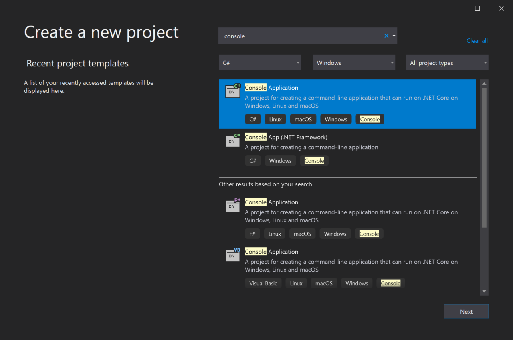
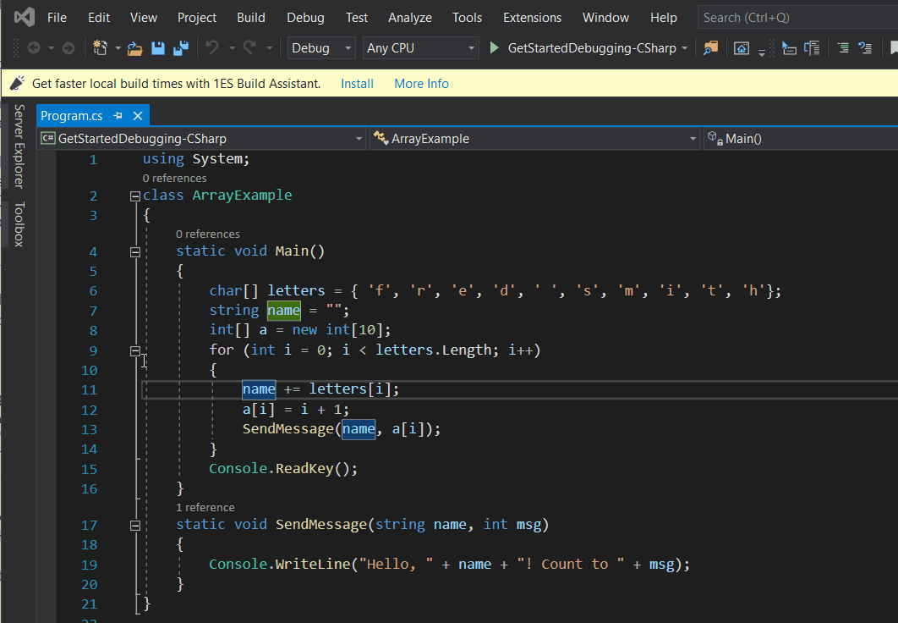
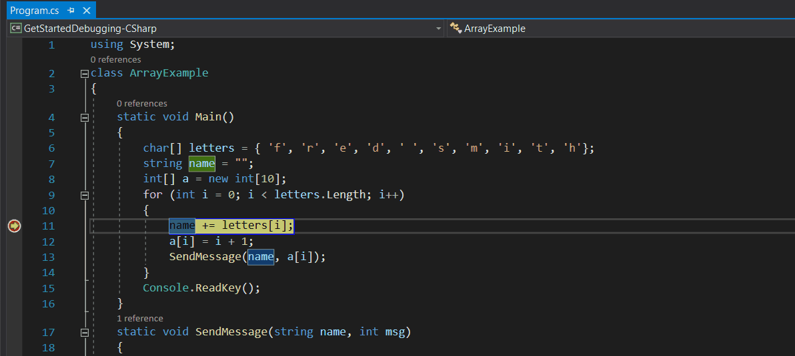
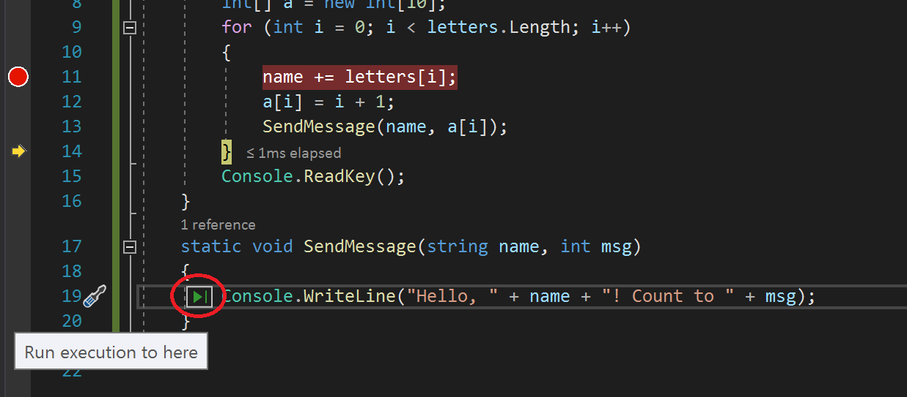
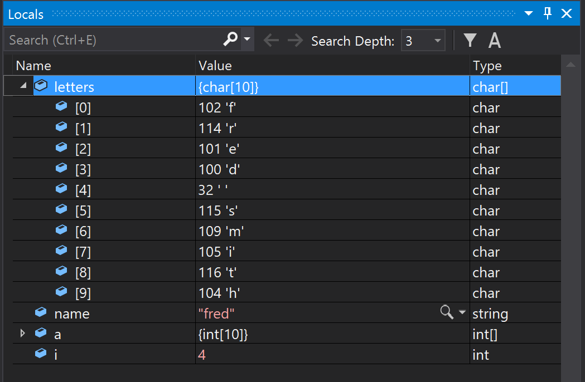

# Tutorial: Learn to debug C# code using Visual Studio

 [!INCLUDE [Visual Studio](~/includes/applies-to-version/vs-windows-only.md)]

This article introduces the features of the Visual Studio debugger in a step-by-step walkthrough. If you want a higher-level view of the debugger features, see [First look at the debugger](../../debugger/debugger-feature-tour.md). When you *debug your app*, it usually means that you are running your application with the debugger attached. When you do this, the debugger provides many ways to see what your code is doing while it runs. You can step through your code and look at the values stored in variables, you can set watches on variables to see when values change, you can examine the execution path of your code, see whether a branch of code is running, and so on. If this is the first time that you've tried to debug code, you might want to read [Debugging for absolute beginners](../../debugger/debugging-absolute-beginners.md) before going through this article.

Although the demo app is C#, most of the features are applicable to C++, Visual Basic, F#, Python, JavaScript, and other languages supported by Visual Studio (F# does not support Edit-and-continue. F# and JavaScript do not support the **Autos** window). The screenshots are in C#.

In this tutorial, you will:

> [!div class="checklist"]
> * Start the debugger and hit breakpoints.
> * Learn commands to step through code in the debugger
> * Inspect variables in data tips and debugger windows
> * Examine the call stack

## Prerequisites

::: moniker range=">=vs-2022"

You must have Visual Studio 2022 installed and the **.NET desktop development** workload.

::: moniker-end

::: moniker range="vs-2019"

You must have Visual Studio 2019 installed and the **.NET Core cross-platform development** workload.

::: moniker-end


If you haven't already installed Visual Studio, go to the [Visual Studio downloads](https://visualstudio.microsoft.com/downloads) page to install it for free.


::: moniker range="<=vs-2019"

If you need to install the workload but already have Visual Studio, go to **Tools** > **Get Tools and Features...**, which opens the Visual Studio Installer. The Visual Studio Installer launches. Choose the **.NET Core cross-platform development** workload, then choose **Modify**.

::: moniker-end

::: moniker range=">=vs-2022"

If you already have Visual Studio but the **.NET desktop development** workload isn't installed, go to **Tools** > **Get Tools and Features...**, which launches the Visual Studio Installer. In the Visual Studio Installer, choose the **.NET desktop development** workload, then choose **Modify**.

::: moniker-end

## Create a project

First, you'll create a .NET Core console application project. The project type comes with all the template files you'll need, before you've even added anything!


::: moniker range="vs-2019"

1. Open Visual Studio.

   If the start window is not open, choose **File** > **Start Window**.

1. On the start window, choose **Create a new project**.

1. On the **Create a new project** window, enter or type *console* in the search box. Next, choose **C#** from the Language list, and then choose **Windows** from the Platform list. 

   After you apply the language and platform filters, choose the **Console Application** template for .NET Core, and then choose **Next**.

   

   > [!NOTE]
   > If you do not see the **Console App** template, you can install it from the **Create a new project** window. In the **Not finding what you're looking for?** message, choose the **Install more tools and features** link. Then, in the Visual Studio Installer, choose the **.NET Core cross-platform development** workload.

1. In the **Configure your new project** window, type or enter *GetStartedDebugging* in the **Project name** box. Then, choose **Next**.

1. Choose either the recommended target framework (.NET Core 3.1 (Long-term support)) or .NET 5.0 (Current) , and then choose **Create**.

   Visual Studio opens your new project.

::: moniker-end

::: moniker range=">=vs-2022"

1. Open Visual Studio.

   If the start window isn't open, choose **File** > **Start Window**.

1. On the start window, choose **Create a new project**.

1. On the **Create a new project** window, enter or type *console* in the search box. Next, choose **C#** from the Language list, and then choose **Windows** from the Platform list. 

   After you apply the language and platform filters, choose the **Console Application** template, and then choose **Next**.

   :::image type="content" source="media/vs-2022/get-started-create-console-project.png" alt-text="Screenshot of the 'Console Application' template in the 'Create a new project' window of Visual Studio 2022.":::

   > [!NOTE]
   > If you don't see the **Console Application** template, you can install it from the **Create a new project** window. In the **Not finding what you're looking for?** message, choose the **Install more tools and features** link. Then, in the Visual Studio Installer, choose the **.NET desktop development** workload.

1. In the **Configure your new project** window, type or enter *GetStartedDebugging* in the **Project name** box. Then, choose **Next**.

1. In the **Additional information** window, ensure that **.NET 6.0 (Long-term support)** is selected in the **Framework** dropdown menu, and then choose **Create**.

    Visual Studio opens your new project.

::: moniker-end

## Create the application

In *Program.cs*, replace all of the default code with the following code:

```csharp
using System;

class ArrayExample
{
    static void Main()
    {
        char[] letters = { 'f', 'r', 'e', 'd', ' ', 's', 'm', 'i', 't', 'h'};
        string name = "";
        int[] a = new int[10];
        for (int i = 0; i < letters.Length; i++)
        {
            name += letters[i];
            a[i] = i + 1;
            SendMessage(name, a[i]);
        }
        Console.ReadKey();
    }

    static void SendMessage(string name, int msg)
    {
        Console.WriteLine("Hello, " + name + "! Count to " + msg);
    }
}
```

## Start the debugger!

::: moniker range="<=vs-2019"

1. Press **F5** (**Debug > Start Debugging**) or the **Start Debugging** button  in the Debug Toolbar.

     **F5** starts the app with the debugger attached to the app process, but right now we haven't done anything special to examine the code. So the app just loads and you'll see this console output.

    ```cmd
    Hello, f! Count to 1
    Hello, fr! Count to 2
    Hello, fre! Count to 3
    Hello, fred! Count to 4
    Hello, fred ! Count to 5
    Hello, fred s! Count to 6
    Hello, fred sm! Count to 7
    Hello, fred smi! Count to 8
    Hello, fred smit! Count to 9
    Hello, fred smith! Count to 10
    ```

     In this tutorial, we'll take a closer look at this app using the debugger and get a look at the debugger features.

1. Stop the debugger by pressing the red stop  button (**Shift** + **F5**).

1. In the console window, press a key to close the console window.

::: moniker-end

::: moniker range=">=vs-2022"

Mostly, we use keyboard shortcuts here, because it's a fast way to execute debugger commands. Equivalent commands, such as toolbar or menu commands, are also noted.

1. To start the debugger, select **F5**, or choose the **Debug Target** button in the Standard toolbar, or choose the **Start Debugging** button in the Debug toolbar, or choose **Debug** > **Start Debugging** from the menu bar.

    :::image type="content" source="media/vs-2022/dbg-tour-start-debugging.png" alt-text="Screenshot of the 'Debug Target' button in the Standard toolbar of Visual Studio 2022.":::

    **F5** starts the app with the debugger attached to the app process. Since we haven't done anything special to examine the code, the app runs to completion and you see the console output.

    ```cmd
    Hello, f! Count to 1
    Hello, fr! Count to 2
    Hello, fre! Count to 3
    Hello, fred! Count to 4
    Hello, fred ! Count to 5
    Hello, fred s! Count to 6
    Hello, fred sm! Count to 7
    Hello, fred smi! Count to 8
    Hello, fred smit! Count to 9
    Hello, fred smith! Count to 10
    ```

1. To stop the debugger, select **Shift+F5**, or choose the **Stop Debugging** button in the Debug toolbar, or choose **Debug** > **Stop Debugging** from the menu bar.

    :::image type="content" source="media/vs-2022/dbg-tour-stop-debugging.png" alt-text="Screenshot of the 'Stop debugging' button in the Debug toolbar of Visual Studio 2022.":::

1. In the console window, select any key to close the console window.

::: moniker-end

## Set a breakpoint and start the debugger

::: moniker range="<=vs-2019"

1. In the `for` loop of the `Main` function, set a breakpoint by clicking the left margin of the following line of code:

    `name += letters[i];`

    A red circle  appears where you set the breakpoint.

    Breakpoints are one of the most basic and essential features of reliable debugging. A breakpoint indicates where Visual Studio should suspend your running code so you can take a look at the values of variables, or the behavior of memory, or whether or not a branch of code is getting run.

1. Press **F5** or the **Start Debugging** button , the app starts, and the debugger runs to the line of code where you set the breakpoint.

    

    The yellow arrow represents the statement on which the debugger paused, which also suspends app execution at the same point (this statement has not yet executed).

     If the app is not yet running, **F5** starts the debugger and stops at the first breakpoint. Otherwise, **F5** continues running the app to the next breakpoint.

    Breakpoints are a useful feature when you know the line of code or the section of code that you want to examine in detail. For information on the different types of breakpoints you can set, such as conditional breakpoints, see [Using breakpoints](../../debugger/using-breakpoints.md).

::: moniker-end

::: moniker range=">=vs-2022"

1. In the `for` loop of the `Main` function, set a breakpoint by clicking the left margin of the following line of code:

    `name += letters[i];`

    A red circle appears where you set the breakpoint.

    :::image type="content" source="media/vs-2022/dbg-tour-breakpoint.png" alt-text="Screenshot of a breakpoint in Visual Studio 2022."::: 

    Breakpoints are an essential feature of reliable debugging. You can set breakpoints where you want Visual Studio to pause your running code so you can look at the values of variables or the behavior of memory, or know whether or not a branch of code is getting run.

1. To start debugging, select **F5**, or choose the **Debug Target** button in the Standard toolbar, or choose the **Start Debugging** button in the Debug toolbar, or choose **Debug** > **Start Debugging** from the menu bar. The app starts and the debugger runs to the line of code where you set the breakpoint.

    :::image type="content" source="media/vs-2022/get-started-set-breakpoint.png" alt-text="Screenshot showing a breakpoint in the code editor of Visual Studio 2022, with code execution paused at the breakpoint.":::

    The yellow arrow points to the statement on which the debugger paused. App execution is paused at the same point, with the statement not yet executed.

    When the app isn't running, **F5** will start the debugger, which will run the app until it reaches the first breakpoint. If the app is paused at a breakpoint, then **F5** will continue running the app until it reaches the next breakpoint.

    Breakpoints are a useful feature when you know the line or section of code that you want to examine in detail. For more about the different types of breakpoints you can set, such as conditional breakpoints, see [Using breakpoints](../../debugger/using-breakpoints.md).

::: moniker-end

## Navigate code and inspect data by using data tips

::: moniker range="<=vs-2019"

Mostly, we use the keyboard shortcuts here, because it's a good way to get fast at executing your app in the debugger (equivalent commands such as menu commands are shown in parentheses).

1. While paused on the `name += letters[i]` statement, hover over the `letters` variable and you see it's default value, the value of the first element in the array, `char[10]`.

     Features that allow you to inspect variables are one of the most useful features of the debugger, and there are different ways to do it. Often, when you try to debug an issue, you are attempting to find out whether variables are storing the values that you expect them to have at a particular time.

1. Expand the `letters` variable to see its properties, which include all the elements that the variable contains.

     ![Screenshot of the debugger paused at the 'name+= letters[I]' statement.](../csharp/media/get-started-view-data-tip.png)

1. Next, hover over the `name` variable, and you see its current value, an empty string.

1. Press **F10** (or choose **Debug > Step Over**) twice to advance to the `SendMessage` method call, and then press **F10** one more time.

     F10 advances the debugger to the next statement without stepping into functions or methods in your app code (the code still executes). By pressing F10 on the `SendMessage` method call, we skipped over the implementation code for `SendMessage` (which maybe we're not interested in right now).

1. Press **F10** (or **Debug** > **Step Over**) a few times to iterate several times through the `for` loop, pausing again at the breakpoint, and hovering over the `name` variable each time to check its value.

     

     The value of the variable changes with each iteration of the `for` loop, showing values of `f`, then `fr`, then `fre`, and so on. To advance the debugger through the loop faster in this scenario, you can press **F5** (or choose **Debug** > **Continue**) instead, which advances you to the breakpoint instead of the next statement.

     Often, when debugging, you want a quick way to check property values on variables, to see whether they are storing the values that you expect them to store, and the data tips are a good way to do it.

1. While still paused in the `for` loop in the `Main` method, press **F11** (or choose **Debug > Step Into**) until you pause at the `SendMessage` method call.

     You should be at this line of code:

     `SendMessage(name, a[i]);`

1. Press **F11** one more time to step into the `SendMessage` method.

     The yellow pointer advances into the `SendMessage` method.

     

     F11 is the **Step Into** command and advances the app execution one statement at a time. F11 is a good way to examine the execution flow in the most detail. By default, the debugger skips over non-user code (if you want more details, see [Just My Code](../../debugger/just-my-code.md)).

     Let's say that you are done examining the `SendMessage` method, and you want to get out of the method but stay in the debugger. You can do this using the **Step Out** command.

1. Press **Shift** + **F11** (or **Debug > Step Out**).

     This command resumes app execution (and advances the debugger) until the current method or function returns.

     You should be back in the `for` loop in the `Main` method, paused at the `SendMessage` method call. For more information on different ways to move through your code, see [Navigate code in the debugger](../../debugger/navigating-through-code-with-the-debugger.md).

::: moniker-end

::: moniker range=">=vs-2022"

1. While paused on the `name += letters[i]` statement, hover over the `letters` variable to see a data tip showing the array size and element type, `char[10]`.

    > [!NOTE]
    > One of the most useful features of the debugger is its ability to inspect a variable. Often, when you're trying to debug an issue, you're attempting to find out whether variables have values that you expect at a particular time. Viewing data tips is a good way to check that.

1. Expand the `letters` variable to view all its array elements and their values.

    :::image type="content" source="media/vs-2022/get-started-view-data-tip.png" alt-text="Screenshot of a debugger data tip in Visual Studio 2022 that shows the element values for the 'letters' array variable.":::

1. Hover over the `name` variable to see its current value, which is an empty string.

1. To advance the debugger to the next statement, select **F10**, or choose the **Step Over** button in the Debug toolbar, or choose **Debug** > **Step Over** from the menu bar. Select **F10** twice more to move past the `SendMessage` method call. 

    **F10** advances the debugger without stepping into function or methods, although their code still executes. In this way, we skipped debugging the code in the `SendMessage` method, which we're not interested in right now.

1. To iterate through the `for` loop a few times, select **F10** repeatedly. During each loop iteration, pause at the breakpoint, and then hover over the `name` variable to check its value in the data tip.

    :::image type="content" source="media/vs-2022/get-started-data-tip.png" alt-text="Screenshot of a debugger data tip in Visual Studio 2022 that shows the string value for the 'name' variable.":::

    The value of the variable changes with each iteration of the `for` loop, showing values of `f`, then `fr`, then `fre`, and so on. To advance the debugger through the loop faster, select **F5** instead, which advances to your breakpoint instead of the next statement.

1. While paused in the `for` loop of the `Main` method, select **F11**, or choose the **Step Into** button from the Debug toolbar, or choose **Debug** > **Step Into** from the menu bar, until you reach the `SendMessage` method call.

     The debugger should be paused at this line of code:

     `SendMessage(name, a[i]);`

1. To step into the `SendMessage` method, select **F11** again.

     The yellow pointer advances into the `SendMessage` method.

     :::image type="content" source="media/vs-2022/get-started-f11.png" alt-text="Screenshot showing the execution pointer of the debugger within the 'SendMessage' method.":::

     **F11** helps you examine the execution flow of your code in more depth. To step into a method from a method call, select **F11**. By default, the debugger skips stepping into non-user methods. To learn about debugging non-user code, see [Just My Code](../../debugger/just-my-code.md).

     Once you've finished debugging the `SendMessage` method, you're ready to return to the `for` loop of the `main` method.

1. To leave the `SendMessage` method, select **Shift+F11**, or choose the **Step Out** button in the Debug toolbar, or choose **Debug** > **Step Out** from the menu bar.

     **Step Out** resumes app execution and advances the debugger until the current method or function returns.

     You'll see the yellow pointer back in the `for` loop of the `Main` method, paused at the `SendMessage` method call. For more information on different ways to move through your code, see [Navigate code in the debugger](../../debugger/navigating-through-code-with-the-debugger.md).

::: moniker-end

## Navigate code using Run to Click

::: moniker range="<=vs-2019"

1. Select **F5** to advance to the breakpoint again.

1. In the code editor, scroll down and hover over the `Console.WriteLine` method in the `SendMessage` method until the green **Run to Click** button  appears on the left. The tooltip for the button shows "Run execution to here".

     

   > [!NOTE]
   > The **Run to Click** button is new in [!include[vs_dev15](../../misc/includes/vs_dev15_md.md)]. (If you don't see the green arrow button, use **F11** in this example instead to advance the debugger to the right place.)

1. Click the **Run to Click** button .

    The debugger advances to the `Console.WriteLine` method.

    Using this button is similar to setting a temporary breakpoint. **Run to Click** is handy for getting around quickly within a visible region of app code (you can click in any open file).

::: moniker-end

::: moniker range=">=vs-2022"

1. Select **F5** to advance to the breakpoint again.

1. In the code editor, hover over the `Console.WriteLine` method call in the `SendMessage` method until the **Run to Click** button appears on the left. The tooltip for the button shows "Run execution to here".

    :::image type="content" source="media/vs-2022/get-started-run-to-click.png" alt-text="Screenshot showing the 'Run to Click' button in Visual Studio 2022.":::

1. Choose the **Run to Click** button. Alternatively, with your cursor at the `Console.WriteLine`statement, select **Ctrl+F10**. Or, right-click the `Console.WriteLine` method call, and choose **Run to Cursor** from the context menu.

    The debugger advances to the `Console.WriteLine` method call.

    Using the **Run to Click** button is similar to setting a temporary breakpoint, and is handy for getting around quickly within a visible region of your app code in an open file.

::: moniker-end

## Restart your app quickly

::: moniker range="<=vs-2019"

Click the **Restart**  button in the Debug Toolbar (**Ctrl** + **Shift** + **F5**).

When you press **Restart**, it saves time versus stopping the app and restarting the debugger. The debugger pauses at the first breakpoint that is hit by executing code.

The debugger stops again at the breakpoint you previously set inside the `for` loop.

::: moniker-end

::: moniker range=">=vs-2022"

To rerun your app from the beginning in the debugger, select **Ctrl+Shift+F5**, or choose the **Restart** button in the Debug toolbar, or choose **Debug** > **Restart** from the menu bar.

:::image type="content" source="media/vs-2022/dbg-tour-restart-debugging.png" alt-text="Screenshot of the 'Restart' button in the Debug toolbar of Visual Studio 2022.":::

**Restart** stops the debugger and then restarts it, in one step. When the debugger restarts, it will run to the first breakpoint, which is the breakpoint you previously set inside the `for` loop, and then pause.

::: moniker-end

## Inspect variables with the Autos and Locals windows

::: moniker range="<=vs-2019"

1. Look at the **Autos** window at the bottom of the code editor.

    If it is closed, open it while paused in the debugger by choosing **Debug** > **Windows** > **Autos**.

    In the **Autos** window, you see variables and their current value. The **Autos** window shows all variables used on the current line or the preceding line (Check documentation for language-specific behavior).

1. Next, look at the **Locals** window, in a tab next to the **Autos** window.

1. Expand the `letters` variable to show the elements that it contains.

     

    The **Locals** window shows you the variables that are in the current [scope](https://www.wikipedia.org/wiki/Scope_(computer_science)), that is, the current execution context.

::: moniker-end

::: moniker range=">=vs-2022"

The **Autos** and **Locals** windows show variable values while you're debugging. The windows are only available during a debug session. The **Autos** window shows variables used on the current line that the debugger is at and the preceding line. The **Locals** window shows variables defined in the local scope, which is usually the current function or method.

1. While the debugger is paused, view the **Autos** window at the bottom of the code editor.

    If the **Autos** window is closed, select **Ctrl+D, A**, or choose **Debug** > **Windows** > **Autos** from the menu bar.

1. With the debugger still paused, view the **Locals** window, in a tab next to the **Autos** window.

    If the **Locals** window is closed, select **Ctrl+D, L**, or choose **Debug** > **Windows** > **Locals**.

1. In the **Locals** window, expand the `letters` variable to see its array elements and their values.

     :::image type="content" source="media/vs-2022/get-started-locals-window.png" alt-text="Screenshot of the Locals window in Visual Studio 2022, with the 'letters' array variable expanded.":::

For more about the **Autos** and **Locals** windows, see [Inspect variables in the Autos and Locals windows](/visualstudio/debugger/autos-and-locals-windows?view=vs-2022&preserve-view=true).

::: moniker-end

## Set a watch

::: moniker range="<=vs-2019"

1. In the main code editor window, right-click the `name` variable and choose **Add Watch**.

    The **Watch** window opens at the bottom of the code editor. You can use a **Watch** window to specify a variable (or an expression) that you want to keep an eye on.

    Now, you have a watch set on the `name` variable, and you can see its value change as you move through the debugger. Unlike the other variable windows, the **Watch** window always shows the variables that you are watching (they're grayed out when out of scope).

::: moniker-end

::: moniker range=">=vs-2022"

You can specify a variable, or an expression, that you want to keep an eye on as you step through code&mdash;by adding it to the **Watch** window.

1. While the debugger is paused, right-click the `name` variable and choose **Add Watch**.

    The **Watch** window opens by default at the bottom of the code editor.

1. Now that you've set a watch on the `name` variable, step through your code to see the value of the `name` variable change with each `for` loop iteration. 

    Unlike the other variable windows, the **Watch** window always shows the variables that you're watching, though they'll be grayed out when they're out of scope.

For more about the **Watch** window, see [Watch variables with Watch windows](/visualstudio/debugger/watch-and-quickwatch-windows?view=vs-2022&preserve-view=true).

::: moniker-end

## Examine the call stack

::: moniker range="<=vs-2019"

1. While paused in the `for` loop, click the **Call Stack** window, which is by default open in the lower right pane.

    If it is closed, open it while paused in the debugger by choosing **Debug** > **Windows** > **Call Stack**.

1. Click **F11** a few times until you see the debugger pause in the `SendMessage` method. Look at the **Call Stack** window.

    

    The **Call Stack** window shows the order in which methods and functions are getting called. The top line shows the current function (the `SendMessage` method in this app). The second line shows that `SendMessage` was called from the `Main` method, and so on.

   > [!NOTE]
   > The **Call Stack** window is similar to the Debug perspective in some IDEs like Eclipse.

    The call stack is a good way to examine and understand the execution flow of an app.

    You can double-click a line of code to go look at that source code and that also changes the current scope being inspected by the debugger. This action does not advance the debugger.

    You can also use right-click menus from the **Call Stack** window to do other things. For example, you can insert breakpoints into specified functions, advance the debugger using **Run to Cursor**, and go examine source code. For more information, see [How to: Examine the Call Stack](../../debugger/how-to-use-the-call-stack-window.md).

::: moniker-end

::: moniker range=">=vs-2022"

The **Call Stack** can help you understand the execution flow of your app, by showing the order in which methods and functions are getting called.

1. While the debugger is paused in the `for` loop, view the **Call Stack** window, which opens by default in the lower right pane of the code editor.

    If the **Call Stack** window is closed, select **Ctrl+D, C**, or choose  **Debug** > **Windows** > **Call Stack** from the menu bar.

    In the **Call Stack** window, you'll see the yellow pointer at the current `Main` method.

1. Select **F11** a few times until you see the debugger pause in the `SendMessage` method.

    The top line of the **Call Stack** window shows the current function, which is the `SendMessage` method. The second line shows that the `SendMessage` method was called from the `Main` method.

    :::image type="content" source="media/vs-2022/get-started-call-stack.png" alt-text="Screenshot of the Call Stack window in Visual Studio 2022.":::

   > [!NOTE]
   > The **Call Stack** window is similar to the Debug perspective in some IDEs, like Eclipse.

    In the **Call Stack** window, you can double-click a line of code to go to that source code, which changes the current scope being inspected by the debugger. This action does not advance the debugger.

    You can also use right-click menus from the **Call Stack** window to do other things. For example, you can insert breakpoints into specified functions, advance the debugger by using **Run to Cursor**, or go to source code. 

For more about the **Call Stack**, see [How to: Examine the Call Stack](../../debugger/how-to-use-the-call-stack-window.md).

::: moniker-end

## Change the execution flow

::: moniker range="<=vs-2019"

1. Press **F11** twice to run the `Console.WriteLine` method.

1. With the debugger paused in the `SendMessage` method call, use the mouse to grab the yellow arrow (the execution pointer) on the left and move the yellow arrow up one line, back to `Console.WriteLine`.

1. Press **F11**.

    The debugger reruns the `Console.WriteLine` method (you see this in the console window output).

    By changing the execution flow, you can do things like test different code execution paths or rerun code without restarting the debugger.

    > [!WARNING]
    > Often you need to be careful with this feature, and you see a warning in the tooltip. You may see other warnings, too. Moving the pointer cannot revert your application to an earlier app state.

1. Press **F5** to continue running the app.

    Congratulations on completing this tutorial!

::: moniker-end

::: moniker range=">=vs-2022"

You can move the execution pointer to change the flow of your app while debugging.

1. With the debugger paused at the `SendMessage` method call in the `for` loop, select **F11** three times to step into the `SendMessage` method and to move past the `Console.WriteLine` method after executing it.

    The debugger is now paused at the final closing brace of the `SendMessage` method.

1. Use the mouse to grab the yellow arrow or execution pointer (in the left margin), and then drag the pointer up one line.

    The debugger is now back on the `Console.WriteLine` statement.

1. Select **F11**.

    The debugger reruns the `Console.WriteLine` method, and you'll see a duplicate line in the console window output.

1. Select **F5** to continue running the app.

By changing the execution flow, you can do things like test different code execution paths or rerun code without restarting the debugger.

> [!WARNING]
> Use this feature with care. You'll see a warning in the tooltip of the execution pointer about the possibility of unintended consequences. You might see other warnings, too. Moving the execution pointer can't revert your application to an earlier state.

For more about the changing the execution flow, see [Move the pointer to change the execution flow](/visualstudio/debugger/navigating-through-code-with-the-debugger?view=vs-2022#BKMK_Set_the_next_statement_to_execute&preserve-view=true).

Congratulations on completing this tutorial!

::: moniker-end

## Next steps

In this tutorial, you've learned how to start the debugger, step through code, and inspect variables. You might want to get a high-level look at debugger features along with links to more information.

> [!div class="nextstepaction"]
> [First look at the debugger](../../debugger/debugger-feature-tour.md)
