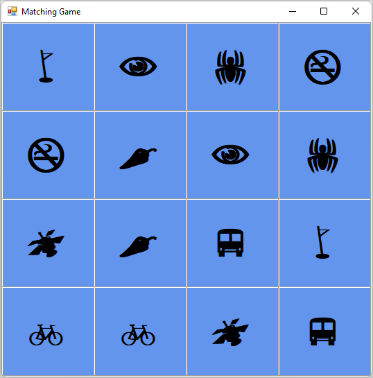
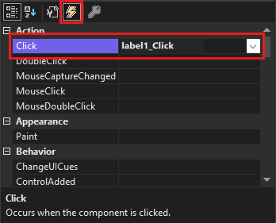
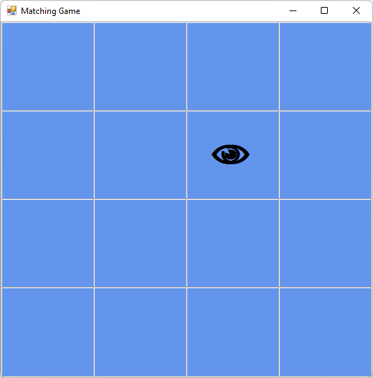

# Tutorial: Add icons to your matching game WinForms app


In this series of four tutorials, you build a matching game, where the player matches pairs of hidden icons.

In the matching game, a player selects a square to see an icon, then chooses another square.
If the icons match, they stay visible.
If not, the game hides both icons.
In this tutorial, you assign icons to labels randomly.
You set them to be hidden and then displayed when selected.

In this second tutorial, you learn how to:

> [!div class="checklist"]
> - Add a Random object and a list of icons.
> - Assign a random icon to each label.
> - Add event handlers that show icons to the labels.

## Prerequisites

This tutorial builds on the previous tutorial, [Create a matching game application](tutorial-windows-forms-create-match-game.md).
If you haven't done that tutorial, go through that one first.

## Add a Random object and a list of icons

In this section, you create a set of matching symbols for the game.
Each symbol is added to two random cells in the TableLayoutPanel on the form.

You use `new` statements to create two objects.
The first is a <xref:System.Random> object that randomly chooses cells in the TableLayoutPanel.
The second object is a <xref:System.Collections.Generic.List%601> object.
It stores the randomly chosen symbols.

1. Open Visual Studio. Your *MatchingGame* project appears under **Open recent**.

1. Select *Form1.cs* if you're using C#, or *Form1.vb* if you're using Visual Basic. Then select **View** > **Code**. 
   As an alternative, select the **F7** key or double-click **Form1**.
   The Visual Studio IDE displays the code module for Form1.

1. In the existing code, add the following code.

   ### [C#](#tab/csharp)
   :::code language="csharp" source="../../snippets/csharp/VS_Snippets_VBCSharp/vbexpresstutorial4step2_3_4/cs/form1.cs" id="Snippet1":::

   ### [VB](#tab/vb)
   :::code language="vb" source="../../snippets/visualbasic/VS_Snippets_VBCSharp/vbexpresstutorial4step2_3_4/vb/form1.vb" id="Snippet1":::
   ---

   [!INCLUDE [devlang-control-csharp-vb](../includes/devlang-control-csharp-vb.md)]

   If you're using C#, be sure you put the code after the opening curly brace and just after the class declaration (`public partial class Form1 : Form`). If you're using Visual Basic, put the code right after the class declaration (`Public Class Form1`).

You can use list objects to keep track of different types of items.
A list can hold numbers, true/false values, text, or other objects.
In your matching game, the list object has 16 strings, one for each cell in the TableLayoutPanel panel.
Each string is a single letter that corresponds to the icons in the labels.
These characters appear in the Webdings font as a bus, a bike, and others.

> [!NOTE]
> Lists can shrink and grow as needed, which is important in this program.

To learn more about lists, see <xref:System.Collections.Generic.List%601>. To see an example in C#, see [A basic list example](/dotnet/csharp/tour-of-csharp/tutorials/arrays-and-collections#a-basic-list-example). To see an example in Visual Basic, see [Using a Simple Collection](/dotnet/visual-basic/programming-guide/concepts/collections#using-a-simple-collection).

## Assign a random icon to each label

Each time you run the program, it assigns the icons randomly to the Label controls on your form by using an `AssignIconsToSquares()` method.
This code uses the keyword `foreach` in C# or `For Each` in Visual Basic.

1. Add the `AssignIconsToSquares()` method.

   ### [C#](#tab/csharp)
   :::code language="csharp" source="../../snippets/csharp/VS_Snippets_VBCSharp/vbexpresstutorial4step2_3_4/cs/form1.cs" id="Snippet2":::

   ### [VB](#tab/vb)
   :::code language="vb" source="../../snippets/visualbasic/VS_Snippets_VBCSharp/vbexpresstutorial4step2_3_4/vb/form1.vb" id="Snippet2":::
   ---

   You can enter this code just below the code you added in the previous section.

   > [!NOTE]
   > One of the lines is commented out on purpose.
   > You add it later in this procedure.

   The `AssignIconsToSquares()` method iterates through each label control in the TableLayoutPanel.
   It runs the same statements for each of them.
   The statements pull a random icon from the list.

   - The first line converts the **control** variable to a label named **iconLabel**. 
   - The second line is an `if` statement that checks to make sure the conversion worked.
     If the conversion does work, the statements in the `if` statement run.
   - The first line in the `if` statement creates a variable named **randomNumber** that contains a random number that corresponds to one of the items in the icons list.
     It uses the <xref:System.Random.Next> method of the <xref:System.Random> object.
     The `Next` method returns the random number.
     This line also uses the <xref:System.Collections.Generic.List%601.Count> property of the **icons** list to determine the range from which to choose the random number.
   - The next line assigns one of the **icons** list items to the <xref:System.Windows.Forms.Label.Text> property of the label.
   - The next line hides the icons.
     The line is commented out here so you can verify the rest of the code before proceeding.
   - The last line in the `if` statement removes the icon that has been added to the form from the list.

1. Add a call to the `AssignIconsToSquares()` method to the **Form1** _constructor_.
   This method fills the game board with icons.
   Constructors are called when you create an object.

   :::code language="csharp" source="../../snippets/csharp/VS_Snippets_VBCSharp/vbexpresstutorial4step2_3_4/cs/form1.cs" id="Snippet13":::

   For Visual Basic, add the `AssignIconsToSquares()` method call to the `Form1_Load` method.

   ```vb
   Private Sub Form1_Load(sender As Object, e As EventArgs) Handles MyBase.Load
       AssignIconsToSquares()
   End Sub
   ```

   For more information, see [Constructors (C# programming guide)](/dotnet/csharp/programming-guide/classes-and-structs/constructors) or [Use constructors and destructors](/previous-versions/visualstudio/visual-studio-2008/2z08e49e\(v\=vs.90\)).

1. Save your program and run it. It should show a form with random icons assigned to each label.

   > [!TIP]
   > If the Webdings icons don't display properly on the form, set the **UseCompatibleTextRendering** property of labels on the form to **True**.

1. Close your program, and then run it again. Different icons are assigned to each label.

   

   The icons are visible now because you haven't hidden them. To hide them from the player, you can set each label's **ForeColor** property to the same color as its **BackColor** property.

1. Stop the program. Remove the comment marks for the commented line of code inside the loop.

   ### [C#](#tab/csharp)
   :::code language="csharp" source="../../snippets/csharp/VS_Snippets_VBCSharp/vbexpresstutorial4step2_3_4/cs/form1.cs" id="Snippet15":::

   ### [VB](#tab/vb)
   :::code language="vb" source="../../snippets/visualbasic/VS_Snippets_VBCSharp/vbexpresstutorial4step2_3_4/vb/form1.vb" id="Snippet15":::
   ---

If you run the program again, the icons seem to have disappeared.
Only a blue background appears.
The icons are randomly assigned and are still there.

## Add event handlers to labels

In this matching game, a player reveals a hidden icon, then a second one.
If the icons match, they stay visible.
Otherwise, both icons are hidden again.

To get your game to work this way, add a <xref:System.Windows.Forms.Control.Click> event handler that changes the color of the chosen label to match the background.

1. Open the form in the **Windows Forms Designer**. Select **Form1.cs** or **Form1.vb**, and then select **View** > **Designer**.

1. Choose the first label control to select it and double-click it to add a `Click` event handler called **label1 _Click()** to the code.

1. Then, hold the **Ctrl** key while you select each of the other labels.
   Be sure that every label is selected.

1. In the **Properties** window, select the **Events** button, which is a lightening bolt.
   For the **Click** event, select **label1_Click** in the box.

     

1. Select the **Enter** key. The IDE adds a `Click` event handler called **label1 _Click()** to the code.
   Because you selected all the labels, the handler is hooked to each of the labels.

1. Fill in the rest of the code.

   ### [C#](#tab/csharp)
   :::code language="csharp" source="../../snippets/csharp/VS_Snippets_VBCSharp/vbexpresstutorial4step2_3_4/cs/form1.cs" id="Snippet4":::

   ### [VB](#tab/vb)
   :::code language="vb" source="../../snippets/visualbasic/VS_Snippets_VBCSharp/vbexpresstutorial4step2_3_4/vb/form1.vb" id="Snippet4":::
   ---

   > [!NOTE]
   > If you copy and paste the `label1_Click()` code block rather than entering the code manually, be sure to replace the existing `label1_Click()` code.
   > Otherwise, you'll end up with a duplicate code block.

Select **Debug** > **Start Debugging** to run your program. You should see an empty form with a blue background. Choose any of the cells in the form. One of the icons should become visible. Continue choosing different places in the form. As you choose the icons, they should appear.

   

## Next steps

Advance to the next tutorial to learn how to change labels using a timer.
> [!div class="nextstepaction"]
> [ Use a timer in your Matching Game](tutorial-windows-forms-match-game-labels.md)
