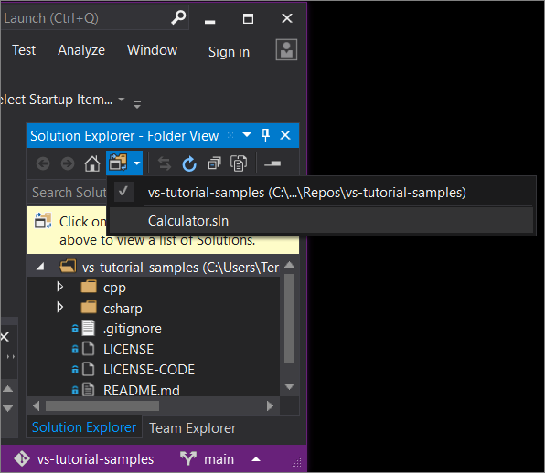

# Tutorial: Open a project from a repo in Visual Studio 2017

In this tutorial, you'll use Visual Studio 2017 to connect to a repository for the first time and then open a project from it.

> [!TIP]
> There's a new, more fully integrated way to connect with a GitHub repo in [Visual Studio 2019](https://visualstudio.microsoft.com/downloads). For more information, see the [**New Git experience in Visual Studio 2019**](../ide/git-with-visual-studio.md?view=vs-2019&preserve-view=true) page.

## Open a project from a GitHub repo by using Visual Studio 2017

1. Open Visual Studio 2017.

1. From the top menu bar, select **File** > **Open** > **Open from Source Control**.

   The **Team Explorer - Connect** pane opens.

    

1. In the **Local Git Repositories** section, select **Clone**.

    

1. In the box that says ***Enter the URL of a Git repo to clone***, type or paste the URL for your repo, and then press **Enter**. (You might receive a prompt to sign in to GitHub; if so, do so.)

   After Visual Studio clones your repo, Team Explorer closes and Solution Explorer opens. A message appears that says *Click on Solutions and Folders above to view a list of Solutions*. Choose **Solutions and Folders**.

   

1. If you have a solution file available, it will appear in the "Solutions and Folders" fly-out menu. Choose it, and Visual Studio opens your solution.

   

   If you do not have a solution file (specifically, a .sln file) in your repo, the fly-out menu will say "No Solutions Found." However, you can double-click any file from the folder menu to open it in the Visual Studio code editor.

### Review your work

View the following animation to check the work that you completed in the previous section.

   

> [!NOTE]
> For information that's specific to Visual Studio 2019, see the [Open a project from a repo in Visual Studio 2019](tutorial-open-project-from-repo-visual-studio-2019.md) page.

## Open a project from an Azure DevOps repo by using Visual Studio 2017

1. Open Visual Studio 2017.

1. From the top menu bar, select **File** > **Open** > **Open from Source Control**.

   The **Team Explorer - Connect** pane opens.

    

1. Here are two ways to connect to your Azure DevOps repo:

      - In the **Hosted Service Providers** section, select **Connect...**.

        

      - In the **Manage Connections** drop-down list, select **Connect to a Project...**.

        

1. In the **Connect to a Project** dialog box, choose the repo that you want to connect to, and then select **Clone**.

      

    > [!NOTE]
    > What you see in the list box depends on the Azure DevOps repositories that you have access to.

1. After Visual Studio clones your repo, Team Explorer closes and Solution Explorer opens. A message appears that says *Click on Solutions and Folders above to view a list of Solutions*. Choose **Solutions and Folders**.

      

   A solution file (specifically, a .sln file), will appear in the "Solutions and Folders" fly-out menu. Choose it, and Visual Studio opens your solution.

   If you do not have a solution file in your repo, the fly-out menu will say "No Solutions Found". However, you can double-click any file from the folder menu to open it in the Visual Studio code editor.

## Next steps

If you're ready to code with Visual Studio 2017, dive into any of the following language-specific tutorials:

- [Visual Studio tutorials | **C#**](./csharp/index.yml)
- [Visual Studio tutorials | **Visual Basic**](./visual-basic/index.yml)
- [Visual Studio tutorials | **C++**](/cpp/get-started/tutorial-console-cpp)
- [Visual Studio tutorials | **Python**](../python/index.yml)
- [Visual Studio tutorials | **JavaScript**, **TypeScript**, and **Node.js**](../javascript/index.yml)

## See also

- [Open a project from a repo in Visual Studio 2019](tutorial-open-project-from-repo-visual-studio-2019.md)
- [New Git experience in Visual Studio 2019](../ide/git-with-visual-studio.md)
- [Azure DevOps Services: Get started with Azure Repos and Visual Studio](/azure/devops/repos/git/gitquickstart/)
- [Microsoft Learn: Get started with Azure DevOps](/learn/modules/get-started-with-devops/)
