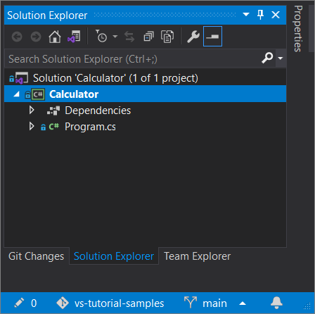
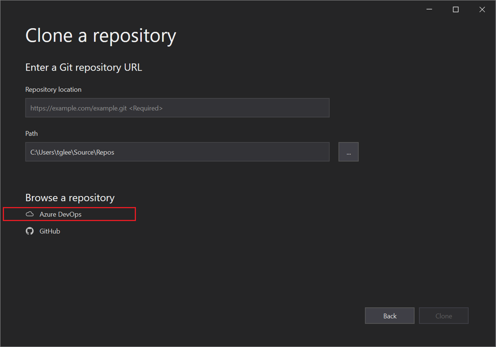
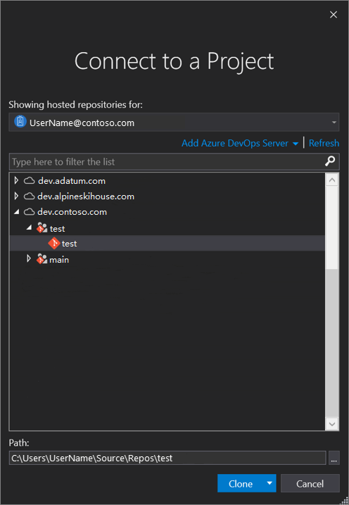
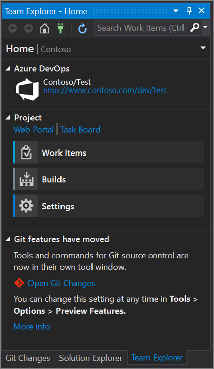
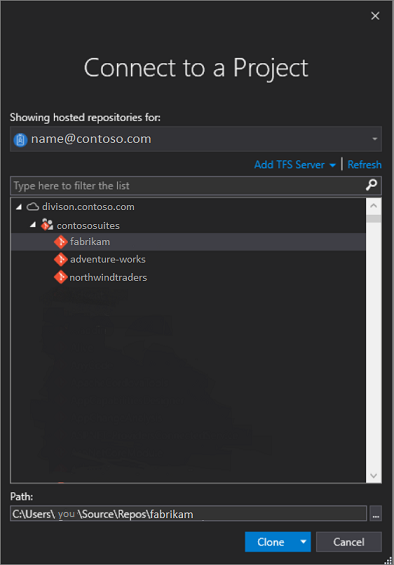

# Tutorial: Open a project from a repo

In this tutorial, you'll use Visual Studio to connect to a repository for the first time and then open a project from it.

If you haven't already installed Visual Studio, go to the [Visual Studio downloads](https://visualstudio.microsoft.com/downloads) page to install it for free.

## Open a project from a GitHub repo

How you open a project from a GitHub repo by using Visual Studio 2019 depends on which version you have. Specifically, if you've installed version [**version 16.8**](/visualstudio/releases/2019/release-notes/) or later, there's a new, more fully integrated [Git experience in Visual Studio](../ide/git-with-visual-studio.md) available to you.

But no matter which version you've installed, you can always open a project from a GitHub repo with Visual Studio.

#### [16.8 and later](#tab/vs168later)

#### Clone a GitHub repo and then open a project

1. Open Visual Studio 2019.

1. On the start window, select **Clone a repository**.

   

1. Enter or type the repository location, and then select **Clone**.

   

1. You might be asked for your user sign-in information in the **Git User Information** dialog box. You can either add your information or edit the default information it provides.

   

    Select **Save** to add the info to your global .gitconfig file. (Or, you can choose to do this later by selecting **Cancel**.)

    > [!TIP]
    > For more information about signing in to Visual Studio, see the [Sign in to Visual Studio](../ide/signing-in-to-visual-studio) page. And for specific information about how to use your GitHub account to sign in, see the [Work with GitHub accounts in Visual Studio](../ide/work-with-github-accounts.md) page.

    Next, Visual Studio automatically loads and opens the solution from the repository.

   

1. If your repository contains multiple solutions, you will see them in Solution Explorer. You can view the list of solutions by selecting the **Switch Views** button in Solution Explorer.

   

   Solution Explorer then gives you the option to open the root folder in **Folder View** or to select a solution file to open.

   

    To toggle the view, select the **Switch Views** button again.

    > [!TIP]
    > You can also use the **Git** menu in the Visual Studio IDE to clone a repo and open a project.
    >
    > 

#### Open a project locally from a previously cloned GitHub repo

1. Open Visual Studio 2019.

1. On the start window, select **Open a project or solution**.

    Visual Studio opens an instance of File Explorer, where you can browse to your solution or project, and then select it to open it.

   

    If you've opened the project or solution recently, select it from the **Open recent** section to quickly open it again.

    > [!TIP]
    > You can also use the **Git** menu in the Visual Studio IDE to open local folders and files from a repo that you've previously cloned.
    >
    > 

    Start coding!

#### [16.7 and earlier](#tab/vs167earlier)

#### Clone a GitHub repo and then open a project

1. Open Visual Studio 2019.

1. On the start window, select **Clone or check out code**.

   

1. Enter or type the repository location, and then select **Clone**.

   

   Visual Studio opens the project from the repo.

1. If you have a solution file available, it will appear in the "Solutions and Folders" fly-out menu. Select it, and Visual Studio opens your solution.

   

   If you do not have a solution file (specifically, an .sln file) in your repo, the fly-out menu says "No Solutions Found." However, you can double-click any file from the folder menu to open it in the Visual Studio code editor.

    Start coding!

---

> [!NOTE]
> For information that's specific to Visual Studio 2017, see the [Open a project from a repo in Visual Studio 2017](tutorial-open-project-from-repo-visual-studio-2017.md) page.

## Connect to an Azure DevOps server

What you see when you connect to an Azure DevOps server by using Visual Studio 2019 depends on which version you have. Specifically, if you've installed version [**version 16.8**](/visualstudio/releases/2019/release-notes/) or later, we've changed the UI to accommodate a new, more fully integrated [Git experience in Visual Studio](../ide/git-with-visual-studio.md) in Visual Studio.

But no matter which version you have installed, you can always connect to an Azure DevOps server with Visual Studio.

#### [16.8 and later](#tab/vs168later)

1. Open Visual Studio 2019.

1. On the start window, select **Clone a repository**.

   

1. In the **Browse a repository** section, select **Azure DevOps**.

    

1. If you see a sign-in window, sign in to your account.

1. In the **Connect to a Project** dialog box, choose the repo that you want to connect to, and then select **Clone**.

      

      > [!TIP]
      > If you don't see a pre-populated list of repos to connect to, select **Add Azure DevOps Server** to enter a server URL. (Alternatively, you might see a "No servers found" prompt that includes links to add an existing Azure DevOps Server or to create an Azure DevOps account.)

   Next, Visual Studio opens **Solution Explorer** that shows the folders and files.

1. Select the **Team Explorer** tab to view the Azure DevOps actions.

      

#### [16.7 and earlier](#tab/vs167earlier)

1. Open Visual Studio 2019.

1. On the start window, select **Clone or check out code**.

   

1. In the **Browse a repository** section, select **Azure DevOps**.

   

   If you see a sign-in window, sign in to your account.

1. In the **Connect to a Project** dialog box, choose the repo that you want to connect to, and then select **Clone**.

      

    > [!NOTE]
    > What you see in the list box depends on the Azure DevOps repositories that you have access to.

   Visual Studio opens **Team Explorer** and a notification appears when the clone is complete.

     

1. To view your folders and files, select the **Show Folder View** link.

     

     Visual Studio opens **Solution Explorer**.

1. Choose the **Solutions and Folders** link to search for a solution file  (specifically, an .sln file) to open.

      

   If you do not have a solution file in your repo, a 'No Solutions Found' message appears. However, you can double-click any file from the folder menu to open it in the Visual Studio code editor.

---

## Next steps

If you're ready to code with Visual Studio, dive into any of the following language-specific tutorials:

- [Visual Studio tutorials | **C#**](./csharp/index.yml)
- [Visual Studio tutorials | **Visual Basic**](./visual-basic/index.yml)
- [Visual Studio tutorials | **C++**](/cpp/get-started/tutorial-console-cpp)
- [Visual Studio tutorials | **Python**](../python/index.yml)
- [Visual Studio tutorials | **JavaScript**, **TypeScript**, and **Node.js**](../javascript/index.yml)

## See also

- [Open a project from a repo in Visual Studio 2017](tutorial-open-project-from-repo-visual-studio-2017.md)
- [New Git experience in Visual Studio 2019](../ide/git-with-visual-studio.md)
- [Azure DevOps Services: Get started with Azure Repos and Visual Studio](/azure/devops/repos/git/gitquickstart/)
- [Microsoft Learn: Get started with Azure DevOps](/learn/modules/get-started-with-devops/)