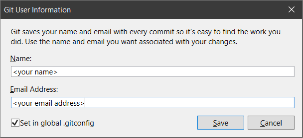
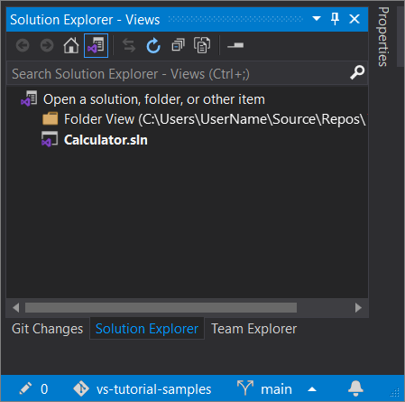
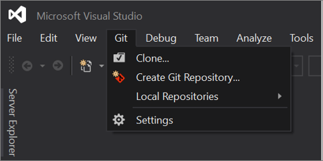
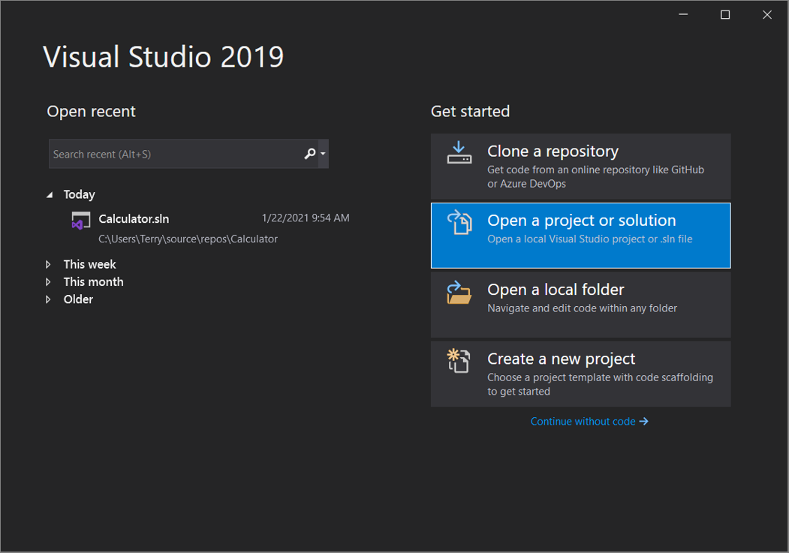

# Tutorial: Open a project from a repo

In this tutorial, you'll use Visual Studio to connect to a repository for the first time, clone it, and then open a project from it.

If you haven't already installed Visual Studio, go to the [Visual Studio downloads](https://visualstudio.microsoft.com/downloads) page to install it for free.

::: moniker range="vs-2022"

## Open a project from a GitHub repo

Visual Studio makes it easy to open a project from a repo. You can do so when you start Visual Studio, or you can do so directly from within the [Visual Studio IDE](visual-studio-ide.md?view=vs-2022&preserve-view=true).

Here's how.

### Use the start window

1. Open Visual Studio.

1. On the start window, select **Clone a repository**.

    :::image type="content" source="../ide/media/vs-2022/clone-repository.png" alt-text="Screenshot of the Clone a Repository dialog in Visual Studio.":::

1. Enter or type the repository location, and then select the **Clone** button.

    :::image type="content" source="../ide/media/vs-2022/clone-repository-enter-location.png" alt-text="Screenshot of the Clone a Repository dialog in Visual Studio where you enter a Git repo URL.":::

1. You might be asked for your user sign-in information in the **Git User Information** dialog box. You can either add your information or edit the default information it provides.

    :::image type="content" source="../ide/media/vs-2022/git-user-information-dialog.png" alt-text="Screenshot of the Git User Information dialog where you enter or edit your account info in Visual Studio 2022.":::

    Select **Save** to add the info to your global .gitconfig file. (Or, you can select **Cancel** if you'd like to add the info later.)

    > [!TIP]
    > For more information about signing in to Visual Studio, see the [**Sign in to Visual Studio**](../ide/signing-in-to-visual-studio.md?view=vs-2022&preserve-view=true) page. For specific information about how to use your GitHub account to sign in, see the [**Work with GitHub accounts in Visual Studio**](../ide/work-with-github-accounts.md?view=vs-2022&preserve-view=true) page. And if you receive a trust notification and want to know more about it, see the [Configure trust settings for files and folders](../ide/reference/trust-settings.md?view=vs-2022&preserve-view=true) page.

### View files in Solution Explorer

1. Next, Visual Studio loads the solution(s) from the repository by using the **Folder View** in [**Solution Explorer**](../ide/use-solution-explorer.md?view=vs-2022&preserve-view=true).

    :::image type="content" source="../ide/media/vs-2022/git-solution-explorer-folder-view.png" alt-text="Screenshot of the Folder View in Solution Explorer in Visual Studio 2022.":::

    You can view a solution in **Solution View** by double-clicking its .sln file.

    Or, you can select the **Switch Views** button, and then select **Program.cs** to view a solution's code.

    :::image type="content" source="../ide/media/vs-2022/git-solution-explorer-switch-views.png" alt-text="Screenshot of a project in Git that's open in Solution Explorer, with the Switch Views button highlighted in Visual Studio 2022.":::

> [!TIP]
> The default view is set to Folder View. You can change it to Solution View from the **Git** menu. Select **Settings** > **Source Control** > **Git Global Settings** > **Automatically load the solution when opening a Git repository** to do so.

#### Open a project locally from a previously cloned GitHub repo

1. Open Visual Studio.

1. On the start window, select **Open a project or solution**.

    Visual Studio opens an instance of File Explorer, where you can browse to your solution or project, and then select it to open it.

    :::image type="content" source="../ide/media/vs-2022/open-local-project-from-cloned-repo.png" alt-text="Screenshot of the 'Open a project or solution' window in Visual Studio 2022.":::

    > [!TIP]
    > If you've opened the project or solution recently, select it from the **Open recent** section to quickly open it again.

    Start coding!

### Use the IDE

You can also use the **Git** menu or the **Select Repository** control in the Visual Studio IDE to interact with a repository's folders and files.

Here's how.

#### To clone a repo and open a project

1. In the Visual Studio IDE, select the **Git** menu, and then select **Clone Repository**.

    :::image type="content" source="../ide/media/vs-2022/git-menu-clone-repository.png" alt-text="Screenshot of the Git menu in Visual Studio 2022 with Clone Repository selected.":::

1. Follow the prompts to connect to the Git repository that includes the files you're looking for.

#### To open local folders and files

1. In the Visual Studio IDE, select the **Git** menu, select **Local Repositories**, and then select **Open Local Repository**.

    :::image type="content" source="../ide/media/vs-2022/git-menu-local-repositories.png" alt-text="Screenshot of the Git menu in Visual Studio 2022 with the Local Repository and Open Local Repository showing.":::

    Alternatively, you can perform the same task from **Solution Explorer**. To do so, choose the **Select Repository** control, select the **ellipsis** icon that's next to the **Filter repositories** box, and then select **Open Local Repository**.

    :::image type="content" source="../ide/media/vs-2022/select-repository-filter-ellipsis.png" alt-text="Screenshot of the Select Repository control with the ellipsis icon selected and the Open Local Repository option showing.":::

1. Follow the prompts to connect to the Git repository that has the files you're looking for.

## Browse to an Azure DevOps repo

Here's how to browse to and clone an Azure DevOps repo by using Visual Studio.

1. Open Visual Studio.

1. On the start window, select **Clone a repository**.

    :::image type="content" source="../ide/media/vs-2022/clone-repository.png" alt-text="Screenshot of the Clone a Repository dialog in Visual Studio, for Azure DevOps.":::

1. In the **Browse a repository** section, select **Azure DevOps**.

    :::image type="content" source="../ide/media/vs-2022/browse-repository-azure-devops.png" alt-text="Screenshot of the 'Browse a repository' section of the 'Clone a repository' dialog box in Visual Studio, Azure DevOps highlighted.":::

1. Follow the prompts to clone an Azure DevOps repo that includes the files you're looking for, and then open your project.

::: moniker-end

::: moniker range="vs-2019"

## Open a project from a GitHub repo with Visual Studio 2019

How you open a project from a GitHub repo by using Visual Studio depends on which version you have. Specifically, if you've installed version Visual Studio 2019 [**version 16.8**](/visualstudio/releases/2019/release-notes-history) or later, there's a new, more fully integrated [Git experience in Visual Studio](../version-control/git-with-visual-studio.md) available to you.

But no matter which version you've installed, you can always open a project from a GitHub repo with Visual Studio.

### Visual Studio 2019 version 16.8 and later

Here's how to use Git in Visual Studio 2019 [**version 16.8**](/visualstudio/releases/2019/release-notes-history) or later.

#### Clone a GitHub repo and then open a project

1. Open Visual Studio 2019.

1. On the start window, select **Clone a repository**.

   

1. Enter or type the repository location, and then select **Clone**.

   

1. You might be asked for your user sign-in information in the **Git User Information** dialog box. You can either add your information or edit the default information it provides.

   

    Select **Save** to add the info to your global .gitconfig file. (Or, you can select **Cancel** if you'd like to save the info later.)

    > [!TIP]
    > For more information about signing in to Visual Studio, see the [Sign in to Visual Studio](../ide/signing-in-to-visual-studio.md?view=vs-2019&preserve-view=true) page. And for specific information about how to use your GitHub account to sign in, see the [Work with GitHub accounts in Visual Studio](../ide/work-with-github-accounts.md?view=vs-2019&preserve-view=true) page.

    Next, Visual Studio automatically loads and opens the solution from the repository.

   

1. If your repository contains multiple solutions, Solution Explorer displays them. For a list view of the solutions, select the **Switch Views** button in Solution Explorer.

   

   Solution Explorer then gives you the option to open the root folder in **Folder View** or to select a solution file to open.

   

    To toggle the view, select the **Switch Views** button again.

    > [!TIP]
    > You can also use the **Git** menu in the Visual Studio IDE to clone a repo and open a project.
    >
    > 

#### Open a project locally from a previously cloned GitHub repo

1. Open Visual Studio 2019 version 16.8 or later.

1. On the start window, select **Open a project or solution**.

    Visual Studio opens an instance of File Explorer, where you can browse to your solution or project, and then select it to open it.

   

    If you've opened the project or solution recently, select it from the **Open recent** section to quickly open it again.

    > [!TIP]
    > You can also use the **Git** menu in the Visual Studio IDE to open local folders and files from a repo that you've previously cloned.
    >
    > 

    Start coding!

### Visual Studio 2019 version 16.7 and earlier

Here's how to use Git in Visual Studio 2019 [**version 16.7**](/visualstudio/releases/2019/release-notes-history) or earlier.

#### Clone a GitHub repo and then open a project

1. Open Visual Studio 2019 version 16.7 or earlier.

1. On the start window, select **Clone or check out code**.

   

1. Enter or type the repository location, and then select **Clone**.

   

   Visual Studio opens the project from the repo.

1. If you have a solution file available, it appears in the "Solutions and Folders" fly-out menu. Select it, and Visual Studio opens your solution.

   

   If you do not have a solution file (specifically, an .sln file) in your repo, the fly-out menu says "No Solutions Found." However, you can double-click any file from the folder menu to open it in the Visual Studio code editor.

    Start coding!

## Browse to an Azure DevOps repo with Visual Studio 2019

What you see when you browse to and clone an Azure DevOps repository by using Visual Studio 2019 depends on which version you have. Specifically, if you've installed version [**version 16.8**](/visualstudio/releases/2019/release-notes-history) or later, we've changed the UI to accommodate a new, more fully integrated [Git experience in Visual Studio](../version-control/git-with-visual-studio.md) in Visual Studio.

But no matter which version you have installed, you can always browse to and clone an Azure DevOps repo with Visual Studio.

### Visual Studio 2019 version 16.8 and later

1. Open Visual Studio 2019 [**version 16.8**](/visualstudio/releases/2019/release-notes-history) or later.

1. On the start window, select **Clone a repository**.

   

1. In the **Browse a repository** section, select **Azure DevOps**.

    

1. If you see a sign-in window, sign in to your account.

1. In the **Connect to a Project** dialog box, choose the repo that you want to connect to, and then select **Clone**.

      

      > [!TIP]
      > If you don't see a pre-populated list of repos to connect to, select **Add Azure DevOps Server** to enter a server URL. (Alternatively, you might see a "No servers found" prompt that includes links to add an existing Azure DevOps Server or to create an Azure DevOps account.)

   Next, Visual Studio opens **Solution Explorer** that shows the folders and files.

1. Select the **Team Explorer** tab to view the Azure DevOps actions.

      

#### Visual Studio 2019 version 16.7 and earlier

1. Open Visual Studio 2019 [**version 16.7**](/visualstudio/releases/2019/release-notes-history) or earlier.

1. On the start window, select **Clone or check out code**.

   

1. In the **Browse a repository** section, select **Azure DevOps**.

   

   If you see a sign-in window, sign in to your account.

1. In the **Connect to a Project** dialog box, choose the repo that you want to connect to, and then select **Clone**.

      

    > [!NOTE]
    > What you see in the list box depends on the Azure DevOps repositories that you have access to.

   Visual Studio opens **Team Explorer** and a notification appears when the clone is complete.

     

1. To view your folders and files, select the **Show Folder View** link.

     

     Visual Studio opens **Solution Explorer**.

1. Choose the **Solutions and Folders** link to search for a solution file  (specifically, an .sln file) to open.

      

   If you do not have a solution file in your repo, a 'No Solutions Found' message appears. However, you can double-click any file from the folder menu to open it in the Visual Studio code editor.

::: moniker-end

::: moniker range="vs-2017"

## Open a project from a GitHub repo with Visual Studio 2017

1. Open Visual Studio 2017.

1. From the top menu bar, select **File** > **Open** > **Open from Source Control**.

   The **Team Explorer - Connect** pane opens.

    

1. In the **Local Git Repositories** section, select **Clone**.

    

1. In the box that says ***Enter the URL of a Git repo to clone***, type or paste the URL for your repo, and then press **Enter**. (You might receive a prompt to sign in to GitHub.)

   After Visual Studio clones your repo, Team Explorer closes and Solution Explorer opens. A message appears that says ***Click on Solutions and Folders above to view a list of Solutions***. Choose **Solutions and Folders**.

   

1. If you have a solution file available, it appears in the "Solutions and Folders" fly-out menu. Choose it, and Visual Studio opens your solution.

   

   If you do not have a solution file (specifically, an .sln file) in your repo, the fly-out menu says, "No Solutions Found." However, you can double-click any file from the folder menu to open it in the Visual Studio code editor.

### Review your work

View the following animation to check the work that you completed in the previous section.

   

## Open a project from an Azure DevOps repo with Visual Studio 2017

1. Open Visual Studio 2017.

1. From the top menu bar, select **File** > **Open** > **Open from Source Control**.

   The **Team Explorer - Connect** pane opens.

    

1. Here are two ways to connect to your Azure DevOps repo:

      - In the **Hosted Service Providers** section, select **Connect...**.

        

      - In the **Manage Connections** drop-down list, select **Connect to a Project...**.

        

1. In the **Connect to a Project** dialog box, choose the repo that you want to connect to, and then select **Clone**.

      

    > [!NOTE]
    > What you see in the list box depends on the Azure DevOps repositories that you have access to.

1. After Visual Studio clones your repo, Team Explorer closes and Solution Explorer opens. A message appears that says *Click on Solutions and Folders above to view a list of Solutions*. Choose **Solutions and Folders**.

      

   A solution file (specifically, an .sln file), appears in the "Solutions and Folders" fly-out menu. Choose it, and Visual Studio opens your solution.

   If you do not have a solution file in your repo, the fly-out menu says, "No Solutions Found". However, you can double-click any file from the folder menu to open it in the Visual Studio code editor.

::: moniker-end

## Next steps

Feel free to dive into any of the following language-specific tutorials:

- [Visual Studio tutorials | **C#**](./csharp/index.yml)
- [Visual Studio tutorials | **Visual Basic**](./visual-basic/index.yml)
- [Visual Studio tutorials | **C++**](/cpp/get-started/tutorial-console-cpp)
- [Visual Studio tutorials | **Python**](../python/index.yml)
- [Visual Studio tutorials | **JavaScript**, **TypeScript**, and **Node.js**](../javascript/index.yml)

## See also

::: moniker range="<=vs-2019"

- [The Git experience in Visual Studio](../version-control/git-with-visual-studio.md)
- [Compare Git and Team Explorer side-by-side](../version-control/git-team-explorer-feature-comparison.md)
- [Microsoft Learn: Get started with Git and GitHub in Visual Studio](/learn/modules/visual-studio-github-push/)
- [Microsoft Learn: Get started with Azure DevOps](/learn/modules/get-started-with-devops/)
- [Azure DevOps Services: Get started with Azure Repos and Visual Studio](/azure/devops/repos/git/gitquickstart/)

::: moniker-end

::: moniker range="vs-2022"

[Visual Studio version control documentation](../version-control/index.yml)

::: moniker-end