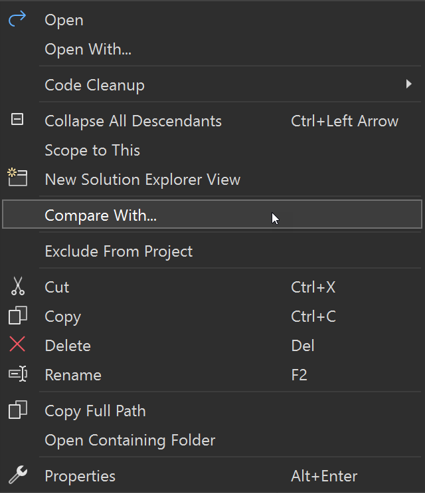
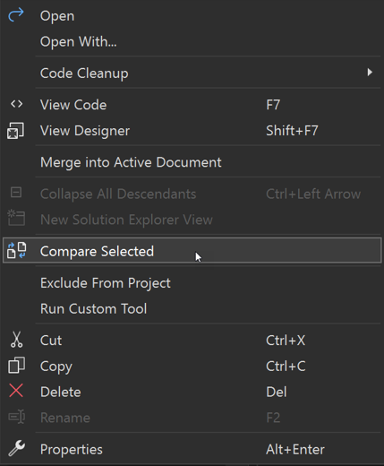
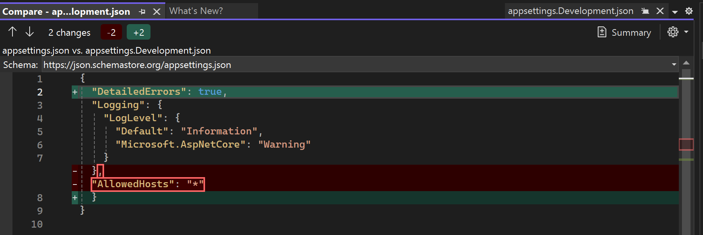

# Compare files in Visual Studio

You can visually compare two files in Visual Studio to examine the differences between them. You can view the files  side-by-side or see the differences inline. The comparison view also appears when you choose to view the changes to a file in a commit or pull request when you use version control.

## Compare two files (IDE)

In Solution Explorer, right-click on one of the files and choose **Compare With...**. The Open File dialog appears. Choose the second file, and then choose **Open**.



The file you right-clicked on appears on the right and is editable. The other file is shown in a read-only view. That means that from the perspective of the diff view, the file you right-clicked is the new version and the other file is considered the old version.

If you select two files (use Ctrl-click to select), you can right-click and choose **Compare Selected** to open the diff view with just those two files.



## Compare two files (command-line)

From the [Developer Command Prompt](./reference/command-prompt-powershell.md), use the `/Diff` (`-diff`) option. See [-Diff](./reference/diff.md).

```cmd
devenv /Diff SourceFile TargetFile [SourceDisplayName [TargetDisplayName]]
```

Visual Studio opens with the two files shown side-by-side, but a project is not opened. The `TargetFile` is considered the newer version, and is editable.

## Understand differences

The minus (-) sign on the left side indicates lines removed. The (+) sign on the right side indicates lines added. Boxes in red and green highlight the specific text that changed in a line. For changed text, red shows the old version, and green shows the new version.

Use the arrows at the top left to move between changed sections.

Side-by-side view shows the differences in a split screen, as shown in the following image.


Inline view shows the differences in a single window, as shown in the following image.



## Display settings in diff view

The **Summary** option is a toggle that you control by pressing the button. The other settings are available when you click on the gear icon.

| Setting | Keyboard shortcut | Description |
| - | - | - |
| **Summary** | **Ctrl**+**\\**, **Ctrl**+**5** | If enabled, only the parts of the two files that differ appear in the view. If not enabled, the entire file is shown. |
| **Inline mode** | **Ctrl**+**\\**, **Ctrl**+**1** | Show diffs in a single file view. |
| **Side by side mode** | **Ctrl**+**\\**, **Ctrl**+**2** | Show the two files separately. |
| **Left file only** | **Ctrl**+**\\**, **Ctrl**+**3** | Show the left file, the one you chose in the Open File dialog. |
| **Right file only** | **Ctrl**+**\\**, **Ctrl**+**4** | Show the right file, the one you right-clicked on. |
| **Ignore Trim Whitespace** | **Ctrl**+**\\**, **Ctrl**+**Space** | Do not show spaces at the end of a line as a difference. |
| **Synchronize Views** | **Ctrl**+**\\**, **Ctrl**+**Down Arrow** | Lock the scroll bars together, so that you are always looking at the same part of both files. |

## Related content

[-Diff](./reference/diff.md)
[Make a commit](../version-control/git-make-commit.md)
[Create a pull request](../version-control/git-create-pull-request.md)
