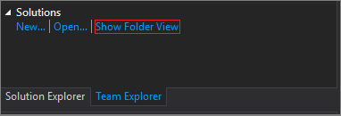

# Connect to projects in Team Explorer

 [!INCLUDE [Visual Studio](~/includes/applies-to-version/vs-windows-only.md)]

::: moniker range="vs-2019"

Team Explorer connects Visual Studio 2019 and earlier to Team Foundation version control (TFVC) repositories, and to projects hosted on [Azure DevOps Services](/azure/devops/user-guide/what-is-azure-devops) or an on-premises [Azure DevOps Server](/azure/devops/user-guide/about-azure-devops-services-tfs?view=azure-devops&preserve-view=true) (formerly known as TFS). You can manage source code, work items, and builds.

> [!IMPORTANT]
> With the release of Visual Studio 2019 [**version 16.8**](/visualstudio/releases/2019/release-notes-history), the Git version control experience is on by default. If you'd like to learn more about how it compares with Team Explorer, see the [**Side-by-side comparison of Git and Team Explorer**](../version-control/git-team-explorer-feature-comparison.md) page.
>
> However, if you prefer to continue to use Team Explorer in Visual Studio 2019, go to **Tools** > **Options** > **Environment** > **Preview Features** and then toggle the **New Git user experience** checkbox. (This option is not available in Visual Studio 2022 and later.)

How you use Team Explorer to connect to a project depends on the version of Visual Studio 2019 you're using.

## In Visual Studio 2019 version 16.8 and later

1. Open Visual Studio 2019.

1. On the start window, select **Clone a repository**.

   

1. In the **Browse a repository** section, select **Azure DevOps**.

    

1. If you see a sign-in window, sign in to your account.

1. In the **Connect to a Project** dialog box, choose the repo that you want to connect to, and then select **Clone**.

      

      > [!TIP]
      > If you don't see a pre-populated list of repos to connect to, select **Add Azure DevOps Server** to enter a server URL. (Alternatively, you might see a "No servers found" prompt that includes links to add an existing Azure DevOps Server or to create an Azure DevOps account.)

   Next, Visual Studio opens **Solution Explorer** that shows the folders and files.

1. Select the **Team Explorer** tab to view the Azure DevOps actions.

      

## In Visual Studio 2019 version 16.7 and earlier

1. Open Visual Studio 2019.

1. On the start window, select **Clone or check out code**.

   

1. In the **Browse a repository** section, select **Azure DevOps**.

   

   If you see a sign-in window, sign in to your account.

1. In the **Connect to a Project** dialog box, choose the repo that you want to connect to, and then select **Clone**.

      

    > [!NOTE]
    > What you see in the list box depends on the Azure DevOps repositories that you have access to.

   Visual Studio opens **Team Explorer** and a notification appears when the clone is complete.

     

1. To view your folders and files, select the **Show Folder View** link.

     

     Visual Studio opens **Solution Explorer**.

1. Choose the **Solutions and Folders** link to search for a solution file  (specifically, an .sln file) to open.

      

   If you do not have a solution file in your repo, a 'No Solutions Found' message appears. However, you can double-click any file from the folder menu to open it in the Visual Studio code editor.

::: moniker-end

## See also

- [Compare Git and Team Explorer side-by-side](../version-control/git-team-explorer-feature-comparison.md)
- [Visual Studio version control documentation](../version-control/index.yml)
- [Team Explorer reference](reference/team-explorer-reference.md)
- [Connect to a project (Azure DevOps)](/azure/devops/organizations/projects/connect-to-projects)
- [Troubleshoot connecting to a project](/azure/devops/user-guide/troubleshoot-connection?view=azure-devops&preserve-view=true)
