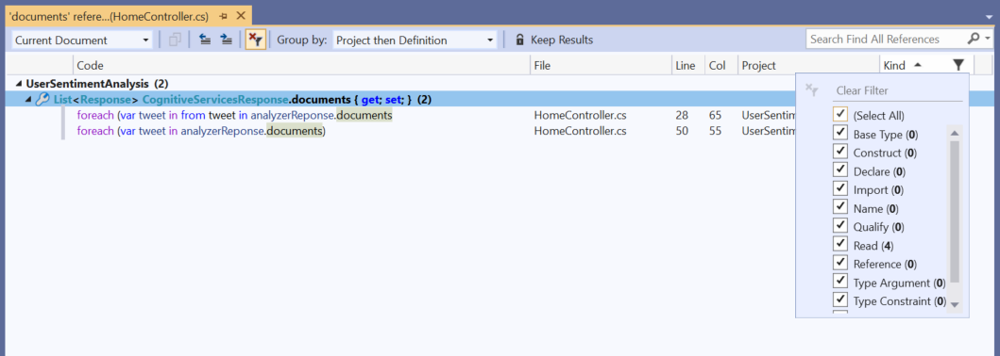

# Find references in your code

 [!INCLUDE [Visual Studio](~/includes/applies-to-version/vs-windows-only.md)]

You can use the **Find All References** command to find where particular code elements are referenced throughout your codebase. The **Find All References** command is available on the context (right-click) menu of the element you want to find references to. Or, if you are a keyboard user, press **Shift + F12**.

The results appear in a tool window named **\<element> references**, where *element* is the name of the item you are searching for. A toolbar in the **references** window enables you to do the following:

- Change the scope of the search in a drop-down list box. You can choose to look only in changed documents all the way up to the entire solution.
- Copy the selected referenced item by choosing the **Copy** button.
- Choose buttons to go to the next or previous location in the list, or press the **F8** and **Shift + F8** keys to do so.
- Remove any filters on the returned results by choosing the **Clear All Filters** button.
- Change how returned items are grouped by choosing a setting in the **Group by:** drop-down list box.
- Keep the current search results window by choosing the **Keep Results** button. When you choose this button, the current search results stay in this window, and new search results appear in a new tool window.
- Search for strings within the search results by entering text in the **Search Find All References** text box.

You can also hover the mouse over any search result to see a preview of the reference.

## Navigate to references

You can use the following methods to navigate to references in the **references** window:

- Press **F8** to go to the next reference, or **Shift + F8** to go to the previous reference.
- Press the **Enter** key on a reference, or double-click it, to go to it in code.
- On the right-click menu (context menu) of a reference, choose the **Go To Previous Location** or **Go To Next Location** commands.
- Choose the **Up Arrow** and **Down Arrow** keys (if they are enabled in the **Options** dialog box). To enable this functionality, on the menu bar, choose **Tools** > **Options** > **Environment** > **Tabs and Windows** > **Preview Tab**, and then select the **Allow new files to be opened in the preview tab** and **Preview selected files in Find Results** boxes.

## Change reference groupings

By default, references are grouped by project, then by definition. However, you can change this grouping order by changing the setting in the **Group by:** drop-down list box on the toolbar. For example, you can change it from the default setting of **Project then definition** to **Definition then project**, as well to other settings.

**Definition** and **Project** are the two default groupings used, but you can add others by choosing the **Grouping** command on the selected item's right-click or context menu. Adding more groupings can be helpful if your solution has a lot of files and paths.

## Filter by reference type in .NET

In C# or Visual Basic, the Find References window has a Kind column where it lists what type of reference it found. This column can be used to filter by reference type by clicking on the filter icon that appears when hovering over the column header. References can be filtered by Read, Write, Reference, Name, Namespace, and Type.

After you apply a filter, you can easily remove it by using the **Clear All Filters** button.

## See also

- [Navigating code](../ide/navigating-code.md)
